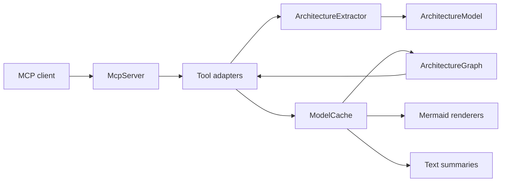

# Architecture

Spoon MCP Server is organized around a simple pipeline:

1. MCP clients send JSON-RPC requests over stdio.
2. `McpServer` dispatches tool calls to tool adapter classes.
3. Tool adapters read from or update the shared `ModelCache`.
4. Extractors use Spoon to scan Java projects and populate `ArchitectureModel`.
5. Mergers add deployment context from supporting files such as Docker Compose or Ansible.
6. `ArchitectureGraph` projects the model into a property graph for traversal queries.
7. Renderers turn the model into Mermaid diagrams or text summaries.

## Packages

### `dev.dominikbreu.spoonmcp.mcp`

Owns the stdio JSON-RPC loop and the MCP protocol surface. `McpServer` registers every public tool name, tool schema, and dispatch branch.

### `dev.dominikbreu.spoonmcp.mcp.tools`

Contains thin tool adapters. These classes parse JSON arguments, call extractor/cache/renderer services, and return user-facing strings.

### `dev.dominikbreu.spoonmcp.extractor`

Contains the core architecture analysis. It identifies applications, entry points, components, dependencies, runtime flows, and framework-specific constructs for Java EE and Quarkus-style projects.

`QuarkusExtractor` reads SmallRye Reactive Messaging annotations (`@Incoming`, `@Outgoing`, `@Channel`) and emits `MESSAGING_CONSUMER` / `MESSAGING_PRODUCER` entrypoints with a `channelName`. Channel-to-broker resolution is performed by `MessagingConfigResolver` and the result is attached as a `MessagingBroker` enum value (`KAFKA`, `MQTT`, `AMQP`, `RABBITMQ`, `PULSAR`, or `UNKNOWN`).

In addition, `QuarkusExtractor` detects raw broker clients held as fields, where the broker is implied by the field's type and no annotation or config lookup is needed: Kafka via `org.apache.kafka.clients.{producer.KafkaProducer,producer.Producer,consumer.KafkaConsumer,consumer.Consumer}` (FQN match) and MQTT via a simple-name pattern that covers Paho v3/v5 (`MqttClient`, `MqttAsyncClient`, `IMqttClient`, `IMqttAsyncClient`) and HiveMQ (`Mqtt3Client`, `Mqtt5Client`, `Mqtt3AsyncClient`, `Mqtt3BlockingClient`, `Mqtt3RxClient`, `Mqtt5AsyncClient`, …).

`MessagingCallSiteResolver` then scans the class's method bodies for call sites that act on the tracked client fields:

- **Direct calls:** `mqttClient.publish(topic, ...)`, `mqttClient.subscribe(topic, ...)`, `mqttClient.unsubscribe(topic)`, `kafkaProducer.send(new ProducerRecord<>(topic, ...))`, `kafkaConsumer.subscribe(List.of("a", "b", ...))` (or `Arrays.asList`, `Collections.singletonList`).
- **HiveMQ fluent chains:** any chain rooted at a tracked field that contains `publishWith()` (→ `MESSAGING_PRODUCER`) or `subscribeWith()` (→ `MESSAGING_CONSUMER`) together with `topic(...)` or `topicFilter(...)`. Intermediate methods such as `toAsync()` / `toBlocking()` are tolerated.

Topic argument resolution: string literal → field-read with a literal initializer (covers `static final String TOPIC = "..."`) → local-var with a literal initializer in the same scope. Anything else (method parameter, `@ConfigProperty`-injected field, builder chain, complex expression) yields `path = "(unresolved)"`. One `messaging_producer` / `messaging_consumer` interface is emitted per (component, broker, resolved topic). The field-level `messaging_client` fallback (one per field, topic `(unresolved)`) is **only** emitted when no call-site findings were produced for that field.

`ExternalSystemInferrer` runs as a post-pass and groups REST client interfaces by `externalServiceName` (read from `@RegisterRestClient(configKey=...)`) into `REST_API` external systems, and groups messaging entrypoints/interfaces by broker into `MESSAGE_BROKER` external systems. It emits component-to-external dependency edges that surface in system-level diagrams.

#### Configuration parsing rule

Spoon AST is the only source of code structure. **The single permitted configuration read is `mp.messaging.{incoming|outgoing}.{channel}.connector` from `application.properties`, `application.yaml`, or `application.yml`** under each module's `src/main/resources`. This is performed by `MessagingConfigResolver` and exists solely to disambiguate the broker behind a Reactive Messaging channel — Reactive Messaging is connector-agnostic at the code level, so without this read every broker would collapse into one `UNKNOWN` blob.

No other configuration key may be parsed. Do not extend the resolver to read additional properties, do not add new file types, and do not introduce grep- or regex-based extraction over project files. Adding broader config interpretation is a slippery slope toward a parallel, ad-hoc model that drifts from the AST-grounded truth — do not do it.

### `dev.dominikbreu.spoonmcp.model`

Contains plain model records/classes used by extractors, mergers, renderers, and tools.

The model includes `ExternalSystem` (REST APIs and message brokers inferred from interfaces) and `MessagingBroker` (resolved broker for a Reactive Messaging channel). `Entrypoint` carries `channelName` and `broker` for messaging entrypoints; `InterfaceEntry` carries `externalServiceName` (REST client `configKey`) and `broker` (messaging channel).

### `dev.dominikbreu.spoonmcp.cache`

Stores the most recently indexed `ArchitectureModel` for subsequent MCP tool calls.
The default backend persists a JSON snapshot. Setting `SPOON_MCP_CACHE_BACKEND=graph`
or `-Dspoonmcp.cache.backend=graph` eagerly maintains an embedded TinkerGraph
projection. Graph tooling can also build this projection lazily from the JSON-backed
model. The projection stores source metadata, confidence, package/module labels,
runtime-relevance flags, cross-module dependency flags, fan-in/fan-out counts, and
entrypoint reachability to support MCP traversal and impact-analysis tools.

### `dev.dominikbreu.spoonmcp.merger`

Adds deployment context to the extracted architecture model from deployment descriptors and infrastructure files.

### `dev.dominikbreu.spoonmcp.renderer`

Renders architecture model slices to Mermaid flowcharts and sequence diagrams.

## Data Flow

## Adding A Tool

1. Add the tool implementation in `src/main/java/dev/dominikbreu/spoonmcp/mcp/tools/`.
2. Register its name, description, and schema in `McpServer.buildToolsList()`.
3. Add dispatch in `McpServer.callTool()`.
4. Add tests for parsing, behavior, or rendering as appropriate.
5. Update `docs/TOOLS.md` and examples when useful.
