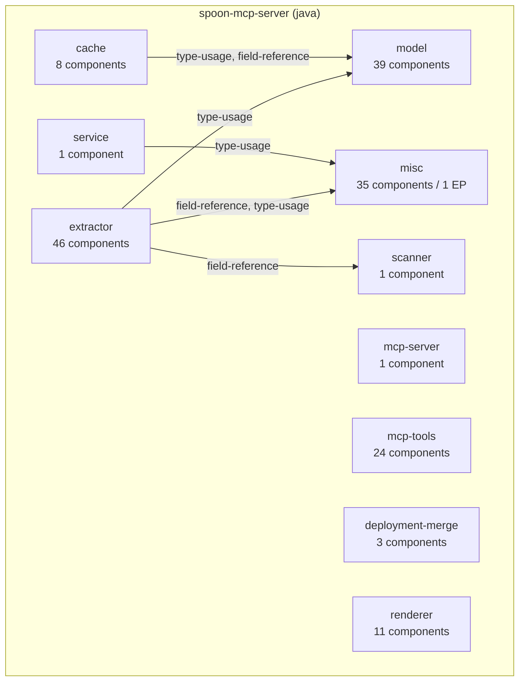
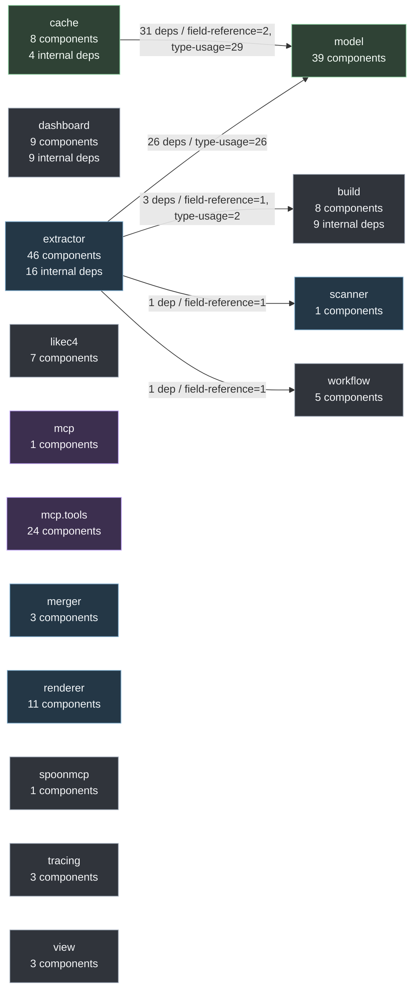

# Generated Architecture

Generated from the indexed architecture model by the MCP tool `export_architecture_docs`.

## Summary

- Applications: 1
- Components: 169
- Entrypoints: 1
- Interfaces: 0
- Dependencies: 100
- Runtime flows: 1

## Source Overview

```mermaid
flowchart TD
    subgraph pkg_dev_dominikbreu_spoonmcp_extractor["dev.dominikbreu.spoonmcp.extractor"]
        dev_dominikbreu_spoonmcp_extractor_FieldAccessIndex["FieldAccessIndex\nUNKNOWN"]
        dev_dominikbreu_spoonmcp_extractor_QuarkusExtractor["QuarkusExtractor\nSERVICE"]
        dev_dominikbreu_spoonmcp_extractor_CallAdjacency["CallAdjacency\nUNKNOWN"]
        dev_dominikbreu_spoonmcp_extractor_DependencyEvidenceScorer["DependencyEvidenceScorer\nUNKNOWN"]
        dev_dominikbreu_spoonmcp_extractor_DependencyAdjacency["DependencyAdjacency\nUNKNOWN"]
        dev_dominikbreu_spoonmcp_extractor_RuntimeFlowInferrer["RuntimeFlowInferrer\nUNKNOWN"]
        dev_dominikbreu_spoonmcp_extractor_MessagingConfigResolver["MessagingConfigResolver\nUNKNOWN"]
        dev_dominikbreu_spoonmcp_extractor_SpringExtractor["SpringExtractor\nSERVICE"]
        dev_dominikbreu_spoonmcp_extractor_EventBusExtractor["EventBusExtractor\nSERVICE"]
        dev_dominikbreu_spoonmcp_extractor_DependencyExtractor["DependencyExtractor\nSERVICE"]
        dev_dominikbreu_spoonmcp_extractor_MessagingCallSiteResolver["MessagingCallSiteResolver\nUNKNOWN"]
        dev_dominikbreu_spoonmcp_extractor_ModelIndex["ModelIndex\nUNKNOWN"]
        dev_dominikbreu_spoonmcp_extractor_InternalModuleClassifier["InternalModuleClassifier\nUNKNOWN"]
        dev_dominikbreu_spoonmcp_extractor_GenericJavaExtractor["GenericJavaExtractor\nSERVICE"]
        dev_dominikbreu_spoonmcp_extractor_OutboundSinkIndex["OutboundSinkIndex\nUNKNOWN"]
        dev_dominikbreu_spoonmcp_extractor_SpringConfigResolver["SpringConfigResolver\nUNKNOWN"]
        dev_dominikbreu_spoonmcp_extractor_DataFlowTracer["DataFlowTracer\nUNKNOWN"]
        dev_dominikbreu_spoonmcp_extractor_CallGraphExtractor["CallGraphExtractor\nSERVICE"]
        dev_dominikbreu_spoonmcp_extractor_ExternalSystemInferrer["ExternalSystemInferrer\nUNKNOWN"]
        dev_dominikbreu_spoonmcp_extractor_ExtractionContext["ExtractionContext\nUNKNOWN"]
        dev_dominikbreu_spoonmcp_extractor_ArchitectureExtractor["ArchitectureExtractor\nSERVICE"]
        dev_dominikbreu_spoonmcp_extractor_DependencyCondenser["DependencyCondenser\nUNKNOWN"]
        dev_dominikbreu_spoonmcp_extractor_EntityIndex["EntityIndex\nUNKNOWN"]
        dev_dominikbreu_spoonmcp_extractor_ComponentIndex["ComponentIndex\nUNKNOWN"]
        dev_dominikbreu_spoonmcp_extractor_UseCaseDetector["UseCaseDetector\nUNKNOWN"]
        dev_dominikbreu_spoonmcp_extractor_PipelineGraphBuilder["PipelineGraphBuilder\nUNKNOWN"]
        dev_dominikbreu_spoonmcp_extractor_ContainerInferrer["ContainerInferrer\nUNKNOWN"]
        dev_dominikbreu_spoonmcp_extractor_JavaEEExtractor["JavaEEExtractor\nSERVICE"]
    end
    subgraph pkg_dev_dominikbreu_spoonmcp_view["dev.dominikbreu.spoonmcp.view"]
        dev_dominikbreu_spoonmcp_view_ArchitectureViewKind["ArchitectureViewKind\nUNKNOWN"]
        dev_dominikbreu_spoonmcp_view_ArchitectureViewProjection["ArchitectureViewProjection\nUNKNOWN"]
        dev_dominikbreu_spoonmcp_view_ArchitectureViewProjector["ArchitectureViewProjector\nUNKNOWN"]
    end
    subgraph pkg_dev_dominikbreu_spoonmcp_mcp_tools["dev.dominikbreu.spoonmcp.mcp.tools"]
        dev_dominikbreu_spoonmcp_mcp_tools_RenderDependencyMapTool["RenderDependencyMapTool\nSERVICE"]
        dev_dominikbreu_spoonmcp_mcp_tools_RenderComponentDependencyDiagramTool["RenderComponentDependencyDiagramTool\nSERVICE"]
        dev_dominikbreu_spoonmcp_mcp_tools_RenderPipelineTool["RenderPipelineTool\nSERVICE"]
        dev_dominikbreu_spoonmcp_mcp_tools_IndexWorkspaceTool["IndexWorkspaceTool\nSERVICE"]
        dev_dominikbreu_spoonmcp_mcp_tools_ExportGraphViewerTool["ExportGraphViewerTool\nSERVICE"]
        dev_dominikbreu_spoonmcp_mcp_tools_RenderArchitectureViewTool["RenderArchitectureViewTool\nSERVICE"]
        dev_dominikbreu_spoonmcp_mcp_tools_ListAppsTool["ListAppsTool\nSERVICE"]
        dev_dominikbreu_spoonmcp_mcp_tools_RenderUseCaseTimelineTool["RenderUseCaseTimelineTool\nSERVICE"]
        dev_dominikbreu_spoonmcp_mcp_tools_ExportLikeC4ModelTool["ExportLikeC4ModelTool\nSERVICE"]
        dev_dominikbreu_spoonmcp_mcp_tools_TraceDataFlowTool["TraceDataFlowTool\nSERVICE"]
        dev_dominikbreu_spoonmcp_mcp_tools_CallFlowTool["CallFlowTool\nSERVICE"]
        dev_dominikbreu_spoonmcp_mcp_tools_ExportGraphArchitecturePocTool["ExportGraphArchitecturePocTool\nSERVICE"]
        dev_dominikbreu_spoonmcp_mcp_tools_DetectUseCasesTool["DetectUseCasesTool\nSERVICE"]
        dev_dominikbreu_spoonmcp_mcp_tools_GraphExportJson["GraphExportJson\nUNKNOWN"]
        dev_dominikbreu_spoonmcp_mcp_tools_ToolArgs["ToolArgs\nUNKNOWN"]
        dev_dominikbreu_spoonmcp_mcp_tools_FindEntrypointsTool["FindEntrypointsTool\nSERVICE"]
        dev_dominikbreu_spoonmcp_mcp_tools_RenderMermaidFlowchartTool["RenderMermaidFlowchartTool\nSERVICE"]
        dev_dominikbreu_spoonmcp_mcp_tools_ExportArchitectureDocsTool["ExportArchitectureDocsTool\nSERVICE"]
        dev_dominikbreu_spoonmcp_mcp_tools_InferContainersTool["InferContainersTool\nSERVICE"]
        dev_dominikbreu_spoonmcp_mcp_tools_RenderSourceOverviewTool["RenderSourceOverviewTool\nSERVICE"]
        dev_dominikbreu_spoonmcp_mcp_tools_QueryArchitectureGraphTool["QueryArchitectureGraphTool\nSERVICE"]
        dev_dominikbreu_spoonmcp_mcp_tools_ExportGraphDataTool["ExportGraphDataTool\nSERVICE"]
        dev_dominikbreu_spoonmcp_mcp_tools_FindComponentsTool["FindComponentsTool\nSERVICE"]
        dev_dominikbreu_spoonmcp_mcp_tools_GetComponentDependenciesTool["GetComponentDependenciesTool\nSERVICE"]
    end
    subgraph pkg_dev_dominikbreu_spoonmcp_model_ids["dev.dominikbreu.spoonmcp.model.ids"]
        dev_dominikbreu_spoonmcp_model_ids_DependencyId["DependencyId\nENTITY"]
        dev_dominikbreu_spoonmcp_model_ids_SourceFactId["SourceFactId\nENTITY"]
        dev_dominikbreu_spoonmcp_model_ids_ComponentId["ComponentId\nENTITY"]
        dev_dominikbreu_spoonmcp_model_ids_FieldAccessId["FieldAccessId\nENTITY"]
        dev_dominikbreu_spoonmcp_model_ids_UseCaseId["UseCaseId\nENTITY"]
        dev_dominikbreu_spoonmcp_model_ids_GraphNodeId["GraphNodeId\nENTITY"]
        dev_dominikbreu_spoonmcp_model_ids_FieldRef["FieldRef\nENTITY"]
        dev_dominikbreu_spoonmcp_model_ids_AppId["AppId\nENTITY"]
        dev_dominikbreu_spoonmcp_model_ids_MethodRef["MethodRef\nENTITY"]
        dev_dominikbreu_spoonmcp_model_ids_DataFlowPathId["DataFlowPathId\nENTITY"]
        dev_dominikbreu_spoonmcp_model_ids_EntrypointId["EntrypointId\nENTITY"]
        dev_dominikbreu_spoonmcp_model_ids_FieldBinding["FieldBinding\nENTITY"]
    end
    subgraph pkg_dev_dominikbreu_spoonmcp_dashboard["dev.dominikbreu.spoonmcp.dashboard"]
        dev_dominikbreu_spoonmcp_dashboard_ReplEngine["ReplEngine\nUNKNOWN"]
        dev_dominikbreu_spoonmcp_dashboard_DispatchResult["DispatchResult\nUNKNOWN"]
        dev_dominikbreu_spoonmcp_dashboard_DashboardRenderer["DashboardRenderer\nSERVICE"]
        dev_dominikbreu_spoonmcp_dashboard_DashboardState["DashboardState\nUNKNOWN"]
        dev_dominikbreu_spoonmcp_dashboard_ReplCommandParser["ReplCommandParser\nUNKNOWN"]
        dev_dominikbreu_spoonmcp_dashboard_Dashboard["Dashboard\nUNKNOWN"]
        dev_dominikbreu_spoonmcp_dashboard_ParsedCommand["ParsedCommand\nUNKNOWN"]
        dev_dominikbreu_spoonmcp_dashboard_DashboardEvent["DashboardEvent\nUNKNOWN"]
        dev_dominikbreu_spoonmcp_dashboard_ReplParseException["ReplParseException\nUNKNOWN"]
    end
    subgraph pkg_dev_dominikbreu_spoonmcp_renderer["dev.dominikbreu.spoonmcp.renderer"]
        dev_dominikbreu_spoonmcp_renderer_Mermaid["Mermaid\nUNKNOWN"]
        dev_dominikbreu_spoonmcp_renderer_ArchitectureViewMermaidRenderer["ArchitectureViewMermaidRenderer\nSERVICE"]
        dev_dominikbreu_spoonmcp_renderer_MermaidFlowchartRenderer["MermaidFlowchartRenderer\nSERVICE"]
        dev_dominikbreu_spoonmcp_renderer_GraphViewerHtmlRenderer["GraphViewerHtmlRenderer\nSERVICE"]
        dev_dominikbreu_spoonmcp_renderer_MermaidDependencyMapRenderer["MermaidDependencyMapRenderer\nSERVICE"]
        dev_dominikbreu_spoonmcp_renderer_MermaidCallFlowRenderer["MermaidCallFlowRenderer\nSERVICE"]
        dev_dominikbreu_spoonmcp_renderer_LikeC4ModelRenderer["LikeC4ModelRenderer\nSERVICE"]
        dev_dominikbreu_spoonmcp_renderer_MermaidDependencySliceRenderer["MermaidDependencySliceRenderer\nSERVICE"]
        dev_dominikbreu_spoonmcp_renderer_MermaidPipelineRenderer["MermaidPipelineRenderer\nSERVICE"]
        dev_dominikbreu_spoonmcp_renderer_MermaidSourceOverviewRenderer["MermaidSourceOverviewRenderer\nSERVICE"]
        dev_dominikbreu_spoonmcp_renderer_MermaidUseCaseTimelineRenderer["MermaidUseCaseTimelineRenderer\nSERVICE"]
    end
    subgraph pkg_dev_dominikbreu_spoonmcp_extractor_sourcefacts["dev.dominikbreu.spoonmcp.extractor.sourcefacts"]
        dev_dominikbreu_spoonmcp_extractor_sourcefacts_SourceField["SourceField\nUNKNOWN"]
        dev_dominikbreu_spoonmcp_extractor_sourcefacts_SourceAnnotation["SourceAnnotation\nUNKNOWN"]
        dev_dominikbreu_spoonmcp_extractor_sourcefacts_SourceEvidence["SourceEvidence\nUNKNOWN"]
        dev_dominikbreu_spoonmcp_extractor_sourcefacts_SourceFactIndex["SourceFactIndex\nUNKNOWN"]
        dev_dominikbreu_spoonmcp_extractor_sourcefacts_SourceMethod["SourceMethod\nUNKNOWN"]
        dev_dominikbreu_spoonmcp_extractor_sourcefacts_SourceInvocation["SourceInvocation\nUNKNOWN"]
        dev_dominikbreu_spoonmcp_extractor_sourcefacts_SourceInjectionPoint["SourceInjectionPoint\nUNKNOWN"]
        dev_dominikbreu_spoonmcp_extractor_sourcefacts_SourceAssignment["SourceAssignment\nUNKNOWN"]
        dev_dominikbreu_spoonmcp_extractor_sourcefacts_SourceReturn["SourceReturn\nUNKNOWN"]
        dev_dominikbreu_spoonmcp_extractor_sourcefacts_FactConfidence["FactConfidence\nUNKNOWN"]
        dev_dominikbreu_spoonmcp_extractor_sourcefacts_SourceLocation["SourceLocation\nUNKNOWN"]
        dev_dominikbreu_spoonmcp_extractor_sourcefacts_SourceType["SourceType\nUNKNOWN"]
        dev_dominikbreu_spoonmcp_extractor_sourcefacts_SourceFactIndexBuilder["SourceFactIndexBuilder\nUNKNOWN"]
    end
    subgraph pkg_dev_dominikbreu_spoonmcp["dev.dominikbreu.spoonmcp"]
        dev_dominikbreu_spoonmcp_Main["Main\nUNKNOWN"]
    end
    subgraph pkg_dev_dominikbreu_spoonmcp_model["dev.dominikbreu.spoonmcp.model"]
        dev_dominikbreu_spoonmcp_model_UseCase["UseCase\nENTITY"]
        dev_dominikbreu_spoonmcp_model_Dependency["Dependency\nENTITY"]
        dev_dominikbreu_spoonmcp_model_EntrypointType["EntrypointType\nENTITY"]
        dev_dominikbreu_spoonmcp_model_Entrypoint["Entrypoint\nENTITY"]
        dev_dominikbreu_spoonmcp_model_RuntimeFlowStep["RuntimeFlowStep\nENTITY"]
        dev_dominikbreu_spoonmcp_model_DataFlowBranch["DataFlowBranch\nENTITY"]
        dev_dominikbreu_spoonmcp_model_SourceInfo["SourceInfo\nENTITY"]
        dev_dominikbreu_spoonmcp_model_DataFlowSink["DataFlowSink\nENTITY"]
        dev_dominikbreu_spoonmcp_model_ArchitectureModel["ArchitectureModel\nENTITY"]
        dev_dominikbreu_spoonmcp_model_ComponentType["ComponentType\nENTITY"]
        dev_dominikbreu_spoonmcp_model_UseCaseNamingConfig["UseCaseNamingConfig\nENTITY"]
        dev_dominikbreu_spoonmcp_model_Component["Component\nENTITY"]
        dev_dominikbreu_spoonmcp_model_DataFlowEdge["DataFlowEdge\nENTITY"]
        dev_dominikbreu_spoonmcp_model_FieldAccess["FieldAccess\nENTITY"]
        dev_dominikbreu_spoonmcp_model_DataFlowStep["DataFlowStep\nENTITY"]
        dev_dominikbreu_spoonmcp_model_DataFlowPath["DataFlowPath\nENTITY"]
        dev_dominikbreu_spoonmcp_model_DataFlowBranchArm["DataFlowBranchArm\nENTITY"]
        dev_dominikbreu_spoonmcp_model_RuntimeFlow["RuntimeFlow\nENTITY"]
        dev_dominikbreu_spoonmcp_model_DataFlowNode["DataFlowNode\nENTITY"]
        dev_dominikbreu_spoonmcp_model_InterfaceEntry["InterfaceEntry\nENTITY"]
        dev_dominikbreu_spoonmcp_model_MessagingBroker["MessagingBroker\nENTITY"]
        dev_dominikbreu_spoonmcp_model_DeploymentEntry["DeploymentEntry\nENTITY"]
        dev_dominikbreu_spoonmcp_model_AppEntry["AppEntry\nENTITY"]
        dev_dominikbreu_spoonmcp_model_CallEdge["CallEdge\nENTITY"]
        dev_dominikbreu_spoonmcp_model_Container["Container\nENTITY"]
        dev_dominikbreu_spoonmcp_model_ExternalSystem["ExternalSystem\nENTITY"]
        dev_dominikbreu_spoonmcp_model_OutboundSinkSite["OutboundSinkSite\nENTITY"]
    end
    subgraph pkg_dev_dominikbreu_spoonmcp_workflow["dev.dominikbreu.spoonmcp.workflow"]
        dev_dominikbreu_spoonmcp_workflow_WorkflowLink["WorkflowLink\nUNKNOWN"]
        dev_dominikbreu_spoonmcp_workflow_WorkflowGraphBuilder["WorkflowGraphBuilder\nUNKNOWN"]
        dev_dominikbreu_spoonmcp_workflow_WorkflowGraph["WorkflowGraph\nUNKNOWN"]
        dev_dominikbreu_spoonmcp_workflow_WorkflowTraversalPolicy["WorkflowTraversalPolicy\nUNKNOWN"]
        dev_dominikbreu_spoonmcp_workflow_WorkflowLinker["WorkflowLinker\nUNKNOWN"]
    end
    subgraph pkg_dev_dominikbreu_spoonmcp_build["dev.dominikbreu.spoonmcp.build"]
        dev_dominikbreu_spoonmcp_build_UnknownBuildProjectDetector["UnknownBuildProjectDetector\nUNKNOWN"]
        dev_dominikbreu_spoonmcp_build_BuildProjectDetector["BuildProjectDetector\nUNKNOWN"]
        dev_dominikbreu_spoonmcp_build_BuildMetadataService["BuildMetadataService\nUNKNOWN"]
        dev_dominikbreu_spoonmcp_build_BuildSystem["BuildSystem\nUNKNOWN"]
        dev_dominikbreu_spoonmcp_build_MavenBuildProjectDetector["MavenBuildProjectDetector\nUNKNOWN"]
        dev_dominikbreu_spoonmcp_build_BuildModule["BuildModule\nUNKNOWN"]
        dev_dominikbreu_spoonmcp_build_BuildProject["BuildProject\nUNKNOWN"]
        dev_dominikbreu_spoonmcp_build_GradleBuildProjectDetector["GradleBuildProjectDetector\nUNKNOWN"]
    end
    subgraph pkg_dev_dominikbreu_spoonmcp_cache["dev.dominikbreu.spoonmcp.cache"]
        dev_dominikbreu_spoonmcp_cache_GraphStore["GraphStore\nUNKNOWN"]
        dev_dominikbreu_spoonmcp_cache_ModelCache["ModelCache\nSERVICE"]
        dev_dominikbreu_spoonmcp_cache_ArchitectureRelevanceScorer["ArchitectureRelevanceScorer\nUNKNOWN"]
        dev_dominikbreu_spoonmcp_cache_GraphProjector["GraphProjector\nUNKNOWN"]
        dev_dominikbreu_spoonmcp_cache_TraversalRecorder["TraversalRecorder\nUNKNOWN"]
        dev_dominikbreu_spoonmcp_cache_GraphDataProjection["GraphDataProjection\nUNKNOWN"]
        dev_dominikbreu_spoonmcp_cache_ComponentClassifier["ComponentClassifier\nUNKNOWN"]
        dev_dominikbreu_spoonmcp_cache_GraphQuery["GraphQuery\nUNKNOWN"]
    end
    subgraph pkg_dev_dominikbreu_spoonmcp_mcp["dev.dominikbreu.spoonmcp.mcp"]
        dev_dominikbreu_spoonmcp_mcp_McpServer["McpServer\nSERVICE"]
    end
    subgraph pkg_dev_dominikbreu_spoonmcp_extractor_objectflow["dev.dominikbreu.spoonmcp.extractor.objectflow"]
        dev_dominikbreu_spoonmcp_extractor_objectflow_ObjectFlowMethodAnalyzer["ObjectFlowMethodAnalyzer\nUNKNOWN"]
        dev_dominikbreu_spoonmcp_extractor_objectflow_ReceiverTarget["ReceiverTarget\nUNKNOWN"]
        dev_dominikbreu_spoonmcp_extractor_objectflow_ObjectFlowIndex["ObjectFlowIndex\nUNKNOWN"]
        dev_dominikbreu_spoonmcp_extractor_objectflow_ObjectFlowIndexBuilder["ObjectFlowIndexBuilder\nUNKNOWN"]
        dev_dominikbreu_spoonmcp_extractor_objectflow_ObjectFlowEvidence["ObjectFlowEvidence\nUNKNOWN"]
    end
    subgraph pkg_dev_dominikbreu_spoonmcp_likec4["dev.dominikbreu.spoonmcp.likec4"]
        dev_dominikbreu_spoonmcp_likec4_LikeC4DynamicStep["LikeC4DynamicStep\nUNKNOWN"]
        dev_dominikbreu_spoonmcp_likec4_LikeC4View["LikeC4View\nUNKNOWN"]
        dev_dominikbreu_spoonmcp_likec4_LikeC4DynamicView["LikeC4DynamicView\nUNKNOWN"]
        dev_dominikbreu_spoonmcp_likec4_LikeC4Document["LikeC4Document\nUNKNOWN"]
        dev_dominikbreu_spoonmcp_likec4_LikeC4WorkspaceProjector["LikeC4WorkspaceProjector\nUNKNOWN"]
        dev_dominikbreu_spoonmcp_likec4_LikeC4Element["LikeC4Element\nUNKNOWN"]
        dev_dominikbreu_spoonmcp_likec4_LikeC4Relationship["LikeC4Relationship\nUNKNOWN"]
    end
    subgraph pkg_dev_dominikbreu_spoonmcp_merger["dev.dominikbreu.spoonmcp.merger"]
        dev_dominikbreu_spoonmcp_merger_DockerComposeMerger["DockerComposeMerger\nSERVICE"]
        dev_dominikbreu_spoonmcp_merger_AnsibleMerger["AnsibleMerger\nSERVICE"]
        dev_dominikbreu_spoonmcp_merger_DeploymentMerger["DeploymentMerger\nSERVICE"]
    end
    subgraph pkg_dev_dominikbreu_spoonmcp_tracing["dev.dominikbreu.spoonmcp.tracing"]
        dev_dominikbreu_spoonmcp_tracing_StdoutSpanExporter["StdoutSpanExporter\nUNKNOWN"]
        dev_dominikbreu_spoonmcp_tracing_TracingConfig["TracingConfig\nUNKNOWN"]
        dev_dominikbreu_spoonmcp_tracing_Spans["Spans\nUNKNOWN"]
    end
    subgraph pkg_dev_dominikbreu_spoonmcp_scanner["dev.dominikbreu.spoonmcp.scanner"]
        dev_dominikbreu_spoonmcp_scanner_SpoonScanner["SpoonScanner\nSERVICE"]
    end
    dev_dominikbreu_spoonmcp_build_BuildMetadataService --> dev_dominikbreu_spoonmcp_build_BuildProject
    dev_dominikbreu_spoonmcp_build_BuildProject --> dev_dominikbreu_spoonmcp_build_BuildSystem
    dev_dominikbreu_spoonmcp_build_BuildProject --> dev_dominikbreu_spoonmcp_build_BuildModule
    dev_dominikbreu_spoonmcp_build_BuildProjectDetector --> dev_dominikbreu_spoonmcp_build_BuildProject
    dev_dominikbreu_spoonmcp_build_GradleBuildProjectDetector --> dev_dominikbreu_spoonmcp_build_BuildProject
    dev_dominikbreu_spoonmcp_build_GradleBuildProjectDetector --> dev_dominikbreu_spoonmcp_build_BuildModule
    dev_dominikbreu_spoonmcp_build_MavenBuildProjectDetector --> dev_dominikbreu_spoonmcp_build_BuildModule
    dev_dominikbreu_spoonmcp_build_MavenBuildProjectDetector --> dev_dominikbreu_spoonmcp_build_BuildProject
    dev_dominikbreu_spoonmcp_build_UnknownBuildProjectDetector --> dev_dominikbreu_spoonmcp_build_BuildProject
    dev_dominikbreu_spoonmcp_cache_ArchitectureRelevanceScorer --> dev_dominikbreu_spoonmcp_model_Component
    dev_dominikbreu_spoonmcp_cache_ComponentClassifier --> dev_dominikbreu_spoonmcp_model_Component
    dev_dominikbreu_spoonmcp_cache_GraphDataProjection --> dev_dominikbreu_spoonmcp_model_ids_GraphNodeId
    dev_dominikbreu_spoonmcp_cache_GraphProjector --> dev_dominikbreu_spoonmcp_cache_GraphStore
    dev_dominikbreu_spoonmcp_cache_GraphProjector --> dev_dominikbreu_spoonmcp_model_ArchitectureModel
    dev_dominikbreu_spoonmcp_cache_GraphProjector --> dev_dominikbreu_spoonmcp_model_AppEntry
    dev_dominikbreu_spoonmcp_cache_GraphProjector --> dev_dominikbreu_spoonmcp_model_Component
    dev_dominikbreu_spoonmcp_cache_GraphProjector --> dev_dominikbreu_spoonmcp_model_Container
    dev_dominikbreu_spoonmcp_cache_GraphProjector --> dev_dominikbreu_spoonmcp_model_DataFlowPath
    dev_dominikbreu_spoonmcp_cache_GraphProjector --> dev_dominikbreu_spoonmcp_model_DeploymentEntry
    dev_dominikbreu_spoonmcp_cache_GraphProjector --> dev_dominikbreu_spoonmcp_model_Entrypoint
    dev_dominikbreu_spoonmcp_cache_GraphProjector --> dev_dominikbreu_spoonmcp_model_ExternalSystem
    dev_dominikbreu_spoonmcp_cache_GraphProjector --> dev_dominikbreu_spoonmcp_model_InterfaceEntry
    dev_dominikbreu_spoonmcp_cache_GraphProjector --> dev_dominikbreu_spoonmcp_model_RuntimeFlow
    dev_dominikbreu_spoonmcp_cache_GraphProjector --> dev_dominikbreu_spoonmcp_model_DataFlowSink
    dev_dominikbreu_spoonmcp_cache_GraphProjector --> dev_dominikbreu_spoonmcp_model_ids_ComponentId
    dev_dominikbreu_spoonmcp_cache_GraphProjector --> dev_dominikbreu_spoonmcp_model_Dependency
    dev_dominikbreu_spoonmcp_cache_GraphProjector --> dev_dominikbreu_spoonmcp_model_FieldAccess
    dev_dominikbreu_spoonmcp_cache_GraphProjector --> dev_dominikbreu_spoonmcp_model_ids_FieldRef
    dev_dominikbreu_spoonmcp_cache_GraphProjector --> dev_dominikbreu_spoonmcp_model_DataFlowNode
    dev_dominikbreu_spoonmcp_cache_GraphProjector --> dev_dominikbreu_spoonmcp_model_SourceInfo
    dev_dominikbreu_spoonmcp_cache_GraphQuery --> dev_dominikbreu_spoonmcp_cache_GraphStore
    dev_dominikbreu_spoonmcp_cache_GraphQuery --> dev_dominikbreu_spoonmcp_model_ids_AppId
    dev_dominikbreu_spoonmcp_cache_GraphQuery --> dev_dominikbreu_spoonmcp_model_ids_GraphNodeId
    dev_dominikbreu_spoonmcp_cache_GraphQuery --> dev_dominikbreu_spoonmcp_model_DataFlowSink
    dev_dominikbreu_spoonmcp_cache_GraphQuery --> dev_dominikbreu_spoonmcp_model_DataFlowPath
    dev_dominikbreu_spoonmcp_cache_GraphQuery --> dev_dominikbreu_spoonmcp_model_ids_ComponentId
    dev_dominikbreu_spoonmcp_cache_GraphQuery --> dev_dominikbreu_spoonmcp_model_ids_EntrypointId
    dev_dominikbreu_spoonmcp_cache_GraphQuery --> dev_dominikbreu_spoonmcp_model_ArchitectureModel
    dev_dominikbreu_spoonmcp_cache_GraphQuery --> dev_dominikbreu_spoonmcp_model_Entrypoint
    dev_dominikbreu_spoonmcp_cache_GraphQuery --> dev_dominikbreu_spoonmcp_model_DataFlowStep
    dev_dominikbreu_spoonmcp_cache_GraphQuery --> dev_dominikbreu_spoonmcp_model_SourceInfo
    dev_dominikbreu_spoonmcp_cache_ModelCache --> dev_dominikbreu_spoonmcp_cache_GraphStore
    dev_dominikbreu_spoonmcp_cache_ModelCache --> dev_dominikbreu_spoonmcp_model_ArchitectureModel
    dev_dominikbreu_spoonmcp_cache_ModelCache --> dev_dominikbreu_spoonmcp_cache_GraphQuery
    dev_dominikbreu_spoonmcp_dashboard_Dashboard --> dev_dominikbreu_spoonmcp_dashboard_ReplEngine
    dev_dominikbreu_spoonmcp_dashboard_Dashboard --> dev_dominikbreu_spoonmcp_dashboard_DashboardState
    dev_dominikbreu_spoonmcp_dashboard_DashboardRenderer --> dev_dominikbreu_spoonmcp_dashboard_DashboardEvent
    dev_dominikbreu_spoonmcp_dashboard_DashboardRenderer --> dev_dominikbreu_spoonmcp_dashboard_DashboardState
    dev_dominikbreu_spoonmcp_dashboard_DashboardState --> dev_dominikbreu_spoonmcp_dashboard_DashboardEvent
    dev_dominikbreu_spoonmcp_dashboard_DispatchResult --> dev_dominikbreu_spoonmcp_dashboard_DashboardEvent
    dev_dominikbreu_spoonmcp_dashboard_ReplCommandParser --> dev_dominikbreu_spoonmcp_dashboard_ParsedCommand
    dev_dominikbreu_spoonmcp_dashboard_ReplEngine --> dev_dominikbreu_spoonmcp_dashboard_DispatchResult
    dev_dominikbreu_spoonmcp_dashboard_ReplEngine --> dev_dominikbreu_spoonmcp_dashboard_DashboardEvent
    dev_dominikbreu_spoonmcp_extractor_ArchitectureExtractor --> dev_dominikbreu_spoonmcp_scanner_SpoonScanner
    dev_dominikbreu_spoonmcp_extractor_ArchitectureExtractor --> dev_dominikbreu_spoonmcp_extractor_QuarkusExtractor
    dev_dominikbreu_spoonmcp_extractor_ArchitectureExtractor --> dev_dominikbreu_spoonmcp_extractor_JavaEEExtractor
    dev_dominikbreu_spoonmcp_extractor_ArchitectureExtractor --> dev_dominikbreu_spoonmcp_extractor_GenericJavaExtractor
    dev_dominikbreu_spoonmcp_extractor_ArchitectureExtractor --> dev_dominikbreu_spoonmcp_extractor_DependencyExtractor
    dev_dominikbreu_spoonmcp_extractor_ArchitectureExtractor --> dev_dominikbreu_spoonmcp_extractor_ContainerInferrer
    dev_dominikbreu_spoonmcp_extractor_ArchitectureExtractor --> dev_dominikbreu_spoonmcp_extractor_InternalModuleClassifier
    dev_dominikbreu_spoonmcp_extractor_ArchitectureExtractor --> dev_dominikbreu_spoonmcp_extractor_EventBusExtractor
    dev_dominikbreu_spoonmcp_extractor_ArchitectureExtractor --> dev_dominikbreu_spoonmcp_extractor_RuntimeFlowInferrer
    dev_dominikbreu_spoonmcp_extractor_ArchitectureExtractor --> dev_dominikbreu_spoonmcp_extractor_MessagingConfigResolver
    dev_dominikbreu_spoonmcp_extractor_ArchitectureExtractor --> dev_dominikbreu_spoonmcp_extractor_ExternalSystemInferrer
    dev_dominikbreu_spoonmcp_extractor_ArchitectureExtractor --> dev_dominikbreu_spoonmcp_extractor_DataFlowTracer
    dev_dominikbreu_spoonmcp_extractor_ArchitectureExtractor --> dev_dominikbreu_spoonmcp_build_BuildMetadataService
    dev_dominikbreu_spoonmcp_extractor_ArchitectureExtractor --> dev_dominikbreu_spoonmcp_extractor_sourcefacts_SourceFactIndexBuilder
    dev_dominikbreu_spoonmcp_extractor_ArchitectureExtractor --> dev_dominikbreu_spoonmcp_model_ArchitectureModel
    dev_dominikbreu_spoonmcp_extractor_ArchitectureExtractor --> dev_dominikbreu_spoonmcp_model_ids_AppId
    dev_dominikbreu_spoonmcp_extractor_ArchitectureExtractor --> dev_dominikbreu_spoonmcp_model_Entrypoint
    dev_dominikbreu_spoonmcp_extractor_ArchitectureExtractor --> dev_dominikbreu_spoonmcp_model_InterfaceEntry
    dev_dominikbreu_spoonmcp_extractor_ArchitectureExtractor --> dev_dominikbreu_spoonmcp_model_AppEntry
    dev_dominikbreu_spoonmcp_extractor_ArchitectureExtractor --> dev_dominikbreu_spoonmcp_build_BuildModule
    dev_dominikbreu_spoonmcp_extractor_ArchitectureExtractor --> dev_dominikbreu_spoonmcp_build_BuildProject
    dev_dominikbreu_spoonmcp_extractor_ArchitectureExtractor --> dev_dominikbreu_spoonmcp_model_ids_ComponentId
    dev_dominikbreu_spoonmcp_extractor_ArchitectureExtractor --> dev_dominikbreu_spoonmcp_extractor_ModelIndex
    dev_dominikbreu_spoonmcp_extractor_CallAdjacency --> dev_dominikbreu_spoonmcp_model_CallEdge
    dev_dominikbreu_spoonmcp_extractor_CallAdjacency --> dev_dominikbreu_spoonmcp_model_ids_ComponentId
    dev_dominikbreu_spoonmcp_extractor_CallGraphExtractor --> dev_dominikbreu_spoonmcp_extractor_objectflow_ObjectFlowIndex
    dev_dominikbreu_spoonmcp_extractor_CallGraphExtractor --> dev_dominikbreu_spoonmcp_extractor_sourcefacts_SourceFactIndex
    dev_dominikbreu_spoonmcp_extractor_CallGraphExtractor --> dev_dominikbreu_spoonmcp_extractor_ExtractionContext
    dev_dominikbreu_spoonmcp_extractor_CallGraphExtractor --> dev_dominikbreu_spoonmcp_model_Component
    dev_dominikbreu_spoonmcp_extractor_CallGraphExtractor --> dev_dominikbreu_spoonmcp_model_ids_ComponentId
    dev_dominikbreu_spoonmcp_extractor_CallGraphExtractor --> dev_dominikbreu_spoonmcp_model_CallEdge
    dev_dominikbreu_spoonmcp_extractor_CallGraphExtractor --> dev_dominikbreu_spoonmcp_model_FieldAccess
    dev_dominikbreu_spoonmcp_extractor_CallGraphExtractor --> dev_dominikbreu_spoonmcp_model_SourceInfo
    dev_dominikbreu_spoonmcp_extractor_CallGraphExtractor --> dev_dominikbreu_spoonmcp_model_ArchitectureModel
    dev_dominikbreu_spoonmcp_extractor_CallGraphExtractor --> dev_dominikbreu_spoonmcp_model_OutboundSinkSite
    dev_dominikbreu_spoonmcp_extractor_ComponentIndex --> dev_dominikbreu_spoonmcp_model_Component
    dev_dominikbreu_spoonmcp_extractor_ComponentIndex --> dev_dominikbreu_spoonmcp_model_ids_ComponentId
    dev_dominikbreu_spoonmcp_extractor_ContainerInferrer --> dev_dominikbreu_spoonmcp_model_Component
    dev_dominikbreu_spoonmcp_extractor_ContainerInferrer --> dev_dominikbreu_spoonmcp_model_Container
    dev_dominikbreu_spoonmcp_extractor_ContainerInferrer --> dev_dominikbreu_spoonmcp_model_ComponentType
    dev_dominikbreu_spoonmcp_extractor_DataFlowTracer --> dev_dominikbreu_spoonmcp_workflow_WorkflowTraversalPolicy
    dev_dominikbreu_spoonmcp_extractor_DataFlowTracer --> dev_dominikbreu_spoonmcp_model_DataFlowPath
    dev_dominikbreu_spoonmcp_extractor_DataFlowTracer --> dev_dominikbreu_spoonmcp_model_CallEdge
    dev_dominikbreu_spoonmcp_extractor_DataFlowTracer --> dev_dominikbreu_spoonmcp_model_ids_ComponentId
    dev_dominikbreu_spoonmcp_extractor_DataFlowTracer --> dev_dominikbreu_spoonmcp_model_Component
    dev_dominikbreu_spoonmcp_extractor_DataFlowTracer --> dev_dominikbreu_spoonmcp_model_ids_FieldRef
    dev_dominikbreu_spoonmcp_extractor_DataFlowTracer --> dev_dominikbreu_spoonmcp_model_Entrypoint
```

## Component Architecture

```mermaid
flowchart TD
    subgraph spoon_mcp_server["spoon-mcp-server (java)"]
        subgraph container_spoon_mcp_server_extractor["extractor"]
            dev_dominikbreu_spoonmcp_extractor_sourcefacts_SourceFactIndex["UNKNOWN\nSourceFactIndex"]
            dev_dominikbreu_spoonmcp_extractor_sourcefacts_SourceFactIndexBuilder["UNKNOWN\nSourceFactIndexBuilder"]
            dev_dominikbreu_spoonmcp_extractor_sourcefacts_SourceField["UNKNOWN\nSourceField"]
            dev_dominikbreu_spoonmcp_extractor_sourcefacts_SourceInjectionPoint["UNKNOWN\nSourceInjectionPoint"]
            dev_dominikbreu_spoonmcp_extractor_sourcefacts_SourceInvocation["UNKNOWN\nSourceInvocation"]
            dev_dominikbreu_spoonmcp_extractor_sourcefacts_SourceLocation["UNKNOWN\nSourceLocation"]
            dev_dominikbreu_spoonmcp_extractor_sourcefacts_SourceMethod["UNKNOWN\nSourceMethod"]
            dev_dominikbreu_spoonmcp_extractor_sourcefacts_SourceReturn["UNKNOWN\nSourceReturn"]
            dev_dominikbreu_spoonmcp_extractor_sourcefacts_SourceType["UNKNOWN\nSourceType"]
            dev_dominikbreu_spoonmcp_extractor_ArchitectureExtractor["SERVICE\nArchitectureExtractor"]
            dev_dominikbreu_spoonmcp_extractor_CallAdjacency["UNKNOWN\nCallAdjacency"]
            dev_dominikbreu_spoonmcp_extractor_CallGraphExtractor["SERVICE\nCallGraphExtractor"]
            dev_dominikbreu_spoonmcp_extractor_ComponentIndex["UNKNOWN\nComponentIndex"]
            dev_dominikbreu_spoonmcp_extractor_ContainerInferrer["UNKNOWN\nContainerInferrer"]
            dev_dominikbreu_spoonmcp_extractor_DataFlowTracer["UNKNOWN\nDataFlowTracer"]
            dev_dominikbreu_spoonmcp_extractor_DependencyAdjacency["UNKNOWN\nDependencyAdjacency"]
            dev_dominikbreu_spoonmcp_extractor_DependencyCondenser["UNKNOWN\nDependencyCondenser"]
            dev_dominikbreu_spoonmcp_extractor_DependencyEvidenceScorer["UNKNOWN\nDependencyEvidenceScorer"]
            dev_dominikbreu_spoonmcp_extractor_DependencyExtractor["SERVICE\nDependencyExtractor"]
            dev_dominikbreu_spoonmcp_extractor_EntityIndex["UNKNOWN\nEntityIndex"]
            dev_dominikbreu_spoonmcp_extractor_EventBusExtractor["SERVICE\nEventBusExtractor"]
            dev_dominikbreu_spoonmcp_extractor_ExternalSystemInferrer["UNKNOWN\nExternalSystemInferrer"]
            dev_dominikbreu_spoonmcp_extractor_ExtractionContext["UNKNOWN\nExtractionContext"]
            dev_dominikbreu_spoonmcp_extractor_FieldAccessIndex["UNKNOWN\nFieldAccessIndex"]
            dev_dominikbreu_spoonmcp_extractor_GenericJavaExtractor["SERVICE\nGenericJavaExtractor"]
            dev_dominikbreu_spoonmcp_extractor_InternalModuleClassifier["UNKNOWN\nInternalModuleClassifier"]
            dev_dominikbreu_spoonmcp_extractor_JavaEEExtractor["SERVICE\nJavaEEExtractor"]
            dev_dominikbreu_spoonmcp_extractor_MessagingCallSiteResolver["UNKNOWN\nMessagingCallSiteResolver"]
            dev_dominikbreu_spoonmcp_extractor_MessagingConfigResolver["UNKNOWN\nMessagingConfigResolver"]
            dev_dominikbreu_spoonmcp_extractor_ModelIndex["UNKNOWN\nModelIndex"]
            dev_dominikbreu_spoonmcp_extractor_OutboundSinkIndex["UNKNOWN\nOutboundSinkIndex"]
            dev_dominikbreu_spoonmcp_extractor_PipelineGraphBuilder["UNKNOWN\nPipelineGraphBuilder"]
            dev_dominikbreu_spoonmcp_extractor_QuarkusExtractor["SERVICE\nQuarkusExtractor"]
            dev_dominikbreu_spoonmcp_extractor_RuntimeFlowInferrer["UNKNOWN\nRuntimeFlowInferrer"]
            dev_dominikbreu_spoonmcp_extractor_SpringConfigResolver["UNKNOWN\nSpringConfigResolver"]
            dev_dominikbreu_spoonmcp_extractor_SpringExtractor["SERVICE\nSpringExtractor"]
            dev_dominikbreu_spoonmcp_extractor_UseCaseDetector["UNKNOWN\nUseCaseDetector"]
            dev_dominikbreu_spoonmcp_extractor_objectflow_ObjectFlowEvidence["UNKNOWN\nObjectFlowEvidence"]
            dev_dominikbreu_spoonmcp_extractor_objectflow_ObjectFlowIndex["UNKNOWN\nObjectFlowIndex"]
            dev_dominikbreu_spoonmcp_extractor_objectflow_ObjectFlowIndexBuilder["UNKNOWN\nObjectFlowIndexBuilder"]
            dev_dominikbreu_spoonmcp_extractor_objectflow_ObjectFlowMethodAnalyzer["UNKNOWN\nObjectFlowMethodAnalyzer"]
            dev_dominikbreu_spoonmcp_extractor_objectflow_ReceiverTarget["UNKNOWN\nReceiverTarget"]
            dev_dominikbreu_spoonmcp_extractor_sourcefacts_FactConfidence["UNKNOWN\nFactConfidence"]
            dev_dominikbreu_spoonmcp_extractor_sourcefacts_SourceAnnotation["UNKNOWN\nSourceAnnotation"]
            dev_dominikbreu_spoonmcp_extractor_sourcefacts_SourceAssignment["UNKNOWN\nSourceAssignment"]
            dev_dominikbreu_spoonmcp_extractor_sourcefacts_SourceEvidence["UNKNOWN\nSourceEvidence"]
        end
        subgraph container_spoon_mcp_server_scanner["scanner"]
            dev_dominikbreu_spoonmcp_scanner_SpoonScanner["SERVICE\nSpoonScanner"]
        end
        subgraph container_spoon_mcp_server_misc["misc"]
            dev_dominikbreu_spoonmcp_likec4_LikeC4Document["UNKNOWN\nLikeC4Document"]
            dev_dominikbreu_spoonmcp_likec4_LikeC4DynamicStep["UNKNOWN\nLikeC4DynamicStep"]
            dev_dominikbreu_spoonmcp_likec4_LikeC4DynamicView["UNKNOWN\nLikeC4DynamicView"]
            dev_dominikbreu_spoonmcp_likec4_LikeC4Element["UNKNOWN\nLikeC4Element"]
            dev_dominikbreu_spoonmcp_likec4_LikeC4Relationship["UNKNOWN\nLikeC4Relationship"]
            dev_dominikbreu_spoonmcp_likec4_LikeC4View["UNKNOWN\nLikeC4View"]
            dev_dominikbreu_spoonmcp_likec4_LikeC4WorkspaceProjector["UNKNOWN\nLikeC4WorkspaceProjector"]
            dev_dominikbreu_spoonmcp_tracing_Spans["UNKNOWN\nSpans"]
            dev_dominikbreu_spoonmcp_tracing_StdoutSpanExporter["UNKNOWN\nStdoutSpanExporter"]
            dev_dominikbreu_spoonmcp_tracing_TracingConfig["UNKNOWN\nTracingConfig"]
            dev_dominikbreu_spoonmcp_view_ArchitectureViewKind["UNKNOWN\nArchitectureViewKind"]
            dev_dominikbreu_spoonmcp_view_ArchitectureViewProjection["UNKNOWN\nArchitectureViewProjection"]
            dev_dominikbreu_spoonmcp_view_ArchitectureViewProjector["UNKNOWN\nArchitectureViewProjector"]
            dev_dominikbreu_spoonmcp_workflow_WorkflowGraph["UNKNOWN\nWorkflowGraph"]
            dev_dominikbreu_spoonmcp_workflow_WorkflowGraphBuilder["UNKNOWN\nWorkflowGraphBuilder"]
            dev_dominikbreu_spoonmcp_workflow_WorkflowLink["UNKNOWN\nWorkflowLink"]
            dev_dominikbreu_spoonmcp_workflow_WorkflowLinker["UNKNOWN\nWorkflowLinker"]
            dev_dominikbreu_spoonmcp_workflow_WorkflowTraversalPolicy["UNKNOWN\nWorkflowTraversalPolicy"]
            dev_dominikbreu_spoonmcp_Main["UNKNOWN\nMain"]
            dev_dominikbreu_spoonmcp_build_BuildMetadataService["UNKNOWN\nBuildMetadataService"]
            dev_dominikbreu_spoonmcp_build_BuildModule["UNKNOWN\nBuildModule"]
            dev_dominikbreu_spoonmcp_build_BuildProject["UNKNOWN\nBuildProject"]
            dev_dominikbreu_spoonmcp_build_BuildProjectDetector["UNKNOWN\nBuildProjectDetector"]
            dev_dominikbreu_spoonmcp_build_BuildSystem["UNKNOWN\nBuildSystem"]
            dev_dominikbreu_spoonmcp_build_GradleBuildProjectDetector["UNKNOWN\nGradleBuildProjectDetector"]
            dev_dominikbreu_spoonmcp_build_MavenBuildProjectDetector["UNKNOWN\nMavenBuildProjectDetector"]
            dev_dominikbreu_spoonmcp_build_UnknownBuildProjectDetector["UNKNOWN\nUnknownBuildProjectDetector"]
            dev_dominikbreu_spoonmcp_dashboard_Dashboard["UNKNOWN\nDashboard"]
            dev_dominikbreu_spoonmcp_dashboard_DashboardEvent["UNKNOWN\nDashboardEvent"]
            dev_dominikbreu_spoonmcp_dashboard_DashboardState["UNKNOWN\nDashboardState"]
            dev_dominikbreu_spoonmcp_dashboard_DispatchResult["UNKNOWN\nDispatchResult"]
            dev_dominikbreu_spoonmcp_dashboard_ParsedCommand["UNKNOWN\nParsedCommand"]
            dev_dominikbreu_spoonmcp_dashboard_ReplCommandParser["UNKNOWN\nReplCommandParser"]
            dev_dominikbreu_spoonmcp_dashboard_ReplEngine["UNKNOWN\nReplEngine"]
            dev_dominikbreu_spoonmcp_dashboard_ReplParseException["UNKNOWN\nReplParseException"]
        end
        subgraph container_spoon_mcp_server_service["service"]
            dev_dominikbreu_spoonmcp_dashboard_DashboardRenderer["SERVICE\nDashboardRenderer"]
        end
        subgraph container_spoon_mcp_server_cache["cache"]
            dev_dominikbreu_spoonmcp_cache_ArchitectureRelevanceScorer["UNKNOWN\nArchitectureRelevanceScorer"]
            dev_dominikbreu_spoonmcp_cache_ComponentClassifier["UNKNOWN\nComponentClassifier"]
            dev_dominikbreu_spoonmcp_cache_GraphDataProjection["UNKNOWN\nGraphDataProjection"]
            dev_dominikbreu_spoonmcp_cache_GraphProjector["UNKNOWN\nGraphProjector"]
            dev_dominikbreu_spoonmcp_cache_GraphQuery["UNKNOWN\nGraphQuery"]
            dev_dominikbreu_spoonmcp_cache_GraphStore["UNKNOWN\nGraphStore"]
            dev_dominikbreu_spoonmcp_cache_ModelCache["SERVICE\nModelCache"]
            dev_dominikbreu_spoonmcp_cache_TraversalRecorder["UNKNOWN\nTraversalRecorder"]
        end
        subgraph container_spoon_mcp_server_mcp_server["mcp-server"]
            dev_dominikbreu_spoonmcp_mcp_McpServer["SERVICE\nMcpServer"]
        end
        subgraph container_spoon_mcp_server_mcp_tools["mcp-tools"]
            dev_dominikbreu_spoonmcp_mcp_tools_ToolArgs["UNKNOWN\nToolArgs"]
            dev_dominikbreu_spoonmcp_mcp_tools_TraceDataFlowTool["SERVICE\nTraceDataFlowTool"]
            dev_dominikbreu_spoonmcp_mcp_tools_CallFlowTool["SERVICE\nCallFlowTool"]
            dev_dominikbreu_spoonmcp_mcp_tools_DetectUseCasesTool["SERVICE\nDetectUseCasesTool"]
            dev_dominikbreu_spoonmcp_mcp_tools_ExportArchitectureDocsTool["SERVICE\nExportArchitectureDocsTool"]
            dev_dominikbreu_spoonmcp_mcp_tools_ExportGraphArchitecturePocTool["SERVICE\nExportGraphArchitecturePocTool"]
            dev_dominikbreu_spoonmcp_mcp_tools_ExportGraphDataTool["SERVICE\nExportGraphDataTool"]
            dev_dominikbreu_spoonmcp_mcp_tools_ExportGraphViewerTool["SERVICE\nExportGraphViewerTool"]
            dev_dominikbreu_spoonmcp_mcp_tools_ExportLikeC4ModelTool["SERVICE\nExportLikeC4ModelTool"]
            dev_dominikbreu_spoonmcp_mcp_tools_FindComponentsTool["SERVICE\nFindComponentsTool"]
            dev_dominikbreu_spoonmcp_mcp_tools_FindEntrypointsTool["SERVICE\nFindEntrypointsTool"]
            dev_dominikbreu_spoonmcp_mcp_tools_GetComponentDependenciesTool["SERVICE\nGetComponentDependenciesTool"]
            dev_dominikbreu_spoonmcp_mcp_tools_GraphExportJson["UNKNOWN\nGraphExportJson"]
            dev_dominikbreu_spoonmcp_mcp_tools_IndexWorkspaceTool["SERVICE\nIndexWorkspaceTool"]
            dev_dominikbreu_spoonmcp_mcp_tools_InferContainersTool["SERVICE\nInferContainersTool"]
            dev_dominikbreu_spoonmcp_mcp_tools_ListAppsTool["SERVICE\nListAppsTool"]
            dev_dominikbreu_spoonmcp_mcp_tools_QueryArchitectureGraphTool["SERVICE\nQueryArchitectureGraphTool"]
            dev_dominikbreu_spoonmcp_mcp_tools_RenderArchitectureViewTool["SERVICE\nRenderArchitectureViewTool"]
            dev_dominikbreu_spoonmcp_mcp_tools_RenderComponentDependencyDiagramTool["SERVICE\nRenderComponentDependencyDiagramTool"]
            dev_dominikbreu_spoonmcp_mcp_tools_RenderDependencyMapTool["SERVICE\nRenderDependencyMapTool"]
            dev_dominikbreu_spoonmcp_mcp_tools_RenderMermaidFlowchartTool["SERVICE\nRenderMermaidFlowchartTool"]
            dev_dominikbreu_spoonmcp_mcp_tools_RenderPipelineTool["SERVICE\nRenderPipelineTool"]
            dev_dominikbreu_spoonmcp_mcp_tools_RenderSourceOverviewTool["SERVICE\nRenderSourceOverviewTool"]
            dev_dominikbreu_spoonmcp_mcp_tools_RenderUseCaseTimelineTool["SERVICE\nRenderUseCaseTimelineTool"]
        end
        subgraph container_spoon_mcp_server_model["model"]
            dev_dominikbreu_spoonmcp_model_ids_AppId[("ENTITY\nAppId")]
            dev_dominikbreu_spoonmcp_model_ids_ComponentId[("ENTITY\nComponentId")]
            dev_dominikbreu_spoonmcp_model_ids_DataFlowPathId[("ENTITY\nDataFlowPathId")]
            dev_dominikbreu_spoonmcp_model_ids_DependencyId[("ENTITY\nDependencyId")]
            dev_dominikbreu_spoonmcp_model_ids_EntrypointId[("ENTITY\nEntrypointId")]
            dev_dominikbreu_spoonmcp_model_ids_FieldAccessId[("ENTITY\nFieldAccessId")]
            dev_dominikbreu_spoonmcp_model_ids_FieldBinding[("ENTITY\nFieldBinding")]
            dev_dominikbreu_spoonmcp_model_ids_FieldRef[("ENTITY\nFieldRef")]
            dev_dominikbreu_spoonmcp_model_ids_GraphNodeId[("ENTITY\nGraphNodeId")]
            dev_dominikbreu_spoonmcp_model_ids_MethodRef[("ENTITY\nMethodRef")]
            dev_dominikbreu_spoonmcp_model_ids_SourceFactId[("ENTITY\nSourceFactId")]
            dev_dominikbreu_spoonmcp_model_ids_UseCaseId[("ENTITY\nUseCaseId")]
            dev_dominikbreu_spoonmcp_model_AppEntry[("ENTITY\nAppEntry")]
            dev_dominikbreu_spoonmcp_model_ArchitectureModel[("ENTITY\nArchitectureModel")]
            dev_dominikbreu_spoonmcp_model_CallEdge[("ENTITY\nCallEdge")]
            dev_dominikbreu_spoonmcp_model_Component[("ENTITY\nComponent")]
            dev_dominikbreu_spoonmcp_model_ComponentType[("ENTITY\nComponentType")]
            dev_dominikbreu_spoonmcp_model_Container[("ENTITY\nContainer")]
            dev_dominikbreu_spoonmcp_model_DataFlowBranch[("ENTITY\nDataFlowBranch")]
            dev_dominikbreu_spoonmcp_model_DataFlowBranchArm[("ENTITY\nDataFlowBranchArm")]
            dev_dominikbreu_spoonmcp_model_DataFlowEdge[("ENTITY\nDataFlowEdge")]
            dev_dominikbreu_spoonmcp_model_DataFlowNode[("ENTITY\nDataFlowNode")]
            dev_dominikbreu_spoonmcp_model_DataFlowPath[("ENTITY\nDataFlowPath")]
            dev_dominikbreu_spoonmcp_model_DataFlowSink[("ENTITY\nDataFlowSink")]
            dev_dominikbreu_spoonmcp_model_DataFlowStep[("ENTITY\nDataFlowStep")]
            dev_dominikbreu_spoonmcp_model_Dependency[("ENTITY\nDependency")]
            dev_dominikbreu_spoonmcp_model_DeploymentEntry[("ENTITY\nDeploymentEntry")]
            dev_dominikbreu_spoonmcp_model_Entrypoint[("ENTITY\nEntrypoint")]
            dev_dominikbreu_spoonmcp_model_EntrypointType[("ENTITY\nEntrypointType")]
            dev_dominikbreu_spoonmcp_model_ExternalSystem[("ENTITY\nExternalSystem")]
            dev_dominikbreu_spoonmcp_model_FieldAccess[("ENTITY\nFieldAccess")]
            dev_dominikbreu_spoonmcp_model_InterfaceEntry[("ENTITY\nInterfaceEntry")]
            dev_dominikbreu_spoonmcp_model_MessagingBroker[("ENTITY\nMessagingBroker")]
            dev_dominikbreu_spoonmcp_model_OutboundSinkSite[("ENTITY\nOutboundSinkSite")]
            dev_dominikbreu_spoonmcp_model_RuntimeFlow[("ENTITY\nRuntimeFlow")]
            dev_dominikbreu_spoonmcp_model_RuntimeFlowStep[("ENTITY\nRuntimeFlowStep")]
            dev_dominikbreu_spoonmcp_model_SourceInfo[("ENTITY\nSourceInfo")]
            dev_dominikbreu_spoonmcp_model_UseCase[("ENTITY\nUseCase")]
            dev_dominikbreu_spoonmcp_model_UseCaseNamingConfig[("ENTITY\nUseCaseNamingConfig")]
        end
        subgraph container_spoon_mcp_server_deployment_merge["deployment-merge"]
            dev_dominikbreu_spoonmcp_merger_AnsibleMerger["SERVICE\nAnsibleMerger"]
            dev_dominikbreu_spoonmcp_merger_DeploymentMerger["SERVICE\nDeploymentMerger"]
            dev_dominikbreu_spoonmcp_merger_DockerComposeMerger["SERVICE\nDockerComposeMerger"]
        end
        subgraph container_spoon_mcp_server_renderer["renderer"]
            dev_dominikbreu_spoonmcp_renderer_MermaidCallFlowRenderer["SERVICE\nMermaidCallFlowRenderer"]
            dev_dominikbreu_spoonmcp_renderer_MermaidDependencyMapRenderer["SERVICE\nMermaidDependencyMapRenderer"]
            dev_dominikbreu_spoonmcp_renderer_MermaidDependencySliceRenderer["SERVICE\nMermaidDependencySliceRenderer"]
            dev_dominikbreu_spoonmcp_renderer_MermaidFlowchartRenderer["SERVICE\nMermaidFlowchartRenderer"]
            dev_dominikbreu_spoonmcp_renderer_MermaidPipelineRenderer["SERVICE\nMermaidPipelineRenderer"]
            dev_dominikbreu_spoonmcp_renderer_MermaidSourceOverviewRenderer["SERVICE\nMermaidSourceOverviewRenderer"]
            dev_dominikbreu_spoonmcp_renderer_MermaidUseCaseTimelineRenderer["SERVICE\nMermaidUseCaseTimelineRenderer"]
            dev_dominikbreu_spoonmcp_renderer_ArchitectureViewMermaidRenderer["SERVICE\nArchitectureViewMermaidRenderer"]
            dev_dominikbreu_spoonmcp_renderer_GraphViewerHtmlRenderer["SERVICE\nGraphViewerHtmlRenderer"]
            dev_dominikbreu_spoonmcp_renderer_LikeC4ModelRenderer["SERVICE\nLikeC4ModelRenderer"]
            dev_dominikbreu_spoonmcp_renderer_Mermaid["UNKNOWN\nMermaid"]
        end
    end
    dev_dominikbreu_spoonmcp_build_BuildMetadataService -->|type-usage| dev_dominikbreu_spoonmcp_build_BuildProject
    dev_dominikbreu_spoonmcp_build_BuildProject -->|field-reference| dev_dominikbreu_spoonmcp_build_BuildSystem
    dev_dominikbreu_spoonmcp_build_BuildProject -->|type-usage| dev_dominikbreu_spoonmcp_build_BuildModule
    dev_dominikbreu_spoonmcp_build_BuildProjectDetector -->|type-usage| dev_dominikbreu_spoonmcp_build_BuildProject
    dev_dominikbreu_spoonmcp_build_GradleBuildProjectDetector -->|type-usage| dev_dominikbreu_spoonmcp_build_BuildProject
    dev_dominikbreu_spoonmcp_build_GradleBuildProjectDetector -->|type-usage| dev_dominikbreu_spoonmcp_build_BuildModule
    dev_dominikbreu_spoonmcp_build_MavenBuildProjectDetector -->|type-usage| dev_dominikbreu_spoonmcp_build_BuildModule
    dev_dominikbreu_spoonmcp_build_MavenBuildProjectDetector -->|type-usage| dev_dominikbreu_spoonmcp_build_BuildProject
    dev_dominikbreu_spoonmcp_build_UnknownBuildProjectDetector -->|type-usage| dev_dominikbreu_spoonmcp_build_BuildProject
    dev_dominikbreu_spoonmcp_cache_ArchitectureRelevanceScorer -->|type-usage| dev_dominikbreu_spoonmcp_model_Component
    dev_dominikbreu_spoonmcp_cache_ComponentClassifier -->|type-usage| dev_dominikbreu_spoonmcp_model_Component
    dev_dominikbreu_spoonmcp_cache_GraphDataProjection -->|type-usage| dev_dominikbreu_spoonmcp_model_ids_GraphNodeId
    dev_dominikbreu_spoonmcp_cache_GraphProjector -->|field-reference| dev_dominikbreu_spoonmcp_cache_GraphStore
    dev_dominikbreu_spoonmcp_cache_GraphProjector -->|field-reference| dev_dominikbreu_spoonmcp_model_ArchitectureModel
    dev_dominikbreu_spoonmcp_cache_GraphProjector -->|type-usage| dev_dominikbreu_spoonmcp_model_AppEntry
    dev_dominikbreu_spoonmcp_cache_GraphProjector -->|type-usage| dev_dominikbreu_spoonmcp_model_Component
    dev_dominikbreu_spoonmcp_cache_GraphProjector -->|type-usage| dev_dominikbreu_spoonmcp_model_Container
    dev_dominikbreu_spoonmcp_cache_GraphProjector -->|type-usage| dev_dominikbreu_spoonmcp_model_DataFlowPath
    dev_dominikbreu_spoonmcp_cache_GraphProjector -->|type-usage| dev_dominikbreu_spoonmcp_model_DeploymentEntry
    dev_dominikbreu_spoonmcp_cache_GraphProjector -->|type-usage| dev_dominikbreu_spoonmcp_model_Entrypoint
    dev_dominikbreu_spoonmcp_cache_GraphProjector -->|type-usage| dev_dominikbreu_spoonmcp_model_ExternalSystem
    dev_dominikbreu_spoonmcp_cache_GraphProjector -->|type-usage| dev_dominikbreu_spoonmcp_model_InterfaceEntry
    dev_dominikbreu_spoonmcp_cache_GraphProjector -->|type-usage| dev_dominikbreu_spoonmcp_model_RuntimeFlow
    dev_dominikbreu_spoonmcp_cache_GraphProjector -->|type-usage| dev_dominikbreu_spoonmcp_model_DataFlowSink
    dev_dominikbreu_spoonmcp_cache_GraphProjector -->|type-usage| dev_dominikbreu_spoonmcp_model_ids_ComponentId
    dev_dominikbreu_spoonmcp_cache_GraphProjector -->|type-usage| dev_dominikbreu_spoonmcp_model_Dependency
    dev_dominikbreu_spoonmcp_cache_GraphProjector -->|type-usage| dev_dominikbreu_spoonmcp_model_FieldAccess
    dev_dominikbreu_spoonmcp_cache_GraphProjector -->|type-usage| dev_dominikbreu_spoonmcp_model_ids_FieldRef
    dev_dominikbreu_spoonmcp_cache_GraphProjector -->|type-usage| dev_dominikbreu_spoonmcp_model_DataFlowNode
    dev_dominikbreu_spoonmcp_cache_GraphProjector -->|type-usage| dev_dominikbreu_spoonmcp_model_SourceInfo
    dev_dominikbreu_spoonmcp_cache_GraphQuery -->|field-reference| dev_dominikbreu_spoonmcp_cache_GraphStore
    dev_dominikbreu_spoonmcp_cache_GraphQuery -->|type-usage| dev_dominikbreu_spoonmcp_model_ids_AppId
    dev_dominikbreu_spoonmcp_cache_GraphQuery -->|type-usage| dev_dominikbreu_spoonmcp_model_ids_GraphNodeId
    dev_dominikbreu_spoonmcp_cache_GraphQuery -->|type-usage| dev_dominikbreu_spoonmcp_model_DataFlowSink
    dev_dominikbreu_spoonmcp_cache_GraphQuery -->|type-usage| dev_dominikbreu_spoonmcp_model_DataFlowPath
    dev_dominikbreu_spoonmcp_cache_GraphQuery -->|type-usage| dev_dominikbreu_spoonmcp_model_ids_ComponentId
    dev_dominikbreu_spoonmcp_cache_GraphQuery -->|type-usage| dev_dominikbreu_spoonmcp_model_ids_EntrypointId
    dev_dominikbreu_spoonmcp_cache_GraphQuery -->|type-usage| dev_dominikbreu_spoonmcp_model_ArchitectureModel
    dev_dominikbreu_spoonmcp_cache_GraphQuery -->|type-usage| dev_dominikbreu_spoonmcp_model_Entrypoint
    dev_dominikbreu_spoonmcp_cache_GraphQuery -->|type-usage| dev_dominikbreu_spoonmcp_model_DataFlowStep
    dev_dominikbreu_spoonmcp_cache_GraphQuery -->|type-usage| dev_dominikbreu_spoonmcp_model_SourceInfo
    dev_dominikbreu_spoonmcp_cache_ModelCache -->|field-reference| dev_dominikbreu_spoonmcp_cache_GraphStore
    dev_dominikbreu_spoonmcp_cache_ModelCache -->|field-reference| dev_dominikbreu_spoonmcp_model_ArchitectureModel
    dev_dominikbreu_spoonmcp_cache_ModelCache -->|type-usage| dev_dominikbreu_spoonmcp_cache_GraphQuery
    dev_dominikbreu_spoonmcp_dashboard_Dashboard -->|field-reference| dev_dominikbreu_spoonmcp_dashboard_ReplEngine
    dev_dominikbreu_spoonmcp_dashboard_Dashboard -->|field-reference| dev_dominikbreu_spoonmcp_dashboard_DashboardState
    dev_dominikbreu_spoonmcp_dashboard_DashboardRenderer -->|type-usage| dev_dominikbreu_spoonmcp_dashboard_DashboardEvent
    dev_dominikbreu_spoonmcp_dashboard_DashboardRenderer -->|type-usage| dev_dominikbreu_spoonmcp_dashboard_DashboardState
    dev_dominikbreu_spoonmcp_dashboard_DashboardState -->|field-reference| dev_dominikbreu_spoonmcp_dashboard_DashboardEvent
    dev_dominikbreu_spoonmcp_dashboard_DispatchResult -->|field-reference| dev_dominikbreu_spoonmcp_dashboard_DashboardEvent
    dev_dominikbreu_spoonmcp_dashboard_ReplCommandParser -->|type-usage| dev_dominikbreu_spoonmcp_dashboard_ParsedCommand
    dev_dominikbreu_spoonmcp_dashboard_ReplEngine -->|type-usage| dev_dominikbreu_spoonmcp_dashboard_DispatchResult
    dev_dominikbreu_spoonmcp_dashboard_ReplEngine -->|type-usage| dev_dominikbreu_spoonmcp_dashboard_DashboardEvent
    dev_dominikbreu_spoonmcp_extractor_ArchitectureExtractor -->|field-reference| dev_dominikbreu_spoonmcp_scanner_SpoonScanner
    dev_dominikbreu_spoonmcp_extractor_ArchitectureExtractor -->|field-reference| dev_dominikbreu_spoonmcp_extractor_QuarkusExtractor
    dev_dominikbreu_spoonmcp_extractor_ArchitectureExtractor -->|field-reference| dev_dominikbreu_spoonmcp_extractor_JavaEEExtractor
    dev_dominikbreu_spoonmcp_extractor_ArchitectureExtractor -->|field-reference| dev_dominikbreu_spoonmcp_extractor_GenericJavaExtractor
    dev_dominikbreu_spoonmcp_extractor_ArchitectureExtractor -->|field-reference| dev_dominikbreu_spoonmcp_extractor_DependencyExtractor
    dev_dominikbreu_spoonmcp_extractor_ArchitectureExtractor -->|field-reference| dev_dominikbreu_spoonmcp_extractor_ContainerInferrer
    dev_dominikbreu_spoonmcp_extractor_ArchitectureExtractor -->|field-reference| dev_dominikbreu_spoonmcp_extractor_InternalModuleClassifier
    dev_dominikbreu_spoonmcp_extractor_ArchitectureExtractor -->|field-reference| dev_dominikbreu_spoonmcp_extractor_EventBusExtractor
    dev_dominikbreu_spoonmcp_extractor_ArchitectureExtractor -->|field-reference| dev_dominikbreu_spoonmcp_extractor_RuntimeFlowInferrer
    dev_dominikbreu_spoonmcp_extractor_ArchitectureExtractor -->|field-reference| dev_dominikbreu_spoonmcp_extractor_MessagingConfigResolver
    dev_dominikbreu_spoonmcp_extractor_ArchitectureExtractor -->|field-reference| dev_dominikbreu_spoonmcp_extractor_ExternalSystemInferrer
    dev_dominikbreu_spoonmcp_extractor_ArchitectureExtractor -->|field-reference| dev_dominikbreu_spoonmcp_extractor_DataFlowTracer
    dev_dominikbreu_spoonmcp_extractor_ArchitectureExtractor -->|field-reference| dev_dominikbreu_spoonmcp_build_BuildMetadataService
    dev_dominikbreu_spoonmcp_extractor_ArchitectureExtractor -->|field-reference| dev_dominikbreu_spoonmcp_extractor_sourcefacts_SourceFactIndexBuilder
    dev_dominikbreu_spoonmcp_extractor_ArchitectureExtractor -->|type-usage| dev_dominikbreu_spoonmcp_model_ArchitectureModel
    dev_dominikbreu_spoonmcp_extractor_ArchitectureExtractor -->|type-usage| dev_dominikbreu_spoonmcp_model_ids_AppId
    dev_dominikbreu_spoonmcp_extractor_ArchitectureExtractor -->|type-usage| dev_dominikbreu_spoonmcp_model_Entrypoint
    dev_dominikbreu_spoonmcp_extractor_ArchitectureExtractor -->|type-usage| dev_dominikbreu_spoonmcp_model_InterfaceEntry
    dev_dominikbreu_spoonmcp_extractor_ArchitectureExtractor -->|type-usage| dev_dominikbreu_spoonmcp_model_AppEntry
    dev_dominikbreu_spoonmcp_extractor_ArchitectureExtractor -->|type-usage| dev_dominikbreu_spoonmcp_build_BuildModule
    dev_dominikbreu_spoonmcp_extractor_ArchitectureExtractor -->|type-usage| dev_dominikbreu_spoonmcp_build_BuildProject
    dev_dominikbreu_spoonmcp_extractor_ArchitectureExtractor -->|type-usage| dev_dominikbreu_spoonmcp_model_ids_ComponentId
    dev_dominikbreu_spoonmcp_extractor_ArchitectureExtractor -->|type-usage| dev_dominikbreu_spoonmcp_extractor_ModelIndex
    dev_dominikbreu_spoonmcp_extractor_CallAdjacency -->|type-usage| dev_dominikbreu_spoonmcp_model_CallEdge
    dev_dominikbreu_spoonmcp_extractor_CallAdjacency -->|type-usage| dev_dominikbreu_spoonmcp_model_ids_ComponentId
    dev_dominikbreu_spoonmcp_extractor_CallGraphExtractor -->|field-reference| dev_dominikbreu_spoonmcp_extractor_objectflow_ObjectFlowIndex
    dev_dominikbreu_spoonmcp_extractor_CallGraphExtractor -->|field-reference| dev_dominikbreu_spoonmcp_extractor_sourcefacts_SourceFactIndex
    dev_dominikbreu_spoonmcp_extractor_CallGraphExtractor -->|type-usage| dev_dominikbreu_spoonmcp_extractor_ExtractionContext
    dev_dominikbreu_spoonmcp_extractor_CallGraphExtractor -->|type-usage| dev_dominikbreu_spoonmcp_model_Component
    dev_dominikbreu_spoonmcp_extractor_CallGraphExtractor -->|type-usage| dev_dominikbreu_spoonmcp_model_ids_ComponentId
    dev_dominikbreu_spoonmcp_extractor_CallGraphExtractor -->|type-usage| dev_dominikbreu_spoonmcp_model_CallEdge
    dev_dominikbreu_spoonmcp_extractor_CallGraphExtractor -->|type-usage| dev_dominikbreu_spoonmcp_model_FieldAccess
    dev_dominikbreu_spoonmcp_extractor_CallGraphExtractor -->|type-usage| dev_dominikbreu_spoonmcp_model_SourceInfo
    dev_dominikbreu_spoonmcp_extractor_CallGraphExtractor -->|type-usage| dev_dominikbreu_spoonmcp_model_ArchitectureModel
    dev_dominikbreu_spoonmcp_extractor_CallGraphExtractor -->|type-usage| dev_dominikbreu_spoonmcp_model_OutboundSinkSite
    dev_dominikbreu_spoonmcp_extractor_ComponentIndex -->|type-usage| dev_dominikbreu_spoonmcp_model_Component
    dev_dominikbreu_spoonmcp_extractor_ComponentIndex -->|type-usage| dev_dominikbreu_spoonmcp_model_ids_ComponentId
    dev_dominikbreu_spoonmcp_extractor_ContainerInferrer -->|type-usage| dev_dominikbreu_spoonmcp_model_Component
    dev_dominikbreu_spoonmcp_extractor_ContainerInferrer -->|type-usage| dev_dominikbreu_spoonmcp_model_Container
    dev_dominikbreu_spoonmcp_extractor_ContainerInferrer -->|type-usage| dev_dominikbreu_spoonmcp_model_ComponentType
    dev_dominikbreu_spoonmcp_extractor_DataFlowTracer -->|field-reference| dev_dominikbreu_spoonmcp_workflow_WorkflowTraversalPolicy
    dev_dominikbreu_spoonmcp_extractor_DataFlowTracer -->|type-usage| dev_dominikbreu_spoonmcp_model_DataFlowPath
    dev_dominikbreu_spoonmcp_extractor_DataFlowTracer -->|type-usage| dev_dominikbreu_spoonmcp_model_CallEdge
    dev_dominikbreu_spoonmcp_extractor_DataFlowTracer -->|type-usage| dev_dominikbreu_spoonmcp_model_ids_ComponentId
    dev_dominikbreu_spoonmcp_extractor_DataFlowTracer -->|type-usage| dev_dominikbreu_spoonmcp_model_Component
    dev_dominikbreu_spoonmcp_extractor_DataFlowTracer -->|type-usage| dev_dominikbreu_spoonmcp_model_ids_FieldRef
    dev_dominikbreu_spoonmcp_extractor_DataFlowTracer -->|type-usage| dev_dominikbreu_spoonmcp_model_Entrypoint
```

## Container Architecture



## Dependency Slice: McpServer


## Components By Type

### SERVICE

- `dev.dominikbreu.spoonmcp.merger.AnsibleMerger` (java)
- `dev.dominikbreu.spoonmcp.extractor.ArchitectureExtractor` (java)
- `dev.dominikbreu.spoonmcp.renderer.ArchitectureViewMermaidRenderer` (java)
- `dev.dominikbreu.spoonmcp.mcp.tools.CallFlowTool` (java)
- `dev.dominikbreu.spoonmcp.extractor.CallGraphExtractor` (java)
- `dev.dominikbreu.spoonmcp.dashboard.DashboardRenderer` (java)
- `dev.dominikbreu.spoonmcp.extractor.DependencyExtractor` (java)
- `dev.dominikbreu.spoonmcp.merger.DeploymentMerger` (java)
- `dev.dominikbreu.spoonmcp.mcp.tools.DetectUseCasesTool` (java)
- `dev.dominikbreu.spoonmcp.merger.DockerComposeMerger` (java)
- `dev.dominikbreu.spoonmcp.extractor.EventBusExtractor` (java)
- `dev.dominikbreu.spoonmcp.mcp.tools.ExportArchitectureDocsTool` (java)
- `dev.dominikbreu.spoonmcp.mcp.tools.ExportGraphArchitecturePocTool` (java)
- `dev.dominikbreu.spoonmcp.mcp.tools.ExportGraphDataTool` (java)
- `dev.dominikbreu.spoonmcp.mcp.tools.ExportGraphViewerTool` (java)
- `dev.dominikbreu.spoonmcp.mcp.tools.ExportLikeC4ModelTool` (java)
- `dev.dominikbreu.spoonmcp.mcp.tools.FindComponentsTool` (java)
- `dev.dominikbreu.spoonmcp.mcp.tools.FindEntrypointsTool` (java)
- `dev.dominikbreu.spoonmcp.extractor.GenericJavaExtractor` (java)
- `dev.dominikbreu.spoonmcp.mcp.tools.GetComponentDependenciesTool` (java)
- `dev.dominikbreu.spoonmcp.renderer.GraphViewerHtmlRenderer` (java)
- `dev.dominikbreu.spoonmcp.mcp.tools.IndexWorkspaceTool` (java)
- `dev.dominikbreu.spoonmcp.mcp.tools.InferContainersTool` (java)
- `dev.dominikbreu.spoonmcp.extractor.JavaEEExtractor` (java)
- `dev.dominikbreu.spoonmcp.renderer.LikeC4ModelRenderer` (java)
- `dev.dominikbreu.spoonmcp.mcp.tools.ListAppsTool` (java)
- `dev.dominikbreu.spoonmcp.mcp.McpServer` (java)
- `dev.dominikbreu.spoonmcp.renderer.MermaidCallFlowRenderer` (java)
- `dev.dominikbreu.spoonmcp.renderer.MermaidDependencyMapRenderer` (java)
- `dev.dominikbreu.spoonmcp.renderer.MermaidDependencySliceRenderer` (java)
- `dev.dominikbreu.spoonmcp.renderer.MermaidFlowchartRenderer` (java)
- `dev.dominikbreu.spoonmcp.renderer.MermaidPipelineRenderer` (java)
- `dev.dominikbreu.spoonmcp.renderer.MermaidSourceOverviewRenderer` (java)
- `dev.dominikbreu.spoonmcp.renderer.MermaidUseCaseTimelineRenderer` (java)
- `dev.dominikbreu.spoonmcp.cache.ModelCache` (java)
- `dev.dominikbreu.spoonmcp.extractor.QuarkusExtractor` (java)
- `dev.dominikbreu.spoonmcp.mcp.tools.QueryArchitectureGraphTool` (java)
- `dev.dominikbreu.spoonmcp.mcp.tools.RenderArchitectureViewTool` (java)
- `dev.dominikbreu.spoonmcp.mcp.tools.RenderComponentDependencyDiagramTool` (java)
- `dev.dominikbreu.spoonmcp.mcp.tools.RenderDependencyMapTool` (java)
- `dev.dominikbreu.spoonmcp.mcp.tools.RenderMermaidFlowchartTool` (java)
- `dev.dominikbreu.spoonmcp.mcp.tools.RenderPipelineTool` (java)
- `dev.dominikbreu.spoonmcp.mcp.tools.RenderSourceOverviewTool` (java)
- `dev.dominikbreu.spoonmcp.mcp.tools.RenderUseCaseTimelineTool` (java)
- `dev.dominikbreu.spoonmcp.scanner.SpoonScanner` (java)
- `dev.dominikbreu.spoonmcp.extractor.SpringExtractor` (java)
- `dev.dominikbreu.spoonmcp.mcp.tools.TraceDataFlowTool` (java)

### ENTITY

- `dev.dominikbreu.spoonmcp.model.AppEntry` (java)
- `dev.dominikbreu.spoonmcp.model.ids.AppId` (java)
- `dev.dominikbreu.spoonmcp.model.ArchitectureModel` (java)
- `dev.dominikbreu.spoonmcp.model.CallEdge` (java)
- `dev.dominikbreu.spoonmcp.model.Component` (java)
- `dev.dominikbreu.spoonmcp.model.ids.ComponentId` (java)
- `dev.dominikbreu.spoonmcp.model.ComponentType` (java)
- `dev.dominikbreu.spoonmcp.model.Container` (java)
- `dev.dominikbreu.spoonmcp.model.DataFlowBranch` (java)
- `dev.dominikbreu.spoonmcp.model.DataFlowBranchArm` (java)
- `dev.dominikbreu.spoonmcp.model.DataFlowEdge` (java)
- `dev.dominikbreu.spoonmcp.model.DataFlowNode` (java)
- `dev.dominikbreu.spoonmcp.model.DataFlowPath` (java)
- `dev.dominikbreu.spoonmcp.model.ids.DataFlowPathId` (java)
- `dev.dominikbreu.spoonmcp.model.DataFlowSink` (java)
- `dev.dominikbreu.spoonmcp.model.DataFlowStep` (java)
- `dev.dominikbreu.spoonmcp.model.Dependency` (java)
- `dev.dominikbreu.spoonmcp.model.ids.DependencyId` (java)
- `dev.dominikbreu.spoonmcp.model.DeploymentEntry` (java)
- `dev.dominikbreu.spoonmcp.model.Entrypoint` (java)
- `dev.dominikbreu.spoonmcp.model.ids.EntrypointId` (java)
- `dev.dominikbreu.spoonmcp.model.EntrypointType` (java)
- `dev.dominikbreu.spoonmcp.model.ExternalSystem` (java)
- `dev.dominikbreu.spoonmcp.model.FieldAccess` (java)
- `dev.dominikbreu.spoonmcp.model.ids.FieldAccessId` (java)
- `dev.dominikbreu.spoonmcp.model.ids.FieldBinding` (java)
- `dev.dominikbreu.spoonmcp.model.ids.FieldRef` (java)
- `dev.dominikbreu.spoonmcp.model.ids.GraphNodeId` (java)
- `dev.dominikbreu.spoonmcp.model.InterfaceEntry` (java)
- `dev.dominikbreu.spoonmcp.model.MessagingBroker` (java)
- `dev.dominikbreu.spoonmcp.model.ids.MethodRef` (java)
- `dev.dominikbreu.spoonmcp.model.OutboundSinkSite` (java)
- `dev.dominikbreu.spoonmcp.model.RuntimeFlow` (java)
- `dev.dominikbreu.spoonmcp.model.RuntimeFlowStep` (java)
- `dev.dominikbreu.spoonmcp.model.ids.SourceFactId` (java)
- `dev.dominikbreu.spoonmcp.model.SourceInfo` (java)
- `dev.dominikbreu.spoonmcp.model.UseCase` (java)
- `dev.dominikbreu.spoonmcp.model.ids.UseCaseId` (java)
- `dev.dominikbreu.spoonmcp.model.UseCaseNamingConfig` (java)

### UNKNOWN

- `dev.dominikbreu.spoonmcp.cache.ArchitectureRelevanceScorer` (java)
- `dev.dominikbreu.spoonmcp.view.ArchitectureViewKind` (java)
- `dev.dominikbreu.spoonmcp.view.ArchitectureViewProjection` (java)
- `dev.dominikbreu.spoonmcp.view.ArchitectureViewProjector` (java)
- `dev.dominikbreu.spoonmcp.build.BuildMetadataService` (java)
- `dev.dominikbreu.spoonmcp.build.BuildModule` (java)
- `dev.dominikbreu.spoonmcp.build.BuildProject` (java)
- `dev.dominikbreu.spoonmcp.build.BuildProjectDetector` (java)
- `dev.dominikbreu.spoonmcp.build.BuildSystem` (java)
- `dev.dominikbreu.spoonmcp.extractor.CallAdjacency` (java)
- `dev.dominikbreu.spoonmcp.cache.ComponentClassifier` (java)
- `dev.dominikbreu.spoonmcp.extractor.ComponentIndex` (java)
- `dev.dominikbreu.spoonmcp.extractor.ContainerInferrer` (java)
- `dev.dominikbreu.spoonmcp.dashboard.Dashboard` (java)
- `dev.dominikbreu.spoonmcp.dashboard.DashboardEvent` (java)
- `dev.dominikbreu.spoonmcp.dashboard.DashboardState` (java)
- `dev.dominikbreu.spoonmcp.extractor.DataFlowTracer` (java)
- `dev.dominikbreu.spoonmcp.extractor.DependencyAdjacency` (java)
- `dev.dominikbreu.spoonmcp.extractor.DependencyCondenser` (java)
- `dev.dominikbreu.spoonmcp.extractor.DependencyEvidenceScorer` (java)
- `dev.dominikbreu.spoonmcp.dashboard.DispatchResult` (java)
- `dev.dominikbreu.spoonmcp.extractor.EntityIndex` (java)
- `dev.dominikbreu.spoonmcp.extractor.ExternalSystemInferrer` (java)
- `dev.dominikbreu.spoonmcp.extractor.ExtractionContext` (java)
- `dev.dominikbreu.spoonmcp.extractor.sourcefacts.FactConfidence` (java)
- `dev.dominikbreu.spoonmcp.extractor.FieldAccessIndex` (java)
- `dev.dominikbreu.spoonmcp.build.GradleBuildProjectDetector` (java)
- `dev.dominikbreu.spoonmcp.cache.GraphDataProjection` (java)
- `dev.dominikbreu.spoonmcp.mcp.tools.GraphExportJson` (java)
- `dev.dominikbreu.spoonmcp.cache.GraphProjector` (java)
- `dev.dominikbreu.spoonmcp.cache.GraphQuery` (java)
- `dev.dominikbreu.spoonmcp.cache.GraphStore` (java)
- `dev.dominikbreu.spoonmcp.extractor.InternalModuleClassifier` (java)
- `dev.dominikbreu.spoonmcp.likec4.LikeC4Document` (java)
- `dev.dominikbreu.spoonmcp.likec4.LikeC4DynamicStep` (java)
- `dev.dominikbreu.spoonmcp.likec4.LikeC4DynamicView` (java)
- `dev.dominikbreu.spoonmcp.likec4.LikeC4Element` (java)
- `dev.dominikbreu.spoonmcp.likec4.LikeC4Relationship` (java)
- `dev.dominikbreu.spoonmcp.likec4.LikeC4View` (java)
- `dev.dominikbreu.spoonmcp.likec4.LikeC4WorkspaceProjector` (java)
- `dev.dominikbreu.spoonmcp.Main` (java)
- `dev.dominikbreu.spoonmcp.build.MavenBuildProjectDetector` (java)
- `dev.dominikbreu.spoonmcp.renderer.Mermaid` (java)
- `dev.dominikbreu.spoonmcp.extractor.MessagingCallSiteResolver` (java)
- `dev.dominikbreu.spoonmcp.extractor.MessagingConfigResolver` (java)
- `dev.dominikbreu.spoonmcp.extractor.ModelIndex` (java)
- `dev.dominikbreu.spoonmcp.extractor.objectflow.ObjectFlowEvidence` (java)
- `dev.dominikbreu.spoonmcp.extractor.objectflow.ObjectFlowIndex` (java)
- `dev.dominikbreu.spoonmcp.extractor.objectflow.ObjectFlowIndexBuilder` (java)
- `dev.dominikbreu.spoonmcp.extractor.objectflow.ObjectFlowMethodAnalyzer` (java)
- `dev.dominikbreu.spoonmcp.extractor.OutboundSinkIndex` (java)
- `dev.dominikbreu.spoonmcp.dashboard.ParsedCommand` (java)
- `dev.dominikbreu.spoonmcp.extractor.PipelineGraphBuilder` (java)
- `dev.dominikbreu.spoonmcp.extractor.objectflow.ReceiverTarget` (java)
- `dev.dominikbreu.spoonmcp.dashboard.ReplCommandParser` (java)
- `dev.dominikbreu.spoonmcp.dashboard.ReplEngine` (java)
- `dev.dominikbreu.spoonmcp.dashboard.ReplParseException` (java)
- `dev.dominikbreu.spoonmcp.extractor.RuntimeFlowInferrer` (java)
- `dev.dominikbreu.spoonmcp.extractor.sourcefacts.SourceAnnotation` (java)
- `dev.dominikbreu.spoonmcp.extractor.sourcefacts.SourceAssignment` (java)
- `dev.dominikbreu.spoonmcp.extractor.sourcefacts.SourceEvidence` (java)
- `dev.dominikbreu.spoonmcp.extractor.sourcefacts.SourceFactIndex` (java)
- `dev.dominikbreu.spoonmcp.extractor.sourcefacts.SourceFactIndexBuilder` (java)
- `dev.dominikbreu.spoonmcp.extractor.sourcefacts.SourceField` (java)
- `dev.dominikbreu.spoonmcp.extractor.sourcefacts.SourceInjectionPoint` (java)
- `dev.dominikbreu.spoonmcp.extractor.sourcefacts.SourceInvocation` (java)
- `dev.dominikbreu.spoonmcp.extractor.sourcefacts.SourceLocation` (java)
- `dev.dominikbreu.spoonmcp.extractor.sourcefacts.SourceMethod` (java)
- `dev.dominikbreu.spoonmcp.extractor.sourcefacts.SourceReturn` (java)
- `dev.dominikbreu.spoonmcp.extractor.sourcefacts.SourceType` (java)
- `dev.dominikbreu.spoonmcp.tracing.Spans` (java)
- `dev.dominikbreu.spoonmcp.extractor.SpringConfigResolver` (java)
- `dev.dominikbreu.spoonmcp.tracing.StdoutSpanExporter` (java)
- `dev.dominikbreu.spoonmcp.mcp.tools.ToolArgs` (java)
- `dev.dominikbreu.spoonmcp.tracing.TracingConfig` (java)
- `dev.dominikbreu.spoonmcp.cache.TraversalRecorder` (java)
- `dev.dominikbreu.spoonmcp.build.UnknownBuildProjectDetector` (java)
- `dev.dominikbreu.spoonmcp.extractor.UseCaseDetector` (java)
- `dev.dominikbreu.spoonmcp.workflow.WorkflowGraph` (java)
- `dev.dominikbreu.spoonmcp.workflow.WorkflowGraphBuilder` (java)
- `dev.dominikbreu.spoonmcp.workflow.WorkflowLink` (java)
- `dev.dominikbreu.spoonmcp.workflow.WorkflowLinker` (java)
- `dev.dominikbreu.spoonmcp.workflow.WorkflowTraversalPolicy` (java)

## Dependency Map



## Dependency Details

- `dev.dominikbreu.spoonmcp.build.BuildMetadataService` -> `dev.dominikbreu.spoonmcp.build.BuildProject` (type-usage, method-signature, evidence-score=0.5)
- `dev.dominikbreu.spoonmcp.build.BuildProject` -> `dev.dominikbreu.spoonmcp.build.BuildSystem` (field-reference, type-relation, evidence-score=0.6)
- `dev.dominikbreu.spoonmcp.build.BuildProject` -> `dev.dominikbreu.spoonmcp.build.BuildModule` (type-usage, method-signature, evidence-score=0.5)
- `dev.dominikbreu.spoonmcp.build.BuildProjectDetector` -> `dev.dominikbreu.spoonmcp.build.BuildProject` (type-usage, method-signature, evidence-score=0.5)
- `dev.dominikbreu.spoonmcp.build.GradleBuildProjectDetector` -> `dev.dominikbreu.spoonmcp.build.BuildProject` (type-usage, method-signature, evidence-score=0.5)
- `dev.dominikbreu.spoonmcp.build.GradleBuildProjectDetector` -> `dev.dominikbreu.spoonmcp.build.BuildModule` (type-usage, method-signature, evidence-score=0.5)
- `dev.dominikbreu.spoonmcp.build.MavenBuildProjectDetector` -> `dev.dominikbreu.spoonmcp.build.BuildModule` (type-usage, method-signature, evidence-score=0.5)
- `dev.dominikbreu.spoonmcp.build.MavenBuildProjectDetector` -> `dev.dominikbreu.spoonmcp.build.BuildProject` (type-usage, method-signature, evidence-score=0.5)
- `dev.dominikbreu.spoonmcp.build.UnknownBuildProjectDetector` -> `dev.dominikbreu.spoonmcp.build.BuildProject` (type-usage, method-signature, evidence-score=0.5)
- `dev.dominikbreu.spoonmcp.cache.ArchitectureRelevanceScorer` -> `dev.dominikbreu.spoonmcp.model.Component` (type-usage, method-signature, evidence-score=0.5)
- `dev.dominikbreu.spoonmcp.cache.ComponentClassifier` -> `dev.dominikbreu.spoonmcp.model.Component` (type-usage, method-signature, evidence-score=0.5)
- `dev.dominikbreu.spoonmcp.cache.GraphDataProjection` -> `dev.dominikbreu.spoonmcp.model.ids.GraphNodeId` (type-usage, method-signature, evidence-score=0.5)
- `dev.dominikbreu.spoonmcp.cache.GraphProjector` -> `dev.dominikbreu.spoonmcp.cache.GraphStore` (field-reference, type-relation, evidence-score=0.6)
- `dev.dominikbreu.spoonmcp.cache.GraphProjector` -> `dev.dominikbreu.spoonmcp.model.ArchitectureModel` (field-reference, type-relation, evidence-score=0.6)
- `dev.dominikbreu.spoonmcp.cache.GraphProjector` -> `dev.dominikbreu.spoonmcp.model.AppEntry` (type-usage, method-signature, evidence-score=0.5)
- `dev.dominikbreu.spoonmcp.cache.GraphProjector` -> `dev.dominikbreu.spoonmcp.model.Component` (type-usage, method-signature, evidence-score=0.5)
- `dev.dominikbreu.spoonmcp.cache.GraphProjector` -> `dev.dominikbreu.spoonmcp.model.Container` (type-usage, method-signature, evidence-score=0.5)
- `dev.dominikbreu.spoonmcp.cache.GraphProjector` -> `dev.dominikbreu.spoonmcp.model.DataFlowPath` (type-usage, method-signature, evidence-score=0.5)
- `dev.dominikbreu.spoonmcp.cache.GraphProjector` -> `dev.dominikbreu.spoonmcp.model.DeploymentEntry` (type-usage, method-signature, evidence-score=0.5)
- `dev.dominikbreu.spoonmcp.cache.GraphProjector` -> `dev.dominikbreu.spoonmcp.model.Entrypoint` (type-usage, method-signature, evidence-score=0.5)
- `dev.dominikbreu.spoonmcp.cache.GraphProjector` -> `dev.dominikbreu.spoonmcp.model.ExternalSystem` (type-usage, method-signature, evidence-score=0.5)
- `dev.dominikbreu.spoonmcp.cache.GraphProjector` -> `dev.dominikbreu.spoonmcp.model.InterfaceEntry` (type-usage, method-signature, evidence-score=0.5)
- `dev.dominikbreu.spoonmcp.cache.GraphProjector` -> `dev.dominikbreu.spoonmcp.model.RuntimeFlow` (type-usage, method-signature, evidence-score=0.5)
- `dev.dominikbreu.spoonmcp.cache.GraphProjector` -> `dev.dominikbreu.spoonmcp.model.DataFlowSink` (type-usage, method-signature, evidence-score=0.5)
- `dev.dominikbreu.spoonmcp.cache.GraphProjector` -> `dev.dominikbreu.spoonmcp.model.ids.ComponentId` (type-usage, method-signature, evidence-score=0.5)
- `dev.dominikbreu.spoonmcp.cache.GraphProjector` -> `dev.dominikbreu.spoonmcp.model.Dependency` (type-usage, method-signature, evidence-score=0.5)
- `dev.dominikbreu.spoonmcp.cache.GraphProjector` -> `dev.dominikbreu.spoonmcp.model.FieldAccess` (type-usage, method-signature, evidence-score=0.5)
- `dev.dominikbreu.spoonmcp.cache.GraphProjector` -> `dev.dominikbreu.spoonmcp.model.ids.FieldRef` (type-usage, method-signature, evidence-score=0.5)
- `dev.dominikbreu.spoonmcp.cache.GraphProjector` -> `dev.dominikbreu.spoonmcp.model.DataFlowNode` (type-usage, method-signature, evidence-score=0.5)
- `dev.dominikbreu.spoonmcp.cache.GraphProjector` -> `dev.dominikbreu.spoonmcp.model.SourceInfo` (type-usage, method-signature, evidence-score=0.5)
- `dev.dominikbreu.spoonmcp.cache.GraphQuery` -> `dev.dominikbreu.spoonmcp.cache.GraphStore` (field-reference, type-relation, evidence-score=0.6)
- `dev.dominikbreu.spoonmcp.cache.GraphQuery` -> `dev.dominikbreu.spoonmcp.model.ids.AppId` (type-usage, method-signature, evidence-score=0.5)
- `dev.dominikbreu.spoonmcp.cache.GraphQuery` -> `dev.dominikbreu.spoonmcp.model.ids.GraphNodeId` (type-usage, method-signature, evidence-score=0.5)
- `dev.dominikbreu.spoonmcp.cache.GraphQuery` -> `dev.dominikbreu.spoonmcp.model.DataFlowSink` (type-usage, method-signature, evidence-score=0.5)
- `dev.dominikbreu.spoonmcp.cache.GraphQuery` -> `dev.dominikbreu.spoonmcp.model.DataFlowPath` (type-usage, method-signature, evidence-score=0.5)
- `dev.dominikbreu.spoonmcp.cache.GraphQuery` -> `dev.dominikbreu.spoonmcp.model.ids.ComponentId` (type-usage, method-signature, evidence-score=0.5)
- `dev.dominikbreu.spoonmcp.cache.GraphQuery` -> `dev.dominikbreu.spoonmcp.model.ids.EntrypointId` (type-usage, method-signature, evidence-score=0.5)
- `dev.dominikbreu.spoonmcp.cache.GraphQuery` -> `dev.dominikbreu.spoonmcp.model.ArchitectureModel` (type-usage, method-signature, evidence-score=0.5)
- `dev.dominikbreu.spoonmcp.cache.GraphQuery` -> `dev.dominikbreu.spoonmcp.model.Entrypoint` (type-usage, method-signature, evidence-score=0.5)
- `dev.dominikbreu.spoonmcp.cache.GraphQuery` -> `dev.dominikbreu.spoonmcp.model.DataFlowStep` (type-usage, method-signature, evidence-score=0.5)
- `dev.dominikbreu.spoonmcp.cache.GraphQuery` -> `dev.dominikbreu.spoonmcp.model.SourceInfo` (type-usage, method-signature, evidence-score=0.5)
- `dev.dominikbreu.spoonmcp.cache.ModelCache` -> `dev.dominikbreu.spoonmcp.cache.GraphStore` (field-reference, type-relation, evidence-score=0.6)
- `dev.dominikbreu.spoonmcp.cache.ModelCache` -> `dev.dominikbreu.spoonmcp.model.ArchitectureModel` (field-reference, type-relation, evidence-score=0.6)
- `dev.dominikbreu.spoonmcp.cache.ModelCache` -> `dev.dominikbreu.spoonmcp.cache.GraphQuery` (type-usage, method-signature, evidence-score=0.5)
- `dev.dominikbreu.spoonmcp.dashboard.Dashboard` -> `dev.dominikbreu.spoonmcp.dashboard.ReplEngine` (field-reference, type-relation, evidence-score=0.6)
- `dev.dominikbreu.spoonmcp.dashboard.Dashboard` -> `dev.dominikbreu.spoonmcp.dashboard.DashboardState` (field-reference, type-relation, evidence-score=0.6)
- `dev.dominikbreu.spoonmcp.dashboard.DashboardRenderer` -> `dev.dominikbreu.spoonmcp.dashboard.DashboardEvent` (type-usage, method-signature, evidence-score=0.5)
- `dev.dominikbreu.spoonmcp.dashboard.DashboardRenderer` -> `dev.dominikbreu.spoonmcp.dashboard.DashboardState` (type-usage, method-signature, evidence-score=0.5)
- `dev.dominikbreu.spoonmcp.dashboard.DashboardState` -> `dev.dominikbreu.spoonmcp.dashboard.DashboardEvent` (field-reference, type-relation, evidence-score=0.6)
- `dev.dominikbreu.spoonmcp.dashboard.DispatchResult` -> `dev.dominikbreu.spoonmcp.dashboard.DashboardEvent` (field-reference, type-relation, evidence-score=0.6)
- `dev.dominikbreu.spoonmcp.dashboard.ReplCommandParser` -> `dev.dominikbreu.spoonmcp.dashboard.ParsedCommand` (type-usage, method-signature, evidence-score=0.5)
- `dev.dominikbreu.spoonmcp.dashboard.ReplEngine` -> `dev.dominikbreu.spoonmcp.dashboard.DispatchResult` (type-usage, method-signature, evidence-score=0.5)
- `dev.dominikbreu.spoonmcp.dashboard.ReplEngine` -> `dev.dominikbreu.spoonmcp.dashboard.DashboardEvent` (type-usage, method-signature, evidence-score=0.5)
- `dev.dominikbreu.spoonmcp.extractor.ArchitectureExtractor` -> `dev.dominikbreu.spoonmcp.scanner.SpoonScanner` (field-reference, type-relation, evidence-score=0.65)
- `dev.dominikbreu.spoonmcp.extractor.ArchitectureExtractor` -> `dev.dominikbreu.spoonmcp.extractor.QuarkusExtractor` (field-reference, type-relation, evidence-score=0.65)
- `dev.dominikbreu.spoonmcp.extractor.ArchitectureExtractor` -> `dev.dominikbreu.spoonmcp.extractor.JavaEEExtractor` (field-reference, type-relation, evidence-score=0.65)
- `dev.dominikbreu.spoonmcp.extractor.ArchitectureExtractor` -> `dev.dominikbreu.spoonmcp.extractor.GenericJavaExtractor` (field-reference, type-relation, evidence-score=0.65)
- `dev.dominikbreu.spoonmcp.extractor.ArchitectureExtractor` -> `dev.dominikbreu.spoonmcp.extractor.DependencyExtractor` (field-reference, type-relation, evidence-score=0.65)
- `dev.dominikbreu.spoonmcp.extractor.ArchitectureExtractor` -> `dev.dominikbreu.spoonmcp.extractor.ContainerInferrer` (field-reference, type-relation, evidence-score=0.6)
- `dev.dominikbreu.spoonmcp.extractor.ArchitectureExtractor` -> `dev.dominikbreu.spoonmcp.extractor.InternalModuleClassifier` (field-reference, type-relation, evidence-score=0.6)
- `dev.dominikbreu.spoonmcp.extractor.ArchitectureExtractor` -> `dev.dominikbreu.spoonmcp.extractor.EventBusExtractor` (field-reference, type-relation, evidence-score=0.65)
- `dev.dominikbreu.spoonmcp.extractor.ArchitectureExtractor` -> `dev.dominikbreu.spoonmcp.extractor.RuntimeFlowInferrer` (field-reference, type-relation, evidence-score=0.6)
- `dev.dominikbreu.spoonmcp.extractor.ArchitectureExtractor` -> `dev.dominikbreu.spoonmcp.extractor.MessagingConfigResolver` (field-reference, type-relation, evidence-score=0.6)
- `dev.dominikbreu.spoonmcp.extractor.ArchitectureExtractor` -> `dev.dominikbreu.spoonmcp.extractor.ExternalSystemInferrer` (field-reference, type-relation, evidence-score=0.6)
- `dev.dominikbreu.spoonmcp.extractor.ArchitectureExtractor` -> `dev.dominikbreu.spoonmcp.extractor.DataFlowTracer` (field-reference, type-relation, evidence-score=0.6)
- `dev.dominikbreu.spoonmcp.extractor.ArchitectureExtractor` -> `dev.dominikbreu.spoonmcp.build.BuildMetadataService` (field-reference, type-relation, evidence-score=0.6)
- `dev.dominikbreu.spoonmcp.extractor.ArchitectureExtractor` -> `dev.dominikbreu.spoonmcp.extractor.sourcefacts.SourceFactIndexBuilder` (field-reference, type-relation, evidence-score=0.6)
- `dev.dominikbreu.spoonmcp.extractor.ArchitectureExtractor` -> `dev.dominikbreu.spoonmcp.model.ArchitectureModel` (type-usage, method-signature, evidence-score=0.5)
- `dev.dominikbreu.spoonmcp.extractor.ArchitectureExtractor` -> `dev.dominikbreu.spoonmcp.model.ids.AppId` (type-usage, method-signature, evidence-score=0.5)
- `dev.dominikbreu.spoonmcp.extractor.ArchitectureExtractor` -> `dev.dominikbreu.spoonmcp.model.Entrypoint` (type-usage, method-signature, evidence-score=0.5)
- `dev.dominikbreu.spoonmcp.extractor.ArchitectureExtractor` -> `dev.dominikbreu.spoonmcp.model.InterfaceEntry` (type-usage, method-signature, evidence-score=0.5)
- `dev.dominikbreu.spoonmcp.extractor.ArchitectureExtractor` -> `dev.dominikbreu.spoonmcp.model.AppEntry` (type-usage, method-signature, evidence-score=0.5)
- `dev.dominikbreu.spoonmcp.extractor.ArchitectureExtractor` -> `dev.dominikbreu.spoonmcp.build.BuildModule` (type-usage, method-signature, evidence-score=0.5)
- `dev.dominikbreu.spoonmcp.extractor.ArchitectureExtractor` -> `dev.dominikbreu.spoonmcp.build.BuildProject` (type-usage, method-signature, evidence-score=0.5)
- `dev.dominikbreu.spoonmcp.extractor.ArchitectureExtractor` -> `dev.dominikbreu.spoonmcp.model.ids.ComponentId` (type-usage, method-signature, evidence-score=0.5)
- `dev.dominikbreu.spoonmcp.extractor.ArchitectureExtractor` -> `dev.dominikbreu.spoonmcp.extractor.ModelIndex` (type-usage, method-signature, evidence-score=0.5)
- `dev.dominikbreu.spoonmcp.extractor.CallAdjacency` -> `dev.dominikbreu.spoonmcp.model.CallEdge` (type-usage, method-signature, evidence-score=0.5)
- `dev.dominikbreu.spoonmcp.extractor.CallAdjacency` -> `dev.dominikbreu.spoonmcp.model.ids.ComponentId` (type-usage, method-signature, evidence-score=0.5)
- `dev.dominikbreu.spoonmcp.extractor.CallGraphExtractor` -> `dev.dominikbreu.spoonmcp.extractor.objectflow.ObjectFlowIndex` (field-reference, type-relation, evidence-score=0.6)
- `dev.dominikbreu.spoonmcp.extractor.CallGraphExtractor` -> `dev.dominikbreu.spoonmcp.extractor.sourcefacts.SourceFactIndex` (field-reference, type-relation, evidence-score=0.6)
- `dev.dominikbreu.spoonmcp.extractor.CallGraphExtractor` -> `dev.dominikbreu.spoonmcp.extractor.ExtractionContext` (type-usage, method-signature, evidence-score=0.5)
- `dev.dominikbreu.spoonmcp.extractor.CallGraphExtractor` -> `dev.dominikbreu.spoonmcp.model.Component` (type-usage, method-signature, evidence-score=0.5)
- `dev.dominikbreu.spoonmcp.extractor.CallGraphExtractor` -> `dev.dominikbreu.spoonmcp.model.ids.ComponentId` (type-usage, method-signature, evidence-score=0.5)
- `dev.dominikbreu.spoonmcp.extractor.CallGraphExtractor` -> `dev.dominikbreu.spoonmcp.model.CallEdge` (type-usage, method-signature, evidence-score=0.5)
- `dev.dominikbreu.spoonmcp.extractor.CallGraphExtractor` -> `dev.dominikbreu.spoonmcp.model.FieldAccess` (type-usage, method-signature, evidence-score=0.5)
- `dev.dominikbreu.spoonmcp.extractor.CallGraphExtractor` -> `dev.dominikbreu.spoonmcp.model.SourceInfo` (type-usage, method-signature, evidence-score=0.5)
- `dev.dominikbreu.spoonmcp.extractor.CallGraphExtractor` -> `dev.dominikbreu.spoonmcp.model.ArchitectureModel` (type-usage, method-signature, evidence-score=0.5)
- `dev.dominikbreu.spoonmcp.extractor.CallGraphExtractor` -> `dev.dominikbreu.spoonmcp.model.OutboundSinkSite` (type-usage, method-signature, evidence-score=0.5)
- `dev.dominikbreu.spoonmcp.extractor.ComponentIndex` -> `dev.dominikbreu.spoonmcp.model.Component` (type-usage, method-signature, evidence-score=0.5)
- `dev.dominikbreu.spoonmcp.extractor.ComponentIndex` -> `dev.dominikbreu.spoonmcp.model.ids.ComponentId` (type-usage, method-signature, evidence-score=0.5)
- `dev.dominikbreu.spoonmcp.extractor.ContainerInferrer` -> `dev.dominikbreu.spoonmcp.model.Component` (type-usage, method-signature, evidence-score=0.5)
- `dev.dominikbreu.spoonmcp.extractor.ContainerInferrer` -> `dev.dominikbreu.spoonmcp.model.Container` (type-usage, method-signature, evidence-score=0.5)
- `dev.dominikbreu.spoonmcp.extractor.ContainerInferrer` -> `dev.dominikbreu.spoonmcp.model.ComponentType` (type-usage, method-signature, evidence-score=0.5)
- `dev.dominikbreu.spoonmcp.extractor.DataFlowTracer` -> `dev.dominikbreu.spoonmcp.workflow.WorkflowTraversalPolicy` (field-reference, type-relation, evidence-score=0.6)
- `dev.dominikbreu.spoonmcp.extractor.DataFlowTracer` -> `dev.dominikbreu.spoonmcp.model.DataFlowPath` (type-usage, method-signature, evidence-score=0.5)
- `dev.dominikbreu.spoonmcp.extractor.DataFlowTracer` -> `dev.dominikbreu.spoonmcp.model.CallEdge` (type-usage, method-signature, evidence-score=0.5)
- `dev.dominikbreu.spoonmcp.extractor.DataFlowTracer` -> `dev.dominikbreu.spoonmcp.model.ids.ComponentId` (type-usage, method-signature, evidence-score=0.5)
- `dev.dominikbreu.spoonmcp.extractor.DataFlowTracer` -> `dev.dominikbreu.spoonmcp.model.Component` (type-usage, method-signature, evidence-score=0.5)
- `dev.dominikbreu.spoonmcp.extractor.DataFlowTracer` -> `dev.dominikbreu.spoonmcp.model.ids.FieldRef` (type-usage, method-signature, evidence-score=0.5)
- `dev.dominikbreu.spoonmcp.extractor.DataFlowTracer` -> `dev.dominikbreu.spoonmcp.model.Entrypoint` (type-usage, method-signature, evidence-score=0.5)
