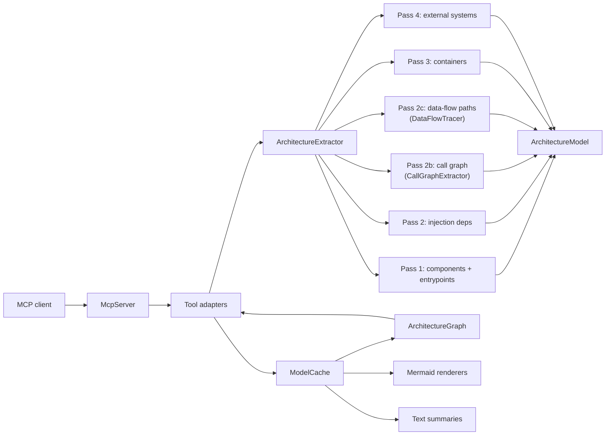

# Architecture

Spoon MCP Server is organized around a simple pipeline:

1. MCP clients send JSON-RPC requests over stdio.
2. `McpServer` dispatches tool calls to tool adapter classes.
3. Tool adapters read from or update the shared `ModelCache`.
4. Extractors use Spoon to scan Java projects and populate `ArchitectureModel`.
5. Mergers add deployment context from supporting files such as Docker Compose or Ansible.
6. `ArchitectureGraph` projects the model into a property graph for traversal queries.
7. Renderers turn the model into Mermaid diagrams or text summaries.

## Extraction Pipeline

`ArchitectureExtractor.extract()` runs six ordered passes over the Spoon AST:

| Pass | What | Classes |
|------|------|---------|
| 1 | Components + entrypoints per module, WAR role assignment | `QuarkusExtractor`, `JavaEEExtractor`, `GenericJavaExtractor`, `EventBusExtractor` |
| 2 | Injection dependencies across all modules | `DependencyExtractor` |
| 2b | **Call graph** — directed method-call edges between components; entrypoint parameter enrichment | `CallGraphExtractor` |
| 2c | **Data-flow tracing** — parameter → sink paths pre-computed from call graph | `DataFlowTracer` |
| 3 | Container inference | `ContainerInferrer` |
| 4 | Messaging broker resolution + external system inference | `MessagingConfigResolver`, `ExternalSystemInferrer` |

Runtime flows are also derived per-entrypoint from the call graph (or injection-edge fallback) and stored in `model.runtimeFlows`.

## Packages

### `dev.dominikbreu.spoonmcp.mcp`

Owns the stdio JSON-RPC loop and the MCP protocol surface. `McpServer` registers every
public tool name, tool schema, and dispatch branch.

### `dev.dominikbreu.spoonmcp.mcp.tools`

Contains thin tool adapters. These classes parse JSON arguments, call
extractor/cache/renderer services, and return user-facing strings.

Current tools: `IndexWorkspaceTool`, `ListAppsTool`, `FindEntrypointsTool`,
`FindComponentsTool`, `GetComponentDependenciesTool`, `InferContainersTool`,
`RenderMermaidFlowchartTool`, `GetRuntimeFlowTool`, `RenderMermaidSequenceTool`,
`ExplainArchitectureTool`, `RenderSourceOverviewTool`, `RenderDependencyMapTool`,
`RenderComponentDependencyDiagramTool`, `ExportArchitectureDocsTool`,
`ExportGraphArchitecturePocTool`, `QueryArchitectureGraphTool`,
`DetectUseCasesTool`, `TraceDataFlowTool`.

### `dev.dominikbreu.spoonmcp.extractor`

Contains the core architecture analysis. It identifies applications, entry points,
components, dependencies, call graphs, use cases, data-flow paths, runtime flows, and
framework-specific constructs for Java EE and Quarkus-style projects.

#### Framework extractors

`QuarkusExtractor` reads SmallRye Reactive Messaging annotations (`@Incoming`,
`@Outgoing`, `@Channel`) and emits `MESSAGING_CONSUMER` / `MESSAGING_PRODUCER`
entrypoints with a `channelName`. Channel-to-broker resolution is performed by
`MessagingConfigResolver` and attached as a `MessagingBroker` enum value (`KAFKA`,
`MQTT`, `AMQP`, `RABBITMQ`, `PULSAR`, or `UNKNOWN`).

`QuarkusExtractor` also detects raw broker clients held as fields, where the broker is
implied by the field type: Kafka (`KafkaProducer`, `KafkaConsumer`, etc.) and MQTT
(Paho v3/v5 and HiveMQ client types).

`MessagingCallSiteResolver` scans method bodies for call sites on tracked client fields
to resolve topic names and classify them as producer or consumer.

`ExternalSystemInferrer` runs as a post-pass and groups REST client interfaces by
`externalServiceName` into `REST_API` external systems, and messaging
entrypoints/interfaces by broker into `MESSAGE_BROKER` external systems.

#### `CallGraphExtractor`

Extracts directed method-call edges between architecture components from actual
`CtInvocation` nodes — not injection annotations.

**Algorithm:**
1. Builds two component lookup maps: by qualified-name ID and by simple name (for
   interface-typed fields where the qualified name is unavailable).
2. For each type matching a known component, builds a `fieldName → Component` map from
   declared fields.
3. For each method, walks all `CtInvocation` elements. Only invocations whose target is a
   `CtFieldRead` referencing a known component field are recorded (cross-component calls
   only; intra-component private calls are ignored).
4. For each such invocation, populates a `CallEdge` with `fromComponentId#fromMethod →
   toComponentId#toMethod`, `callKind` (`direct`, `event-bus`, or `messaging`), and a
   `paramMapping` (caller-parameter-name → callee-parameter-name for arguments that are
   simple variable reads and whose callee method is in the same Spoon model).
5. Also enriches each `Entrypoint.parameters` list with the method's declared parameter
   names when the method is found.

Must run after all components are registered (after Pass 1 and dependency extraction).
Deduplicates edges by ID on repeated runs.

#### `DataFlowTracer`

Traces how entrypoint parameters flow through the call graph to architectural sinks.

**Sink classification:**

| Condition | Sink kind |
|-----------|-----------|
| `edge.callKind == "event-bus"` | `event-bus` |
| `edge.callKind == "messaging"` | `messaging` |
| target component type is `REPOSITORY` | `persistence` |
| target is `HTTP_CLIENT` with `"messaging"` stereotype | `messaging` |
| target is `HTTP_CLIENT` without `"messaging"` stereotype | `http-outbound` |
| target is `CDI_EVENT_PRODUCER` | `event-bus` |

**Algorithm:**
1. For each entrypoint, for each parameter in `ep.parameters`, start a `DataFlowPath`.
2. DFS over `CallEdge` graph from `ep.componentId#ep.name`.
3. At each hop, record a `DataFlowStep` with the current `localName` of the tracked value.
4. When the edge reaches a sink, append a `DataFlowSink` and stop following that edge.
5. When the edge does not reach a sink, look up `edge.paramMapping[trackedName]` for the
   next local name (precise rename tracking); fall back to the current name if not found.
6. Cycle guard: `visitedKeys` set keyed on `compId#method@localName`.
7. Paths with no sinks are not stored.

Pre-computed during `index_workspace`; results stored in `model.dataFlowPaths`.

#### `UseCaseDetector`

Derives one `UseCase` per entrypoint.

**With call graph:** builds an adjacency map from `model.callEdges` and performs DFS from
the entrypoint's component and method, recording the method call chain as
`ComponentA.methodX → ComponentB.methodY` strings.

**Without call graph (fallback):** performs BFS over `model.dependencies` from the
entrypoint's component, recording the reachable component IDs.

Name resolution: `UseCaseNamingConfig.resolveName(entrypointId, derivedName)`. Derived
names follow these heuristics:
- `REST_ENDPOINT` → `"HTTP_METHOD camelToTitle(name)"` (e.g. `"POST Create Order"`)
- `MESSAGING_CONSUMER` → `"Process camelToTitle(channelName)"` (e.g. `"Process Order Events"`)
- `MESSAGING_PRODUCER` → `"Publish camelToTitle(channelName)"`
- `SCHEDULER` → `"Scheduled: camelToTitle(name)"`
- `CDI_EVENT_OBSERVER` → `"On Event: <eventType>"`
- `JMS_CONSUMER` → `"Consume camelToTitle(name)"`

#### `RuntimeFlowInferrer`

Infers the reduced runtime path for a given entry point.

- **Call-graph mode** (when `model.callEdges` is non-empty): DFS over call edges; step
  `via` reflects the actual called-method name or `HTTP_METHOD path` for REST entrypoints.
- **Injection-edge fallback**: BFS over `model.dependencies`; step `via` reflects the
  actual `dep.kind` (`injection`, `cdi-event`, `field-reference`, etc.).

Raw messaging clients (`HTTP_CLIENT` + `"messaging"` stereotype) are excluded from
traversal in both modes.

#### Configuration parsing rule

Spoon AST is the only source of code structure. **The single permitted configuration read
is `mp.messaging.{incoming|outgoing}.{channel}.connector` from `application.properties`,
`application.yaml`, or `application.yml`** under each module's `src/main/resources`.

No other configuration key may be parsed. Do not extend the resolver to read additional
properties.

### `dev.dominikbreu.spoonmcp.model`

Plain model classes used by extractors, mergers, renderers, and tools.

| Class | Purpose |
|-------|---------|
| `ArchitectureModel` | Root document; contains all lists below |
| `AppEntry` | Maven module / application entry |
| `Component` | Source-level component (service, repository, etc.) |
| `Entrypoint` | Runtime trigger (REST, messaging, scheduler); carries `parameters` list |
| `Dependency` | Directed component dependency edge |
| `RuntimeFlow` / `RuntimeFlowStep` | Pre-computed call path for an entrypoint |
| `CallEdge` | Directed method-call edge from the call graph; carries `paramMapping` |
| `DataFlowPath` / `DataFlowStep` / `DataFlowSink` | Inter-procedural parameter-to-sink flow |
| `UseCase` / `UseCaseNamingConfig` | Business use case derived from an entrypoint |
| `Container` | Logical container inferred from component roles |
| `InterfaceEntry` | Exposed or consumed interface (REST, messaging) |
| `ExternalSystem` | REST API or message broker inferred from client interfaces |
| `MessagingBroker` | Resolved broker enum for Reactive Messaging channels |
| `DeploymentEntry` | Deployment metadata from Docker Compose / Ansible |
| `SourceInfo` | File/line/confidence evidence attached to extracted elements |

### `dev.dominikbreu.spoonmcp.cache`

Stores the most recently indexed `ArchitectureModel` for subsequent MCP tool calls.
The default backend persists a JSON snapshot. Setting `SPOON_MCP_CACHE_BACKEND=graph`
or `-Dspoonmcp.cache.backend=graph` eagerly maintains an embedded TinkerGraph
projection. Graph tooling can also build this projection lazily from the JSON-backed
model.

The graph projection stores source metadata, confidence, package/module labels,
runtime-relevance flags, cross-module dependency flags, fan-in/fan-out counts, and
entrypoint reachability to support MCP traversal and impact-analysis tools.

### `dev.dominikbreu.spoonmcp.merger`

Adds deployment context to the extracted architecture model from deployment descriptors
and infrastructure files (`DockerComposeMerger`, `AnsibleMerger`).

### `dev.dominikbreu.spoonmcp.renderer`

Renders architecture model slices to Mermaid diagrams and text summaries.

Renderers: `MermaidFlowchartRenderer`, `MermaidSequenceRenderer`,
`MermaidDependencyMapRenderer`, `MermaidComponentDependencyRenderer`,
`MermaidSourceOverviewRenderer`.

Sequence diagrams use actual call-graph `via` labels when call-edge data is present,
producing meaningful arrow labels instead of the generic `[injection]` fallback.

## Data Flow

## Adding A Tool

1. Add the tool implementation in `src/main/java/dev/dominikbreu/spoonmcp/mcp/tools/`.
2. Register its name, description, and schema in `McpServer.buildToolsList()`.
3. Add dispatch in `McpServer.callTool()`.
4. Add tests for parsing, behavior, or rendering as appropriate.
5. Update `docs/TOOLS.md` and `llms.txt` when changing the public tool surface.

## Adding An Extraction Pass

1. Implement the extractor in `src/main/java/dev/dominikbreu/spoonmcp/extractor/`.
2. Wire it into `ArchitectureExtractor.extract()` at the appropriate pass position.
3. Add new model fields to `ArchitectureModel` with a `@JsonProperty` annotation.
4. Add tests using `ExtractorTestBase` or model-only unit tests.
5. Update the extraction pipeline table in this document.
