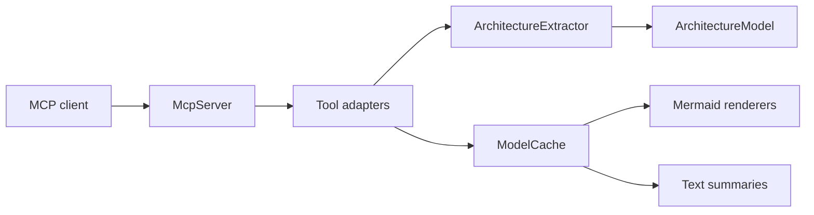

# Architecture

Spoon MCP Server is organized around a simple pipeline:

1. MCP clients send JSON-RPC requests over stdio.
2. `McpServer` dispatches tool calls to tool adapter classes.
3. Tool adapters read from or update the shared in-memory `ModelCache`.
4. Extractors use Spoon to scan Java projects and populate `ArchitectureModel`.
5. Mergers add deployment context from supporting files such as Docker Compose or Ansible.
6. Renderers turn the model into Mermaid diagrams or text summaries.

## Packages

### `dev.dominikbreu.spoonmcp.mcp`

Owns the stdio JSON-RPC loop and the MCP protocol surface. `McpServer` registers every public tool name, tool schema, and dispatch branch.

### `dev.dominikbreu.spoonmcp.mcp.tools`

Contains thin tool adapters. These classes parse JSON arguments, call extractor/cache/renderer services, and return user-facing strings.

### `dev.dominikbreu.spoonmcp.extractor`

Contains the core architecture analysis. It identifies applications, entry points, components, dependencies, runtime flows, and framework-specific constructs for Java EE and Quarkus-style projects.

### `dev.dominikbreu.spoonmcp.model`

Contains plain model records/classes used by extractors, mergers, renderers, and tools.

### `dev.dominikbreu.spoonmcp.cache`

Stores the most recently indexed `ArchitectureModel` for subsequent MCP tool calls.

### `dev.dominikbreu.spoonmcp.merger`

Adds deployment context to the extracted architecture model from deployment descriptors and infrastructure files.

### `dev.dominikbreu.spoonmcp.renderer`

Renders architecture model slices to Mermaid flowcharts and sequence diagrams.

## Data Flow

## Adding A Tool

1. Add the tool implementation in `src/main/java/dev/dominikbreu/spoonmcp/mcp/tools/`.
2. Register its name, description, and schema in `McpServer.buildToolsList()`.
3. Add dispatch in `McpServer.callTool()`.
4. Add tests for parsing, behavior, or rendering as appropriate.
5. Update `docs/TOOLS.md` and examples when useful.

