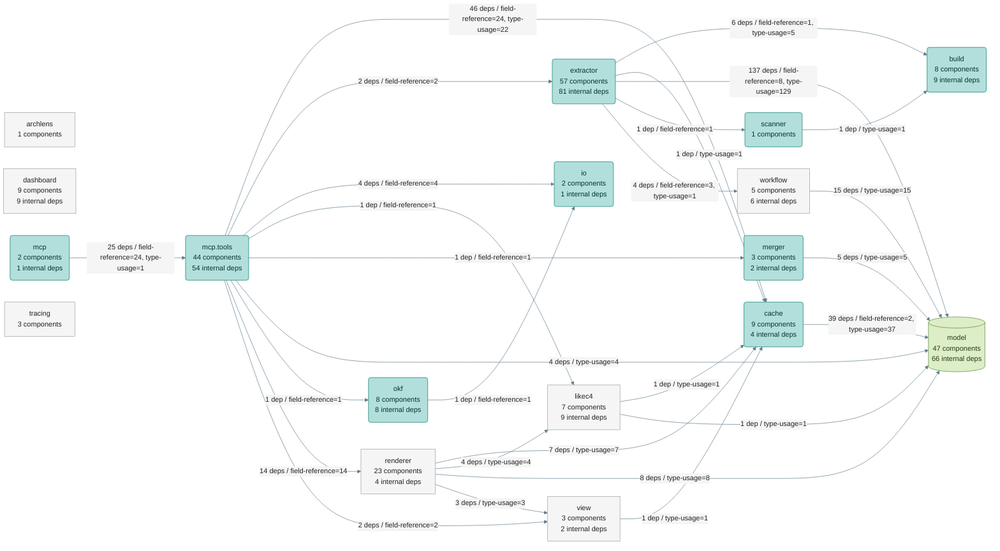

# Generated Architecture

Generated from the indexed architecture model by the MCP tool `export_architecture_docs`.

## Summary

- Applications: 1
- Components: 232
- Entrypoints: 1
- Interfaces: 0
- Dependencies: 591
- Runtime flows: 1

## Architecture Question OKF Compilation

`dev.dominikbreu.archlens.okf` is a graph-independent compilation layer for turning a
caller-reviewed `answer_architecture_question` structured result into a project-local OKF
investigation. It does not retain or query the extraction model. The MCP adapter obtains indexed
project roots through its graph lookup, then supplies those roots and the caller-provided result
to the compiler for contained-path resolution, deterministic semantic identity, rendering, and
safe bundle writes.

## Diagram Templates

`renderer/` prepares presentation data for Mermaid (including its C4 dialect) and LikeC4.
Graph queries, filtering, traversal, stable ordering, identifier allocation, semantic labels,
and target-language escaping stay in Java. Typed presentation records under `renderer/template/`
carry that data into Mustache templates under `src/main/resources/templates/mermaid/` and
`src/main/resources/templates/likec4/`, which own diagram syntax and document layout.

Maven explicitly runs the JStachio annotation processor to validate template bindings and generate
Java renderers in `target/generated-sources/annotations/`. Templates use `JStacheType.STACHE` and
the application calls generated renderers directly. The annotation dependency has provided scope;
there is no runtime template interpreter, reflection fallback, or runtime template compilation.
Template changes require a rebuild (use `mvn clean verify` when changing only template resources).
STACHE passes values through without HTML escaping: Java must escape each value for its Mermaid
or LikeC4 position before rendering. Values containing Mustache syntax remain literal data.

HTML graph-viewer and user-editable OKF templates have separate rendering paths.

`scripts/self-doc.py` runs a clean package build before indexing this repository. It shortens
internal Mermaid identifiers and splits oversized flowcharts across fenced blocks, preserving
all dependencies within Mermaid's default text and edge limits. Labels and node styles remain
intact. The prose in this section lives in `scripts/self-doc-notes.md` so regeneration preserves it.

## Source Overview

Part 1 of 2 (nodes repeated; dependencies partitioned).

```mermaid
%%{init: {"theme": "base", "themeVariables": {"primaryColor": "#f5f5f5", "primaryBorderColor": "#9e9e9e", "primaryTextColor": "#212121", "lineColor": "#607d8b", "clusterBkg": "#fafafa", "clusterBorder": "#b0bec5"}}}%%
flowchart TD
    subgraph n0 ["dev.dominikbreu.archlens.mcp.tools.question"]
        n1("ConfigurationContextAnswerer\n«service»")
        n2("EndpointContextAnswerer\n«service»")
        n3("QuestionRequestNormalizer\n«service»")
        n4("QueryPlanRecorder\n«service»")
        n5("RelationshipAnswerer\n«service»")
        n6("StateLifecycleAnswerer\n«service»")
        n7["QuestionSupport\n«unknown»"]
        n8("ExternalIntegrationContextAnswerer\n«service»")
        n9("MessagingFlowAnswerer\n«service»")
        n10("QuestionPlanner\n«service»")
        n11("PersistenceDestinationAnswerer\n«service»")
        n12("ImpactAnswerer\n«service»")
        n13["Interpretation\n«unknown»"]
        n14("TransactionContextAnswerer\n«service»")
        n15("ScheduledWorkflowAnswerer\n«service»")
        n16("ConsumerContextAnswerer\n«service»")
        n17["Answer\n«unknown»"]
    end
    subgraph n18 ["dev.dominikbreu.archlens.model.ids"]
        n19[("DependencyId\n«entity»")]
        n20[("FieldRef\n«entity»")]
        n21[("GraphNodeId\n«entity»")]
        n22[("EntrypointId\n«entity»")]
        n23[("FieldBinding\n«entity»")]
        n24[("SourceFactId\n«entity»")]
        n25[("DataFlowPathId\n«entity»")]
        n26[("MethodRef\n«entity»")]
        n27[("AppId\n«entity»")]
        n28[("UseCaseId\n«entity»")]
        n29[("FieldAccessId\n«entity»")]
        n30[("ComponentId\n«entity»")]
    end
    subgraph n31 ["dev.dominikbreu.archlens.extractor"]
        n32("TransactionScopeInferrer\n«service»")
        n33["EntityIndex\n«unknown»"]
        n34("ConfigPropertyResolver\n«service»")
        n35("MessagingTopicResolver\n«service»")
        n36["ModelIndex\n«unknown»"]
        n37("SpringConfigResolver\n«service»")
        n38["ComponentIndex\n«unknown»"]
        n39["SecretKeyFilter\n«unknown»"]
        n40("TransactionPolicyPostProcessor\n«service»")
        n41("TransactionPolicyExtractor\n«service»")
        n42("DependencyEvidenceScorer\n«service»")
        n43("RuntimeFlowInferrer\n«service»")
        n44("MessagingConfigResolver\n«service»")
        n45["CallAdjacency\n«unknown»"]
        n46["OutboundSinkIndex\n«unknown»"]
        n47("QuarkusExtractor\n«service»")
        n48("ArchitectureExtractor\n«service»")
        n49("DataFlowTracer\n«service»")
        n50["ExtractionContext\n«unknown»"]
        n51("SpringExtractor\n«service»")
        n52("PersistenceTopologyExtractor\n«service»")
        n53("MessagingCallSiteResolver\n«service»")
        n54("DependencyExtractor\n«service»")
        n55("EventBusExtractor\n«service»")
        n56["PersistenceEntityTypes\n«unknown»"]
        n57("CallGraphExtractor\n«service»")
        n58("JavaEEExtractor\n«service»")
        n59("UseCaseDetector\n«service»")
        n60["DependencyAdjacency\n«unknown»"]
        n61["FieldAccessIndex\n«unknown»"]
        n62("ExternalSystemInferrer\n«service»")
        n63("DependencyCondenser\n«service»")
        n64("InternalModuleClassifier\n«service»")
        n65["PropertyFileReader\n«unknown»"]
        n66("ContainerInferrer\n«service»")
        n67("GenericJavaExtractor\n«service»")
        n68("StringExpressionResolver\n«service»")
        n69("PipelineGraphBuilder\n«service»")
        n70("TransactionXmlPolicyResolver\n«service»")
    end
    subgraph n71 ["dev.dominikbreu.archlens.mcp.tools"]
        n72("RenderArchitectureViewTool\n«service»")
        n73("RenderMermaidFlowchartTool\n«service»")
        n74("ExportArchitectureDocsTool\n«service»")
        n75["GraphExportJson\n«unknown»"]
        n76("FindEntrypointsTool\n«service»")
        n77("IndexWorkspaceTool\n«service»")
        n78("RenderComponentDependencyDiagramTool\n«service»")
        n79("RenderUseCaseTimelineTool\n«service»")
        n80("DetectUseCasesTool\n«service»")
        n81("TraceDataFlowTool\n«service»")
        n82("ExportLikeC4ModelTool\n«service»")
        n83("ExportGraphArchitecturePocTool\n«service»")
        n84("InferContainersTool\n«service»")
        n85("CallFlowTool\n«service»")
        n86("CompileArchitectureQuestionToOkfTool\n«service»")
        n87["ToolArgs\n«unknown»"]
        n88("RenderPipelineTool\n«service»")
        n89("ExportGraphDataTool\n«service»")
        n90["ToolResult\n«unknown»"]
        n91("GetComponentDependenciesTool\n«service»")
        n92("QueryArchitectureGraphTool\n«service»")
        n93("RenderDependencyMapTool\n«service»")
        n94("AnswerArchitectureQuestionTool\n«service»")
        n95("ListAppsTool\n«service»")
        n96("ExportGraphViewerTool\n«service»")
        n97("FindComponentsTool\n«service»")
        n98("RenderSourceOverviewTool\n«service»")
    end
    subgraph n99 ["dev.dominikbreu.archlens.model"]
        n100[("DataFlowBranch\n«entity»")]
        n101[("DataFlowSink\n«entity»")]
        n102[("DataSourceUsage\n«entity»")]
        n103[("Dependency\n«entity»")]
        n104[("OutboundSinkSite\n«entity»")]
        n105[("AppEntry\n«entity»")]
        n106[("DataFlowBranchArm\n«entity»")]
        n107[("SourceInfo\n«entity»")]
        n108[("PersistenceOperation\n«entity»")]
        n109[("DeploymentEntry\n«entity»")]
        n110[("ExternalSystem\n«entity»")]
        n111[("DataFlowPath\n«entity»")]
        n112[("RuntimeFlowStep\n«entity»")]
        n113[("Component\n«entity»")]
        n114[("ConfigProperty\n«entity»")]
        n115[("DataSourceInfo\n«entity»")]
        n116[("ComponentType\n«entity»")]
        n117[("DataFlowNode\n«entity»")]
        n118[("FieldAccess\n«entity»")]
        n119[("EntrypointType\n«entity»")]
        n120[("PersistenceUnitInfo\n«entity»")]
        n121[("UseCaseNamingConfig\n«entity»")]
        n122[("DataFlowEdge\n«entity»")]
        n123[("CallEdge\n«entity»")]
        n124[("RuntimeFlow\n«entity»")]
        n125[("ArchitectureModel\n«entity»")]
        n126[("TopicArgKind\n«entity»")]
        n127[("MessagingBroker\n«entity»")]
        n128[("InterfaceEntry\n«entity»")]
        n129[("Container\n«entity»")]
        n130[("DataFlowStep\n«entity»")]
        n131[("TransactionPolicy\n«entity»")]
        n132[("Entrypoint\n«entity»")]
        n133[("PersistenceUnitUsage\n«entity»")]
        n134[("UseCase\n«entity»")]
    end
    subgraph n135 ["dev.dominikbreu.archlens.likec4"]
        n136["LikeC4View\n«unknown»"]
        n137["LikeC4Relationship\n«unknown»"]
        n138["LikeC4Document\n«unknown»"]
        n139["Like#67;4DynamicStep\n«unknown»"]
        n140["LikeC4Element\n«unknown»"]
        n141["Like#67;4DynamicView\n«unknown»"]
        n142("LikeC4WorkspaceProjector\n«service»")
    end
    subgraph n143 ["dev.dominikbreu.archlens.renderer"]
        n144("MermaidDependencySliceRenderer\n«service»")
        n145["MermaidStyle\n«unknown»"]
        n146("GraphViewerHtmlRenderer\n«service»")
        n147("MermaidDependencyMapRenderer\n«service»")
        n148["MermaidDocument\n«unknown»"]
        n149["MermaidDialect\n«unknown»"]
        n150("MermaidPipelineRenderer\n«service»")
        n151("MermaidFlowchartRenderer\n«service»")
        n152("LikeC4TemplateAdapter\n«service»")
        n153("MermaidUseCaseTimelineRenderer\n«service»")
        n154("MermaidSourceOverviewRenderer\n«service»")
        n155("MermaidCallFlowRenderer\n«service»")
        n156("LikeC4ModelRenderer\n«service»")
        n157["Mermaid\n«unknown»"]
        n158["MermaidTemplateAdapters\n«unknown»"]
        n159("ArchitectureViewMermaidRenderer\n«service»")
    end
    subgraph n160 ["dev.dominikbreu.archlens.mcp"]
        n161("McpServer\n«service»")
        n162["StructuredOutputMode\n«unknown»"]
    end
    subgraph n163 ["dev.dominikbreu.archlens.tracing"]
        n164["TracingConfig\n«unknown»"]
        n165["Spans\n«unknown»"]
        n166["StdoutSpanExporter\n«unknown»"]
    end
    subgraph n167 ["dev.dominikbreu.archlens.renderer.template"]
        n168["MermaidStyleTemplate\n«unknown»"]
        n169["MermaidC4Template\n«unknown»"]
        n170["MermaidHeaderTemplate\n«unknown»"]
        n171["MermaidSequenceTemplate\n«unknown»"]
        n172["MermaidNodeTemplate\n«unknown»"]
        n173["MermaidFlowchartTemplate\n«unknown»"]
        n174["LikeC4Template\n«unknown»"]
    end
    subgraph n175 ["dev.dominikbreu.archlens.extractor.sourcefacts"]
        n176["FactConfidence\n«unknown»"]
        n177["SourceInvocation\n«unknown»"]
        n178["SourceFactIndex\n«unknown»"]
        n179["SourceField\n«unknown»"]
        n180["SourceAnnotation\n«unknown»"]
        n181["SourceType\n«unknown»"]
        n182["SourceAssignment\n«unknown»"]
        n183["SourceReturn\n«unknown»"]
        n184["SourceMethod\n«unknown»"]
        n185["SourceEvidence\n«unknown»"]
        n186["SourceInjectionPoint\n«unknown»"]
        n187["SourceLocation\n«unknown»"]
        n188("SourceFactIndexBuilder\n«service»")
    end
    subgraph n189 ["dev.dominikbreu.archlens.merger"]
        n190("DockerComposeMerger\n«service»")
        n191("AnsibleMerger\n«service»")
        n192("DeploymentMerger\n«service»")
    end
    subgraph n193 ["dev.dominikbreu.archlens.okf"]
        n194("AnswerValueRenderer\n«service»")
        n195("OkfEntryValidator\n«service»")
        n196["QuestionConceptIdentity\n«unknown»"]
        n197["QuestionOkfCompiler\n«unknown»"]
        n198("ProjectPathResolver\n«service»")
        n199["OkfBundleWriter\n«unknown»"]
        n200("QuestionOkfRenderer\n«service»")
        n201["ArchitectureQuestionResult\n«unknown»"]
    end
    subgraph n202 ["dev.dominikbreu.archlens.build"]
        n203["BuildSystem\n«unknown»"]
        n204("BuildMetadataService\n«service»")
        n205("UnknownBuildProjectDetector\n«service»")
        n206("GradleBuildProjectDetector\n«service»")
        n207("MavenBuildProjectDetector\n«service»")
        n208("BuildProjectDetector\n«service»")
        n209["BuildModule\n«unknown»"]
        n210["BuildProject\n«unknown»"]
    end
    subgraph n211 ["dev.dominikbreu.archlens.extractor.objectflow"]
        n212["ObjectFlowEvidence\n«unknown»"]
        n213("ObjectFlowIndexBuilder\n«service»")
        n214["ObjectFlowIndex\n«unknown»"]
        n215["ReceiverTarget\n«unknown»"]
        n216("ObjectFlowMethodAnalyzer\n«service»")
    end
    subgraph n217 ["dev.dominikbreu.archlens.io"]
        n218["AtomicFileWriter\n«unknown»"]
        n219("FilePromoter\n«service»")
    end
    subgraph n220 ["dev.dominikbreu.archlens.cache"]
        n221["GraphQuery\n«unknown»"]
        n222["GraphDataProjection\n«unknown»"]
        n223("TraversalRecorder\n«service»")
        n224("EvidenceNormalizer\n«service»")
        n225("GraphProjector\n«service»")
        n226("ComponentClassifier\n«service»")
        n227["GraphStore\n«unknown»"]
        n228("ModelCache\n«service»")
        n229("ArchitectureRelevanceScorer\n«service»")
    end
    subgraph n230 ["dev.dominikbreu.archlens"]
        n231["Main\n«unknown»"]
    end
    subgraph n232 ["dev.dominikbreu.archlens.workflow"]
        n233["WorkflowTraversalPolicy\n«unknown»"]
        n234("WorkflowGraphBuilder\n«service»")
        n235["WorkflowLink\n«unknown»"]
        n236["WorkflowGraph\n«unknown»"]
        n237("WorkflowLinker\n«service»")
    end
    subgraph n238 ["dev.dominikbreu.archlens.dashboard"]
        n239("DashboardRenderer\n«service»")
        n240["DashboardEvent\n«unknown»"]
        n241["Dashboard\n«unknown»"]
        n242["ReplEngine\n«unknown»"]
        n243["ParsedCommand\n«unknown»"]
        n244["DispatchResult\n«unknown»"]
        n245("ReplCommandParser\n«service»")
        n246["ReplParseException\n«unknown»"]
        n247["DashboardState\n«unknown»"]
    end
    subgraph n248 ["dev.dominikbreu.archlens.view"]
        n249("ArchitectureViewProjector\n«service»")
        n250["ArchitectureViewProjection\n«unknown»"]
        n251["ArchitectureViewKind\n«unknown»"]
    end
    subgraph n252 ["dev.dominikbreu.archlens.scanner"]
        n253("SpoonScanner\n«service»")
    end
    n204 --> n210
    n210 --> n203
    n210 --> n209
    n208 --> n210
    n206 --> n210
    n206 --> n209
    n207 --> n209
    n207 --> n210
    n205 --> n210
    n229 --> n113
    n226 --> n113
    n224 --> n107
    n222 --> n21
    n225 --> n227
    n225 --> n125
    n225 --> n105
    n225 --> n113
    n225 --> n114
    n225 --> n129
    n225 --> n111
    n225 --> n115
    n225 --> n109
    n225 --> n132
    n225 --> n110
    n225 --> n128
    n225 --> n108
    n225 --> n120
    n225 --> n124
    n225 --> n101
    n225 --> n131
    n225 --> n30
    n225 --> n103
    n225 --> n118
    n225 --> n27
    n225 --> n133
    n225 --> n20
    n225 --> n117
    n225 --> n107
    n221 --> n227
    n221 --> n27
    n221 --> n21
    n221 --> n101
    n221 --> n111
    n221 --> n30
    n221 --> n22
    n221 --> n125
    n221 --> n107
    n221 --> n132
    n221 --> n130
    n228 --> n227
    n228 --> n125
    n228 --> n221
    n241 --> n242
    n241 --> n247
    n239 --> n240
    n239 --> n247
    n247 --> n240
    n244 --> n240
    n245 --> n243
    n242 --> n244
    n242 --> n240
    n48 --> n253
    n48 --> n47
    n48 --> n58
    n48 --> n67
    n48 --> n54
    n48 --> n66
    n48 --> n64
    n48 --> n55
    n48 --> n43
    n48 --> n44
    n48 --> n62
    n48 --> n49
    n48 --> n204
    n48 --> n188
    n48 --> n52
    n48 --> n34
    n48 --> n41
    n48 --> n125
    n48 --> n27
    n48 --> n132
    n48 --> n128
    n48 --> n105
    n48 --> n209
    n48 --> n210
    n48 --> n30
    n48 --> n36
    n45 --> n123
    n45 --> n30
    n57 --> n214
    n57 --> n178
    n57 --> n50
    n57 --> n113
    n57 --> n30
    n57 --> n123
    n57 --> n118
    n57 --> n107
    n57 --> n125
    n57 --> n104
    n38 --> n113
    n38 --> n30
    n34 --> n27
    n34 --> n125
    n66 --> n113
    n66 --> n129
    n66 --> n116
    n49 --> n233
    n49 --> n132
    n49 --> n36
    n49 --> n111
    n49 --> n101
    n49 --> n123
    n49 --> n30
    n49 --> n113
    n49 --> n20
    n49 --> n127
    n49 --> n26
    n49 --> n118
    n49 --> n22
    n49 --> n25
    n49 --> n125
    n60 --> n103
    n60 --> n30
    n63 --> n103
    n63 --> n30
    n63 --> n113
    n42 --> n113
    n42 --> n116
    n54 --> n42
    n54 --> n125
    n54 --> n30
    n54 --> n113
    n33 --> n113
    n55 --> n125
    n55 --> n27
    n55 --> n30
    n55 --> n113
    n55 --> n116
    n62 --> n125
    n62 --> n19
    n62 --> n127
    n62 --> n110
    n50 --> n38
    n61 --> n118
    n61 --> n30
    n67 --> n116
    n67 --> n125
    n67 --> n27
    n67 --> n113
    n64 --> n105
    n58 --> n113
    n58 --> n125
    n58 --> n27
    n44 --> n127
    n35 --> n104
    n35 --> n125
    n36 --> n38
    n36 --> n45
    n36 --> n61
    n36 --> n46
    n36 --> n33
    n36 --> n60
    n36 --> n125
    n36 --> n26
    n36 --> n108
    n46 --> n104
    n46 --> n30
    n52 --> n125
    n52 --> n27
    n52 --> n30
    n52 --> n107
    n52 --> n120
    n52 --> n209
    n52 --> n115
    n69 --> n125
    n69 --> n111
    n69 --> n101
    n69 --> n235
    n47 --> n53
    n47 --> n113
    n47 --> n125
    n47 --> n128
    n47 --> n119
    n47 --> n127
    n47 --> n116
    n47 --> n27
    n43 --> n233
    n43 --> n124
    n43 --> n113
    n43 --> n30
    n43 --> n36
    n43 --> n132
    n43 --> n125
    n51 --> n128
    n51 --> n113
    n51 --> n125
    n51 --> n119
    n51 --> n127
    n51 --> n104
    n51 --> n27
    n51 --> n22
    n41 --> n113
    n41 --> n125
    n41 --> n27
    n41 --> n177
    n41 --> n131
    n41 --> n180
    n41 --> n184
    n41 --> n178
    n41 --> n209
    n41 --> n187
    n41 --> n181
    n41 --> n30
    n41 --> n107
    n40 --> n125
    n32 --> n125
    n32 --> n124
    n32 --> n131
    n32 --> n112
    n70 --> n125
    n70 --> n27
    n70 --> n209
    n70 --> n178
    n70 --> n113
    n70 --> n184
    n70 --> n131
    n59 --> n233
    n59 --> n123
    n59 --> n221
    n59 --> n30
    n59 --> n113
    n59 --> n103
    n59 --> n134
    n59 --> n132
    n59 --> n125
    n59 --> n121
    n214 --> n215
    n213 --> n214
    n213 --> n125
    n213 --> n178
    n213 --> n113
    n213 --> n215
    n213 --> n212
    n216 --> n215
    n216 --> n212
    n215 --> n212
    n180 --> n24
    n180 --> n187
    n180 --> n185
    n182 --> n24
    n182 --> n187
    n182 --> n176
    n182 --> n185
    n178 --> n180
    n178 --> n24
    n178 --> n182
    n178 --> n179
    n178 --> n181
    n178 --> n186
    n178 --> n177
    n178 --> n184
    n178 --> n183
    n188 --> n186
    n188 --> n180
    n188 --> n24
    n188 --> n182
    n188 --> n178
    n188 --> n177
    n188 --> n183
    n188 --> n181
    n188 --> n184
    n188 --> n179
    n188 --> n187
    n179 --> n24
    n179 --> n187
    n186 --> n24
    n186 --> n187
    n186 --> n176
    n186 --> n185
    n177 --> n24
    n177 --> n187
    n177 --> n176
    n177 --> n185
    n184 --> n24
    n184 --> n187
    n183 --> n24
    n183 --> n187
    n183 --> n176
    n183 --> n185
    n181 --> n24
    n181 --> n187
    n218 --> n219
    n138 --> n141
    n138 --> n140
    n138 --> n137
    n138 --> n136
    n141 --> n139
    n142 --> n21
    n142 --> n140
    n142 --> n137
    n142 --> n221
    n142 --> n141
    n142 --> n138
    n161 --> n77
    n161 --> n95
    n161 --> n76
    n161 --> n97
    n161 --> n91
    n161 --> n84
    n161 --> n73
    n161 --> n85
    n161 --> n98
    n161 --> n93
    n161 --> n78
    n161 --> n74
    n161 --> n83
    n161 --> n89
    n161 --> n96
    n161 --> n92
    n161 --> n94
    n161 --> n86
    n161 --> n80
    n161 --> n81
    n161 --> n79
    n161 --> n88
    n161 --> n72
    n161 --> n82
    n161 --> n162
    n161 --> n90
    n94 --> n228
    n94 --> n10
    n94 --> n13
    n94 --> n17
    n94 --> n221
    n94 --> n4
    n94 --> n90
    n85 --> n228
    n85 --> n155
    n85 --> n90
    n85 --> n221
    n86 --> n228
    n86 --> n197
    n86 --> n90
    n80 --> n228
    n80 --> n59
    n80 --> n90
    n80 --> n134
    n80 --> n221
    n80 --> n30
    n74 --> n228
    n74 --> n218
    n74 --> n151
    n74 --> n154
    n74 --> n144
    n74 --> n147
    n74 --> n90
    n74 --> n221
    n83 --> n228
    n83 --> n218
    n83 --> n221
    n83 --> n90
    n89 --> n228
    n89 --> n218
    n89 --> n90
    n96 --> n228
    n96 --> n218
    n96 --> n146
    n96 --> n90
    n82 --> n228
    n82 --> n249
    n82 --> n142
    n82 --> n156
    n82 --> n90
    n97 --> n228
    n97 --> n90
    n76 --> n228
    n76 --> n90
    n91 --> n228
    n91 --> n90
    n91 --> n221
    n77 --> n48
    n77 --> n228
    n77 --> n192
    n77 --> n90
    n84 --> n228
    n84 --> n90
    n95 --> n228
    n95 --> n90
    n92 --> n228
    n92 --> n90
    n72 --> n228
    n72 --> n249
    n72 --> n159
    n72 --> n90
    n72 --> n221
    n78 --> n228
    n78 --> n144
    n78 --> n90
    n93 --> n228
    n93 --> n147
    classDef service fill:#b2dfdb,stroke:#00796b,color:#00352f
    classDef entity fill:#dcedc8,stroke:#558b2f,color:#243c10
    classDef component fill:#f5f5f5,stroke:#9e9e9e,color:#212121
    class n1 service
    class n2 service
    class n3 service
    class n4 service
    class n5 service
    class n6 service
    class n7 component
    class n8 service
    class n9 service
    class n10 service
    class n11 service
    class n12 service
    class n13 component
    class n14 service
    class n15 service
    class n16 service
    class n17 component
    class n19 entity
    class n20 entity
    class n21 entity
    class n22 entity
    class n23 entity
    class n24 entity
    class n25 entity
    class n26 entity
    class n27 entity
    class n28 entity
    class n29 entity
    class n30 entity
    class n32 service
    class n33 component
    class n34 service
    class n35 service
    class n36 component
    class n37 service
    class n38 component
    class n39 component
    class n40 service
    class n41 service
    class n42 service
    class n43 service
    class n44 service
    class n45 component
    class n46 component
    class n47 service
    class n48 service
    class n49 service
    class n50 component
    class n51 service
    class n52 service
    class n53 service
    class n54 service
    class n55 service
    class n56 component
    class n57 service
    class n58 service
    class n59 service
    class n60 component
    class n61 component
    class n62 service
    class n63 service
    class n64 service
    class n65 component
    class n66 service
    class n67 service
    class n68 service
    class n69 service
    class n70 service
    class n72 service
    class n73 service
    class n74 service
    class n75 component
    class n76 service
    class n77 service
    class n78 service
    class n79 service
    class n80 service
    class n81 service
    class n82 service
    class n83 service
    class n84 service
    class n85 service
    class n86 service
    class n87 component
    class n88 service
    class n89 service
    class n90 component
    class n91 service
    class n92 service
    class n93 service
    class n94 service
    class n95 service
    class n96 service
    class n97 service
    class n98 service
    class n100 entity
    class n101 entity
    class n102 entity
    class n103 entity
    class n104 entity
    class n105 entity
    class n106 entity
    class n107 entity
    class n108 entity
    class n109 entity
    class n110 entity
    class n111 entity
    class n112 entity
    class n113 entity
    class n114 entity
    class n115 entity
    class n116 entity
    class n117 entity
    class n118 entity
    class n119 entity
    class n120 entity
    class n121 entity
    class n122 entity
    class n123 entity
    class n124 entity
    class n125 entity
    class n126 entity
    class n127 entity
    class n128 entity
    class n129 entity
    class n130 entity
    class n131 entity
    class n132 entity
    class n133 entity
    class n134 entity
    class n136 component
    class n137 component
    class n138 component
    class n139 component
    class n140 component
    class n141 component
    class n142 service
    class n144 service
    class n145 component
    class n146 service
    class n147 service
    class n148 component
    class n149 component
    class n150 service
    class n151 service
    class n152 service
    class n153 service
    class n154 service
    class n155 service
    class n156 service
    class n157 component
    class n158 component
    class n159 service
    class n161 service
    class n162 component
    class n164 component
    class n165 component
    class n166 component
    class n168 component
    class n169 component
    class n170 component
    class n171 component
    class n172 component
    class n173 component
    class n174 component
    class n176 component
    class n177 component
    class n178 component
    class n179 component
    class n180 component
    class n181 component
    class n182 component
    class n183 component
    class n184 component
    class n185 component
    class n186 component
    class n187 component
    class n188 service
    class n190 service
    class n191 service
    class n192 service
    class n194 service
    class n195 service
    class n196 component
    class n197 component
    class n198 service
    class n199 component
    class n200 service
    class n201 component
    class n203 component
    class n204 service
    class n205 service
    class n206 service
    class n207 service
    class n208 service
    class n209 component
    class n210 component
    class n212 component
    class n213 service
    class n214 component
    class n215 component
    class n216 service
    class n218 component
    class n219 service
    class n221 component
    class n222 component
    class n223 service
    class n224 service
    class n225 service
    class n226 service
    class n227 component
    class n228 service
    class n229 service
    class n231 component
    class n233 component
    class n234 service
    class n235 component
    class n236 component
    class n237 service
    class n239 service
    class n240 component
    class n241 component
    class n242 component
    class n243 component
    class n244 component
    class n245 service
    class n246 component
    class n247 component
    class n249 service
    class n250 component
    class n251 component
    class n253 service
```

Part 2 of 2 (nodes repeated; dependencies partitioned).

```mermaid
%%{init: {"theme": "base", "themeVariables": {"primaryColor": "#f5f5f5", "primaryBorderColor": "#9e9e9e", "primaryTextColor": "#212121", "lineColor": "#607d8b", "clusterBkg": "#fafafa", "clusterBorder": "#b0bec5"}}}%%
flowchart TD
    subgraph n0 ["dev.dominikbreu.archlens.mcp.tools.question"]
        n1("ConfigurationContextAnswerer\n«service»")
        n2("EndpointContextAnswerer\n«service»")
        n3("QuestionRequestNormalizer\n«service»")
        n4("QueryPlanRecorder\n«service»")
        n5("RelationshipAnswerer\n«service»")
        n6("StateLifecycleAnswerer\n«service»")
        n7["QuestionSupport\n«unknown»"]
        n8("ExternalIntegrationContextAnswerer\n«service»")
        n9("MessagingFlowAnswerer\n«service»")
        n10("QuestionPlanner\n«service»")
        n11("PersistenceDestinationAnswerer\n«service»")
        n12("ImpactAnswerer\n«service»")
        n13["Interpretation\n«unknown»"]
        n14("TransactionContextAnswerer\n«service»")
        n15("ScheduledWorkflowAnswerer\n«service»")
        n16("ConsumerContextAnswerer\n«service»")
        n17["Answer\n«unknown»"]
    end
    subgraph n18 ["dev.dominikbreu.archlens.model.ids"]
        n19[("DependencyId\n«entity»")]
        n20[("FieldRef\n«entity»")]
        n21[("GraphNodeId\n«entity»")]
        n22[("EntrypointId\n«entity»")]
        n23[("FieldBinding\n«entity»")]
        n24[("SourceFactId\n«entity»")]
        n25[("DataFlowPathId\n«entity»")]
        n26[("MethodRef\n«entity»")]
        n27[("AppId\n«entity»")]
        n28[("UseCaseId\n«entity»")]
        n29[("FieldAccessId\n«entity»")]
        n30[("ComponentId\n«entity»")]
    end
    subgraph n31 ["dev.dominikbreu.archlens.extractor"]
        n32("TransactionScopeInferrer\n«service»")
        n33["EntityIndex\n«unknown»"]
        n34("ConfigPropertyResolver\n«service»")
        n35("MessagingTopicResolver\n«service»")
        n36["ModelIndex\n«unknown»"]
        n37("SpringConfigResolver\n«service»")
        n38["ComponentIndex\n«unknown»"]
        n39["SecretKeyFilter\n«unknown»"]
        n40("TransactionPolicyPostProcessor\n«service»")
        n41("TransactionPolicyExtractor\n«service»")
        n42("DependencyEvidenceScorer\n«service»")
        n43("RuntimeFlowInferrer\n«service»")
        n44("MessagingConfigResolver\n«service»")
        n45["CallAdjacency\n«unknown»"]
        n46["OutboundSinkIndex\n«unknown»"]
        n47("QuarkusExtractor\n«service»")
        n48("ArchitectureExtractor\n«service»")
        n49("DataFlowTracer\n«service»")
        n50["ExtractionContext\n«unknown»"]
        n51("SpringExtractor\n«service»")
        n52("PersistenceTopologyExtractor\n«service»")
        n53("MessagingCallSiteResolver\n«service»")
        n54("DependencyExtractor\n«service»")
        n55("EventBusExtractor\n«service»")
        n56["PersistenceEntityTypes\n«unknown»"]
        n57("CallGraphExtractor\n«service»")
        n58("JavaEEExtractor\n«service»")
        n59("UseCaseDetector\n«service»")
        n60["DependencyAdjacency\n«unknown»"]
        n61["FieldAccessIndex\n«unknown»"]
        n62("ExternalSystemInferrer\n«service»")
        n63("DependencyCondenser\n«service»")
        n64("InternalModuleClassifier\n«service»")
        n65["PropertyFileReader\n«unknown»"]
        n66("ContainerInferrer\n«service»")
        n67("GenericJavaExtractor\n«service»")
        n68("StringExpressionResolver\n«service»")
        n69("PipelineGraphBuilder\n«service»")
        n70("TransactionXmlPolicyResolver\n«service»")
    end
    subgraph n71 ["dev.dominikbreu.archlens.mcp.tools"]
        n72("RenderArchitectureViewTool\n«service»")
        n73("RenderMermaidFlowchartTool\n«service»")
        n74("ExportArchitectureDocsTool\n«service»")
        n75["GraphExportJson\n«unknown»"]
        n76("FindEntrypointsTool\n«service»")
        n77("IndexWorkspaceTool\n«service»")
        n78("RenderComponentDependencyDiagramTool\n«service»")
        n79("RenderUseCaseTimelineTool\n«service»")
        n80("DetectUseCasesTool\n«service»")
        n81("TraceDataFlowTool\n«service»")
        n82("ExportLikeC4ModelTool\n«service»")
        n83("ExportGraphArchitecturePocTool\n«service»")
        n84("InferContainersTool\n«service»")
        n85("CallFlowTool\n«service»")
        n86("CompileArchitectureQuestionToOkfTool\n«service»")
        n87["ToolArgs\n«unknown»"]
        n88("RenderPipelineTool\n«service»")
        n89("ExportGraphDataTool\n«service»")
        n90["ToolResult\n«unknown»"]
        n91("GetComponentDependenciesTool\n«service»")
        n92("QueryArchitectureGraphTool\n«service»")
        n93("RenderDependencyMapTool\n«service»")
        n94("AnswerArchitectureQuestionTool\n«service»")
        n95("ListAppsTool\n«service»")
        n96("ExportGraphViewerTool\n«service»")
        n97("FindComponentsTool\n«service»")
        n98("RenderSourceOverviewTool\n«service»")
    end
    subgraph n99 ["dev.dominikbreu.archlens.model"]
        n100[("DataFlowBranch\n«entity»")]
        n101[("DataFlowSink\n«entity»")]
        n102[("DataSourceUsage\n«entity»")]
        n103[("Dependency\n«entity»")]
        n104[("OutboundSinkSite\n«entity»")]
        n105[("AppEntry\n«entity»")]
        n106[("DataFlowBranchArm\n«entity»")]
        n107[("SourceInfo\n«entity»")]
        n108[("PersistenceOperation\n«entity»")]
        n109[("DeploymentEntry\n«entity»")]
        n110[("ExternalSystem\n«entity»")]
        n111[("DataFlowPath\n«entity»")]
        n112[("RuntimeFlowStep\n«entity»")]
        n113[("Component\n«entity»")]
        n114[("ConfigProperty\n«entity»")]
        n115[("DataSourceInfo\n«entity»")]
        n116[("ComponentType\n«entity»")]
        n117[("DataFlowNode\n«entity»")]
        n118[("FieldAccess\n«entity»")]
        n119[("EntrypointType\n«entity»")]
        n120[("PersistenceUnitInfo\n«entity»")]
        n121[("UseCaseNamingConfig\n«entity»")]
        n122[("DataFlowEdge\n«entity»")]
        n123[("CallEdge\n«entity»")]
        n124[("RuntimeFlow\n«entity»")]
        n125[("ArchitectureModel\n«entity»")]
        n126[("TopicArgKind\n«entity»")]
        n127[("MessagingBroker\n«entity»")]
        n128[("InterfaceEntry\n«entity»")]
        n129[("Container\n«entity»")]
        n130[("DataFlowStep\n«entity»")]
        n131[("TransactionPolicy\n«entity»")]
        n132[("Entrypoint\n«entity»")]
        n133[("PersistenceUnitUsage\n«entity»")]
        n134[("UseCase\n«entity»")]
    end
    subgraph n135 ["dev.dominikbreu.archlens.likec4"]
        n136["LikeC4View\n«unknown»"]
        n137["LikeC4Relationship\n«unknown»"]
        n138["LikeC4Document\n«unknown»"]
        n139["Like#67;4DynamicStep\n«unknown»"]
        n140["LikeC4Element\n«unknown»"]
        n141["Like#67;4DynamicView\n«unknown»"]
        n142("LikeC4WorkspaceProjector\n«service»")
    end
    subgraph n143 ["dev.dominikbreu.archlens.renderer"]
        n144("MermaidDependencySliceRenderer\n«service»")
        n145["MermaidStyle\n«unknown»"]
        n146("GraphViewerHtmlRenderer\n«service»")
        n147("MermaidDependencyMapRenderer\n«service»")
        n148["MermaidDocument\n«unknown»"]
        n149["MermaidDialect\n«unknown»"]
        n150("MermaidPipelineRenderer\n«service»")
        n151("MermaidFlowchartRenderer\n«service»")
        n152("LikeC4TemplateAdapter\n«service»")
        n153("MermaidUseCaseTimelineRenderer\n«service»")
        n154("MermaidSourceOverviewRenderer\n«service»")
        n155("MermaidCallFlowRenderer\n«service»")
        n156("LikeC4ModelRenderer\n«service»")
        n157["Mermaid\n«unknown»"]
        n158["MermaidTemplateAdapters\n«unknown»"]
        n159("ArchitectureViewMermaidRenderer\n«service»")
    end
    subgraph n160 ["dev.dominikbreu.archlens.mcp"]
        n161("McpServer\n«service»")
        n162["StructuredOutputMode\n«unknown»"]
    end
    subgraph n163 ["dev.dominikbreu.archlens.tracing"]
        n164["TracingConfig\n«unknown»"]
        n165["Spans\n«unknown»"]
        n166["StdoutSpanExporter\n«unknown»"]
    end
    subgraph n167 ["dev.dominikbreu.archlens.renderer.template"]
        n168["MermaidStyleTemplate\n«unknown»"]
        n169["MermaidC4Template\n«unknown»"]
        n170["MermaidHeaderTemplate\n«unknown»"]
        n171["MermaidSequenceTemplate\n«unknown»"]
        n172["MermaidNodeTemplate\n«unknown»"]
        n173["MermaidFlowchartTemplate\n«unknown»"]
        n174["LikeC4Template\n«unknown»"]
    end
    subgraph n175 ["dev.dominikbreu.archlens.extractor.sourcefacts"]
        n176["FactConfidence\n«unknown»"]
        n177["SourceInvocation\n«unknown»"]
        n178["SourceFactIndex\n«unknown»"]
        n179["SourceField\n«unknown»"]
        n180["SourceAnnotation\n«unknown»"]
        n181["SourceType\n«unknown»"]
        n182["SourceAssignment\n«unknown»"]
        n183["SourceReturn\n«unknown»"]
        n184["SourceMethod\n«unknown»"]
        n185["SourceEvidence\n«unknown»"]
        n186["SourceInjectionPoint\n«unknown»"]
        n187["SourceLocation\n«unknown»"]
        n188("SourceFactIndexBuilder\n«service»")
    end
    subgraph n189 ["dev.dominikbreu.archlens.merger"]
        n190("DockerComposeMerger\n«service»")
        n191("AnsibleMerger\n«service»")
        n192("DeploymentMerger\n«service»")
    end
    subgraph n193 ["dev.dominikbreu.archlens.okf"]
        n194("AnswerValueRenderer\n«service»")
        n195("OkfEntryValidator\n«service»")
        n196["QuestionConceptIdentity\n«unknown»"]
        n197["QuestionOkfCompiler\n«unknown»"]
        n198("ProjectPathResolver\n«service»")
        n199["OkfBundleWriter\n«unknown»"]
        n200("QuestionOkfRenderer\n«service»")
        n201["ArchitectureQuestionResult\n«unknown»"]
    end
    subgraph n202 ["dev.dominikbreu.archlens.build"]
        n203["BuildSystem\n«unknown»"]
        n204("BuildMetadataService\n«service»")
        n205("UnknownBuildProjectDetector\n«service»")
        n206("GradleBuildProjectDetector\n«service»")
        n207("MavenBuildProjectDetector\n«service»")
        n208("BuildProjectDetector\n«service»")
        n209["BuildModule\n«unknown»"]
        n210["BuildProject\n«unknown»"]
    end
    subgraph n211 ["dev.dominikbreu.archlens.extractor.objectflow"]
        n212["ObjectFlowEvidence\n«unknown»"]
        n213("ObjectFlowIndexBuilder\n«service»")
        n214["ObjectFlowIndex\n«unknown»"]
        n215["ReceiverTarget\n«unknown»"]
        n216("ObjectFlowMethodAnalyzer\n«service»")
    end
    subgraph n217 ["dev.dominikbreu.archlens.io"]
        n218["AtomicFileWriter\n«unknown»"]
        n219("FilePromoter\n«service»")
    end
    subgraph n220 ["dev.dominikbreu.archlens.cache"]
        n221["GraphQuery\n«unknown»"]
        n222["GraphDataProjection\n«unknown»"]
        n223("TraversalRecorder\n«service»")
        n224("EvidenceNormalizer\n«service»")
        n225("GraphProjector\n«service»")
        n226("ComponentClassifier\n«service»")
        n227["GraphStore\n«unknown»"]
        n228("ModelCache\n«service»")
        n229("ArchitectureRelevanceScorer\n«service»")
    end
    subgraph n230 ["dev.dominikbreu.archlens"]
        n231["Main\n«unknown»"]
    end
    subgraph n232 ["dev.dominikbreu.archlens.workflow"]
        n233["WorkflowTraversalPolicy\n«unknown»"]
        n234("WorkflowGraphBuilder\n«service»")
        n235["WorkflowLink\n«unknown»"]
        n236["WorkflowGraph\n«unknown»"]
        n237("WorkflowLinker\n«service»")
    end
    subgraph n238 ["dev.dominikbreu.archlens.dashboard"]
        n239("DashboardRenderer\n«service»")
        n240["DashboardEvent\n«unknown»"]
        n241["Dashboard\n«unknown»"]
        n242["ReplEngine\n«unknown»"]
        n243["ParsedCommand\n«unknown»"]
        n244["DispatchResult\n«unknown»"]
        n245("ReplCommandParser\n«service»")
        n246["ReplParseException\n«unknown»"]
        n247["DashboardState\n«unknown»"]
    end
    subgraph n248 ["dev.dominikbreu.archlens.view"]
        n249("ArchitectureViewProjector\n«service»")
        n250["ArchitectureViewProjection\n«unknown»"]
        n251["ArchitectureViewKind\n«unknown»"]
    end
    subgraph n252 ["dev.dominikbreu.archlens.scanner"]
        n253("SpoonScanner\n«service»")
    end
    n93 --> n90
    n73 --> n228
    n73 --> n151
    n73 --> n90
    n88 --> n228
    n88 --> n150
    n88 --> n221
    n88 --> n90
    n98 --> n228
    n98 --> n154
    n98 --> n90
    n79 --> n228
    n79 --> n153
    n79 --> n90
    n79 --> n221
    n81 --> n228
    n81 --> n221
    n81 --> n90
    n17 --> n13
    n17 --> n4
    n1 --> n17
    n1 --> n221
    n1 --> n4
    n16 --> n17
    n16 --> n221
    n16 --> n4
    n2 --> n17
    n2 --> n221
    n2 --> n4
    n8 --> n17
    n8 --> n221
    n8 --> n4
    n12 --> n17
    n12 --> n221
    n12 --> n4
    n9 --> n17
    n9 --> n221
    n9 --> n4
    n11 --> n17
    n11 --> n221
    n11 --> n4
    n10 --> n13
    n7 --> n221
    n7 --> n17
    n7 --> n21
    n5 --> n17
    n5 --> n221
    n5 --> n4
    n5 --> n21
    n15 --> n17
    n15 --> n221
    n15 --> n4
    n6 --> n17
    n6 --> n221
    n6 --> n4
    n14 --> n17
    n14 --> n221
    n14 --> n4
    n191 --> n109
    n191 --> n125
    n192 --> n190
    n192 --> n191
    n192 --> n125
    n190 --> n109
    n190 --> n125
    n105 --> n27
    n123 --> n30
    n123 --> n107
    n113 --> n30
    n113 --> n116
    n113 --> n27
    n113 --> n107
    n114 --> n27
    n114 --> n107
    n129 --> n27
    n100 --> n107
    n117 --> n30
    n117 --> n107
    n111 --> n25
    n111 --> n22
    n101 --> n30
    n101 --> n107
    n101 --> n127
    n130 --> n30
    n115 --> n27
    n115 --> n107
    n102 --> n30
    n102 --> n27
    n102 --> n107
    n103 --> n19
    n103 --> n30
    n132 --> n22
    n132 --> n119
    n132 --> n127
    n132 --> n30
    n132 --> n107
    n110 --> n107
    n118 --> n29
    n118 --> n30
    n118 --> n23
    n118 --> n107
    n128 --> n30
    n128 --> n27
    n128 --> n127
    n128 --> n107
    n104 --> n30
    n104 --> n127
    n104 --> n107
    n104 --> n126
    n108 --> n27
    n108 --> n30
    n108 --> n107
    n120 --> n27
    n120 --> n107
    n133 --> n30
    n133 --> n27
    n133 --> n107
    n124 --> n22
    n112 --> n30
    n131 --> n27
    n131 --> n30
    n131 --> n107
    n134 --> n28
    n134 --> n22
    n134 --> n119
    n25 --> n22
    n19 --> n30
    n22 --> n30
    n20 --> n30
    n26 --> n30
    n28 --> n22
    n199 --> n218
    n199 --> n195
    n196 --> n201
    n197 --> n198
    n197 --> n196
    n197 --> n200
    n197 --> n195
    n197 --> n199
    n200 --> n201
    n159 --> n250
    n156 --> n152
    n156 --> n138
    n156 --> n250
    n152 --> n138
    n152 --> n140
    n152 --> n250
    n152 --> n137
    n152 --> n174
    n155 --> n221
    n147 --> n116
    n147 --> n221
    n144 --> n21
    n144 --> n221
    n151 --> n149
    n151 --> n221
    n151 --> n21
    n150 --> n101
    n150 --> n221
    n150 --> n130
    n150 --> n132
    n154 --> n221
    n154 --> n21
    n145 --> n116
    n158 --> n169
    n153 --> n221
    n253 --> n209
    n250 --> n251
    n249 --> n250
    n249 --> n221
    n236 --> n22
    n236 --> n132
    n236 --> n235
    n236 --> n111
    n234 --> n233
    n234 --> n237
    n234 --> n236
    n234 --> n125
    n237 --> n233
    n237 --> n20
    n237 --> n125
    n237 --> n22
    n237 --> n132
    n237 --> n111
    n237 --> n101
    n237 --> n235
    n233 --> n123
    n233 --> n132
    n233 --> n113
    n233 --> n101
    n233 --> n20
    classDef service fill:#b2dfdb,stroke:#00796b,color:#00352f
    classDef entity fill:#dcedc8,stroke:#558b2f,color:#243c10
    classDef component fill:#f5f5f5,stroke:#9e9e9e,color:#212121
    class n1 service
    class n2 service
    class n3 service
    class n4 service
    class n5 service
    class n6 service
    class n7 component
    class n8 service
    class n9 service
    class n10 service
    class n11 service
    class n12 service
    class n13 component
    class n14 service
    class n15 service
    class n16 service
    class n17 component
    class n19 entity
    class n20 entity
    class n21 entity
    class n22 entity
    class n23 entity
    class n24 entity
    class n25 entity
    class n26 entity
    class n27 entity
    class n28 entity
    class n29 entity
    class n30 entity
    class n32 service
    class n33 component
    class n34 service
    class n35 service
    class n36 component
    class n37 service
    class n38 component
    class n39 component
    class n40 service
    class n41 service
    class n42 service
    class n43 service
    class n44 service
    class n45 component
    class n46 component
    class n47 service
    class n48 service
    class n49 service
    class n50 component
    class n51 service
    class n52 service
    class n53 service
    class n54 service
    class n55 service
    class n56 component
    class n57 service
    class n58 service
    class n59 service
    class n60 component
    class n61 component
    class n62 service
    class n63 service
    class n64 service
    class n65 component
    class n66 service
    class n67 service
    class n68 service
    class n69 service
    class n70 service
    class n72 service
    class n73 service
    class n74 service
    class n75 component
    class n76 service
    class n77 service
    class n78 service
    class n79 service
    class n80 service
    class n81 service
    class n82 service
    class n83 service
    class n84 service
    class n85 service
    class n86 service
    class n87 component
    class n88 service
    class n89 service
    class n90 component
    class n91 service
    class n92 service
    class n93 service
    class n94 service
    class n95 service
    class n96 service
    class n97 service
    class n98 service
    class n100 entity
    class n101 entity
    class n102 entity
    class n103 entity
    class n104 entity
    class n105 entity
    class n106 entity
    class n107 entity
    class n108 entity
    class n109 entity
    class n110 entity
    class n111 entity
    class n112 entity
    class n113 entity
    class n114 entity
    class n115 entity
    class n116 entity
    class n117 entity
    class n118 entity
    class n119 entity
    class n120 entity
    class n121 entity
    class n122 entity
    class n123 entity
    class n124 entity
    class n125 entity
    class n126 entity
    class n127 entity
    class n128 entity
    class n129 entity
    class n130 entity
    class n131 entity
    class n132 entity
    class n133 entity
    class n134 entity
    class n136 component
    class n137 component
    class n138 component
    class n139 component
    class n140 component
    class n141 component
    class n142 service
    class n144 service
    class n145 component
    class n146 service
    class n147 service
    class n148 component
    class n149 component
    class n150 service
    class n151 service
    class n152 service
    class n153 service
    class n154 service
    class n155 service
    class n156 service
    class n157 component
    class n158 component
    class n159 service
    class n161 service
    class n162 component
    class n164 component
    class n165 component
    class n166 component
    class n168 component
    class n169 component
    class n170 component
    class n171 component
    class n172 component
    class n173 component
    class n174 component
    class n176 component
    class n177 component
    class n178 component
    class n179 component
    class n180 component
    class n181 component
    class n182 component
    class n183 component
    class n184 component
    class n185 component
    class n186 component
    class n187 component
    class n188 service
    class n190 service
    class n191 service
    class n192 service
    class n194 service
    class n195 service
    class n196 component
    class n197 component
    class n198 service
    class n199 component
    class n200 service
    class n201 component
    class n203 component
    class n204 service
    class n205 service
    class n206 service
    class n207 service
    class n208 service
    class n209 component
    class n210 component
    class n212 component
    class n213 service
    class n214 component
    class n215 component
    class n216 service
    class n218 component
    class n219 service
    class n221 component
    class n222 component
    class n223 service
    class n224 service
    class n225 service
    class n226 service
    class n227 component
    class n228 service
    class n229 service
    class n231 component
    class n233 component
    class n234 service
    class n235 component
    class n236 component
    class n237 service
    class n239 service
    class n240 component
    class n241 component
    class n242 component
    class n243 component
    class n244 component
    class n245 service
    class n246 component
    class n247 component
    class n249 service
    class n250 component
    class n251 component
    class n253 service
```

## Component Architecture

Part 1 of 2 (nodes repeated; dependencies partitioned).

```mermaid
%%{init: {"theme": "base", "themeVariables": {"primaryColor": "#f5f5f5", "primaryBorderColor": "#9e9e9e", "primaryTextColor": "#212121", "lineColor": "#607d8b", "clusterBkg": "#fafafa", "clusterBorder": "#b0bec5"}}}%%
flowchart TD
    subgraph n0 ["archlens (java)"]
        subgraph n1 ["misc"]
            n2["AtomicFileWriter\n«unknown»"]
            n3["LikeC4Document\n«unknown»"]
            n4["Like#67;4DynamicStep\n«unknown»"]
            n5["Like#67;4DynamicView\n«unknown»"]
            n6["LikeC4Element\n«unknown»"]
            n7["LikeC4Relationship\n«unknown»"]
            n8["LikeC4View\n«unknown»"]
            n9["ArchitectureQuestionResult\n«unknown»"]
            n10["OkfBundleWriter\n«unknown»"]
            n11["QuestionConceptIdentity\n«unknown»"]
            n12["QuestionOkfCompiler\n«unknown»"]
            n13["Spans\n«unknown»"]
            n14["StdoutSpanExporter\n«unknown»"]
            n15["TracingConfig\n«unknown»"]
            n16["ArchitectureViewKind\n«unknown»"]
            n17["ArchitectureViewProjection\n«unknown»"]
            n18["WorkflowGraph\n«unknown»"]
            n19["WorkflowLink\n«unknown»"]
            n20["WorkflowTraversalPolicy\n«unknown»"]
            n21["Main\n«unknown»"]
            n22["BuildModule\n«unknown»"]
            n23["BuildProject\n«unknown»"]
            n24["BuildSystem\n«unknown»"]
            n25["Dashboard\n«unknown»"]
            n26["DashboardEvent\n«unknown»"]
            n27["DashboardState\n«unknown»"]
            n28["DispatchResult\n«unknown»"]
            n29["ParsedCommand\n«unknown»"]
            n30["ReplEngine\n«unknown»"]
            n31["ReplParseException\n«unknown»"]
        end
        subgraph n32 ["mcp-server"]
            n33("McpServer\n«service»")
            n34["StructuredOutputMode\n«unknown»"]
        end
        subgraph n35 ["scanner"]
            n36("SpoonScanner\n«service»")
        end
        subgraph n37 ["mcp-tools"]
            n38["ToolResult\n«unknown»"]
            n39("TraceDataFlowTool\n«service»")
            n40["Answer\n«unknown»"]
            n41("ConfigurationContextAnswerer\n«service»")
            n42("ConsumerContextAnswerer\n«service»")
            n43("EndpointContextAnswerer\n«service»")
            n44("ExternalIntegrationContextAnswerer\n«service»")
            n45("ImpactAnswerer\n«service»")
            n46["Interpretation\n«unknown»"]
            n47("MessagingFlowAnswerer\n«service»")
            n48("PersistenceDestinationAnswerer\n«service»")
            n49("QueryPlanRecorder\n«service»")
            n50("QuestionPlanner\n«service»")
            n51("QuestionRequestNormalizer\n«service»")
            n52["QuestionSupport\n«unknown»"]
            n53("RelationshipAnswerer\n«service»")
            n54("ScheduledWorkflowAnswerer\n«service»")
            n55("StateLifecycleAnswerer\n«service»")
            n56("TransactionContextAnswerer\n«service»")
            n57("AnswerArchitectureQuestionTool\n«service»")
            n58("CallFlowTool\n«service»")
            n59("CompileArchitectureQuestionToOkfTool\n«service»")
            n60("DetectUseCasesTool\n«service»")
            n61("ExportArchitectureDocsTool\n«service»")
            n62("ExportGraphArchitecturePocTool\n«service»")
            n63("ExportGraphDataTool\n«service»")
            n64("ExportGraphViewerTool\n«service»")
            n65("ExportLikeC4ModelTool\n«service»")
            n66("FindComponentsTool\n«service»")
            n67("FindEntrypointsTool\n«service»")
            n68("GetComponentDependenciesTool\n«service»")
            n69["GraphExportJson\n«unknown»"]
            n70("IndexWorkspaceTool\n«service»")
            n71("InferContainersTool\n«service»")
            n72("ListAppsTool\n«service»")
            n73("QueryArchitectureGraphTool\n«service»")
            n74("RenderArchitectureViewTool\n«service»")
            n75("RenderComponentDependencyDiagramTool\n«service»")
            n76("RenderDependencyMapTool\n«service»")
            n77("RenderMermaidFlowchartTool\n«service»")
            n78("RenderPipelineTool\n«service»")
            n79("RenderSourceOverviewTool\n«service»")
            n80("RenderUseCaseTimelineTool\n«service»")
            n81["ToolArgs\n«unknown»"]
        end
        subgraph n82 ["extractor"]
            n83("MessagingConfigResolver\n«service»")
            n84("MessagingTopicResolver\n«service»")
            n85["ModelIndex\n«unknown»"]
            n86["OutboundSinkIndex\n«unknown»"]
            n87["PersistenceEntityTypes\n«unknown»"]
            n88("PersistenceTopologyExtractor\n«service»")
            n89("PipelineGraphBuilder\n«service»")
            n90["PropertyFileReader\n«unknown»"]
            n91("QuarkusExtractor\n«service»")
            n92("RuntimeFlowInferrer\n«service»")
            n93["SecretKeyFilter\n«unknown»"]
            n94("SpringConfigResolver\n«service»")
            n95("SpringExtractor\n«service»")
            n96("StringExpressionResolver\n«service»")
            n97("TransactionPolicyExtractor\n«service»")
            n98("TransactionPolicyPostProcessor\n«service»")
            n99("TransactionScopeInferrer\n«service»")
            n100("TransactionXmlPolicyResolver\n«service»")
            n101("UseCaseDetector\n«service»")
            n102["ObjectFlowEvidence\n«unknown»"]
            n103["ObjectFlowIndex\n«unknown»"]
            n104("ObjectFlowIndexBuilder\n«service»")
            n105("ObjectFlowMethodAnalyzer\n«service»")
            n106["ReceiverTarget\n«unknown»"]
            n107["FactConfidence\n«unknown»"]
            n108["SourceAnnotation\n«unknown»"]
            n109["SourceAssignment\n«unknown»"]
            n110["SourceEvidence\n«unknown»"]
            n111["SourceFactIndex\n«unknown»"]
            n112("SourceFactIndexBuilder\n«service»")
            n113["SourceField\n«unknown»"]
            n114["SourceInjectionPoint\n«unknown»"]
            n115["SourceInvocation\n«unknown»"]
            n116["SourceLocation\n«unknown»"]
            n117["SourceMethod\n«unknown»"]
            n118["SourceReturn\n«unknown»"]
            n119["SourceType\n«unknown»"]
            n120("ArchitectureExtractor\n«service»")
            n121["CallAdjacency\n«unknown»"]
            n122("CallGraphExtractor\n«service»")
            n123["ComponentIndex\n«unknown»"]
            n124("ConfigPropertyResolver\n«service»")
            n125("ContainerInferrer\n«service»")
            n126("DataFlowTracer\n«service»")
            n127["DependencyAdjacency\n«unknown»"]
            n128("DependencyCondenser\n«service»")
            n129("DependencyEvidenceScorer\n«service»")
            n130("DependencyExtractor\n«service»")
            n131["EntityIndex\n«unknown»"]
            n132("EventBusExtractor\n«service»")
            n133("ExternalSystemInferrer\n«service»")
            n134["ExtractionContext\n«unknown»"]
            n135["FieldAccessIndex\n«unknown»"]
            n136("GenericJavaExtractor\n«service»")
            n137("InternalModuleClassifier\n«service»")
            n138("JavaEEExtractor\n«service»")
            n139("MessagingCallSiteResolver\n«service»")
        end
        subgraph n140 ["service"]
            n141("ArchitectureViewProjector\n«service»")
            n142("WorkflowGraphBuilder\n«service»")
            n143("WorkflowLinker\n«service»")
            n144("BuildMetadataService\n«service»")
            n145("BuildProjectDetector\n«service»")
            n146("GradleBuildProjectDetector\n«service»")
            n147("MavenBuildProjectDetector\n«service»")
            n148("UnknownBuildProjectDetector\n«service»")
            n149("DashboardRenderer\n«service»")
            n150("ReplCommandParser\n«service»")
            n151("FilePromoter\n«service»")
            n152("LikeC4WorkspaceProjector\n«service»")
            n153("AnswerValueRenderer\n«service»")
            n154("OkfEntryValidator\n«service»")
            n155("ProjectPathResolver\n«service»")
            n156("QuestionOkfRenderer\n«service»")
        end
        subgraph n157 ["model"]
            n158[("FieldRef\n«entity»")]
            n159[("GraphNodeId\n«entity»")]
            n160[("MethodRef\n«entity»")]
            n161[("SourceFactId\n«entity»")]
            n162[("UseCaseId\n«entity»")]
            n163[("AppEntry\n«entity»")]
            n164[("ArchitectureModel\n«entity»")]
            n165[("CallEdge\n«entity»")]
            n166[("Component\n«entity»")]
            n167[("ComponentType\n«entity»")]
            n168[("ConfigProperty\n«entity»")]
            n169[("Container\n«entity»")]
            n170[("DataFlowBranch\n«entity»")]
            n171[("DataFlowBranchArm\n«entity»")]
            n172[("DataFlowEdge\n«entity»")]
            n173[("DataFlowNode\n«entity»")]
            n174[("DataFlowPath\n«entity»")]
            n175[("DataFlowSink\n«entity»")]
            n176[("DataFlowStep\n«entity»")]
            n177[("DataSourceInfo\n«entity»")]
            n178[("DataSourceUsage\n«entity»")]
            n179[("Dependency\n«entity»")]
            n180[("DeploymentEntry\n«entity»")]
            n181[("Entrypoint\n«entity»")]
            n182[("EntrypointType\n«entity»")]
            n183[("ExternalSystem\n«entity»")]
            n184[("FieldAccess\n«entity»")]
            n185[("InterfaceEntry\n«entity»")]
            n186[("MessagingBroker\n«entity»")]
            n187[("OutboundSinkSite\n«entity»")]
            n188[("PersistenceOperation\n«entity»")]
            n189[("PersistenceUnitInfo\n«entity»")]
            n190[("PersistenceUnitUsage\n«entity»")]
            n191[("RuntimeFlow\n«entity»")]
            n192[("RuntimeFlowStep\n«entity»")]
            n193[("SourceInfo\n«entity»")]
            n194[("TopicArgKind\n«entity»")]
            n195[("TransactionPolicy\n«entity»")]
            n196[("UseCase\n«entity»")]
            n197[("UseCaseNamingConfig\n«entity»")]
            n198[("AppId\n«entity»")]
            n199[("ComponentId\n«entity»")]
            n200[("DataFlowPathId\n«entity»")]
            n201[("DependencyId\n«entity»")]
            n202[("EntrypointId\n«entity»")]
            n203[("FieldAccessId\n«entity»")]
            n204[("FieldBinding\n«entity»")]
        end
        subgraph n205 ["renderer"]
            n206("ArchitectureViewMermaidRenderer\n«service»")
            n207("GraphViewerHtmlRenderer\n«service»")
            n208("LikeC4ModelRenderer\n«service»")
            n209("LikeC4TemplateAdapter\n«service»")
            n210["Mermaid\n«unknown»"]
            n211("MermaidCallFlowRenderer\n«service»")
            n212("MermaidDependencyMapRenderer\n«service»")
            n213("MermaidDependencySliceRenderer\n«service»")
            n214["MermaidDialect\n«unknown»"]
            n215["MermaidDocument\n«unknown»"]
            n216("MermaidFlowchartRenderer\n«service»")
            n217("MermaidPipelineRenderer\n«service»")
            n218("MermaidSourceOverviewRenderer\n«service»")
            n219["MermaidStyle\n«unknown»"]
            n220["MermaidTemplateAdapters\n«unknown»"]
            n221("MermaidUseCaseTimelineRenderer\n«service»")
            n222["LikeC4Template\n«unknown»"]
            n223["MermaidC4Template\n«unknown»"]
            n224["MermaidFlowchartTemplate\n«unknown»"]
            n225["MermaidHeaderTemplate\n«unknown»"]
            n226["MermaidNodeTemplate\n«unknown»"]
            n227["MermaidSequenceTemplate\n«unknown»"]
            n228["MermaidStyleTemplate\n«unknown»"]
        end
        subgraph n229 ["deployment-merge"]
            n230("AnsibleMerger\n«service»")
            n231("DeploymentMerger\n«service»")
            n232("DockerComposeMerger\n«service»")
        end
        subgraph n233 ["cache"]
            n234("ArchitectureRelevanceScorer\n«service»")
            n235("ComponentClassifier\n«service»")
            n236("EvidenceNormalizer\n«service»")
            n237["GraphDataProjection\n«unknown»"]
            n238("GraphProjector\n«service»")
            n239["GraphQuery\n«unknown»"]
            n240["GraphStore\n«unknown»"]
            n241("ModelCache\n«service»")
            n242("TraversalRecorder\n«service»")
        end
    end
    n144 -->|type-usage| n23
    n23 -->|field-reference| n24
    n23 -->|type-usage| n22
    n145 -->|type-usage| n23
    n146 -->|type-usage| n23
    n146 -->|type-usage| n22
    n147 -->|type-usage| n22
    n147 -->|type-usage| n23
    n148 -->|type-usage| n23
    n234 -->|type-usage| n166
    n235 -->|type-usage| n166
    n236 -->|type-usage| n193
    n237 -->|type-usage| n159
    n238 -->|field-reference| n240
    n238 -->|field-reference| n164
    n238 -->|type-usage| n163
    n238 -->|type-usage| n166
    n238 -->|type-usage| n168
    n238 -->|type-usage| n169
    n238 -->|type-usage| n174
    n238 -->|type-usage| n177
    n238 -->|type-usage| n180
    n238 -->|type-usage| n181
    n238 -->|type-usage| n183
    n238 -->|type-usage| n185
    n238 -->|type-usage| n188
    n238 -->|type-usage| n189
    n238 -->|type-usage| n191
    n238 -->|type-usage| n175
    n238 -->|type-usage| n195
    n238 -->|type-usage| n199
    n238 -->|type-usage| n179
    n238 -->|type-usage| n184
    n238 -->|type-usage| n198
    n238 -->|type-usage| n190
    n238 -->|type-usage| n158
    n238 -->|type-usage| n173
    n238 -->|type-usage| n193
    n239 -->|field-reference| n240
    n239 -->|type-usage| n198
    n239 -->|type-usage| n159
    n239 -->|type-usage| n175
    n239 -->|type-usage| n174
    n239 -->|type-usage| n199
    n239 -->|type-usage| n202
    n239 -->|type-usage| n164
    n239 -->|type-usage| n193
    n239 -->|type-usage| n181
    n239 -->|type-usage| n176
    n241 -->|field-reference| n240
    n241 -->|field-reference| n164
    n241 -->|type-usage| n239
    n25 -->|field-reference| n30
    n25 -->|field-reference| n27
    n149 -->|type-usage| n26
    n149 -->|type-usage| n27
    n27 -->|field-reference| n26
    n28 -->|field-reference| n26
    n150 -->|type-usage| n29
    n30 -->|type-usage| n28
    n30 -->|type-usage| n26
    n120 -->|field-reference| n36
    n120 -->|field-reference| n91
    n120 -->|field-reference| n138
    n120 -->|field-reference| n136
    n120 -->|field-reference| n130
    n120 -->|field-reference| n125
    n120 -->|field-reference| n137
    n120 -->|field-reference| n132
    n120 -->|field-reference| n92
    n120 -->|field-reference| n83
    n120 -->|field-reference| n133
    n120 -->|field-reference| n126
    n120 -->|field-reference| n144
    n120 -->|field-reference| n112
    n120 -->|field-reference| n88
    n120 -->|field-reference| n124
    n120 -->|field-reference| n97
    n120 -->|type-usage| n164
    n120 -->|type-usage| n198
    n120 -->|type-usage| n181
    n120 -->|type-usage| n185
    n120 -->|type-usage| n163
    n120 -->|type-usage| n22
    n120 -->|type-usage| n23
    n120 -->|type-usage| n199
    n120 -->|type-usage| n85
    n121 -->|type-usage| n165
    n121 -->|type-usage| n199
    n122 -->|field-reference| n103
    n122 -->|field-reference| n111
    n122 -->|type-usage| n134
    n122 -->|type-usage| n166
    n122 -->|type-usage| n199
    n122 -->|type-usage| n165
    n122 -->|type-usage| n184
    n122 -->|type-usage| n193
    n122 -->|type-usage| n164
    n122 -->|type-usage| n187
    n123 -->|type-usage| n166
    n123 -->|type-usage| n199
    n124 -->|type-usage| n198
    n124 -->|type-usage| n164
    n125 -->|type-usage| n166
    n125 -->|type-usage| n169
    n125 -->|type-usage| n167
    n126 -->|field-reference| n20
    n126 -->|type-usage| n181
    n126 -->|type-usage| n85
    n126 -->|type-usage| n174
    n126 -->|type-usage| n175
    n126 -->|type-usage| n165
    n126 -->|type-usage| n199
    n126 -->|type-usage| n166
    n126 -->|type-usage| n158
    n126 -->|type-usage| n186
    n126 -->|type-usage| n160
    n126 -->|type-usage| n184
    n126 -->|type-usage| n202
    n126 -->|type-usage| n200
    n126 -->|type-usage| n164
    n127 -->|type-usage| n179
    n127 -->|type-usage| n199
    n128 -->|type-usage| n179
    n128 -->|type-usage| n199
    n128 -->|type-usage| n166
    n129 -->|type-usage| n166
    n129 -->|type-usage| n167
    n130 -->|field-reference| n129
    n130 -->|type-usage| n164
    n130 -->|type-usage| n199
    n130 -->|type-usage| n166
    n131 -->|type-usage| n166
    n132 -->|type-usage| n164
    n132 -->|type-usage| n198
    n132 -->|type-usage| n199
    n132 -->|type-usage| n166
    n132 -->|type-usage| n167
    n133 -->|type-usage| n164
    n133 -->|type-usage| n201
    n133 -->|type-usage| n186
    n133 -->|type-usage| n183
    n134 -->|field-reference| n123
    n135 -->|type-usage| n184
    n135 -->|type-usage| n199
    n136 -->|type-usage| n167
    n136 -->|type-usage| n164
    n136 -->|type-usage| n198
    n136 -->|type-usage| n166
    n137 -->|type-usage| n163
    n138 -->|type-usage| n166
    n138 -->|type-usage| n164
    n138 -->|type-usage| n198
    n83 -->|type-usage| n186
    n84 -->|type-usage| n187
    n84 -->|type-usage| n164
    n85 -->|field-reference| n123
    n85 -->|field-reference| n121
    n85 -->|field-reference| n135
    n85 -->|field-reference| n86
    n85 -->|field-reference| n131
    n85 -->|field-reference| n127
    n85 -->|type-usage| n164
    n85 -->|type-usage| n160
    n85 -->|type-usage| n188
    n86 -->|type-usage| n187
    n86 -->|type-usage| n199
    n88 -->|type-usage| n164
    n88 -->|type-usage| n198
    n88 -->|type-usage| n199
    n88 -->|type-usage| n193
    n88 -->|type-usage| n189
    n88 -->|type-usage| n22
    n88 -->|type-usage| n177
    n89 -->|type-usage| n164
    n89 -->|type-usage| n174
    n89 -->|type-usage| n175
    n89 -->|type-usage| n19
    n91 -->|field-reference| n139
    n91 -->|type-usage| n166
    n91 -->|type-usage| n164
    n91 -->|type-usage| n185
    n91 -->|type-usage| n182
    n91 -->|type-usage| n186
    n91 -->|type-usage| n167
    n91 -->|type-usage| n198
    n92 -->|field-reference| n20
    n92 -->|type-usage| n191
    n92 -->|type-usage| n166
    n92 -->|type-usage| n199
    n92 -->|type-usage| n85
    n92 -->|type-usage| n181
    n92 -->|type-usage| n164
    n95 -->|type-usage| n185
    n95 -->|type-usage| n166
    n95 -->|type-usage| n164
    n95 -->|type-usage| n182
    n95 -->|type-usage| n186
    n95 -->|type-usage| n187
    n95 -->|type-usage| n198
    n95 -->|type-usage| n202
    n97 -->|type-usage| n166
    n97 -->|type-usage| n164
    n97 -->|type-usage| n198
    n97 -->|type-usage| n115
    n97 -->|type-usage| n195
    n97 -->|type-usage| n108
    n97 -->|type-usage| n117
    n97 -->|type-usage| n111
    n97 -->|type-usage| n22
    n97 -->|type-usage| n116
    n97 -->|type-usage| n119
    n97 -->|type-usage| n199
    n97 -->|type-usage| n193
    n98 -->|type-usage| n164
    n99 -->|type-usage| n164
    n99 -->|type-usage| n191
    n99 -->|type-usage| n195
    n99 -->|type-usage| n192
    n100 -->|type-usage| n164
    n100 -->|type-usage| n198
    n100 -->|type-usage| n22
    n100 -->|type-usage| n111
    n100 -->|type-usage| n166
    n100 -->|type-usage| n117
    n100 -->|type-usage| n195
    n101 -->|field-reference| n20
    n101 -->|type-usage| n165
    n101 -->|type-usage| n239
    n101 -->|type-usage| n199
    n101 -->|type-usage| n166
    n101 -->|type-usage| n179
    n101 -->|type-usage| n196
    n101 -->|type-usage| n181
    n101 -->|type-usage| n164
    n101 -->|type-usage| n197
    n103 -->|type-usage| n106
    n104 -->|type-usage| n103
    n104 -->|type-usage| n164
    n104 -->|type-usage| n111
    n104 -->|type-usage| n166
    n104 -->|type-usage| n106
    n104 -->|type-usage| n102
    n105 -->|type-usage| n106
    n105 -->|type-usage| n102
    n106 -->|field-reference| n102
    n108 -->|field-reference| n161
    n108 -->|field-reference| n116
    n108 -->|field-reference| n110
    n109 -->|field-reference| n161
    n109 -->|field-reference| n116
    n109 -->|field-reference| n107
    n109 -->|field-reference| n110
    n111 -->|type-usage| n108
    n111 -->|type-usage| n161
    n111 -->|type-usage| n109
    n111 -->|type-usage| n113
    n111 -->|type-usage| n119
    n111 -->|type-usage| n114
    n111 -->|type-usage| n115
    n111 -->|type-usage| n117
    n111 -->|type-usage| n118
    n112 -->|type-usage| n114
    n112 -->|type-usage| n108
    n112 -->|type-usage| n161
    n112 -->|type-usage| n109
    n112 -->|type-usage| n111
    n112 -->|type-usage| n115
    n112 -->|type-usage| n118
    n112 -->|type-usage| n119
    n112 -->|type-usage| n117
    n112 -->|type-usage| n113
    n112 -->|type-usage| n116
    n113 -->|field-reference| n161
    n113 -->|field-reference| n116
    n114 -->|field-reference| n161
    n114 -->|field-reference| n116
    n114 -->|field-reference| n107
    n114 -->|field-reference| n110
    n115 -->|field-reference| n161
    n115 -->|field-reference| n116
    n115 -->|field-reference| n107
    n115 -->|field-reference| n110
    n117 -->|field-reference| n161
    n117 -->|field-reference| n116
    n118 -->|field-reference| n161
    n118 -->|field-reference| n116
    n118 -->|field-reference| n107
    n118 -->|field-reference| n110
    n119 -->|field-reference| n161
    n119 -->|field-reference| n116
    n2 -->|field-reference| n151
    n3 -->|type-usage| n5
    n3 -->|type-usage| n6
    n3 -->|type-usage| n7
    n3 -->|type-usage| n8
    n5 -->|type-usage| n4
    n152 -->|type-usage| n159
    n152 -->|type-usage| n6
    n152 -->|type-usage| n7
    n152 -->|type-usage| n239
    n152 -->|type-usage| n5
    n152 -->|type-usage| n3
    n33 -->|field-reference| n70
    n33 -->|field-reference| n72
    n33 -->|field-reference| n67
    n33 -->|field-reference| n66
    n33 -->|field-reference| n68
    n33 -->|field-reference| n71
    n33 -->|field-reference| n77
    n33 -->|field-reference| n58
    n33 -->|field-reference| n79
    n33 -->|field-reference| n76
    n33 -->|field-reference| n75
    n33 -->|field-reference| n61
    n33 -->|field-reference| n62
    n33 -->|field-reference| n63
    n33 -->|field-reference| n64
    n33 -->|field-reference| n73
    n33 -->|field-reference| n57
    n33 -->|field-reference| n59
    n33 -->|field-reference| n60
    n33 -->|field-reference| n39
    n33 -->|field-reference| n80
    n33 -->|field-reference| n78
    n33 -->|field-reference| n74
    n33 -->|field-reference| n65
    n33 -->|field-reference| n34
    n33 -->|type-usage| n38
    n57 -->|field-reference| n241
    n57 -->|field-reference| n50
    n57 -->|type-usage| n46
    n57 -->|type-usage| n40
    n57 -->|type-usage| n239
    n57 -->|type-usage| n49
    n57 -->|type-usage| n38
    n58 -->|field-reference| n241
    n58 -->|field-reference| n211
    n58 -->|type-usage| n38
    n58 -->|type-usage| n239
    n59 -->|field-reference| n241
    n59 -->|field-reference| n12
    n59 -->|type-usage| n38
    n60 -->|field-reference| n241
    n60 -->|field-reference| n101
    n60 -->|type-usage| n38
    n60 -->|type-usage| n196
    n60 -->|type-usage| n239
    n60 -->|type-usage| n199
    n61 -->|field-reference| n241
    n61 -->|field-reference| n2
    n61 -->|field-reference| n216
    n61 -->|field-reference| n218
    n61 -->|field-reference| n213
    n61 -->|field-reference| n212
    n61 -->|type-usage| n38
    n61 -->|type-usage| n239
    n62 -->|field-reference| n241
    n62 -->|field-reference| n2
    n62 -->|type-usage| n239
    n62 -->|type-usage| n38
    n63 -->|field-reference| n241
    n63 -->|field-reference| n2
    n63 -->|type-usage| n38
    n64 -->|field-reference| n241
    n64 -->|field-reference| n2
    n64 -->|field-reference| n207
    n64 -->|type-usage| n38
    n65 -->|field-reference| n241
    n65 -->|field-reference| n141
    n65 -->|field-reference| n152
    n65 -->|field-reference| n208
    n65 -->|type-usage| n38
    n66 -->|field-reference| n241
    n66 -->|type-usage| n38
    n67 -->|field-reference| n241
    n67 -->|type-usage| n38
    n68 -->|field-reference| n241
    n68 -->|type-usage| n38
    n68 -->|type-usage| n239
    n70 -->|field-reference| n120
    n70 -->|field-reference| n241
    n70 -->|field-reference| n231
    n70 -->|type-usage| n38
    n71 -->|field-reference| n241
    n71 -->|type-usage| n38
    n72 -->|field-reference| n241
    n72 -->|type-usage| n38
    n73 -->|field-reference| n241
    n73 -->|type-usage| n38
    n74 -->|field-reference| n241
    n74 -->|field-reference| n141
    n74 -->|field-reference| n206
    n74 -->|type-usage| n38
    n74 -->|type-usage| n239
    n75 -->|field-reference| n241
    n75 -->|field-reference| n213
    n75 -->|type-usage| n38
    n76 -->|field-reference| n241
    n76 -->|field-reference| n212
    classDef service fill:#b2dfdb,stroke:#00796b,color:#00352f
    classDef entity fill:#dcedc8,stroke:#558b2f,color:#243c10
    classDef component fill:#f5f5f5,stroke:#9e9e9e,color:#212121
    class n2 component
    class n3 component
    class n4 component
    class n5 component
    class n6 component
    class n7 component
    class n8 component
    class n9 component
    class n10 component
    class n11 component
    class n12 component
    class n13 component
    class n14 component
    class n15 component
    class n16 component
    class n17 component
    class n18 component
    class n19 component
    class n20 component
    class n21 component
    class n22 component
    class n23 component
    class n24 component
    class n25 component
    class n26 component
    class n27 component
    class n28 component
    class n29 component
    class n30 component
    class n31 component
    class n33 service
    class n34 component
    class n36 service
    class n38 component
    class n39 service
    class n40 component
    class n41 service
    class n42 service
    class n43 service
    class n44 service
    class n45 service
    class n46 component
    class n47 service
    class n48 service
    class n49 service
    class n50 service
    class n51 service
    class n52 component
    class n53 service
    class n54 service
    class n55 service
    class n56 service
    class n57 service
    class n58 service
    class n59 service
    class n60 service
    class n61 service
    class n62 service
    class n63 service
    class n64 service
    class n65 service
    class n66 service
    class n67 service
    class n68 service
    class n69 component
    class n70 service
    class n71 service
    class n72 service
    class n73 service
    class n74 service
    class n75 service
    class n76 service
    class n77 service
    class n78 service
    class n79 service
    class n80 service
    class n81 component
    class n83 service
    class n84 service
    class n85 component
    class n86 component
    class n87 component
    class n88 service
    class n89 service
    class n90 component
    class n91 service
    class n92 service
    class n93 component
    class n94 service
    class n95 service
    class n96 service
    class n97 service
    class n98 service
    class n99 service
    class n100 service
    class n101 service
    class n102 component
    class n103 component
    class n104 service
    class n105 service
    class n106 component
    class n107 component
    class n108 component
    class n109 component
    class n110 component
    class n111 component
    class n112 service
    class n113 component
    class n114 component
    class n115 component
    class n116 component
    class n117 component
    class n118 component
    class n119 component
    class n120 service
    class n121 component
    class n122 service
    class n123 component
    class n124 service
    class n125 service
    class n126 service
    class n127 component
    class n128 service
    class n129 service
    class n130 service
    class n131 component
    class n132 service
    class n133 service
    class n134 component
    class n135 component
    class n136 service
    class n137 service
    class n138 service
    class n139 service
    class n141 service
    class n142 service
    class n143 service
    class n144 service
    class n145 service
    class n146 service
    class n147 service
    class n148 service
    class n149 service
    class n150 service
    class n151 service
    class n152 service
    class n153 service
    class n154 service
    class n155 service
    class n156 service
    class n158 entity
    class n159 entity
    class n160 entity
    class n161 entity
    class n162 entity
    class n163 entity
    class n164 entity
    class n165 entity
    class n166 entity
    class n167 entity
    class n168 entity
    class n169 entity
    class n170 entity
    class n171 entity
    class n172 entity
    class n173 entity
    class n174 entity
    class n175 entity
    class n176 entity
    class n177 entity
    class n178 entity
    class n179 entity
    class n180 entity
    class n181 entity
    class n182 entity
    class n183 entity
    class n184 entity
    class n185 entity
    class n186 entity
    class n187 entity
    class n188 entity
    class n189 entity
    class n190 entity
    class n191 entity
    class n192 entity
    class n193 entity
    class n194 entity
    class n195 entity
    class n196 entity
    class n197 entity
    class n198 entity
    class n199 entity
    class n200 entity
    class n201 entity
    class n202 entity
    class n203 entity
    class n204 entity
    class n206 service
    class n207 service
    class n208 service
    class n209 service
    class n210 component
    class n211 service
    class n212 service
    class n213 service
    class n214 component
    class n215 component
    class n216 service
    class n217 service
    class n218 service
    class n219 component
    class n220 component
    class n221 service
    class n222 component
    class n223 component
    class n224 component
    class n225 component
    class n226 component
    class n227 component
    class n228 component
    class n230 service
    class n231 service
    class n232 service
    class n234 service
    class n235 service
    class n236 service
    class n237 component
    class n238 service
    class n239 component
    class n240 component
    class n241 service
    class n242 service
```

Part 2 of 2 (nodes repeated; dependencies partitioned).

```mermaid
%%{init: {"theme": "base", "themeVariables": {"primaryColor": "#f5f5f5", "primaryBorderColor": "#9e9e9e", "primaryTextColor": "#212121", "lineColor": "#607d8b", "clusterBkg": "#fafafa", "clusterBorder": "#b0bec5"}}}%%
flowchart TD
    subgraph n0 ["archlens (java)"]
        subgraph n1 ["misc"]
            n2["AtomicFileWriter\n«unknown»"]
            n3["LikeC4Document\n«unknown»"]
            n4["Like#67;4DynamicStep\n«unknown»"]
            n5["Like#67;4DynamicView\n«unknown»"]
            n6["LikeC4Element\n«unknown»"]
            n7["LikeC4Relationship\n«unknown»"]
            n8["LikeC4View\n«unknown»"]
            n9["ArchitectureQuestionResult\n«unknown»"]
            n10["OkfBundleWriter\n«unknown»"]
            n11["QuestionConceptIdentity\n«unknown»"]
            n12["QuestionOkfCompiler\n«unknown»"]
            n13["Spans\n«unknown»"]
            n14["StdoutSpanExporter\n«unknown»"]
            n15["TracingConfig\n«unknown»"]
            n16["ArchitectureViewKind\n«unknown»"]
            n17["ArchitectureViewProjection\n«unknown»"]
            n18["WorkflowGraph\n«unknown»"]
            n19["WorkflowLink\n«unknown»"]
            n20["WorkflowTraversalPolicy\n«unknown»"]
            n21["Main\n«unknown»"]
            n22["BuildModule\n«unknown»"]
            n23["BuildProject\n«unknown»"]
            n24["BuildSystem\n«unknown»"]
            n25["Dashboard\n«unknown»"]
            n26["DashboardEvent\n«unknown»"]
            n27["DashboardState\n«unknown»"]
            n28["DispatchResult\n«unknown»"]
            n29["ParsedCommand\n«unknown»"]
            n30["ReplEngine\n«unknown»"]
            n31["ReplParseException\n«unknown»"]
        end
        subgraph n32 ["mcp-server"]
            n33("McpServer\n«service»")
            n34["StructuredOutputMode\n«unknown»"]
        end
        subgraph n35 ["scanner"]
            n36("SpoonScanner\n«service»")
        end
        subgraph n37 ["mcp-tools"]
            n38["ToolResult\n«unknown»"]
            n39("TraceDataFlowTool\n«service»")
            n40["Answer\n«unknown»"]
            n41("ConfigurationContextAnswerer\n«service»")
            n42("ConsumerContextAnswerer\n«service»")
            n43("EndpointContextAnswerer\n«service»")
            n44("ExternalIntegrationContextAnswerer\n«service»")
            n45("ImpactAnswerer\n«service»")
            n46["Interpretation\n«unknown»"]
            n47("MessagingFlowAnswerer\n«service»")
            n48("PersistenceDestinationAnswerer\n«service»")
            n49("QueryPlanRecorder\n«service»")
            n50("QuestionPlanner\n«service»")
            n51("QuestionRequestNormalizer\n«service»")
            n52["QuestionSupport\n«unknown»"]
            n53("RelationshipAnswerer\n«service»")
            n54("ScheduledWorkflowAnswerer\n«service»")
            n55("StateLifecycleAnswerer\n«service»")
            n56("TransactionContextAnswerer\n«service»")
            n57("AnswerArchitectureQuestionTool\n«service»")
            n58("CallFlowTool\n«service»")
            n59("CompileArchitectureQuestionToOkfTool\n«service»")
            n60("DetectUseCasesTool\n«service»")
            n61("ExportArchitectureDocsTool\n«service»")
            n62("ExportGraphArchitecturePocTool\n«service»")
            n63("ExportGraphDataTool\n«service»")
            n64("ExportGraphViewerTool\n«service»")
            n65("ExportLikeC4ModelTool\n«service»")
            n66("FindComponentsTool\n«service»")
            n67("FindEntrypointsTool\n«service»")
            n68("GetComponentDependenciesTool\n«service»")
            n69["GraphExportJson\n«unknown»"]
            n70("IndexWorkspaceTool\n«service»")
            n71("InferContainersTool\n«service»")
            n72("ListAppsTool\n«service»")
            n73("QueryArchitectureGraphTool\n«service»")
            n74("RenderArchitectureViewTool\n«service»")
            n75("RenderComponentDependencyDiagramTool\n«service»")
            n76("RenderDependencyMapTool\n«service»")
            n77("RenderMermaidFlowchartTool\n«service»")
            n78("RenderPipelineTool\n«service»")
            n79("RenderSourceOverviewTool\n«service»")
            n80("RenderUseCaseTimelineTool\n«service»")
            n81["ToolArgs\n«unknown»"]
        end
        subgraph n82 ["extractor"]
            n83("MessagingConfigResolver\n«service»")
            n84("MessagingTopicResolver\n«service»")
            n85["ModelIndex\n«unknown»"]
            n86["OutboundSinkIndex\n«unknown»"]
            n87["PersistenceEntityTypes\n«unknown»"]
            n88("PersistenceTopologyExtractor\n«service»")
            n89("PipelineGraphBuilder\n«service»")
            n90["PropertyFileReader\n«unknown»"]
            n91("QuarkusExtractor\n«service»")
            n92("RuntimeFlowInferrer\n«service»")
            n93["SecretKeyFilter\n«unknown»"]
            n94("SpringConfigResolver\n«service»")
            n95("SpringExtractor\n«service»")
            n96("StringExpressionResolver\n«service»")
            n97("TransactionPolicyExtractor\n«service»")
            n98("TransactionPolicyPostProcessor\n«service»")
            n99("TransactionScopeInferrer\n«service»")
            n100("TransactionXmlPolicyResolver\n«service»")
            n101("UseCaseDetector\n«service»")
            n102["ObjectFlowEvidence\n«unknown»"]
            n103["ObjectFlowIndex\n«unknown»"]
            n104("ObjectFlowIndexBuilder\n«service»")
            n105("ObjectFlowMethodAnalyzer\n«service»")
            n106["ReceiverTarget\n«unknown»"]
            n107["FactConfidence\n«unknown»"]
            n108["SourceAnnotation\n«unknown»"]
            n109["SourceAssignment\n«unknown»"]
            n110["SourceEvidence\n«unknown»"]
            n111["SourceFactIndex\n«unknown»"]
            n112("SourceFactIndexBuilder\n«service»")
            n113["SourceField\n«unknown»"]
            n114["SourceInjectionPoint\n«unknown»"]
            n115["SourceInvocation\n«unknown»"]
            n116["SourceLocation\n«unknown»"]
            n117["SourceMethod\n«unknown»"]
            n118["SourceReturn\n«unknown»"]
            n119["SourceType\n«unknown»"]
            n120("ArchitectureExtractor\n«service»")
            n121["CallAdjacency\n«unknown»"]
            n122("CallGraphExtractor\n«service»")
            n123["ComponentIndex\n«unknown»"]
            n124("ConfigPropertyResolver\n«service»")
            n125("ContainerInferrer\n«service»")
            n126("DataFlowTracer\n«service»")
            n127["DependencyAdjacency\n«unknown»"]
            n128("DependencyCondenser\n«service»")
            n129("DependencyEvidenceScorer\n«service»")
            n130("DependencyExtractor\n«service»")
            n131["EntityIndex\n«unknown»"]
            n132("EventBusExtractor\n«service»")
            n133("ExternalSystemInferrer\n«service»")
            n134["ExtractionContext\n«unknown»"]
            n135["FieldAccessIndex\n«unknown»"]
            n136("GenericJavaExtractor\n«service»")
            n137("InternalModuleClassifier\n«service»")
            n138("JavaEEExtractor\n«service»")
            n139("MessagingCallSiteResolver\n«service»")
        end
        subgraph n140 ["service"]
            n141("ArchitectureViewProjector\n«service»")
            n142("WorkflowGraphBuilder\n«service»")
            n143("WorkflowLinker\n«service»")
            n144("BuildMetadataService\n«service»")
            n145("BuildProjectDetector\n«service»")
            n146("GradleBuildProjectDetector\n«service»")
            n147("MavenBuildProjectDetector\n«service»")
            n148("UnknownBuildProjectDetector\n«service»")
            n149("DashboardRenderer\n«service»")
            n150("ReplCommandParser\n«service»")
            n151("FilePromoter\n«service»")
            n152("LikeC4WorkspaceProjector\n«service»")
            n153("AnswerValueRenderer\n«service»")
            n154("OkfEntryValidator\n«service»")
            n155("ProjectPathResolver\n«service»")
            n156("QuestionOkfRenderer\n«service»")
        end
        subgraph n157 ["model"]
            n158[("FieldRef\n«entity»")]
            n159[("GraphNodeId\n«entity»")]
            n160[("MethodRef\n«entity»")]
            n161[("SourceFactId\n«entity»")]
            n162[("UseCaseId\n«entity»")]
            n163[("AppEntry\n«entity»")]
            n164[("ArchitectureModel\n«entity»")]
            n165[("CallEdge\n«entity»")]
            n166[("Component\n«entity»")]
            n167[("ComponentType\n«entity»")]
            n168[("ConfigProperty\n«entity»")]
            n169[("Container\n«entity»")]
            n170[("DataFlowBranch\n«entity»")]
            n171[("DataFlowBranchArm\n«entity»")]
            n172[("DataFlowEdge\n«entity»")]
            n173[("DataFlowNode\n«entity»")]
            n174[("DataFlowPath\n«entity»")]
            n175[("DataFlowSink\n«entity»")]
            n176[("DataFlowStep\n«entity»")]
            n177[("DataSourceInfo\n«entity»")]
            n178[("DataSourceUsage\n«entity»")]
            n179[("Dependency\n«entity»")]
            n180[("DeploymentEntry\n«entity»")]
            n181[("Entrypoint\n«entity»")]
            n182[("EntrypointType\n«entity»")]
            n183[("ExternalSystem\n«entity»")]
            n184[("FieldAccess\n«entity»")]
            n185[("InterfaceEntry\n«entity»")]
            n186[("MessagingBroker\n«entity»")]
            n187[("OutboundSinkSite\n«entity»")]
            n188[("PersistenceOperation\n«entity»")]
            n189[("PersistenceUnitInfo\n«entity»")]
            n190[("PersistenceUnitUsage\n«entity»")]
            n191[("RuntimeFlow\n«entity»")]
            n192[("RuntimeFlowStep\n«entity»")]
            n193[("SourceInfo\n«entity»")]
            n194[("TopicArgKind\n«entity»")]
            n195[("TransactionPolicy\n«entity»")]
            n196[("UseCase\n«entity»")]
            n197[("UseCaseNamingConfig\n«entity»")]
            n198[("AppId\n«entity»")]
            n199[("ComponentId\n«entity»")]
            n200[("DataFlowPathId\n«entity»")]
            n201[("DependencyId\n«entity»")]
            n202[("EntrypointId\n«entity»")]
            n203[("FieldAccessId\n«entity»")]
            n204[("FieldBinding\n«entity»")]
        end
        subgraph n205 ["renderer"]
            n206("ArchitectureViewMermaidRenderer\n«service»")
            n207("GraphViewerHtmlRenderer\n«service»")
            n208("LikeC4ModelRenderer\n«service»")
            n209("LikeC4TemplateAdapter\n«service»")
            n210["Mermaid\n«unknown»"]
            n211("MermaidCallFlowRenderer\n«service»")
            n212("MermaidDependencyMapRenderer\n«service»")
            n213("MermaidDependencySliceRenderer\n«service»")
            n214["MermaidDialect\n«unknown»"]
            n215["MermaidDocument\n«unknown»"]
            n216("MermaidFlowchartRenderer\n«service»")
            n217("MermaidPipelineRenderer\n«service»")
            n218("MermaidSourceOverviewRenderer\n«service»")
            n219["MermaidStyle\n«unknown»"]
            n220["MermaidTemplateAdapters\n«unknown»"]
            n221("MermaidUseCaseTimelineRenderer\n«service»")
            n222["LikeC4Template\n«unknown»"]
            n223["MermaidC4Template\n«unknown»"]
            n224["MermaidFlowchartTemplate\n«unknown»"]
            n225["MermaidHeaderTemplate\n«unknown»"]
            n226["MermaidNodeTemplate\n«unknown»"]
            n227["MermaidSequenceTemplate\n«unknown»"]
            n228["MermaidStyleTemplate\n«unknown»"]
        end
        subgraph n229 ["deployment-merge"]
            n230("AnsibleMerger\n«service»")
            n231("DeploymentMerger\n«service»")
            n232("DockerComposeMerger\n«service»")
        end
        subgraph n233 ["cache"]
            n234("ArchitectureRelevanceScorer\n«service»")
            n235("ComponentClassifier\n«service»")
            n236("EvidenceNormalizer\n«service»")
            n237["GraphDataProjection\n«unknown»"]
            n238("GraphProjector\n«service»")
            n239["GraphQuery\n«unknown»"]
            n240["GraphStore\n«unknown»"]
            n241("ModelCache\n«service»")
            n242("TraversalRecorder\n«service»")
        end
    end
    n76 -->|type-usage| n38
    n77 -->|field-reference| n241
    n77 -->|field-reference| n216
    n77 -->|type-usage| n38
    n78 -->|field-reference| n241
    n78 -->|field-reference| n217
    n78 -->|type-usage| n239
    n78 -->|type-usage| n38
    n79 -->|field-reference| n241
    n79 -->|field-reference| n218
    n79 -->|type-usage| n38
    n80 -->|field-reference| n241
    n80 -->|field-reference| n221
    n80 -->|type-usage| n38
    n80 -->|type-usage| n239
    n39 -->|field-reference| n241
    n39 -->|type-usage| n239
    n39 -->|type-usage| n38
    n40 -->|type-usage| n46
    n40 -->|type-usage| n49
    n41 -->|type-usage| n40
    n41 -->|type-usage| n239
    n41 -->|type-usage| n49
    n42 -->|type-usage| n40
    n42 -->|type-usage| n239
    n42 -->|type-usage| n49
    n43 -->|type-usage| n40
    n43 -->|type-usage| n239
    n43 -->|type-usage| n49
    n44 -->|type-usage| n40
    n44 -->|type-usage| n239
    n44 -->|type-usage| n49
    n45 -->|type-usage| n40
    n45 -->|type-usage| n239
    n45 -->|type-usage| n49
    n47 -->|type-usage| n40
    n47 -->|type-usage| n239
    n47 -->|type-usage| n49
    n48 -->|type-usage| n40
    n48 -->|type-usage| n239
    n48 -->|type-usage| n49
    n50 -->|type-usage| n46
    n52 -->|type-usage| n239
    n52 -->|type-usage| n40
    n52 -->|type-usage| n159
    n53 -->|type-usage| n40
    n53 -->|type-usage| n239
    n53 -->|type-usage| n49
    n53 -->|type-usage| n159
    n54 -->|type-usage| n40
    n54 -->|type-usage| n239
    n54 -->|type-usage| n49
    n55 -->|type-usage| n40
    n55 -->|type-usage| n239
    n55 -->|type-usage| n49
    n56 -->|type-usage| n40
    n56 -->|type-usage| n239
    n56 -->|type-usage| n49
    n230 -->|type-usage| n180
    n230 -->|type-usage| n164
    n231 -->|field-reference| n232
    n231 -->|field-reference| n230
    n231 -->|type-usage| n164
    n232 -->|type-usage| n180
    n232 -->|type-usage| n164
    n163 -->|field-reference| n198
    n165 -->|field-reference| n199
    n165 -->|field-reference| n193
    n166 -->|field-reference| n199
    n166 -->|field-reference| n167
    n166 -->|field-reference| n198
    n166 -->|field-reference| n193
    n168 -->|field-reference| n198
    n168 -->|field-reference| n193
    n169 -->|field-reference| n198
    n170 -->|field-reference| n193
    n173 -->|field-reference| n199
    n173 -->|field-reference| n193
    n174 -->|field-reference| n200
    n174 -->|field-reference| n202
    n175 -->|field-reference| n199
    n175 -->|field-reference| n193
    n175 -->|field-reference| n186
    n176 -->|field-reference| n199
    n177 -->|field-reference| n198
    n177 -->|field-reference| n193
    n178 -->|field-reference| n199
    n178 -->|field-reference| n198
    n178 -->|field-reference| n193
    n179 -->|field-reference| n201
    n179 -->|field-reference| n199
    n181 -->|field-reference| n202
    n181 -->|field-reference| n182
    n181 -->|field-reference| n186
    n181 -->|field-reference| n199
    n181 -->|field-reference| n193
    n183 -->|field-reference| n193
    n184 -->|field-reference| n203
    n184 -->|field-reference| n199
    n184 -->|field-reference| n204
    n184 -->|field-reference| n193
    n185 -->|field-reference| n199
    n185 -->|field-reference| n198
    n185 -->|field-reference| n186
    n185 -->|field-reference| n193
    n187 -->|field-reference| n199
    n187 -->|field-reference| n186
    n187 -->|field-reference| n193
    n187 -->|field-reference| n194
    n188 -->|field-reference| n198
    n188 -->|field-reference| n199
    n188 -->|field-reference| n193
    n189 -->|field-reference| n198
    n189 -->|field-reference| n193
    n190 -->|field-reference| n199
    n190 -->|field-reference| n198
    n190 -->|field-reference| n193
    n191 -->|field-reference| n202
    n192 -->|field-reference| n199
    n195 -->|field-reference| n198
    n195 -->|field-reference| n199
    n195 -->|field-reference| n193
    n196 -->|field-reference| n162
    n196 -->|field-reference| n202
    n196 -->|field-reference| n182
    n200 -->|field-reference| n202
    n201 -->|type-usage| n199
    n202 -->|field-reference| n199
    n158 -->|field-reference| n199
    n160 -->|field-reference| n199
    n162 -->|field-reference| n202
    n10 -->|field-reference| n2
    n10 -->|field-reference| n154
    n11 -->|type-usage| n9
    n12 -->|field-reference| n155
    n12 -->|field-reference| n11
    n12 -->|field-reference| n156
    n12 -->|field-reference| n154
    n12 -->|field-reference| n10
    n156 -->|type-usage| n9
    n206 -->|type-usage| n17
    n208 -->|field-reference| n209
    n208 -->|type-usage| n3
    n208 -->|type-usage| n17
    n209 -->|type-usage| n3
    n209 -->|type-usage| n6
    n209 -->|type-usage| n17
    n209 -->|type-usage| n7
    n209 -->|type-usage| n222
    n211 -->|type-usage| n239
    n212 -->|type-usage| n167
    n212 -->|type-usage| n239
    n213 -->|type-usage| n159
    n213 -->|type-usage| n239
    n216 -->|field-reference| n214
    n216 -->|type-usage| n239
    n216 -->|type-usage| n159
    n217 -->|type-usage| n175
    n217 -->|type-usage| n239
    n217 -->|type-usage| n176
    n217 -->|type-usage| n181
    n218 -->|type-usage| n239
    n218 -->|type-usage| n159
    n219 -->|type-usage| n167
    n220 -->|type-usage| n223
    n221 -->|type-usage| n239
    n36 -->|type-usage| n22
    n17 -->|field-reference| n16
    n141 -->|type-usage| n17
    n141 -->|type-usage| n239
    n18 -->|type-usage| n202
    n18 -->|type-usage| n181
    n18 -->|type-usage| n19
    n18 -->|type-usage| n174
    n142 -->|field-reference| n20
    n142 -->|field-reference| n143
    n142 -->|type-usage| n18
    n142 -->|type-usage| n164
    n143 -->|field-reference| n20
    n143 -->|type-usage| n158
    n143 -->|type-usage| n164
    n143 -->|type-usage| n202
    n143 -->|type-usage| n181
    n143 -->|type-usage| n174
    n143 -->|type-usage| n175
    n143 -->|type-usage| n19
    n20 -->|type-usage| n165
    n20 -->|type-usage| n181
    n20 -->|type-usage| n166
    n20 -->|type-usage| n175
    n20 -->|type-usage| n158
    classDef service fill:#b2dfdb,stroke:#00796b,color:#00352f
    classDef entity fill:#dcedc8,stroke:#558b2f,color:#243c10
    classDef component fill:#f5f5f5,stroke:#9e9e9e,color:#212121
    class n2 component
    class n3 component
    class n4 component
    class n5 component
    class n6 component
    class n7 component
    class n8 component
    class n9 component
    class n10 component
    class n11 component
    class n12 component
    class n13 component
    class n14 component
    class n15 component
    class n16 component
    class n17 component
    class n18 component
    class n19 component
    class n20 component
    class n21 component
    class n22 component
    class n23 component
    class n24 component
    class n25 component
    class n26 component
    class n27 component
    class n28 component
    class n29 component
    class n30 component
    class n31 component
    class n33 service
    class n34 component
    class n36 service
    class n38 component
    class n39 service
    class n40 component
    class n41 service
    class n42 service
    class n43 service
    class n44 service
    class n45 service
    class n46 component
    class n47 service
    class n48 service
    class n49 service
    class n50 service
    class n51 service
    class n52 component
    class n53 service
    class n54 service
    class n55 service
    class n56 service
    class n57 service
    class n58 service
    class n59 service
    class n60 service
    class n61 service
    class n62 service
    class n63 service
    class n64 service
    class n65 service
    class n66 service
    class n67 service
    class n68 service
    class n69 component
    class n70 service
    class n71 service
    class n72 service
    class n73 service
    class n74 service
    class n75 service
    class n76 service
    class n77 service
    class n78 service
    class n79 service
    class n80 service
    class n81 component
    class n83 service
    class n84 service
    class n85 component
    class n86 component
    class n87 component
    class n88 service
    class n89 service
    class n90 component
    class n91 service
    class n92 service
    class n93 component
    class n94 service
    class n95 service
    class n96 service
    class n97 service
    class n98 service
    class n99 service
    class n100 service
    class n101 service
    class n102 component
    class n103 component
    class n104 service
    class n105 service
    class n106 component
    class n107 component
    class n108 component
    class n109 component
    class n110 component
    class n111 component
    class n112 service
    class n113 component
    class n114 component
    class n115 component
    class n116 component
    class n117 component
    class n118 component
    class n119 component
    class n120 service
    class n121 component
    class n122 service
    class n123 component
    class n124 service
    class n125 service
    class n126 service
    class n127 component
    class n128 service
    class n129 service
    class n130 service
    class n131 component
    class n132 service
    class n133 service
    class n134 component
    class n135 component
    class n136 service
    class n137 service
    class n138 service
    class n139 service
    class n141 service
    class n142 service
    class n143 service
    class n144 service
    class n145 service
    class n146 service
    class n147 service
    class n148 service
    class n149 service
    class n150 service
    class n151 service
    class n152 service
    class n153 service
    class n154 service
    class n155 service
    class n156 service
    class n158 entity
    class n159 entity
    class n160 entity
    class n161 entity
    class n162 entity
    class n163 entity
    class n164 entity
    class n165 entity
    class n166 entity
    class n167 entity
    class n168 entity
    class n169 entity
    class n170 entity
    class n171 entity
    class n172 entity
    class n173 entity
    class n174 entity
    class n175 entity
    class n176 entity
    class n177 entity
    class n178 entity
    class n179 entity
    class n180 entity
    class n181 entity
    class n182 entity
    class n183 entity
    class n184 entity
    class n185 entity
    class n186 entity
    class n187 entity
    class n188 entity
    class n189 entity
    class n190 entity
    class n191 entity
    class n192 entity
    class n193 entity
    class n194 entity
    class n195 entity
    class n196 entity
    class n197 entity
    class n198 entity
    class n199 entity
    class n200 entity
    class n201 entity
    class n202 entity
    class n203 entity
    class n204 entity
    class n206 service
    class n207 service
    class n208 service
    class n209 service
    class n210 component
    class n211 service
    class n212 service
    class n213 service
    class n214 component
    class n215 component
    class n216 service
    class n217 service
    class n218 service
    class n219 component
    class n220 component
    class n221 service
    class n222 component
    class n223 component
    class n224 component
    class n225 component
    class n226 component
    class n227 component
    class n228 component
    class n230 service
    class n231 service
    class n232 service
    class n234 service
    class n235 service
    class n236 service
    class n237 component
    class n238 service
    class n239 component
    class n240 component
    class n241 service
    class n242 service
```

## Container Architecture


```mermaid
%%{init: {"theme": "base", "themeVariables": {"primaryColor": "#f5f5f5", "primaryBorderColor": "#9e9e9e", "primaryTextColor": "#212121", "lineColor": "#607d8b", "clusterBkg": "#fafafa", "clusterBorder": "#b0bec5"}}}%%
flowchart TD
    subgraph archlens ["archlens (java)"]
        container_archlens_misc["misc\n30 components / 1 EP"]
        container_archlens_mcp_server["mcp-server\n2 components"]
        container_archlens_scanner["scanner\n1 component"]
        container_archlens_mcp_tools["mcp-tools\n44 components"]
        container_archlens_extractor["extractor\n57 components"]
        container_archlens_service["service\n16 components"]
        container_archlens_model["model\n47 components"]
        container_archlens_renderer["renderer\n23 components"]
        container_archlens_deployment_merge["deployment-merge\n3 components"]
        container_archlens_cache["cache\n9 components"]
    end
    container_archlens_service -->|type-usage, field-reference| container_archlens_misc
    container_archlens_cache -->|type-usage, field-reference| container_archlens_model
    container_archlens_extractor -->|field-reference| container_archlens_scanner
    container_archlens_extractor -->|field-reference| container_archlens_service
    container_archlens_extractor -->|type-usage, field-reference| container_archlens_model
    container_archlens_extractor -->|type-usage, field-reference| container_archlens_misc
    container_archlens_extractor -->|type-usage| container_archlens_cache
    container_archlens_misc -->|field-reference| container_archlens_service
    container_archlens_service -->|type-usage| container_archlens_model
    container_archlens_service -->|type-usage| container_archlens_cache
    container_archlens_mcp_server -->|field-reference, type-usage| container_archlens_mcp_tools
    container_archlens_mcp_tools -->|field-reference, type-usage| container_archlens_cache
    container_archlens_mcp_tools -->|field-reference| container_archlens_renderer
    container_archlens_mcp_tools -->|field-reference| container_archlens_misc
    container_archlens_mcp_tools -->|field-reference| container_archlens_extractor
    container_archlens_mcp_tools -->|type-usage| container_archlens_model
    container_archlens_mcp_tools -->|field-reference| container_archlens_service
    container_archlens_mcp_tools -->|field-reference| container_archlens_deployment_merge
    container_archlens_deployment_merge -->|type-usage| container_archlens_model
    container_archlens_renderer -->|type-usage| container_archlens_misc
    container_archlens_renderer -->|type-usage| container_archlens_cache
    container_archlens_renderer -->|type-usage| container_archlens_model
    container_archlens_scanner -->|type-usage| container_archlens_misc
    container_archlens_misc -->|type-usage| container_archlens_model
    classDef container fill:#e8eaf6,stroke:#3949ab,color:#1a2038
    class container_archlens_misc container
    class container_archlens_mcp_server container
    class container_archlens_scanner container
    class container_archlens_mcp_tools container
    class container_archlens_extractor container
    class container_archlens_service container
    class container_archlens_model container
    class container_archlens_renderer container
    class container_archlens_deployment_merge container
    class container_archlens_cache container
```

## Dependency Slice: McpServer

```mermaid
%%{init: {"theme": "base", "themeVariables": {"primaryColor": "#f5f5f5", "primaryBorderColor": "#9e9e9e", "primaryTextColor": "#212121", "lineColor": "#607d8b", "clusterBkg": "#fafafa", "clusterBorder": "#b0bec5"}}}%%
flowchart LR
    dev_dominikbreu_archlens_mcp_McpServer("McpServer\n«service»")
    dev_dominikbreu_archlens_mcp_tools_IndexWorkspaceTool("IndexWorkspaceTool\n«service»")
    dev_dominikbreu_archlens_mcp_tools_ListAppsTool("ListAppsTool\n«service»")
    dev_dominikbreu_archlens_mcp_tools_FindEntrypointsTool("FindEntrypointsTool\n«service»")
    dev_dominikbreu_archlens_mcp_tools_FindComponentsTool("FindComponentsTool\n«service»")
    dev_dominikbreu_archlens_mcp_tools_GetComponentDependenciesTool("GetComponentDependenciesTool\n«service»")
    dev_dominikbreu_archlens_mcp_tools_InferContainersTool("InferContainersTool\n«service»")
    dev_dominikbreu_archlens_mcp_tools_RenderMermaidFlowchartTool("RenderMermaidFlowchartTool\n«service»")
    dev_dominikbreu_archlens_mcp_tools_CallFlowTool("CallFlowTool\n«service»")
    dev_dominikbreu_archlens_mcp_tools_RenderSourceOverviewTool("RenderSourceOverviewTool\n«service»")
    dev_dominikbreu_archlens_mcp_tools_RenderDependencyMapTool("RenderDependencyMapTool\n«service»")
    dev_dominikbreu_archlens_mcp_tools_RenderComponentDependencyDiagramTool("RenderComponentDependencyDiagramTool\n«service»")
    dev_dominikbreu_archlens_mcp_tools_ExportArchitectureDocsTool("ExportArchitectureDocsTool\n«service»")
    dev_dominikbreu_archlens_mcp_tools_ExportGraphArchitecturePocTool("ExportGraphArchitecturePocTool\n«service»")
    dev_dominikbreu_archlens_mcp_tools_ExportGraphDataTool("ExportGraphDataTool\n«service»")
    dev_dominikbreu_archlens_mcp_tools_ExportGraphViewerTool("ExportGraphViewerTool\n«service»")
    dev_dominikbreu_archlens_mcp_tools_QueryArchitectureGraphTool("QueryArchitectureGraphTool\n«service»")
    dev_dominikbreu_archlens_mcp_tools_AnswerArchitectureQuestionTool("AnswerArchitectureQuestionTool\n«service»")
    dev_dominikbreu_archlens_mcp_tools_CompileArchitectureQuestionToOkfTool("CompileArchitectureQuestionToOkfTool\n«service»")
    dev_dominikbreu_archlens_mcp_tools_DetectUseCasesTool("DetectUseCasesTool\n«service»")
    dev_dominikbreu_archlens_mcp_tools_TraceDataFlowTool("TraceDataFlowTool\n«service»")
    dev_dominikbreu_archlens_mcp_tools_RenderUseCaseTimelineTool("RenderUseCaseTimelineTool\n«service»")
    dev_dominikbreu_archlens_mcp_tools_RenderPipelineTool("RenderPipelineTool\n«service»")
    dev_dominikbreu_archlens_mcp_tools_RenderArchitectureViewTool("RenderArchitectureViewTool\n«service»")
    dev_dominikbreu_archlens_mcp_tools_ExportLikeC4ModelTool("ExportLikeC4ModelTool\n«service»")
    dev_dominikbreu_archlens_mcp_StructuredOutputMode["StructuredOutputMode\n«unknown»"]
    dev_dominikbreu_archlens_mcp_tools_ToolResult["ToolResult\n«unknown»"]
    dev_dominikbreu_archlens_extractor_ArchitectureExtractor("ArchitectureExtractor\n«service»")
    dev_dominikbreu_archlens_cache_ModelCache("ModelCache\n«service»")
    dev_dominikbreu_archlens_merger_DeploymentMerger("DeploymentMerger\n«service»")
    dev_dominikbreu_archlens_cache_GraphQuery["GraphQuery\n«unknown»"]
    dev_dominikbreu_archlens_renderer_MermaidFlowchartRenderer("MermaidFlowchartRenderer\n«service»")
    dev_dominikbreu_archlens_renderer_MermaidCallFlowRenderer("MermaidCallFlowRenderer\n«service»")
    dev_dominikbreu_archlens_renderer_MermaidSourceOverviewRenderer("MermaidSourceOverviewRenderer\n«service»")
    dev_dominikbreu_archlens_renderer_MermaidDependencyMapRenderer("MermaidDependencyMapRenderer\n«service»")
    dev_dominikbreu_archlens_renderer_MermaidDependencySliceRenderer("MermaidDependencySliceRenderer\n«service»")
    dev_dominikbreu_archlens_io_AtomicFileWriter["AtomicFileWriter\n«unknown»"]
    dev_dominikbreu_archlens_renderer_GraphViewerHtmlRenderer("GraphViewerHtmlRenderer\n«service»")
    dev_dominikbreu_archlens_mcp_tools_question_QuestionPlanner("QuestionPlanner\n«service»")
    dev_dominikbreu_archlens_mcp_tools_question_Interpretation["Interpretation\n«unknown»"]
    dev_dominikbreu_archlens_mcp_tools_question_Answer["Answer\n«unknown»"]
    dev_dominikbreu_archlens_mcp_tools_question_QueryPlanRecorder("QueryPlanRecorder\n«service»")
    dev_dominikbreu_archlens_okf_QuestionOkfCompiler["QuestionOkfCompiler\n«unknown»"]
    dev_dominikbreu_archlens_extractor_UseCaseDetector("UseCaseDetector\n«service»")
    dev_dominikbreu_archlens_model_UseCase[("UseCase\n«entity»")]
    dev_dominikbreu_archlens_model_ids_ComponentId[("ComponentId\n«entity»")]
    dev_dominikbreu_archlens_renderer_MermaidUseCaseTimelineRenderer("MermaidUseCaseTimelineRenderer\n«service»")
    dev_dominikbreu_archlens_renderer_MermaidPipelineRenderer("MermaidPipelineRenderer\n«service»")
    dev_dominikbreu_archlens_view_ArchitectureViewProjector("ArchitectureViewProjector\n«service»")
    dev_dominikbreu_archlens_renderer_ArchitectureViewMermaidRenderer("ArchitectureViewMermaidRenderer\n«service»")
    dev_dominikbreu_archlens_likec4_LikeC4WorkspaceProjector("LikeC4WorkspaceProjector\n«service»")
    dev_dominikbreu_archlens_renderer_LikeC4ModelRenderer("LikeC4ModelRenderer\n«service»")
    dev_dominikbreu_archlens_mcp_McpServer -->|field-reference| dev_dominikbreu_archlens_mcp_tools_IndexWorkspaceTool
    dev_dominikbreu_archlens_mcp_McpServer -->|field-reference| dev_dominikbreu_archlens_mcp_tools_ListAppsTool
    dev_dominikbreu_archlens_mcp_McpServer -->|field-reference| dev_dominikbreu_archlens_mcp_tools_FindEntrypointsTool
    dev_dominikbreu_archlens_mcp_McpServer -->|field-reference| dev_dominikbreu_archlens_mcp_tools_FindComponentsTool
    dev_dominikbreu_archlens_mcp_McpServer -->|field-reference| dev_dominikbreu_archlens_mcp_tools_GetComponentDependenciesTool
    dev_dominikbreu_archlens_mcp_McpServer -->|field-reference| dev_dominikbreu_archlens_mcp_tools_InferContainersTool
    dev_dominikbreu_archlens_mcp_McpServer -->|field-reference| dev_dominikbreu_archlens_mcp_tools_RenderMermaidFlowchartTool
    dev_dominikbreu_archlens_mcp_McpServer -->|field-reference| dev_dominikbreu_archlens_mcp_tools_CallFlowTool
    dev_dominikbreu_archlens_mcp_McpServer -->|field-reference| dev_dominikbreu_archlens_mcp_tools_RenderSourceOverviewTool
    dev_dominikbreu_archlens_mcp_McpServer -->|field-reference| dev_dominikbreu_archlens_mcp_tools_RenderDependencyMapTool
    dev_dominikbreu_archlens_mcp_McpServer -->|field-reference| dev_dominikbreu_archlens_mcp_tools_RenderComponentDependencyDiagramTool
    dev_dominikbreu_archlens_mcp_McpServer -->|field-reference| dev_dominikbreu_archlens_mcp_tools_ExportArchitectureDocsTool
    dev_dominikbreu_archlens_mcp_McpServer -->|field-reference| dev_dominikbreu_archlens_mcp_tools_ExportGraphArchitecturePocTool
    dev_dominikbreu_archlens_mcp_McpServer -->|field-reference| dev_dominikbreu_archlens_mcp_tools_ExportGraphDataTool
    dev_dominikbreu_archlens_mcp_McpServer -->|field-reference| dev_dominikbreu_archlens_mcp_tools_ExportGraphViewerTool
    dev_dominikbreu_archlens_mcp_McpServer -->|field-reference| dev_dominikbreu_archlens_mcp_tools_QueryArchitectureGraphTool
    dev_dominikbreu_archlens_mcp_McpServer -->|field-reference| dev_dominikbreu_archlens_mcp_tools_AnswerArchitectureQuestionTool
    dev_dominikbreu_archlens_mcp_McpServer -->|field-reference| dev_dominikbreu_archlens_mcp_tools_CompileArchitectureQuestionToOkfTool
    dev_dominikbreu_archlens_mcp_McpServer -->|field-reference| dev_dominikbreu_archlens_mcp_tools_DetectUseCasesTool
    dev_dominikbreu_archlens_mcp_McpServer -->|field-reference| dev_dominikbreu_archlens_mcp_tools_TraceDataFlowTool
    dev_dominikbreu_archlens_mcp_McpServer -->|field-reference| dev_dominikbreu_archlens_mcp_tools_RenderUseCaseTimelineTool
    dev_dominikbreu_archlens_mcp_McpServer -->|field-reference| dev_dominikbreu_archlens_mcp_tools_RenderPipelineTool
    dev_dominikbreu_archlens_mcp_McpServer -->|field-reference| dev_dominikbreu_archlens_mcp_tools_RenderArchitectureViewTool
    dev_dominikbreu_archlens_mcp_McpServer -->|field-reference| dev_dominikbreu_archlens_mcp_tools_ExportLikeC4ModelTool
    dev_dominikbreu_archlens_mcp_McpServer -->|field-reference| dev_dominikbreu_archlens_mcp_StructuredOutputMode
    dev_dominikbreu_archlens_mcp_McpServer -->|type-usage| dev_dominikbreu_archlens_mcp_tools_ToolResult
    dev_dominikbreu_archlens_mcp_tools_IndexWorkspaceTool -->|field-reference| dev_dominikbreu_archlens_extractor_ArchitectureExtractor
    dev_dominikbreu_archlens_mcp_tools_IndexWorkspaceTool -->|field-reference| dev_dominikbreu_archlens_cache_ModelCache
    dev_dominikbreu_archlens_mcp_tools_IndexWorkspaceTool -->|field-reference| dev_dominikbreu_archlens_merger_DeploymentMerger
    dev_dominikbreu_archlens_mcp_tools_IndexWorkspaceTool -->|type-usage| dev_dominikbreu_archlens_mcp_tools_ToolResult
    dev_dominikbreu_archlens_mcp_tools_ListAppsTool -->|field-reference| dev_dominikbreu_archlens_cache_ModelCache
    dev_dominikbreu_archlens_mcp_tools_ListAppsTool -->|type-usage| dev_dominikbreu_archlens_mcp_tools_ToolResult
    dev_dominikbreu_archlens_mcp_tools_FindEntrypointsTool -->|field-reference| dev_dominikbreu_archlens_cache_ModelCache
    dev_dominikbreu_archlens_mcp_tools_FindEntrypointsTool -->|type-usage| dev_dominikbreu_archlens_mcp_tools_ToolResult
    dev_dominikbreu_archlens_mcp_tools_FindComponentsTool -->|field-reference| dev_dominikbreu_archlens_cache_ModelCache
    dev_dominikbreu_archlens_mcp_tools_FindComponentsTool -->|type-usage| dev_dominikbreu_archlens_mcp_tools_ToolResult
    dev_dominikbreu_archlens_mcp_tools_GetComponentDependenciesTool -->|field-reference| dev_dominikbreu_archlens_cache_ModelCache
    dev_dominikbreu_archlens_mcp_tools_GetComponentDependenciesTool -->|type-usage| dev_dominikbreu_archlens_mcp_tools_ToolResult
    dev_dominikbreu_archlens_mcp_tools_GetComponentDependenciesTool -->|type-usage| dev_dominikbreu_archlens_cache_GraphQuery
    dev_dominikbreu_archlens_mcp_tools_InferContainersTool -->|field-reference| dev_dominikbreu_archlens_cache_ModelCache
    dev_dominikbreu_archlens_mcp_tools_InferContainersTool -->|type-usage| dev_dominikbreu_archlens_mcp_tools_ToolResult
    dev_dominikbreu_archlens_mcp_tools_RenderMermaidFlowchartTool -->|field-reference| dev_dominikbreu_archlens_cache_ModelCache
    dev_dominikbreu_archlens_mcp_tools_RenderMermaidFlowchartTool -->|field-reference| dev_dominikbreu_archlens_renderer_MermaidFlowchartRenderer
    dev_dominikbreu_archlens_mcp_tools_RenderMermaidFlowchartTool -->|type-usage| dev_dominikbreu_archlens_mcp_tools_ToolResult
    dev_dominikbreu_archlens_mcp_tools_CallFlowTool -->|field-reference| dev_dominikbreu_archlens_cache_ModelCache
    dev_dominikbreu_archlens_mcp_tools_CallFlowTool -->|field-reference| dev_dominikbreu_archlens_renderer_MermaidCallFlowRenderer
    dev_dominikbreu_archlens_mcp_tools_CallFlowTool -->|type-usage| dev_dominikbreu_archlens_mcp_tools_ToolResult
    dev_dominikbreu_archlens_mcp_tools_CallFlowTool -->|type-usage| dev_dominikbreu_archlens_cache_GraphQuery
    dev_dominikbreu_archlens_mcp_tools_RenderSourceOverviewTool -->|field-reference| dev_dominikbreu_archlens_cache_ModelCache
    dev_dominikbreu_archlens_mcp_tools_RenderSourceOverviewTool -->|field-reference| dev_dominikbreu_archlens_renderer_MermaidSourceOverviewRenderer
    dev_dominikbreu_archlens_mcp_tools_RenderSourceOverviewTool -->|type-usage| dev_dominikbreu_archlens_mcp_tools_ToolResult
    dev_dominikbreu_archlens_mcp_tools_RenderDependencyMapTool -->|field-reference| dev_dominikbreu_archlens_cache_ModelCache
    dev_dominikbreu_archlens_mcp_tools_RenderDependencyMapTool -->|field-reference| dev_dominikbreu_archlens_renderer_MermaidDependencyMapRenderer
    dev_dominikbreu_archlens_mcp_tools_RenderDependencyMapTool -->|type-usage| dev_dominikbreu_archlens_mcp_tools_ToolResult
    dev_dominikbreu_archlens_mcp_tools_RenderComponentDependencyDiagramTool -->|field-reference| dev_dominikbreu_archlens_cache_ModelCache
    dev_dominikbreu_archlens_mcp_tools_RenderComponentDependencyDiagramTool -->|field-reference| dev_dominikbreu_archlens_renderer_MermaidDependencySliceRenderer
    dev_dominikbreu_archlens_mcp_tools_RenderComponentDependencyDiagramTool -->|type-usage| dev_dominikbreu_archlens_mcp_tools_ToolResult
    dev_dominikbreu_archlens_mcp_tools_ExportArchitectureDocsTool -->|field-reference| dev_dominikbreu_archlens_cache_ModelCache
    dev_dominikbreu_archlens_mcp_tools_ExportArchitectureDocsTool -->|field-reference| dev_dominikbreu_archlens_io_AtomicFileWriter
    dev_dominikbreu_archlens_mcp_tools_ExportArchitectureDocsTool -->|field-reference| dev_dominikbreu_archlens_renderer_MermaidFlowchartRenderer
    dev_dominikbreu_archlens_mcp_tools_ExportArchitectureDocsTool -->|field-reference| dev_dominikbreu_archlens_renderer_MermaidSourceOverviewRenderer
    dev_dominikbreu_archlens_mcp_tools_ExportArchitectureDocsTool -->|field-reference| dev_dominikbreu_archlens_renderer_MermaidDependencySliceRenderer
    dev_dominikbreu_archlens_mcp_tools_ExportArchitectureDocsTool -->|field-reference| dev_dominikbreu_archlens_renderer_MermaidDependencyMapRenderer
    dev_dominikbreu_archlens_mcp_tools_ExportArchitectureDocsTool -->|type-usage| dev_dominikbreu_archlens_mcp_tools_ToolResult
    dev_dominikbreu_archlens_mcp_tools_ExportArchitectureDocsTool -->|type-usage| dev_dominikbreu_archlens_cache_GraphQuery
    dev_dominikbreu_archlens_mcp_tools_ExportGraphArchitecturePocTool -->|field-reference| dev_dominikbreu_archlens_cache_ModelCache
    dev_dominikbreu_archlens_mcp_tools_ExportGraphArchitecturePocTool -->|field-reference| dev_dominikbreu_archlens_io_AtomicFileWriter
    dev_dominikbreu_archlens_mcp_tools_ExportGraphArchitecturePocTool -->|type-usage| dev_dominikbreu_archlens_cache_GraphQuery
    dev_dominikbreu_archlens_mcp_tools_ExportGraphArchitecturePocTool -->|type-usage| dev_dominikbreu_archlens_mcp_tools_ToolResult
    dev_dominikbreu_archlens_mcp_tools_ExportGraphDataTool -->|field-reference| dev_dominikbreu_archlens_cache_ModelCache
    dev_dominikbreu_archlens_mcp_tools_ExportGraphDataTool -->|field-reference| dev_dominikbreu_archlens_io_AtomicFileWriter
    dev_dominikbreu_archlens_mcp_tools_ExportGraphDataTool -->|type-usage| dev_dominikbreu_archlens_mcp_tools_ToolResult
    dev_dominikbreu_archlens_mcp_tools_ExportGraphViewerTool -->|field-reference| dev_dominikbreu_archlens_cache_ModelCache
    dev_dominikbreu_archlens_mcp_tools_ExportGraphViewerTool -->|field-reference| dev_dominikbreu_archlens_io_AtomicFileWriter
    dev_dominikbreu_archlens_mcp_tools_ExportGraphViewerTool -->|field-reference| dev_dominikbreu_archlens_renderer_GraphViewerHtmlRenderer
    dev_dominikbreu_archlens_mcp_tools_ExportGraphViewerTool -->|type-usage| dev_dominikbreu_archlens_mcp_tools_ToolResult
    dev_dominikbreu_archlens_mcp_tools_QueryArchitectureGraphTool -->|field-reference| dev_dominikbreu_archlens_cache_ModelCache
    dev_dominikbreu_archlens_mcp_tools_QueryArchitectureGraphTool -->|type-usage| dev_dominikbreu_archlens_mcp_tools_ToolResult
    dev_dominikbreu_archlens_mcp_tools_AnswerArchitectureQuestionTool -->|field-reference| dev_dominikbreu_archlens_cache_ModelCache
    dev_dominikbreu_archlens_mcp_tools_AnswerArchitectureQuestionTool -->|field-reference| dev_dominikbreu_archlens_mcp_tools_question_QuestionPlanner
    dev_dominikbreu_archlens_mcp_tools_AnswerArchitectureQuestionTool -->|type-usage| dev_dominikbreu_archlens_mcp_tools_question_Interpretation
    dev_dominikbreu_archlens_mcp_tools_AnswerArchitectureQuestionTool -->|type-usage| dev_dominikbreu_archlens_mcp_tools_question_Answer
    dev_dominikbreu_archlens_mcp_tools_AnswerArchitectureQuestionTool -->|type-usage| dev_dominikbreu_archlens_cache_GraphQuery
    dev_dominikbreu_archlens_mcp_tools_AnswerArchitectureQuestionTool -->|type-usage| dev_dominikbreu_archlens_mcp_tools_question_QueryPlanRecorder
    dev_dominikbreu_archlens_mcp_tools_AnswerArchitectureQuestionTool -->|type-usage| dev_dominikbreu_archlens_mcp_tools_ToolResult
    dev_dominikbreu_archlens_mcp_tools_CompileArchitectureQuestionToOkfTool -->|field-reference| dev_dominikbreu_archlens_cache_ModelCache
    dev_dominikbreu_archlens_mcp_tools_CompileArchitectureQuestionToOkfTool -->|field-reference| dev_dominikbreu_archlens_okf_QuestionOkfCompiler
    dev_dominikbreu_archlens_mcp_tools_CompileArchitectureQuestionToOkfTool -->|type-usage| dev_dominikbreu_archlens_mcp_tools_ToolResult
    dev_dominikbreu_archlens_mcp_tools_DetectUseCasesTool -->|field-reference| dev_dominikbreu_archlens_cache_ModelCache
    dev_dominikbreu_archlens_mcp_tools_DetectUseCasesTool -->|field-reference| dev_dominikbreu_archlens_extractor_UseCaseDetector
    dev_dominikbreu_archlens_mcp_tools_DetectUseCasesTool -->|type-usage| dev_dominikbreu_archlens_mcp_tools_ToolResult
    dev_dominikbreu_archlens_mcp_tools_DetectUseCasesTool -->|type-usage| dev_dominikbreu_archlens_model_UseCase
    dev_dominikbreu_archlens_mcp_tools_DetectUseCasesTool -->|type-usage| dev_dominikbreu_archlens_cache_GraphQuery
    dev_dominikbreu_archlens_mcp_tools_DetectUseCasesTool -->|type-usage| dev_dominikbreu_archlens_model_ids_ComponentId
    dev_dominikbreu_archlens_mcp_tools_TraceDataFlowTool -->|field-reference| dev_dominikbreu_archlens_cache_ModelCache
    dev_dominikbreu_archlens_mcp_tools_TraceDataFlowTool -->|type-usage| dev_dominikbreu_archlens_cache_GraphQuery
    dev_dominikbreu_archlens_mcp_tools_TraceDataFlowTool -->|type-usage| dev_dominikbreu_archlens_mcp_tools_ToolResult
    dev_dominikbreu_archlens_mcp_tools_RenderUseCaseTimelineTool -->|field-reference| dev_dominikbreu_archlens_cache_ModelCache
    dev_dominikbreu_archlens_mcp_tools_RenderUseCaseTimelineTool -->|field-reference| dev_dominikbreu_archlens_renderer_MermaidUseCaseTimelineRenderer
    dev_dominikbreu_archlens_mcp_tools_RenderUseCaseTimelineTool -->|type-usage| dev_dominikbreu_archlens_mcp_tools_ToolResult
    dev_dominikbreu_archlens_mcp_tools_RenderUseCaseTimelineTool -->|type-usage| dev_dominikbreu_archlens_cache_GraphQuery
    dev_dominikbreu_archlens_mcp_tools_RenderPipelineTool -->|field-reference| dev_dominikbreu_archlens_cache_ModelCache
    dev_dominikbreu_archlens_mcp_tools_RenderPipelineTool -->|field-reference| dev_dominikbreu_archlens_renderer_MermaidPipelineRenderer
    dev_dominikbreu_archlens_mcp_tools_RenderPipelineTool -->|type-usage| dev_dominikbreu_archlens_cache_GraphQuery
    dev_dominikbreu_archlens_mcp_tools_RenderPipelineTool -->|type-usage| dev_dominikbreu_archlens_mcp_tools_ToolResult
    dev_dominikbreu_archlens_mcp_tools_RenderArchitectureViewTool -->|field-reference| dev_dominikbreu_archlens_cache_ModelCache
    dev_dominikbreu_archlens_mcp_tools_RenderArchitectureViewTool -->|field-reference| dev_dominikbreu_archlens_view_ArchitectureViewProjector
    dev_dominikbreu_archlens_mcp_tools_RenderArchitectureViewTool -->|field-reference| dev_dominikbreu_archlens_renderer_ArchitectureViewMermaidRenderer
    dev_dominikbreu_archlens_mcp_tools_RenderArchitectureViewTool -->|type-usage| dev_dominikbreu_archlens_mcp_tools_ToolResult
    dev_dominikbreu_archlens_mcp_tools_RenderArchitectureViewTool -->|type-usage| dev_dominikbreu_archlens_cache_GraphQuery
    dev_dominikbreu_archlens_mcp_tools_ExportLikeC4ModelTool -->|field-reference| dev_dominikbreu_archlens_cache_ModelCache
    dev_dominikbreu_archlens_mcp_tools_ExportLikeC4ModelTool -->|field-reference| dev_dominikbreu_archlens_view_ArchitectureViewProjector
    dev_dominikbreu_archlens_mcp_tools_ExportLikeC4ModelTool -->|field-reference| dev_dominikbreu_archlens_likec4_LikeC4WorkspaceProjector
    dev_dominikbreu_archlens_mcp_tools_ExportLikeC4ModelTool -->|field-reference| dev_dominikbreu_archlens_renderer_LikeC4ModelRenderer
    dev_dominikbreu_archlens_mcp_tools_ExportLikeC4ModelTool -->|type-usage| dev_dominikbreu_archlens_mcp_tools_ToolResult
    classDef service fill:#b2dfdb,stroke:#00796b,color:#00352f
    classDef entity fill:#dcedc8,stroke:#558b2f,color:#243c10
    classDef component fill:#f5f5f5,stroke:#9e9e9e,color:#212121
    class dev_dominikbreu_archlens_mcp_McpServer service
    class dev_dominikbreu_archlens_mcp_tools_IndexWorkspaceTool service
    class dev_dominikbreu_archlens_mcp_tools_ListAppsTool service
    class dev_dominikbreu_archlens_mcp_tools_FindEntrypointsTool service
    class dev_dominikbreu_archlens_mcp_tools_FindComponentsTool service
    class dev_dominikbreu_archlens_mcp_tools_GetComponentDependenciesTool service
    class dev_dominikbreu_archlens_mcp_tools_InferContainersTool service
    class dev_dominikbreu_archlens_mcp_tools_RenderMermaidFlowchartTool service
    class dev_dominikbreu_archlens_mcp_tools_CallFlowTool service
    class dev_dominikbreu_archlens_mcp_tools_RenderSourceOverviewTool service
    class dev_dominikbreu_archlens_mcp_tools_RenderDependencyMapTool service
    class dev_dominikbreu_archlens_mcp_tools_RenderComponentDependencyDiagramTool service
    class dev_dominikbreu_archlens_mcp_tools_ExportArchitectureDocsTool service
    class dev_dominikbreu_archlens_mcp_tools_ExportGraphArchitecturePocTool service
    class dev_dominikbreu_archlens_mcp_tools_ExportGraphDataTool service
    class dev_dominikbreu_archlens_mcp_tools_ExportGraphViewerTool service
    class dev_dominikbreu_archlens_mcp_tools_QueryArchitectureGraphTool service
    class dev_dominikbreu_archlens_mcp_tools_AnswerArchitectureQuestionTool service
    class dev_dominikbreu_archlens_mcp_tools_CompileArchitectureQuestionToOkfTool service
    class dev_dominikbreu_archlens_mcp_tools_DetectUseCasesTool service
    class dev_dominikbreu_archlens_mcp_tools_TraceDataFlowTool service
    class dev_dominikbreu_archlens_mcp_tools_RenderUseCaseTimelineTool service
    class dev_dominikbreu_archlens_mcp_tools_RenderPipelineTool service
    class dev_dominikbreu_archlens_mcp_tools_RenderArchitectureViewTool service
    class dev_dominikbreu_archlens_mcp_tools_ExportLikeC4ModelTool service
    class dev_dominikbreu_archlens_mcp_StructuredOutputMode component
    class dev_dominikbreu_archlens_mcp_tools_ToolResult component
    class dev_dominikbreu_archlens_extractor_ArchitectureExtractor service
    class dev_dominikbreu_archlens_cache_ModelCache service
    class dev_dominikbreu_archlens_merger_DeploymentMerger service
    class dev_dominikbreu_archlens_cache_GraphQuery component
    class dev_dominikbreu_archlens_renderer_MermaidFlowchartRenderer service
    class dev_dominikbreu_archlens_renderer_MermaidCallFlowRenderer service
    class dev_dominikbreu_archlens_renderer_MermaidSourceOverviewRenderer service
    class dev_dominikbreu_archlens_renderer_MermaidDependencyMapRenderer service
    class dev_dominikbreu_archlens_renderer_MermaidDependencySliceRenderer service
    class dev_dominikbreu_archlens_io_AtomicFileWriter component
    class dev_dominikbreu_archlens_renderer_GraphViewerHtmlRenderer service
    class dev_dominikbreu_archlens_mcp_tools_question_QuestionPlanner service
    class dev_dominikbreu_archlens_mcp_tools_question_Interpretation component
    class dev_dominikbreu_archlens_mcp_tools_question_Answer component
    class dev_dominikbreu_archlens_mcp_tools_question_QueryPlanRecorder service
    class dev_dominikbreu_archlens_okf_QuestionOkfCompiler component
    class dev_dominikbreu_archlens_extractor_UseCaseDetector service
    class dev_dominikbreu_archlens_model_UseCase entity
    class dev_dominikbreu_archlens_model_ids_ComponentId entity
    class dev_dominikbreu_archlens_renderer_MermaidUseCaseTimelineRenderer service
    class dev_dominikbreu_archlens_renderer_MermaidPipelineRenderer service
    class dev_dominikbreu_archlens_view_ArchitectureViewProjector service
    class dev_dominikbreu_archlens_renderer_ArchitectureViewMermaidRenderer service
    class dev_dominikbreu_archlens_likec4_LikeC4WorkspaceProjector service
    class dev_dominikbreu_archlens_renderer_LikeC4ModelRenderer service
```

## Components By Type

### SERVICE

- `dev.dominikbreu.archlens.merger.AnsibleMerger` (java)
- `dev.dominikbreu.archlens.mcp.tools.AnswerArchitectureQuestionTool` (java)
- `dev.dominikbreu.archlens.okf.AnswerValueRenderer` (java)
- `dev.dominikbreu.archlens.extractor.ArchitectureExtractor` (java)
- `dev.dominikbreu.archlens.cache.ArchitectureRelevanceScorer` (java)
- `dev.dominikbreu.archlens.renderer.ArchitectureViewMermaidRenderer` (java)
- `dev.dominikbreu.archlens.view.ArchitectureViewProjector` (java)
- `dev.dominikbreu.archlens.build.BuildMetadataService` (java)
- `dev.dominikbreu.archlens.build.BuildProjectDetector` (java)
- `dev.dominikbreu.archlens.mcp.tools.CallFlowTool` (java)
- `dev.dominikbreu.archlens.extractor.CallGraphExtractor` (java)
- `dev.dominikbreu.archlens.mcp.tools.CompileArchitectureQuestionToOkfTool` (java)
- `dev.dominikbreu.archlens.cache.ComponentClassifier` (java)
- `dev.dominikbreu.archlens.extractor.ConfigPropertyResolver` (java)
- `dev.dominikbreu.archlens.mcp.tools.question.ConfigurationContextAnswerer` (java)
- `dev.dominikbreu.archlens.mcp.tools.question.ConsumerContextAnswerer` (java)
- `dev.dominikbreu.archlens.extractor.ContainerInferrer` (java)
- `dev.dominikbreu.archlens.dashboard.DashboardRenderer` (java)
- `dev.dominikbreu.archlens.extractor.DataFlowTracer` (java)
- `dev.dominikbreu.archlens.extractor.DependencyCondenser` (java)
- `dev.dominikbreu.archlens.extractor.DependencyEvidenceScorer` (java)
- `dev.dominikbreu.archlens.extractor.DependencyExtractor` (java)
- `dev.dominikbreu.archlens.merger.DeploymentMerger` (java)
- `dev.dominikbreu.archlens.mcp.tools.DetectUseCasesTool` (java)
- `dev.dominikbreu.archlens.merger.DockerComposeMerger` (java)
- `dev.dominikbreu.archlens.mcp.tools.question.EndpointContextAnswerer` (java)
- `dev.dominikbreu.archlens.extractor.EventBusExtractor` (java)
- `dev.dominikbreu.archlens.cache.EvidenceNormalizer` (java)
- `dev.dominikbreu.archlens.mcp.tools.ExportArchitectureDocsTool` (java)
- `dev.dominikbreu.archlens.mcp.tools.ExportGraphArchitecturePocTool` (java)
- `dev.dominikbreu.archlens.mcp.tools.ExportGraphDataTool` (java)
- `dev.dominikbreu.archlens.mcp.tools.ExportGraphViewerTool` (java)
- `dev.dominikbreu.archlens.mcp.tools.ExportLikeC4ModelTool` (java)
- `dev.dominikbreu.archlens.mcp.tools.question.ExternalIntegrationContextAnswerer` (java)
- `dev.dominikbreu.archlens.extractor.ExternalSystemInferrer` (java)
- `dev.dominikbreu.archlens.io.FilePromoter` (java)
- `dev.dominikbreu.archlens.mcp.tools.FindComponentsTool` (java)
- `dev.dominikbreu.archlens.mcp.tools.FindEntrypointsTool` (java)
- `dev.dominikbreu.archlens.extractor.GenericJavaExtractor` (java)
- `dev.dominikbreu.archlens.mcp.tools.GetComponentDependenciesTool` (java)
- `dev.dominikbreu.archlens.build.GradleBuildProjectDetector` (java)
- `dev.dominikbreu.archlens.cache.GraphProjector` (java)
- `dev.dominikbreu.archlens.renderer.GraphViewerHtmlRenderer` (java)
- `dev.dominikbreu.archlens.mcp.tools.question.ImpactAnswerer` (java)
- `dev.dominikbreu.archlens.mcp.tools.IndexWorkspaceTool` (java)
- `dev.dominikbreu.archlens.mcp.tools.InferContainersTool` (java)
- `dev.dominikbreu.archlens.extractor.InternalModuleClassifier` (java)
- `dev.dominikbreu.archlens.extractor.JavaEEExtractor` (java)
- `dev.dominikbreu.archlens.renderer.LikeC4ModelRenderer` (java)
- `dev.dominikbreu.archlens.renderer.LikeC4TemplateAdapter` (java)
- `dev.dominikbreu.archlens.likec4.LikeC4WorkspaceProjector` (java)
- `dev.dominikbreu.archlens.mcp.tools.ListAppsTool` (java)
- `dev.dominikbreu.archlens.build.MavenBuildProjectDetector` (java)
- `dev.dominikbreu.archlens.mcp.McpServer` (java)
- `dev.dominikbreu.archlens.renderer.MermaidCallFlowRenderer` (java)
- `dev.dominikbreu.archlens.renderer.MermaidDependencyMapRenderer` (java)
- `dev.dominikbreu.archlens.renderer.MermaidDependencySliceRenderer` (java)
- `dev.dominikbreu.archlens.renderer.MermaidFlowchartRenderer` (java)
- `dev.dominikbreu.archlens.renderer.MermaidPipelineRenderer` (java)
- `dev.dominikbreu.archlens.renderer.MermaidSourceOverviewRenderer` (java)
- `dev.dominikbreu.archlens.renderer.MermaidUseCaseTimelineRenderer` (java)
- `dev.dominikbreu.archlens.extractor.MessagingCallSiteResolver` (java)
- `dev.dominikbreu.archlens.extractor.MessagingConfigResolver` (java)
- `dev.dominikbreu.archlens.mcp.tools.question.MessagingFlowAnswerer` (java)
- `dev.dominikbreu.archlens.extractor.MessagingTopicResolver` (java)
- `dev.dominikbreu.archlens.cache.ModelCache` (java)
- `dev.dominikbreu.archlens.extractor.objectflow.ObjectFlowIndexBuilder` (java)
- `dev.dominikbreu.archlens.extractor.objectflow.ObjectFlowMethodAnalyzer` (java)
- `dev.dominikbreu.archlens.okf.OkfEntryValidator` (java)
- `dev.dominikbreu.archlens.mcp.tools.question.PersistenceDestinationAnswerer` (java)
- `dev.dominikbreu.archlens.extractor.PersistenceTopologyExtractor` (java)
- `dev.dominikbreu.archlens.extractor.PipelineGraphBuilder` (java)
- `dev.dominikbreu.archlens.okf.ProjectPathResolver` (java)
- `dev.dominikbreu.archlens.extractor.QuarkusExtractor` (java)
- `dev.dominikbreu.archlens.mcp.tools.QueryArchitectureGraphTool` (java)
- `dev.dominikbreu.archlens.mcp.tools.question.QueryPlanRecorder` (java)
- `dev.dominikbreu.archlens.okf.QuestionOkfRenderer` (java)
- `dev.dominikbreu.archlens.mcp.tools.question.QuestionPlanner` (java)
- `dev.dominikbreu.archlens.mcp.tools.question.QuestionRequestNormalizer` (java)
- `dev.dominikbreu.archlens.mcp.tools.question.RelationshipAnswerer` (java)
- `dev.dominikbreu.archlens.mcp.tools.RenderArchitectureViewTool` (java)
- `dev.dominikbreu.archlens.mcp.tools.RenderComponentDependencyDiagramTool` (java)
- `dev.dominikbreu.archlens.mcp.tools.RenderDependencyMapTool` (java)
- `dev.dominikbreu.archlens.mcp.tools.RenderMermaidFlowchartTool` (java)
- `dev.dominikbreu.archlens.mcp.tools.RenderPipelineTool` (java)
- `dev.dominikbreu.archlens.mcp.tools.RenderSourceOverviewTool` (java)
- `dev.dominikbreu.archlens.mcp.tools.RenderUseCaseTimelineTool` (java)
- `dev.dominikbreu.archlens.dashboard.ReplCommandParser` (java)
- `dev.dominikbreu.archlens.extractor.RuntimeFlowInferrer` (java)
- `dev.dominikbreu.archlens.mcp.tools.question.ScheduledWorkflowAnswerer` (java)
- `dev.dominikbreu.archlens.extractor.sourcefacts.SourceFactIndexBuilder` (java)
- `dev.dominikbreu.archlens.scanner.SpoonScanner` (java)
- `dev.dominikbreu.archlens.extractor.SpringConfigResolver` (java)
- `dev.dominikbreu.archlens.extractor.SpringExtractor` (java)
- `dev.dominikbreu.archlens.mcp.tools.question.StateLifecycleAnswerer` (java)
- `dev.dominikbreu.archlens.extractor.StringExpressionResolver` (java)
- `dev.dominikbreu.archlens.mcp.tools.TraceDataFlowTool` (java)
- `dev.dominikbreu.archlens.mcp.tools.question.TransactionContextAnswerer` (java)
- `dev.dominikbreu.archlens.extractor.TransactionPolicyExtractor` (java)
- `dev.dominikbreu.archlens.extractor.TransactionPolicyPostProcessor` (java)
- `dev.dominikbreu.archlens.extractor.TransactionScopeInferrer` (java)
- `dev.dominikbreu.archlens.extractor.TransactionXmlPolicyResolver` (java)
- `dev.dominikbreu.archlens.cache.TraversalRecorder` (java)
- `dev.dominikbreu.archlens.build.UnknownBuildProjectDetector` (java)
- `dev.dominikbreu.archlens.extractor.UseCaseDetector` (java)
- `dev.dominikbreu.archlens.workflow.WorkflowGraphBuilder` (java)
- `dev.dominikbreu.archlens.workflow.WorkflowLinker` (java)

### UNKNOWN

- `dev.dominikbreu.archlens.mcp.tools.question.Answer` (java)
- `dev.dominikbreu.archlens.okf.ArchitectureQuestionResult` (java)
- `dev.dominikbreu.archlens.view.ArchitectureViewKind` (java)
- `dev.dominikbreu.archlens.view.ArchitectureViewProjection` (java)
- `dev.dominikbreu.archlens.io.AtomicFileWriter` (java)
- `dev.dominikbreu.archlens.build.BuildModule` (java)
- `dev.dominikbreu.archlens.build.BuildProject` (java)
- `dev.dominikbreu.archlens.build.BuildSystem` (java)
- `dev.dominikbreu.archlens.extractor.CallAdjacency` (java)
- `dev.dominikbreu.archlens.extractor.ComponentIndex` (java)
- `dev.dominikbreu.archlens.dashboard.Dashboard` (java)
- `dev.dominikbreu.archlens.dashboard.DashboardEvent` (java)
- `dev.dominikbreu.archlens.dashboard.DashboardState` (java)
- `dev.dominikbreu.archlens.extractor.DependencyAdjacency` (java)
- `dev.dominikbreu.archlens.dashboard.DispatchResult` (java)
- `dev.dominikbreu.archlens.extractor.EntityIndex` (java)
- `dev.dominikbreu.archlens.extractor.ExtractionContext` (java)
- `dev.dominikbreu.archlens.extractor.sourcefacts.FactConfidence` (java)
- `dev.dominikbreu.archlens.extractor.FieldAccessIndex` (java)
- `dev.dominikbreu.archlens.cache.GraphDataProjection` (java)
- `dev.dominikbreu.archlens.mcp.tools.GraphExportJson` (java)
- `dev.dominikbreu.archlens.cache.GraphQuery` (java)
- `dev.dominikbreu.archlens.cache.GraphStore` (java)
- `dev.dominikbreu.archlens.mcp.tools.question.Interpretation` (java)
- `dev.dominikbreu.archlens.likec4.LikeC4Document` (java)
- `dev.dominikbreu.archlens.likec4.LikeC4DynamicStep` (java)
- `dev.dominikbreu.archlens.likec4.LikeC4DynamicView` (java)
- `dev.dominikbreu.archlens.likec4.LikeC4Element` (java)
- `dev.dominikbreu.archlens.likec4.LikeC4Relationship` (java)
- `dev.dominikbreu.archlens.renderer.template.LikeC4Template` (java)
- `dev.dominikbreu.archlens.likec4.LikeC4View` (java)
- `dev.dominikbreu.archlens.Main` (java)
- `dev.dominikbreu.archlens.renderer.Mermaid` (java)
- `dev.dominikbreu.archlens.renderer.template.MermaidC4Template` (java)
- `dev.dominikbreu.archlens.renderer.MermaidDialect` (java)
- `dev.dominikbreu.archlens.renderer.MermaidDocument` (java)
- `dev.dominikbreu.archlens.renderer.template.MermaidFlowchartTemplate` (java)
- `dev.dominikbreu.archlens.renderer.template.MermaidHeaderTemplate` (java)
- `dev.dominikbreu.archlens.renderer.template.MermaidNodeTemplate` (java)
- `dev.dominikbreu.archlens.renderer.template.MermaidSequenceTemplate` (java)
- `dev.dominikbreu.archlens.renderer.MermaidStyle` (java)
- `dev.dominikbreu.archlens.renderer.template.MermaidStyleTemplate` (java)
- `dev.dominikbreu.archlens.renderer.MermaidTemplateAdapters` (java)
- `dev.dominikbreu.archlens.extractor.ModelIndex` (java)
- `dev.dominikbreu.archlens.extractor.objectflow.ObjectFlowEvidence` (java)
- `dev.dominikbreu.archlens.extractor.objectflow.ObjectFlowIndex` (java)
- `dev.dominikbreu.archlens.okf.OkfBundleWriter` (java)
- `dev.dominikbreu.archlens.extractor.OutboundSinkIndex` (java)
- `dev.dominikbreu.archlens.dashboard.ParsedCommand` (java)
- `dev.dominikbreu.archlens.extractor.PersistenceEntityTypes` (java)
- `dev.dominikbreu.archlens.extractor.PropertyFileReader` (java)
- `dev.dominikbreu.archlens.okf.QuestionConceptIdentity` (java)
- `dev.dominikbreu.archlens.okf.QuestionOkfCompiler` (java)
- `dev.dominikbreu.archlens.mcp.tools.question.QuestionSupport` (java)
- `dev.dominikbreu.archlens.extractor.objectflow.ReceiverTarget` (java)
- `dev.dominikbreu.archlens.dashboard.ReplEngine` (java)
- `dev.dominikbreu.archlens.dashboard.ReplParseException` (java)
- `dev.dominikbreu.archlens.extractor.SecretKeyFilter` (java)
- `dev.dominikbreu.archlens.extractor.sourcefacts.SourceAnnotation` (java)
- `dev.dominikbreu.archlens.extractor.sourcefacts.SourceAssignment` (java)
- `dev.dominikbreu.archlens.extractor.sourcefacts.SourceEvidence` (java)
- `dev.dominikbreu.archlens.extractor.sourcefacts.SourceFactIndex` (java)
- `dev.dominikbreu.archlens.extractor.sourcefacts.SourceField` (java)
- `dev.dominikbreu.archlens.extractor.sourcefacts.SourceInjectionPoint` (java)
- `dev.dominikbreu.archlens.extractor.sourcefacts.SourceInvocation` (java)
- `dev.dominikbreu.archlens.extractor.sourcefacts.SourceLocation` (java)
- `dev.dominikbreu.archlens.extractor.sourcefacts.SourceMethod` (java)
- `dev.dominikbreu.archlens.extractor.sourcefacts.SourceReturn` (java)
- `dev.dominikbreu.archlens.extractor.sourcefacts.SourceType` (java)
- `dev.dominikbreu.archlens.tracing.Spans` (java)
- `dev.dominikbreu.archlens.tracing.StdoutSpanExporter` (java)
- `dev.dominikbreu.archlens.mcp.StructuredOutputMode` (java)
- `dev.dominikbreu.archlens.mcp.tools.ToolArgs` (java)
- `dev.dominikbreu.archlens.mcp.tools.ToolResult` (java)
- `dev.dominikbreu.archlens.tracing.TracingConfig` (java)
- `dev.dominikbreu.archlens.workflow.WorkflowGraph` (java)
- `dev.dominikbreu.archlens.workflow.WorkflowLink` (java)
- `dev.dominikbreu.archlens.workflow.WorkflowTraversalPolicy` (java)

### ENTITY

- `dev.dominikbreu.archlens.model.AppEntry` (java)
- `dev.dominikbreu.archlens.model.ids.AppId` (java)
- `dev.dominikbreu.archlens.model.ArchitectureModel` (java)
- `dev.dominikbreu.archlens.model.CallEdge` (java)
- `dev.dominikbreu.archlens.model.Component` (java)
- `dev.dominikbreu.archlens.model.ids.ComponentId` (java)
- `dev.dominikbreu.archlens.model.ComponentType` (java)
- `dev.dominikbreu.archlens.model.ConfigProperty` (java)
- `dev.dominikbreu.archlens.model.Container` (java)
- `dev.dominikbreu.archlens.model.DataFlowBranch` (java)
- `dev.dominikbreu.archlens.model.DataFlowBranchArm` (java)
- `dev.dominikbreu.archlens.model.DataFlowEdge` (java)
- `dev.dominikbreu.archlens.model.DataFlowNode` (java)
- `dev.dominikbreu.archlens.model.DataFlowPath` (java)
- `dev.dominikbreu.archlens.model.ids.DataFlowPathId` (java)
- `dev.dominikbreu.archlens.model.DataFlowSink` (java)
- `dev.dominikbreu.archlens.model.DataFlowStep` (java)
- `dev.dominikbreu.archlens.model.DataSourceInfo` (java)
- `dev.dominikbreu.archlens.model.DataSourceUsage` (java)
- `dev.dominikbreu.archlens.model.Dependency` (java)
- `dev.dominikbreu.archlens.model.ids.DependencyId` (java)
- `dev.dominikbreu.archlens.model.DeploymentEntry` (java)
- `dev.dominikbreu.archlens.model.Entrypoint` (java)
- `dev.dominikbreu.archlens.model.ids.EntrypointId` (java)
- `dev.dominikbreu.archlens.model.EntrypointType` (java)
- `dev.dominikbreu.archlens.model.ExternalSystem` (java)
- `dev.dominikbreu.archlens.model.FieldAccess` (java)
- `dev.dominikbreu.archlens.model.ids.FieldAccessId` (java)
- `dev.dominikbreu.archlens.model.ids.FieldBinding` (java)
- `dev.dominikbreu.archlens.model.ids.FieldRef` (java)
- `dev.dominikbreu.archlens.model.ids.GraphNodeId` (java)
- `dev.dominikbreu.archlens.model.InterfaceEntry` (java)
- `dev.dominikbreu.archlens.model.MessagingBroker` (java)
- `dev.dominikbreu.archlens.model.ids.MethodRef` (java)
- `dev.dominikbreu.archlens.model.OutboundSinkSite` (java)
- `dev.dominikbreu.archlens.model.PersistenceOperation` (java)
- `dev.dominikbreu.archlens.model.PersistenceUnitInfo` (java)
- `dev.dominikbreu.archlens.model.PersistenceUnitUsage` (java)
- `dev.dominikbreu.archlens.model.RuntimeFlow` (java)
- `dev.dominikbreu.archlens.model.RuntimeFlowStep` (java)
- `dev.dominikbreu.archlens.model.ids.SourceFactId` (java)
- `dev.dominikbreu.archlens.model.SourceInfo` (java)
- `dev.dominikbreu.archlens.model.TopicArgKind` (java)
- `dev.dominikbreu.archlens.model.TransactionPolicy` (java)
- `dev.dominikbreu.archlens.model.UseCase` (java)
- `dev.dominikbreu.archlens.model.ids.UseCaseId` (java)
- `dev.dominikbreu.archlens.model.UseCaseNamingConfig` (java)

## Dependency Map


```mermaid
%%{init: {"theme": "base", "themeVariables": {"primaryColor": "#f5f5f5", "primaryBorderColor": "#9e9e9e", "primaryTextColor": "#212121", "lineColor": "#607d8b", "clusterBkg": "#fafafa", "clusterBorder": "#b0bec5"}}}%%
flowchart LR
    dep_archlens["archlens\n1 components"]
    dep_build("build\n8 components\n9 internal deps")
    dep_cache("cache\n9 components\n4 internal deps")
    dep_dashboard["dashboard\n9 components\n9 internal deps"]
    dep_extractor("extractor\n57 components\n81 internal deps")
    dep_io("io\n2 components\n1 internal deps")
    dep_likec4["likec4\n7 components\n9 internal deps"]
    dep_mcp("mcp\n2 components\n1 internal deps")
    dep_mcp_tools("mcp.tools\n44 components\n54 internal deps")
    dep_merger("merger\n3 components\n2 internal deps")
    dep_model[("model\n47 components\n66 internal deps")]
    dep_okf("okf\n8 components\n8 internal deps")
    dep_renderer["renderer\n23 components\n4 internal deps"]
    dep_scanner("scanner\n1 components")
    dep_tracing["tracing\n3 components"]
    dep_view["view\n3 components\n2 internal deps"]
    dep_workflow["workflow\n5 components\n6 internal deps"]
    dep_cache -->|39 deps / field-reference=2, type-usage=37| dep_model
    dep_extractor -->|6 deps / field-reference=1, type-usage=5| dep_build
    dep_extractor -->|1 dep / type-usage=1| dep_cache
    dep_extractor -->|137 deps / field-reference=8, type-usage=129| dep_model
    dep_extractor -->|1 dep / field-reference=1| dep_scanner
    dep_extractor -->|4 deps / field-reference=3, type-usage=1| dep_workflow
    dep_likec4 -->|1 dep / type-usage=1| dep_cache
    dep_likec4 -->|1 dep / type-usage=1| dep_model
    dep_mcp -->|25 deps / field-reference=24, type-usage=1| dep_mcp_tools
    dep_mcp_tools -->|46 deps / field-reference=24, type-usage=22| dep_cache
    dep_mcp_tools -->|2 deps / field-reference=2| dep_extractor
    dep_mcp_tools -->|4 deps / field-reference=4| dep_io
    dep_mcp_tools -->|1 dep / field-reference=1| dep_likec4
    dep_mcp_tools -->|1 dep / field-reference=1| dep_merger
    dep_mcp_tools -->|4 deps / type-usage=4| dep_model
    dep_mcp_tools -->|1 dep / field-reference=1| dep_okf
    dep_mcp_tools -->|14 deps / field-reference=14| dep_renderer
    dep_mcp_tools -->|2 deps / field-reference=2| dep_view
    dep_merger -->|5 deps / type-usage=5| dep_model
    dep_okf -->|1 dep / field-reference=1| dep_io
    dep_renderer -->|7 deps / type-usage=7| dep_cache
    dep_renderer -->|4 deps / type-usage=4| dep_likec4
    dep_renderer -->|8 deps / type-usage=8| dep_model
    dep_renderer -->|3 deps / type-usage=3| dep_view
    dep_scanner -->|1 dep / type-usage=1| dep_build
    dep_view -->|1 dep / type-usage=1| dep_cache
    dep_workflow -->|15 deps / type-usage=15| dep_model
    classDef service fill:#b2dfdb,stroke:#00796b,color:#00352f
    classDef entity fill:#dcedc8,stroke:#558b2f,color:#243c10
    classDef component fill:#f5f5f5,stroke:#9e9e9e,color:#212121
    class dep_archlens component
    class dep_build service
    class dep_cache service
    class dep_dashboard component
    class dep_extractor service
    class dep_io service
    class dep_likec4 component
    class dep_mcp service
    class dep_mcp_tools service
    class dep_merger service
    class dep_model entity
    class dep_okf service
    class dep_renderer component
    class dep_scanner service
    class dep_tracing component
    class dep_view component
    class dep_workflow component
```

## Dependency Details

- `dev.dominikbreu.archlens.build.BuildMetadataService` -> `dev.dominikbreu.archlens.build.BuildProject` (type-usage, method-signature, evidence-score=0.5)
- `dev.dominikbreu.archlens.build.BuildProject` -> `dev.dominikbreu.archlens.build.BuildSystem` (field-reference, type-relation, evidence-score=0.6)
- `dev.dominikbreu.archlens.build.BuildProject` -> `dev.dominikbreu.archlens.build.BuildModule` (type-usage, method-signature, evidence-score=0.5)
- `dev.dominikbreu.archlens.build.BuildProjectDetector` -> `dev.dominikbreu.archlens.build.BuildProject` (type-usage, method-signature, evidence-score=0.5)
- `dev.dominikbreu.archlens.build.GradleBuildProjectDetector` -> `dev.dominikbreu.archlens.build.BuildProject` (type-usage, method-signature, evidence-score=0.5)
- `dev.dominikbreu.archlens.build.GradleBuildProjectDetector` -> `dev.dominikbreu.archlens.build.BuildModule` (type-usage, method-signature, evidence-score=0.5)
- `dev.dominikbreu.archlens.build.MavenBuildProjectDetector` -> `dev.dominikbreu.archlens.build.BuildModule` (type-usage, method-signature, evidence-score=0.5)
- `dev.dominikbreu.archlens.build.MavenBuildProjectDetector` -> `dev.dominikbreu.archlens.build.BuildProject` (type-usage, method-signature, evidence-score=0.5)
- `dev.dominikbreu.archlens.build.UnknownBuildProjectDetector` -> `dev.dominikbreu.archlens.build.BuildProject` (type-usage, method-signature, evidence-score=0.5)
- `dev.dominikbreu.archlens.cache.ArchitectureRelevanceScorer` -> `dev.dominikbreu.archlens.model.Component` (type-usage, method-signature, evidence-score=0.5)
- `dev.dominikbreu.archlens.cache.ComponentClassifier` -> `dev.dominikbreu.archlens.model.Component` (type-usage, method-signature, evidence-score=0.5)
- `dev.dominikbreu.archlens.cache.EvidenceNormalizer` -> `dev.dominikbreu.archlens.model.SourceInfo` (type-usage, method-signature, evidence-score=0.5)
- `dev.dominikbreu.archlens.cache.GraphDataProjection` -> `dev.dominikbreu.archlens.model.ids.GraphNodeId` (type-usage, method-signature, evidence-score=0.5)
- `dev.dominikbreu.archlens.cache.GraphProjector` -> `dev.dominikbreu.archlens.cache.GraphStore` (field-reference, type-relation, evidence-score=0.6)
- `dev.dominikbreu.archlens.cache.GraphProjector` -> `dev.dominikbreu.archlens.model.ArchitectureModel` (field-reference, type-relation, evidence-score=0.6)
- `dev.dominikbreu.archlens.cache.GraphProjector` -> `dev.dominikbreu.archlens.model.AppEntry` (type-usage, method-signature, evidence-score=0.5)
- `dev.dominikbreu.archlens.cache.GraphProjector` -> `dev.dominikbreu.archlens.model.Component` (type-usage, method-signature, evidence-score=0.5)
- `dev.dominikbreu.archlens.cache.GraphProjector` -> `dev.dominikbreu.archlens.model.ConfigProperty` (type-usage, method-signature, evidence-score=0.5)
- `dev.dominikbreu.archlens.cache.GraphProjector` -> `dev.dominikbreu.archlens.model.Container` (type-usage, method-signature, evidence-score=0.5)
- `dev.dominikbreu.archlens.cache.GraphProjector` -> `dev.dominikbreu.archlens.model.DataFlowPath` (type-usage, method-signature, evidence-score=0.5)
- `dev.dominikbreu.archlens.cache.GraphProjector` -> `dev.dominikbreu.archlens.model.DataSourceInfo` (type-usage, method-signature, evidence-score=0.5)
- `dev.dominikbreu.archlens.cache.GraphProjector` -> `dev.dominikbreu.archlens.model.DeploymentEntry` (type-usage, method-signature, evidence-score=0.5)
- `dev.dominikbreu.archlens.cache.GraphProjector` -> `dev.dominikbreu.archlens.model.Entrypoint` (type-usage, method-signature, evidence-score=0.5)
- `dev.dominikbreu.archlens.cache.GraphProjector` -> `dev.dominikbreu.archlens.model.ExternalSystem` (type-usage, method-signature, evidence-score=0.5)
- `dev.dominikbreu.archlens.cache.GraphProjector` -> `dev.dominikbreu.archlens.model.InterfaceEntry` (type-usage, method-signature, evidence-score=0.5)
- `dev.dominikbreu.archlens.cache.GraphProjector` -> `dev.dominikbreu.archlens.model.PersistenceOperation` (type-usage, method-signature, evidence-score=0.5)
- `dev.dominikbreu.archlens.cache.GraphProjector` -> `dev.dominikbreu.archlens.model.PersistenceUnitInfo` (type-usage, method-signature, evidence-score=0.5)
- `dev.dominikbreu.archlens.cache.GraphProjector` -> `dev.dominikbreu.archlens.model.RuntimeFlow` (type-usage, method-signature, evidence-score=0.5)
- `dev.dominikbreu.archlens.cache.GraphProjector` -> `dev.dominikbreu.archlens.model.DataFlowSink` (type-usage, method-signature, evidence-score=0.5)
- `dev.dominikbreu.archlens.cache.GraphProjector` -> `dev.dominikbreu.archlens.model.TransactionPolicy` (type-usage, method-signature, evidence-score=0.5)
- `dev.dominikbreu.archlens.cache.GraphProjector` -> `dev.dominikbreu.archlens.model.ids.ComponentId` (type-usage, method-signature, evidence-score=0.5)
- `dev.dominikbreu.archlens.cache.GraphProjector` -> `dev.dominikbreu.archlens.model.Dependency` (type-usage, method-signature, evidence-score=0.5)
- `dev.dominikbreu.archlens.cache.GraphProjector` -> `dev.dominikbreu.archlens.model.FieldAccess` (type-usage, method-signature, evidence-score=0.5)
- `dev.dominikbreu.archlens.cache.GraphProjector` -> `dev.dominikbreu.archlens.model.ids.AppId` (type-usage, method-signature, evidence-score=0.5)
- `dev.dominikbreu.archlens.cache.GraphProjector` -> `dev.dominikbreu.archlens.model.PersistenceUnitUsage` (type-usage, method-signature, evidence-score=0.5)
- `dev.dominikbreu.archlens.cache.GraphProjector` -> `dev.dominikbreu.archlens.model.ids.FieldRef` (type-usage, method-signature, evidence-score=0.5)
- `dev.dominikbreu.archlens.cache.GraphProjector` -> `dev.dominikbreu.archlens.model.DataFlowNode` (type-usage, method-signature, evidence-score=0.5)
- `dev.dominikbreu.archlens.cache.GraphProjector` -> `dev.dominikbreu.archlens.model.SourceInfo` (type-usage, method-signature, evidence-score=0.5)
- `dev.dominikbreu.archlens.cache.GraphQuery` -> `dev.dominikbreu.archlens.cache.GraphStore` (field-reference, type-relation, evidence-score=0.6)
- `dev.dominikbreu.archlens.cache.GraphQuery` -> `dev.dominikbreu.archlens.model.ids.AppId` (type-usage, method-signature, evidence-score=0.5)
- `dev.dominikbreu.archlens.cache.GraphQuery` -> `dev.dominikbreu.archlens.model.ids.GraphNodeId` (type-usage, method-signature, evidence-score=0.5)
- `dev.dominikbreu.archlens.cache.GraphQuery` -> `dev.dominikbreu.archlens.model.DataFlowSink` (type-usage, method-signature, evidence-score=0.5)
- `dev.dominikbreu.archlens.cache.GraphQuery` -> `dev.dominikbreu.archlens.model.DataFlowPath` (type-usage, method-signature, evidence-score=0.5)
- `dev.dominikbreu.archlens.cache.GraphQuery` -> `dev.dominikbreu.archlens.model.ids.ComponentId` (type-usage, method-signature, evidence-score=0.5)
- `dev.dominikbreu.archlens.cache.GraphQuery` -> `dev.dominikbreu.archlens.model.ids.EntrypointId` (type-usage, method-signature, evidence-score=0.5)
- `dev.dominikbreu.archlens.cache.GraphQuery` -> `dev.dominikbreu.archlens.model.ArchitectureModel` (type-usage, method-signature, evidence-score=0.5)
- `dev.dominikbreu.archlens.cache.GraphQuery` -> `dev.dominikbreu.archlens.model.SourceInfo` (type-usage, method-signature, evidence-score=0.5)
- `dev.dominikbreu.archlens.cache.GraphQuery` -> `dev.dominikbreu.archlens.model.Entrypoint` (type-usage, method-signature, evidence-score=0.5)
- `dev.dominikbreu.archlens.cache.GraphQuery` -> `dev.dominikbreu.archlens.model.DataFlowStep` (type-usage, method-signature, evidence-score=0.5)
- `dev.dominikbreu.archlens.cache.ModelCache` -> `dev.dominikbreu.archlens.cache.GraphStore` (field-reference, type-relation, evidence-score=0.6)
- `dev.dominikbreu.archlens.cache.ModelCache` -> `dev.dominikbreu.archlens.model.ArchitectureModel` (field-reference, type-relation, evidence-score=0.6)
- `dev.dominikbreu.archlens.cache.ModelCache` -> `dev.dominikbreu.archlens.cache.GraphQuery` (type-usage, method-signature, evidence-score=0.5)
- `dev.dominikbreu.archlens.dashboard.Dashboard` -> `dev.dominikbreu.archlens.dashboard.ReplEngine` (field-reference, type-relation, evidence-score=0.6)
- `dev.dominikbreu.archlens.dashboard.Dashboard` -> `dev.dominikbreu.archlens.dashboard.DashboardState` (field-reference, type-relation, evidence-score=0.6)
- `dev.dominikbreu.archlens.dashboard.DashboardRenderer` -> `dev.dominikbreu.archlens.dashboard.DashboardEvent` (type-usage, method-signature, evidence-score=0.5)
- `dev.dominikbreu.archlens.dashboard.DashboardRenderer` -> `dev.dominikbreu.archlens.dashboard.DashboardState` (type-usage, method-signature, evidence-score=0.5)
- `dev.dominikbreu.archlens.dashboard.DashboardState` -> `dev.dominikbreu.archlens.dashboard.DashboardEvent` (field-reference, type-relation, evidence-score=0.6)
- `dev.dominikbreu.archlens.dashboard.DispatchResult` -> `dev.dominikbreu.archlens.dashboard.DashboardEvent` (field-reference, type-relation, evidence-score=0.6)
- `dev.dominikbreu.archlens.dashboard.ReplCommandParser` -> `dev.dominikbreu.archlens.dashboard.ParsedCommand` (type-usage, method-signature, evidence-score=0.5)
- `dev.dominikbreu.archlens.dashboard.ReplEngine` -> `dev.dominikbreu.archlens.dashboard.DispatchResult` (type-usage, method-signature, evidence-score=0.5)
- `dev.dominikbreu.archlens.dashboard.ReplEngine` -> `dev.dominikbreu.archlens.dashboard.DashboardEvent` (type-usage, method-signature, evidence-score=0.5)
- `dev.dominikbreu.archlens.extractor.ArchitectureExtractor` -> `dev.dominikbreu.archlens.scanner.SpoonScanner` (field-reference, type-relation, evidence-score=0.65)
- `dev.dominikbreu.archlens.extractor.ArchitectureExtractor` -> `dev.dominikbreu.archlens.extractor.QuarkusExtractor` (field-reference, type-relation, evidence-score=0.65)
- `dev.dominikbreu.archlens.extractor.ArchitectureExtractor` -> `dev.dominikbreu.archlens.extractor.JavaEEExtractor` (field-reference, type-relation, evidence-score=0.65)
- `dev.dominikbreu.archlens.extractor.ArchitectureExtractor` -> `dev.dominikbreu.archlens.extractor.GenericJavaExtractor` (field-reference, type-relation, evidence-score=0.65)
- `dev.dominikbreu.archlens.extractor.ArchitectureExtractor` -> `dev.dominikbreu.archlens.extractor.DependencyExtractor` (field-reference, type-relation, evidence-score=0.65)
- `dev.dominikbreu.archlens.extractor.ArchitectureExtractor` -> `dev.dominikbreu.archlens.extractor.ContainerInferrer` (field-reference, type-relation, evidence-score=0.65)
- `dev.dominikbreu.archlens.extractor.ArchitectureExtractor` -> `dev.dominikbreu.archlens.extractor.InternalModuleClassifier` (field-reference, type-relation, evidence-score=0.65)
- `dev.dominikbreu.archlens.extractor.ArchitectureExtractor` -> `dev.dominikbreu.archlens.extractor.EventBusExtractor` (field-reference, type-relation, evidence-score=0.65)
- `dev.dominikbreu.archlens.extractor.ArchitectureExtractor` -> `dev.dominikbreu.archlens.extractor.RuntimeFlowInferrer` (field-reference, type-relation, evidence-score=0.65)
- `dev.dominikbreu.archlens.extractor.ArchitectureExtractor` -> `dev.dominikbreu.archlens.extractor.MessagingConfigResolver` (field-reference, type-relation, evidence-score=0.65)
- `dev.dominikbreu.archlens.extractor.ArchitectureExtractor` -> `dev.dominikbreu.archlens.extractor.ExternalSystemInferrer` (field-reference, type-relation, evidence-score=0.65)
- `dev.dominikbreu.archlens.extractor.ArchitectureExtractor` -> `dev.dominikbreu.archlens.extractor.DataFlowTracer` (field-reference, type-relation, evidence-score=0.65)
- `dev.dominikbreu.archlens.extractor.ArchitectureExtractor` -> `dev.dominikbreu.archlens.build.BuildMetadataService` (field-reference, type-relation, evidence-score=0.65)
- `dev.dominikbreu.archlens.extractor.ArchitectureExtractor` -> `dev.dominikbreu.archlens.extractor.sourcefacts.SourceFactIndexBuilder` (field-reference, type-relation, evidence-score=0.65)
- `dev.dominikbreu.archlens.extractor.ArchitectureExtractor` -> `dev.dominikbreu.archlens.extractor.PersistenceTopologyExtractor` (field-reference, type-relation, evidence-score=0.65)
- `dev.dominikbreu.archlens.extractor.ArchitectureExtractor` -> `dev.dominikbreu.archlens.extractor.ConfigPropertyResolver` (field-reference, type-relation, evidence-score=0.65)
- `dev.dominikbreu.archlens.extractor.ArchitectureExtractor` -> `dev.dominikbreu.archlens.extractor.TransactionPolicyExtractor` (field-reference, type-relation, evidence-score=0.65)
- `dev.dominikbreu.archlens.extractor.ArchitectureExtractor` -> `dev.dominikbreu.archlens.model.ArchitectureModel` (type-usage, method-signature, evidence-score=0.5)
- `dev.dominikbreu.archlens.extractor.ArchitectureExtractor` -> `dev.dominikbreu.archlens.model.ids.AppId` (type-usage, method-signature, evidence-score=0.5)
- `dev.dominikbreu.archlens.extractor.ArchitectureExtractor` -> `dev.dominikbreu.archlens.model.Entrypoint` (type-usage, method-signature, evidence-score=0.5)
- `dev.dominikbreu.archlens.extractor.ArchitectureExtractor` -> `dev.dominikbreu.archlens.model.InterfaceEntry` (type-usage, method-signature, evidence-score=0.5)
- `dev.dominikbreu.archlens.extractor.ArchitectureExtractor` -> `dev.dominikbreu.archlens.model.AppEntry` (type-usage, method-signature, evidence-score=0.5)
- `dev.dominikbreu.archlens.extractor.ArchitectureExtractor` -> `dev.dominikbreu.archlens.build.BuildModule` (type-usage, method-signature, evidence-score=0.5)
- `dev.dominikbreu.archlens.extractor.ArchitectureExtractor` -> `dev.dominikbreu.archlens.build.BuildProject` (type-usage, method-signature, evidence-score=0.5)
- `dev.dominikbreu.archlens.extractor.ArchitectureExtractor` -> `dev.dominikbreu.archlens.model.ids.ComponentId` (type-usage, method-signature, evidence-score=0.5)
- `dev.dominikbreu.archlens.extractor.ArchitectureExtractor` -> `dev.dominikbreu.archlens.extractor.ModelIndex` (type-usage, method-signature, evidence-score=0.5)
- `dev.dominikbreu.archlens.extractor.CallAdjacency` -> `dev.dominikbreu.archlens.model.CallEdge` (type-usage, method-signature, evidence-score=0.5)
- `dev.dominikbreu.archlens.extractor.CallAdjacency` -> `dev.dominikbreu.archlens.model.ids.ComponentId` (type-usage, method-signature, evidence-score=0.5)
- `dev.dominikbreu.archlens.extractor.CallGraphExtractor` -> `dev.dominikbreu.archlens.extractor.objectflow.ObjectFlowIndex` (field-reference, type-relation, evidence-score=0.6)
- `dev.dominikbreu.archlens.extractor.CallGraphExtractor` -> `dev.dominikbreu.archlens.extractor.sourcefacts.SourceFactIndex` (field-reference, type-relation, evidence-score=0.6)
- `dev.dominikbreu.archlens.extractor.CallGraphExtractor` -> `dev.dominikbreu.archlens.extractor.ExtractionContext` (type-usage, method-signature, evidence-score=0.5)
- `dev.dominikbreu.archlens.extractor.CallGraphExtractor` -> `dev.dominikbreu.archlens.model.Component` (type-usage, method-signature, evidence-score=0.5)
- `dev.dominikbreu.archlens.extractor.CallGraphExtractor` -> `dev.dominikbreu.archlens.model.ids.ComponentId` (type-usage, method-signature, evidence-score=0.5)
- `dev.dominikbreu.archlens.extractor.CallGraphExtractor` -> `dev.dominikbreu.archlens.model.CallEdge` (type-usage, method-signature, evidence-score=0.5)
- `dev.dominikbreu.archlens.extractor.CallGraphExtractor` -> `dev.dominikbreu.archlens.model.FieldAccess` (type-usage, method-signature, evidence-score=0.5)
- `dev.dominikbreu.archlens.extractor.CallGraphExtractor` -> `dev.dominikbreu.archlens.model.SourceInfo` (type-usage, method-signature, evidence-score=0.5)
- `dev.dominikbreu.archlens.extractor.CallGraphExtractor` -> `dev.dominikbreu.archlens.model.ArchitectureModel` (type-usage, method-signature, evidence-score=0.5)
- `dev.dominikbreu.archlens.extractor.CallGraphExtractor` -> `dev.dominikbreu.archlens.model.OutboundSinkSite` (type-usage, method-signature, evidence-score=0.5)
- `dev.dominikbreu.archlens.extractor.ComponentIndex` -> `dev.dominikbreu.archlens.model.Component` (type-usage, method-signature, evidence-score=0.5)
- `dev.dominikbreu.archlens.extractor.ComponentIndex` -> `dev.dominikbreu.archlens.model.ids.ComponentId` (type-usage, method-signature, evidence-score=0.5)
- `dev.dominikbreu.archlens.extractor.ConfigPropertyResolver` -> `dev.dominikbreu.archlens.model.ids.AppId` (type-usage, method-signature, evidence-score=0.5)
- `dev.dominikbreu.archlens.extractor.ConfigPropertyResolver` -> `dev.dominikbreu.archlens.model.ArchitectureModel` (type-usage, method-signature, evidence-score=0.5)
- `dev.dominikbreu.archlens.extractor.ContainerInferrer` -> `dev.dominikbreu.archlens.model.Component` (type-usage, method-signature, evidence-score=0.5)
- `dev.dominikbreu.archlens.extractor.ContainerInferrer` -> `dev.dominikbreu.archlens.model.Container` (type-usage, method-signature, evidence-score=0.5)
- `dev.dominikbreu.archlens.extractor.ContainerInferrer` -> `dev.dominikbreu.archlens.model.ComponentType` (type-usage, method-signature, evidence-score=0.5)
- `dev.dominikbreu.archlens.extractor.DataFlowTracer` -> `dev.dominikbreu.archlens.workflow.WorkflowTraversalPolicy` (field-reference, type-relation, evidence-score=0.6)
- `dev.dominikbreu.archlens.extractor.DataFlowTracer` -> `dev.dominikbreu.archlens.model.Entrypoint` (type-usage, method-signature, evidence-score=0.5)
- `dev.dominikbreu.archlens.extractor.DataFlowTracer` -> `dev.dominikbreu.archlens.extractor.ModelIndex` (type-usage, method-signature, evidence-score=0.5)
- `dev.dominikbreu.archlens.extractor.DataFlowTracer` -> `dev.dominikbreu.archlens.model.DataFlowPath` (type-usage, method-signature, evidence-score=0.5)
- `dev.dominikbreu.archlens.extractor.DataFlowTracer` -> `dev.dominikbreu.archlens.model.DataFlowSink` (type-usage, method-signature, evidence-score=0.5)
- `dev.dominikbreu.archlens.extractor.DataFlowTracer` -> `dev.dominikbreu.archlens.model.CallEdge` (type-usage, method-signature, evidence-score=0.5)
- `dev.dominikbreu.archlens.extractor.DataFlowTracer` -> `dev.dominikbreu.archlens.model.ids.ComponentId` (type-usage, method-signature, evidence-score=0.5)
- `dev.dominikbreu.archlens.extractor.DataFlowTracer` -> `dev.dominikbreu.archlens.model.Component` (type-usage, method-signature, evidence-score=0.5)
- `dev.dominikbreu.archlens.extractor.DataFlowTracer` -> `dev.dominikbreu.archlens.model.ids.FieldRef` (type-usage, method-signature, evidence-score=0.5)
- `dev.dominikbreu.archlens.extractor.DataFlowTracer` -> `dev.dominikbreu.archlens.model.MessagingBroker` (type-usage, method-signature, evidence-score=0.5)
- `dev.dominikbreu.archlens.extractor.DataFlowTracer` -> `dev.dominikbreu.archlens.model.ids.MethodRef` (type-usage, method-signature, evidence-score=0.5)
- `dev.dominikbreu.archlens.extractor.DataFlowTracer` -> `dev.dominikbreu.archlens.model.FieldAccess` (type-usage, method-signature, evidence-score=0.5)
- `dev.dominikbreu.archlens.extractor.DataFlowTracer` -> `dev.dominikbreu.archlens.model.ids.EntrypointId` (type-usage, method-signature, evidence-score=0.5)
- `dev.dominikbreu.archlens.extractor.DataFlowTracer` -> `dev.dominikbreu.archlens.model.ids.DataFlowPathId` (type-usage, method-signature, evidence-score=0.5)
- `dev.dominikbreu.archlens.extractor.DataFlowTracer` -> `dev.dominikbreu.archlens.model.ArchitectureModel` (type-usage, method-signature, evidence-score=0.5)
- `dev.dominikbreu.archlens.extractor.DependencyAdjacency` -> `dev.dominikbreu.archlens.model.Dependency` (type-usage, method-signature, evidence-score=0.5)
- `dev.dominikbreu.archlens.extractor.DependencyAdjacency` -> `dev.dominikbreu.archlens.model.ids.ComponentId` (type-usage, method-signature, evidence-score=0.5)
- `dev.dominikbreu.archlens.extractor.DependencyCondenser` -> `dev.dominikbreu.archlens.model.Dependency` (type-usage, method-signature, evidence-score=0.5)
- `dev.dominikbreu.archlens.extractor.DependencyCondenser` -> `dev.dominikbreu.archlens.model.ids.ComponentId` (type-usage, method-signature, evidence-score=0.5)
- `dev.dominikbreu.archlens.extractor.DependencyCondenser` -> `dev.dominikbreu.archlens.model.Component` (type-usage, method-signature, evidence-score=0.5)
- `dev.dominikbreu.archlens.extractor.DependencyEvidenceScorer` -> `dev.dominikbreu.archlens.model.Component` (type-usage, method-signature, evidence-score=0.5)
- `dev.dominikbreu.archlens.extractor.DependencyEvidenceScorer` -> `dev.dominikbreu.archlens.model.ComponentType` (type-usage, method-signature, evidence-score=0.5)
- `dev.dominikbreu.archlens.extractor.DependencyExtractor` -> `dev.dominikbreu.archlens.extractor.DependencyEvidenceScorer` (field-reference, type-relation, evidence-score=0.65)
- `dev.dominikbreu.archlens.extractor.DependencyExtractor` -> `dev.dominikbreu.archlens.model.ArchitectureModel` (type-usage, method-signature, evidence-score=0.5)
- `dev.dominikbreu.archlens.extractor.DependencyExtractor` -> `dev.dominikbreu.archlens.model.ids.ComponentId` (type-usage, method-signature, evidence-score=0.5)
- `dev.dominikbreu.archlens.extractor.DependencyExtractor` -> `dev.dominikbreu.archlens.model.Component` (type-usage, method-signature, evidence-score=0.5)
- `dev.dominikbreu.archlens.extractor.EntityIndex` -> `dev.dominikbreu.archlens.model.Component` (type-usage, method-signature, evidence-score=0.5)
- `dev.dominikbreu.archlens.extractor.EventBusExtractor` -> `dev.dominikbreu.archlens.model.ArchitectureModel` (type-usage, method-signature, evidence-score=0.5)
- `dev.dominikbreu.archlens.extractor.EventBusExtractor` -> `dev.dominikbreu.archlens.model.ids.AppId` (type-usage, method-signature, evidence-score=0.5)
- `dev.dominikbreu.archlens.extractor.EventBusExtractor` -> `dev.dominikbreu.archlens.model.ids.ComponentId` (type-usage, method-signature, evidence-score=0.5)
- `dev.dominikbreu.archlens.extractor.EventBusExtractor` -> `dev.dominikbreu.archlens.model.Component` (type-usage, method-signature, evidence-score=0.5)
- `dev.dominikbreu.archlens.extractor.EventBusExtractor` -> `dev.dominikbreu.archlens.model.ComponentType` (type-usage, method-signature, evidence-score=0.5)
- `dev.dominikbreu.archlens.extractor.ExternalSystemInferrer` -> `dev.dominikbreu.archlens.model.ArchitectureModel` (type-usage, method-signature, evidence-score=0.5)
- `dev.dominikbreu.archlens.extractor.ExternalSystemInferrer` -> `dev.dominikbreu.archlens.model.ids.DependencyId` (type-usage, method-signature, evidence-score=0.5)
- `dev.dominikbreu.archlens.extractor.ExternalSystemInferrer` -> `dev.dominikbreu.archlens.model.MessagingBroker` (type-usage, method-signature, evidence-score=0.5)
- `dev.dominikbreu.archlens.extractor.ExternalSystemInferrer` -> `dev.dominikbreu.archlens.model.ExternalSystem` (type-usage, method-signature, evidence-score=0.5)
- `dev.dominikbreu.archlens.extractor.ExtractionContext` -> `dev.dominikbreu.archlens.extractor.ComponentIndex` (field-reference, type-relation, evidence-score=0.6)
- `dev.dominikbreu.archlens.extractor.FieldAccessIndex` -> `dev.dominikbreu.archlens.model.FieldAccess` (type-usage, method-signature, evidence-score=0.5)
- `dev.dominikbreu.archlens.extractor.FieldAccessIndex` -> `dev.dominikbreu.archlens.model.ids.ComponentId` (type-usage, method-signature, evidence-score=0.5)
- `dev.dominikbreu.archlens.extractor.GenericJavaExtractor` -> `dev.dominikbreu.archlens.model.ComponentType` (type-usage, method-signature, evidence-score=0.5)
- `dev.dominikbreu.archlens.extractor.GenericJavaExtractor` -> `dev.dominikbreu.archlens.model.ArchitectureModel` (type-usage, method-signature, evidence-score=0.5)
- `dev.dominikbreu.archlens.extractor.GenericJavaExtractor` -> `dev.dominikbreu.archlens.model.ids.AppId` (type-usage, method-signature, evidence-score=0.5)
- `dev.dominikbreu.archlens.extractor.GenericJavaExtractor` -> `dev.dominikbreu.archlens.model.Component` (type-usage, method-signature, evidence-score=0.5)
- `dev.dominikbreu.archlens.extractor.InternalModuleClassifier` -> `dev.dominikbreu.archlens.model.AppEntry` (type-usage, method-signature, evidence-score=0.5)
- `dev.dominikbreu.archlens.extractor.JavaEEExtractor` -> `dev.dominikbreu.archlens.model.Component` (type-usage, method-signature, evidence-score=0.5)
- `dev.dominikbreu.archlens.extractor.JavaEEExtractor` -> `dev.dominikbreu.archlens.model.ArchitectureModel` (type-usage, method-signature, evidence-score=0.5)
- `dev.dominikbreu.archlens.extractor.JavaEEExtractor` -> `dev.dominikbreu.archlens.model.ids.AppId` (type-usage, method-signature, evidence-score=0.5)
- `dev.dominikbreu.archlens.extractor.MessagingConfigResolver` -> `dev.dominikbreu.archlens.model.MessagingBroker` (type-usage, method-signature, evidence-score=0.5)
- `dev.dominikbreu.archlens.extractor.MessagingTopicResolver` -> `dev.dominikbreu.archlens.model.OutboundSinkSite` (type-usage, method-signature, evidence-score=0.5)
- `dev.dominikbreu.archlens.extractor.MessagingTopicResolver` -> `dev.dominikbreu.archlens.model.ArchitectureModel` (type-usage, method-signature, evidence-score=0.5)
- `dev.dominikbreu.archlens.extractor.ModelIndex` -> `dev.dominikbreu.archlens.extractor.ComponentIndex` (field-reference, type-relation, evidence-score=0.6)
- `dev.dominikbreu.archlens.extractor.ModelIndex` -> `dev.dominikbreu.archlens.extractor.CallAdjacency` (field-reference, type-relation, evidence-score=0.6)
- `dev.dominikbreu.archlens.extractor.ModelIndex` -> `dev.dominikbreu.archlens.extractor.FieldAccessIndex` (field-reference, type-relation, evidence-score=0.6)
- `dev.dominikbreu.archlens.extractor.ModelIndex` -> `dev.dominikbreu.archlens.extractor.OutboundSinkIndex` (field-reference, type-relation, evidence-score=0.6)
- `dev.dominikbreu.archlens.extractor.ModelIndex` -> `dev.dominikbreu.archlens.extractor.EntityIndex` (field-reference, type-relation, evidence-score=0.6)
- `dev.dominikbreu.archlens.extractor.ModelIndex` -> `dev.dominikbreu.archlens.extractor.DependencyAdjacency` (field-reference, type-relation, evidence-score=0.6)
- `dev.dominikbreu.archlens.extractor.ModelIndex` -> `dev.dominikbreu.archlens.model.ArchitectureModel` (type-usage, method-signature, evidence-score=0.5)
- `dev.dominikbreu.archlens.extractor.ModelIndex` -> `dev.dominikbreu.archlens.model.ids.MethodRef` (type-usage, method-signature, evidence-score=0.5)
- `dev.dominikbreu.archlens.extractor.ModelIndex` -> `dev.dominikbreu.archlens.model.PersistenceOperation` (type-usage, method-signature, evidence-score=0.5)
- `dev.dominikbreu.archlens.extractor.OutboundSinkIndex` -> `dev.dominikbreu.archlens.model.OutboundSinkSite` (type-usage, method-signature, evidence-score=0.5)
- `dev.dominikbreu.archlens.extractor.OutboundSinkIndex` -> `dev.dominikbreu.archlens.model.ids.ComponentId` (type-usage, method-signature, evidence-score=0.5)
- `dev.dominikbreu.archlens.extractor.PersistenceTopologyExtractor` -> `dev.dominikbreu.archlens.model.ArchitectureModel` (type-usage, method-signature, evidence-score=0.5)
- `dev.dominikbreu.archlens.extractor.PersistenceTopologyExtractor` -> `dev.dominikbreu.archlens.model.ids.AppId` (type-usage, method-signature, evidence-score=0.5)
- `dev.dominikbreu.archlens.extractor.PersistenceTopologyExtractor` -> `dev.dominikbreu.archlens.model.ids.ComponentId` (type-usage, method-signature, evidence-score=0.5)
- `dev.dominikbreu.archlens.extractor.PersistenceTopologyExtractor` -> `dev.dominikbreu.archlens.model.SourceInfo` (type-usage, method-signature, evidence-score=0.5)
- `dev.dominikbreu.archlens.extractor.PersistenceTopologyExtractor` -> `dev.dominikbreu.archlens.model.PersistenceUnitInfo` (type-usage, method-signature, evidence-score=0.5)
- `dev.dominikbreu.archlens.extractor.PersistenceTopologyExtractor` -> `dev.dominikbreu.archlens.build.BuildModule` (type-usage, method-signature, evidence-score=0.5)
- `dev.dominikbreu.archlens.extractor.PersistenceTopologyExtractor` -> `dev.dominikbreu.archlens.model.DataSourceInfo` (type-usage, method-signature, evidence-score=0.5)
- `dev.dominikbreu.archlens.extractor.PipelineGraphBuilder` -> `dev.dominikbreu.archlens.model.ArchitectureModel` (type-usage, method-signature, evidence-score=0.5)
- `dev.dominikbreu.archlens.extractor.PipelineGraphBuilder` -> `dev.dominikbreu.archlens.model.DataFlowPath` (type-usage, method-signature, evidence-score=0.5)
- `dev.dominikbreu.archlens.extractor.PipelineGraphBuilder` -> `dev.dominikbreu.archlens.model.DataFlowSink` (type-usage, method-signature, evidence-score=0.5)
- `dev.dominikbreu.archlens.extractor.PipelineGraphBuilder` -> `dev.dominikbreu.archlens.workflow.WorkflowLink` (type-usage, method-signature, evidence-score=0.5)
- `dev.dominikbreu.archlens.extractor.QuarkusExtractor` -> `dev.dominikbreu.archlens.extractor.MessagingCallSiteResolver` (field-reference, type-relation, evidence-score=0.65)
- `dev.dominikbreu.archlens.extractor.QuarkusExtractor` -> `dev.dominikbreu.archlens.model.Component` (type-usage, method-signature, evidence-score=0.5)
- `dev.dominikbreu.archlens.extractor.QuarkusExtractor` -> `dev.dominikbreu.archlens.model.ArchitectureModel` (type-usage, method-signature, evidence-score=0.5)
- `dev.dominikbreu.archlens.extractor.QuarkusExtractor` -> `dev.dominikbreu.archlens.model.InterfaceEntry` (type-usage, method-signature, evidence-score=0.5)
- `dev.dominikbreu.archlens.extractor.QuarkusExtractor` -> `dev.dominikbreu.archlens.model.EntrypointType` (type-usage, method-signature, evidence-score=0.5)
- `dev.dominikbreu.archlens.extractor.QuarkusExtractor` -> `dev.dominikbreu.archlens.model.MessagingBroker` (type-usage, method-signature, evidence-score=0.5)
- `dev.dominikbreu.archlens.extractor.QuarkusExtractor` -> `dev.dominikbreu.archlens.model.ComponentType` (type-usage, method-signature, evidence-score=0.5)
- `dev.dominikbreu.archlens.extractor.QuarkusExtractor` -> `dev.dominikbreu.archlens.model.ids.AppId` (type-usage, method-signature, evidence-score=0.5)
- `dev.dominikbreu.archlens.extractor.RuntimeFlowInferrer` -> `dev.dominikbreu.archlens.workflow.WorkflowTraversalPolicy` (field-reference, type-relation, evidence-score=0.6)
- `dev.dominikbreu.archlens.extractor.RuntimeFlowInferrer` -> `dev.dominikbreu.archlens.model.RuntimeFlow` (type-usage, method-signature, evidence-score=0.5)
- `dev.dominikbreu.archlens.extractor.RuntimeFlowInferrer` -> `dev.dominikbreu.archlens.model.Component` (type-usage, method-signature, evidence-score=0.5)
- `dev.dominikbreu.archlens.extractor.RuntimeFlowInferrer` -> `dev.dominikbreu.archlens.model.ids.ComponentId` (type-usage, method-signature, evidence-score=0.5)
- `dev.dominikbreu.archlens.extractor.RuntimeFlowInferrer` -> `dev.dominikbreu.archlens.extractor.ModelIndex` (type-usage, method-signature, evidence-score=0.5)
- `dev.dominikbreu.archlens.extractor.RuntimeFlowInferrer` -> `dev.dominikbreu.archlens.model.Entrypoint` (type-usage, method-signature, evidence-score=0.5)
- `dev.dominikbreu.archlens.extractor.RuntimeFlowInferrer` -> `dev.dominikbreu.archlens.model.ArchitectureModel` (type-usage, method-signature, evidence-score=0.5)
- `dev.dominikbreu.archlens.extractor.SpringExtractor` -> `dev.dominikbreu.archlens.model.InterfaceEntry` (type-usage, method-signature, evidence-score=0.5)
- `dev.dominikbreu.archlens.extractor.SpringExtractor` -> `dev.dominikbreu.archlens.model.Component` (type-usage, method-signature, evidence-score=0.5)
- `dev.dominikbreu.archlens.extractor.SpringExtractor` -> `dev.dominikbreu.archlens.model.ArchitectureModel` (type-usage, method-signature, evidence-score=0.5)
- `dev.dominikbreu.archlens.extractor.SpringExtractor` -> `dev.dominikbreu.archlens.model.EntrypointType` (type-usage, method-signature, evidence-score=0.5)
- `dev.dominikbreu.archlens.extractor.SpringExtractor` -> `dev.dominikbreu.archlens.model.MessagingBroker` (type-usage, method-signature, evidence-score=0.5)
- `dev.dominikbreu.archlens.extractor.SpringExtractor` -> `dev.dominikbreu.archlens.model.OutboundSinkSite` (type-usage, method-signature, evidence-score=0.5)
- `dev.dominikbreu.archlens.extractor.SpringExtractor` -> `dev.dominikbreu.archlens.model.ids.AppId` (type-usage, method-signature, evidence-score=0.5)
- `dev.dominikbreu.archlens.extractor.SpringExtractor` -> `dev.dominikbreu.archlens.model.ids.EntrypointId` (type-usage, method-signature, evidence-score=0.5)
- `dev.dominikbreu.archlens.extractor.TransactionPolicyExtractor` -> `dev.dominikbreu.archlens.model.Component` (type-usage, method-signature, evidence-score=0.5)
- `dev.dominikbreu.archlens.extractor.TransactionPolicyExtractor` -> `dev.dominikbreu.archlens.model.ArchitectureModel` (type-usage, method-signature, evidence-score=0.5)
- `dev.dominikbreu.archlens.extractor.TransactionPolicyExtractor` -> `dev.dominikbreu.archlens.model.ids.AppId` (type-usage, method-signature, evidence-score=0.5)
- `dev.dominikbreu.archlens.extractor.TransactionPolicyExtractor` -> `dev.dominikbreu.archlens.extractor.sourcefacts.SourceInvocation` (type-usage, method-signature, evidence-score=0.5)
- `dev.dominikbreu.archlens.extractor.TransactionPolicyExtractor` -> `dev.dominikbreu.archlens.model.TransactionPolicy` (type-usage, method-signature, evidence-score=0.5)
- `dev.dominikbreu.archlens.extractor.TransactionPolicyExtractor` -> `dev.dominikbreu.archlens.extractor.sourcefacts.SourceAnnotation` (type-usage, method-signature, evidence-score=0.5)
- `dev.dominikbreu.archlens.extractor.TransactionPolicyExtractor` -> `dev.dominikbreu.archlens.extractor.sourcefacts.SourceMethod` (type-usage, method-signature, evidence-score=0.5)
- `dev.dominikbreu.archlens.extractor.TransactionPolicyExtractor` -> `dev.dominikbreu.archlens.extractor.sourcefacts.SourceFactIndex` (type-usage, method-signature, evidence-score=0.5)
- `dev.dominikbreu.archlens.extractor.TransactionPolicyExtractor` -> `dev.dominikbreu.archlens.build.BuildModule` (type-usage, method-signature, evidence-score=0.5)
- `dev.dominikbreu.archlens.extractor.TransactionPolicyExtractor` -> `dev.dominikbreu.archlens.extractor.sourcefacts.SourceLocation` (type-usage, method-signature, evidence-score=0.5)
- `dev.dominikbreu.archlens.extractor.TransactionPolicyExtractor` -> `dev.dominikbreu.archlens.extractor.sourcefacts.SourceType` (type-usage, method-signature, evidence-score=0.5)
- `dev.dominikbreu.archlens.extractor.TransactionPolicyExtractor` -> `dev.dominikbreu.archlens.model.ids.ComponentId` (type-usage, method-signature, evidence-score=0.5)
- `dev.dominikbreu.archlens.extractor.TransactionPolicyExtractor` -> `dev.dominikbreu.archlens.model.SourceInfo` (type-usage, method-signature, evidence-score=0.5)
- `dev.dominikbreu.archlens.extractor.TransactionPolicyPostProcessor` -> `dev.dominikbreu.archlens.model.ArchitectureModel` (type-usage, method-signature, evidence-score=0.5)
- `dev.dominikbreu.archlens.extractor.TransactionScopeInferrer` -> `dev.dominikbreu.archlens.model.ArchitectureModel` (type-usage, method-signature, evidence-score=0.5)
- `dev.dominikbreu.archlens.extractor.TransactionScopeInferrer` -> `dev.dominikbreu.archlens.model.RuntimeFlow` (type-usage, method-signature, evidence-score=0.5)
- `dev.dominikbreu.archlens.extractor.TransactionScopeInferrer` -> `dev.dominikbreu.archlens.model.TransactionPolicy` (type-usage, method-signature, evidence-score=0.5)
- `dev.dominikbreu.archlens.extractor.TransactionScopeInferrer` -> `dev.dominikbreu.archlens.model.RuntimeFlowStep` (type-usage, method-signature, evidence-score=0.5)
- `dev.dominikbreu.archlens.extractor.TransactionXmlPolicyResolver` -> `dev.dominikbreu.archlens.model.ArchitectureModel` (type-usage, method-signature, evidence-score=0.5)
- `dev.dominikbreu.archlens.extractor.TransactionXmlPolicyResolver` -> `dev.dominikbreu.archlens.model.ids.AppId` (type-usage, method-signature, evidence-score=0.5)
- `dev.dominikbreu.archlens.extractor.TransactionXmlPolicyResolver` -> `dev.dominikbreu.archlens.build.BuildModule` (type-usage, method-signature, evidence-score=0.5)
- `dev.dominikbreu.archlens.extractor.TransactionXmlPolicyResolver` -> `dev.dominikbreu.archlens.extractor.sourcefacts.SourceFactIndex` (type-usage, method-signature, evidence-score=0.5)
- `dev.dominikbreu.archlens.extractor.TransactionXmlPolicyResolver` -> `dev.dominikbreu.archlens.model.Component` (type-usage, method-signature, evidence-score=0.5)
- `dev.dominikbreu.archlens.extractor.TransactionXmlPolicyResolver` -> `dev.dominikbreu.archlens.extractor.sourcefacts.SourceMethod` (type-usage, method-signature, evidence-score=0.5)
- `dev.dominikbreu.archlens.extractor.TransactionXmlPolicyResolver` -> `dev.dominikbreu.archlens.model.TransactionPolicy` (type-usage, method-signature, evidence-score=0.5)
- `dev.dominikbreu.archlens.extractor.UseCaseDetector` -> `dev.dominikbreu.archlens.workflow.WorkflowTraversalPolicy` (field-reference, type-relation, evidence-score=0.6)
- `dev.dominikbreu.archlens.extractor.UseCaseDetector` -> `dev.dominikbreu.archlens.model.CallEdge` (type-usage, method-signature, evidence-score=0.5)
- `dev.dominikbreu.archlens.extractor.UseCaseDetector` -> `dev.dominikbreu.archlens.cache.GraphQuery` (type-usage, method-signature, evidence-score=0.5)
- `dev.dominikbreu.archlens.extractor.UseCaseDetector` -> `dev.dominikbreu.archlens.model.ids.ComponentId` (type-usage, method-signature, evidence-score=0.5)
- `dev.dominikbreu.archlens.extractor.UseCaseDetector` -> `dev.dominikbreu.archlens.model.Component` (type-usage, method-signature, evidence-score=0.5)
- `dev.dominikbreu.archlens.extractor.UseCaseDetector` -> `dev.dominikbreu.archlens.model.Dependency` (type-usage, method-signature, evidence-score=0.5)
- `dev.dominikbreu.archlens.extractor.UseCaseDetector` -> `dev.dominikbreu.archlens.model.UseCase` (type-usage, method-signature, evidence-score=0.5)
- `dev.dominikbreu.archlens.extractor.UseCaseDetector` -> `dev.dominikbreu.archlens.model.Entrypoint` (type-usage, method-signature, evidence-score=0.5)
- `dev.dominikbreu.archlens.extractor.UseCaseDetector` -> `dev.dominikbreu.archlens.model.ArchitectureModel` (type-usage, method-signature, evidence-score=0.5)
- `dev.dominikbreu.archlens.extractor.UseCaseDetector` -> `dev.dominikbreu.archlens.model.UseCaseNamingConfig` (type-usage, method-signature, evidence-score=0.5)
- `dev.dominikbreu.archlens.extractor.objectflow.ObjectFlowIndex` -> `dev.dominikbreu.archlens.extractor.objectflow.ReceiverTarget` (type-usage, method-signature, evidence-score=0.5)
- `dev.dominikbreu.archlens.extractor.objectflow.ObjectFlowIndexBuilder` -> `dev.dominikbreu.archlens.extractor.objectflow.ObjectFlowIndex` (type-usage, method-signature, evidence-score=0.5)
- `dev.dominikbreu.archlens.extractor.objectflow.ObjectFlowIndexBuilder` -> `dev.dominikbreu.archlens.model.ArchitectureModel` (type-usage, method-signature, evidence-score=0.5)
- `dev.dominikbreu.archlens.extractor.objectflow.ObjectFlowIndexBuilder` -> `dev.dominikbreu.archlens.extractor.sourcefacts.SourceFactIndex` (type-usage, method-signature, evidence-score=0.5)
- `dev.dominikbreu.archlens.extractor.objectflow.ObjectFlowIndexBuilder` -> `dev.dominikbreu.archlens.model.Component` (type-usage, method-signature, evidence-score=0.5)
- `dev.dominikbreu.archlens.extractor.objectflow.ObjectFlowIndexBuilder` -> `dev.dominikbreu.archlens.extractor.objectflow.ReceiverTarget` (type-usage, method-signature, evidence-score=0.5)
- `dev.dominikbreu.archlens.extractor.objectflow.ObjectFlowIndexBuilder` -> `dev.dominikbreu.archlens.extractor.objectflow.ObjectFlowEvidence` (type-usage, method-signature, evidence-score=0.5)
- `dev.dominikbreu.archlens.extractor.objectflow.ObjectFlowMethodAnalyzer` -> `dev.dominikbreu.archlens.extractor.objectflow.ReceiverTarget` (type-usage, method-signature, evidence-score=0.5)
- `dev.dominikbreu.archlens.extractor.objectflow.ObjectFlowMethodAnalyzer` -> `dev.dominikbreu.archlens.extractor.objectflow.ObjectFlowEvidence` (type-usage, method-signature, evidence-score=0.5)
- `dev.dominikbreu.archlens.extractor.objectflow.ReceiverTarget` -> `dev.dominikbreu.archlens.extractor.objectflow.ObjectFlowEvidence` (field-reference, type-relation, evidence-score=0.6)
- `dev.dominikbreu.archlens.extractor.sourcefacts.SourceAnnotation` -> `dev.dominikbreu.archlens.model.ids.SourceFactId` (field-reference, type-relation, evidence-score=0.6)
- `dev.dominikbreu.archlens.extractor.sourcefacts.SourceAnnotation` -> `dev.dominikbreu.archlens.extractor.sourcefacts.SourceLocation` (field-reference, type-relation, evidence-score=0.6)
- `dev.dominikbreu.archlens.extractor.sourcefacts.SourceAnnotation` -> `dev.dominikbreu.archlens.extractor.sourcefacts.SourceEvidence` (field-reference, type-relation, evidence-score=0.6)
- `dev.dominikbreu.archlens.extractor.sourcefacts.SourceAssignment` -> `dev.dominikbreu.archlens.model.ids.SourceFactId` (field-reference, type-relation, evidence-score=0.6)
- `dev.dominikbreu.archlens.extractor.sourcefacts.SourceAssignment` -> `dev.dominikbreu.archlens.extractor.sourcefacts.SourceLocation` (field-reference, type-relation, evidence-score=0.6)
- `dev.dominikbreu.archlens.extractor.sourcefacts.SourceAssignment` -> `dev.dominikbreu.archlens.extractor.sourcefacts.FactConfidence` (field-reference, type-relation, evidence-score=0.6)
- `dev.dominikbreu.archlens.extractor.sourcefacts.SourceAssignment` -> `dev.dominikbreu.archlens.extractor.sourcefacts.SourceEvidence` (field-reference, type-relation, evidence-score=0.6)
- `dev.dominikbreu.archlens.extractor.sourcefacts.SourceFactIndex` -> `dev.dominikbreu.archlens.extractor.sourcefacts.SourceAnnotation` (type-usage, method-signature, evidence-score=0.5)
- `dev.dominikbreu.archlens.extractor.sourcefacts.SourceFactIndex` -> `dev.dominikbreu.archlens.model.ids.SourceFactId` (type-usage, method-signature, evidence-score=0.5)
- `dev.dominikbreu.archlens.extractor.sourcefacts.SourceFactIndex` -> `dev.dominikbreu.archlens.extractor.sourcefacts.SourceAssignment` (type-usage, method-signature, evidence-score=0.5)
- `dev.dominikbreu.archlens.extractor.sourcefacts.SourceFactIndex` -> `dev.dominikbreu.archlens.extractor.sourcefacts.SourceField` (type-usage, method-signature, evidence-score=0.5)
- `dev.dominikbreu.archlens.extractor.sourcefacts.SourceFactIndex` -> `dev.dominikbreu.archlens.extractor.sourcefacts.SourceType` (type-usage, method-signature, evidence-score=0.5)
- `dev.dominikbreu.archlens.extractor.sourcefacts.SourceFactIndex` -> `dev.dominikbreu.archlens.extractor.sourcefacts.SourceInjectionPoint` (type-usage, method-signature, evidence-score=0.5)
- `dev.dominikbreu.archlens.extractor.sourcefacts.SourceFactIndex` -> `dev.dominikbreu.archlens.extractor.sourcefacts.SourceInvocation` (type-usage, method-signature, evidence-score=0.5)
- `dev.dominikbreu.archlens.extractor.sourcefacts.SourceFactIndex` -> `dev.dominikbreu.archlens.extractor.sourcefacts.SourceMethod` (type-usage, method-signature, evidence-score=0.5)
- `dev.dominikbreu.archlens.extractor.sourcefacts.SourceFactIndex` -> `dev.dominikbreu.archlens.extractor.sourcefacts.SourceReturn` (type-usage, method-signature, evidence-score=0.5)
- `dev.dominikbreu.archlens.extractor.sourcefacts.SourceFactIndexBuilder` -> `dev.dominikbreu.archlens.extractor.sourcefacts.SourceInjectionPoint` (type-usage, method-signature, evidence-score=0.5)
- `dev.dominikbreu.archlens.extractor.sourcefacts.SourceFactIndexBuilder` -> `dev.dominikbreu.archlens.extractor.sourcefacts.SourceAnnotation` (type-usage, method-signature, evidence-score=0.5)
- `dev.dominikbreu.archlens.extractor.sourcefacts.SourceFactIndexBuilder` -> `dev.dominikbreu.archlens.model.ids.SourceFactId` (type-usage, method-signature, evidence-score=0.5)
- `dev.dominikbreu.archlens.extractor.sourcefacts.SourceFactIndexBuilder` -> `dev.dominikbreu.archlens.extractor.sourcefacts.SourceAssignment` (type-usage, method-signature, evidence-score=0.5)
- `dev.dominikbreu.archlens.extractor.sourcefacts.SourceFactIndexBuilder` -> `dev.dominikbreu.archlens.extractor.sourcefacts.SourceFactIndex` (type-usage, method-signature, evidence-score=0.5)
- `dev.dominikbreu.archlens.extractor.sourcefacts.SourceFactIndexBuilder` -> `dev.dominikbreu.archlens.extractor.sourcefacts.SourceInvocation` (type-usage, method-signature, evidence-score=0.5)
- `dev.dominikbreu.archlens.extractor.sourcefacts.SourceFactIndexBuilder` -> `dev.dominikbreu.archlens.extractor.sourcefacts.SourceReturn` (type-usage, method-signature, evidence-score=0.5)
- `dev.dominikbreu.archlens.extractor.sourcefacts.SourceFactIndexBuilder` -> `dev.dominikbreu.archlens.extractor.sourcefacts.SourceType` (type-usage, method-signature, evidence-score=0.5)
- `dev.dominikbreu.archlens.extractor.sourcefacts.SourceFactIndexBuilder` -> `dev.dominikbreu.archlens.extractor.sourcefacts.SourceMethod` (type-usage, method-signature, evidence-score=0.5)
- `dev.dominikbreu.archlens.extractor.sourcefacts.SourceFactIndexBuilder` -> `dev.dominikbreu.archlens.extractor.sourcefacts.SourceField` (type-usage, method-signature, evidence-score=0.5)
- `dev.dominikbreu.archlens.extractor.sourcefacts.SourceFactIndexBuilder` -> `dev.dominikbreu.archlens.extractor.sourcefacts.SourceLocation` (type-usage, method-signature, evidence-score=0.5)
- `dev.dominikbreu.archlens.extractor.sourcefacts.SourceField` -> `dev.dominikbreu.archlens.model.ids.SourceFactId` (field-reference, type-relation, evidence-score=0.6)
- `dev.dominikbreu.archlens.extractor.sourcefacts.SourceField` -> `dev.dominikbreu.archlens.extractor.sourcefacts.SourceLocation` (field-reference, type-relation, evidence-score=0.6)
- `dev.dominikbreu.archlens.extractor.sourcefacts.SourceInjectionPoint` -> `dev.dominikbreu.archlens.model.ids.SourceFactId` (field-reference, type-relation, evidence-score=0.6)
- `dev.dominikbreu.archlens.extractor.sourcefacts.SourceInjectionPoint` -> `dev.dominikbreu.archlens.extractor.sourcefacts.SourceLocation` (field-reference, type-relation, evidence-score=0.6)
- `dev.dominikbreu.archlens.extractor.sourcefacts.SourceInjectionPoint` -> `dev.dominikbreu.archlens.extractor.sourcefacts.FactConfidence` (field-reference, type-relation, evidence-score=0.6)
- `dev.dominikbreu.archlens.extractor.sourcefacts.SourceInjectionPoint` -> `dev.dominikbreu.archlens.extractor.sourcefacts.SourceEvidence` (field-reference, type-relation, evidence-score=0.6)
- `dev.dominikbreu.archlens.extractor.sourcefacts.SourceInvocation` -> `dev.dominikbreu.archlens.model.ids.SourceFactId` (field-reference, type-relation, evidence-score=0.6)
- `dev.dominikbreu.archlens.extractor.sourcefacts.SourceInvocation` -> `dev.dominikbreu.archlens.extractor.sourcefacts.SourceLocation` (field-reference, type-relation, evidence-score=0.6)
- `dev.dominikbreu.archlens.extractor.sourcefacts.SourceInvocation` -> `dev.dominikbreu.archlens.extractor.sourcefacts.FactConfidence` (field-reference, type-relation, evidence-score=0.6)
- `dev.dominikbreu.archlens.extractor.sourcefacts.SourceInvocation` -> `dev.dominikbreu.archlens.extractor.sourcefacts.SourceEvidence` (field-reference, type-relation, evidence-score=0.6)
- `dev.dominikbreu.archlens.extractor.sourcefacts.SourceMethod` -> `dev.dominikbreu.archlens.model.ids.SourceFactId` (field-reference, type-relation, evidence-score=0.6)
- `dev.dominikbreu.archlens.extractor.sourcefacts.SourceMethod` -> `dev.dominikbreu.archlens.extractor.sourcefacts.SourceLocation` (field-reference, type-relation, evidence-score=0.6)
- `dev.dominikbreu.archlens.extractor.sourcefacts.SourceReturn` -> `dev.dominikbreu.archlens.model.ids.SourceFactId` (field-reference, type-relation, evidence-score=0.6)
- `dev.dominikbreu.archlens.extractor.sourcefacts.SourceReturn` -> `dev.dominikbreu.archlens.extractor.sourcefacts.SourceLocation` (field-reference, type-relation, evidence-score=0.6)
- `dev.dominikbreu.archlens.extractor.sourcefacts.SourceReturn` -> `dev.dominikbreu.archlens.extractor.sourcefacts.FactConfidence` (field-reference, type-relation, evidence-score=0.6)
- `dev.dominikbreu.archlens.extractor.sourcefacts.SourceReturn` -> `dev.dominikbreu.archlens.extractor.sourcefacts.SourceEvidence` (field-reference, type-relation, evidence-score=0.6)
- `dev.dominikbreu.archlens.extractor.sourcefacts.SourceType` -> `dev.dominikbreu.archlens.model.ids.SourceFactId` (field-reference, type-relation, evidence-score=0.6)
- `dev.dominikbreu.archlens.extractor.sourcefacts.SourceType` -> `dev.dominikbreu.archlens.extractor.sourcefacts.SourceLocation` (field-reference, type-relation, evidence-score=0.6)
- `dev.dominikbreu.archlens.io.AtomicFileWriter` -> `dev.dominikbreu.archlens.io.FilePromoter` (field-reference, type-relation, evidence-score=0.65)
- `dev.dominikbreu.archlens.likec4.LikeC4Document` -> `dev.dominikbreu.archlens.likec4.LikeC4DynamicView` (type-usage, method-signature, evidence-score=0.5)
- `dev.dominikbreu.archlens.likec4.LikeC4Document` -> `dev.dominikbreu.archlens.likec4.LikeC4Element` (type-usage, method-signature, evidence-score=0.5)
- `dev.dominikbreu.archlens.likec4.LikeC4Document` -> `dev.dominikbreu.archlens.likec4.LikeC4Relationship` (type-usage, method-signature, evidence-score=0.5)
- `dev.dominikbreu.archlens.likec4.LikeC4Document` -> `dev.dominikbreu.archlens.likec4.LikeC4View` (type-usage, method-signature, evidence-score=0.5)
- `dev.dominikbreu.archlens.likec4.LikeC4DynamicView` -> `dev.dominikbreu.archlens.likec4.LikeC4DynamicStep` (type-usage, method-signature, evidence-score=0.5)
- `dev.dominikbreu.archlens.likec4.LikeC4WorkspaceProjector` -> `dev.dominikbreu.archlens.model.ids.GraphNodeId` (type-usage, method-signature, evidence-score=0.5)
- `dev.dominikbreu.archlens.likec4.LikeC4WorkspaceProjector` -> `dev.dominikbreu.archlens.likec4.LikeC4Element` (type-usage, method-signature, evidence-score=0.5)
- `dev.dominikbreu.archlens.likec4.LikeC4WorkspaceProjector` -> `dev.dominikbreu.archlens.likec4.LikeC4Relationship` (type-usage, method-signature, evidence-score=0.5)
- `dev.dominikbreu.archlens.likec4.LikeC4WorkspaceProjector` -> `dev.dominikbreu.archlens.cache.GraphQuery` (type-usage, method-signature, evidence-score=0.5)
- `dev.dominikbreu.archlens.likec4.LikeC4WorkspaceProjector` -> `dev.dominikbreu.archlens.likec4.LikeC4DynamicView` (type-usage, method-signature, evidence-score=0.5)
- `dev.dominikbreu.archlens.likec4.LikeC4WorkspaceProjector` -> `dev.dominikbreu.archlens.likec4.LikeC4Document` (type-usage, method-signature, evidence-score=0.5)
- `dev.dominikbreu.archlens.mcp.McpServer` -> `dev.dominikbreu.archlens.mcp.tools.IndexWorkspaceTool` (field-reference, type-relation, evidence-score=0.65)
- `dev.dominikbreu.archlens.mcp.McpServer` -> `dev.dominikbreu.archlens.mcp.tools.ListAppsTool` (field-reference, type-relation, evidence-score=0.65)
- `dev.dominikbreu.archlens.mcp.McpServer` -> `dev.dominikbreu.archlens.mcp.tools.FindEntrypointsTool` (field-reference, type-relation, evidence-score=0.65)
- `dev.dominikbreu.archlens.mcp.McpServer` -> `dev.dominikbreu.archlens.mcp.tools.FindComponentsTool` (field-reference, type-relation, evidence-score=0.65)
- `dev.dominikbreu.archlens.mcp.McpServer` -> `dev.dominikbreu.archlens.mcp.tools.GetComponentDependenciesTool` (field-reference, type-relation, evidence-score=0.65)
- `dev.dominikbreu.archlens.mcp.McpServer` -> `dev.dominikbreu.archlens.mcp.tools.InferContainersTool` (field-reference, type-relation, evidence-score=0.65)
- `dev.dominikbreu.archlens.mcp.McpServer` -> `dev.dominikbreu.archlens.mcp.tools.RenderMermaidFlowchartTool` (field-reference, type-relation, evidence-score=0.65)
- `dev.dominikbreu.archlens.mcp.McpServer` -> `dev.dominikbreu.archlens.mcp.tools.CallFlowTool` (field-reference, type-relation, evidence-score=0.65)
- `dev.dominikbreu.archlens.mcp.McpServer` -> `dev.dominikbreu.archlens.mcp.tools.RenderSourceOverviewTool` (field-reference, type-relation, evidence-score=0.65)
- `dev.dominikbreu.archlens.mcp.McpServer` -> `dev.dominikbreu.archlens.mcp.tools.RenderDependencyMapTool` (field-reference, type-relation, evidence-score=0.65)
- `dev.dominikbreu.archlens.mcp.McpServer` -> `dev.dominikbreu.archlens.mcp.tools.RenderComponentDependencyDiagramTool` (field-reference, type-relation, evidence-score=0.65)
- `dev.dominikbreu.archlens.mcp.McpServer` -> `dev.dominikbreu.archlens.mcp.tools.ExportArchitectureDocsTool` (field-reference, type-relation, evidence-score=0.65)
- `dev.dominikbreu.archlens.mcp.McpServer` -> `dev.dominikbreu.archlens.mcp.tools.ExportGraphArchitecturePocTool` (field-reference, type-relation, evidence-score=0.65)
- `dev.dominikbreu.archlens.mcp.McpServer` -> `dev.dominikbreu.archlens.mcp.tools.ExportGraphDataTool` (field-reference, type-relation, evidence-score=0.65)
- `dev.dominikbreu.archlens.mcp.McpServer` -> `dev.dominikbreu.archlens.mcp.tools.ExportGraphViewerTool` (field-reference, type-relation, evidence-score=0.65)
- `dev.dominikbreu.archlens.mcp.McpServer` -> `dev.dominikbreu.archlens.mcp.tools.QueryArchitectureGraphTool` (field-reference, type-relation, evidence-score=0.65)
- `dev.dominikbreu.archlens.mcp.McpServer` -> `dev.dominikbreu.archlens.mcp.tools.AnswerArchitectureQuestionTool` (field-reference, type-relation, evidence-score=0.65)
- `dev.dominikbreu.archlens.mcp.McpServer` -> `dev.dominikbreu.archlens.mcp.tools.CompileArchitectureQuestionToOkfTool` (field-reference, type-relation, evidence-score=0.65)
- `dev.dominikbreu.archlens.mcp.McpServer` -> `dev.dominikbreu.archlens.mcp.tools.DetectUseCasesTool` (field-reference, type-relation, evidence-score=0.65)
- `dev.dominikbreu.archlens.mcp.McpServer` -> `dev.dominikbreu.archlens.mcp.tools.TraceDataFlowTool` (field-reference, type-relation, evidence-score=0.65)
- `dev.dominikbreu.archlens.mcp.McpServer` -> `dev.dominikbreu.archlens.mcp.tools.RenderUseCaseTimelineTool` (field-reference, type-relation, evidence-score=0.65)
- `dev.dominikbreu.archlens.mcp.McpServer` -> `dev.dominikbreu.archlens.mcp.tools.RenderPipelineTool` (field-reference, type-relation, evidence-score=0.65)
- `dev.dominikbreu.archlens.mcp.McpServer` -> `dev.dominikbreu.archlens.mcp.tools.RenderArchitectureViewTool` (field-reference, type-relation, evidence-score=0.65)
- `dev.dominikbreu.archlens.mcp.McpServer` -> `dev.dominikbreu.archlens.mcp.tools.ExportLikeC4ModelTool` (field-reference, type-relation, evidence-score=0.65)
- `dev.dominikbreu.archlens.mcp.McpServer` -> `dev.dominikbreu.archlens.mcp.StructuredOutputMode` (field-reference, type-relation, evidence-score=0.6)
- `dev.dominikbreu.archlens.mcp.McpServer` -> `dev.dominikbreu.archlens.mcp.tools.ToolResult` (type-usage, method-signature, evidence-score=0.5)
- `dev.dominikbreu.archlens.mcp.tools.AnswerArchitectureQuestionTool` -> `dev.dominikbreu.archlens.cache.ModelCache` (field-reference, type-relation, evidence-score=0.65)
- `dev.dominikbreu.archlens.mcp.tools.AnswerArchitectureQuestionTool` -> `dev.dominikbreu.archlens.mcp.tools.question.QuestionPlanner` (field-reference, type-relation, evidence-score=0.65)
- `dev.dominikbreu.archlens.mcp.tools.AnswerArchitectureQuestionTool` -> `dev.dominikbreu.archlens.mcp.tools.question.Interpretation` (type-usage, method-signature, evidence-score=0.5)
- `dev.dominikbreu.archlens.mcp.tools.AnswerArchitectureQuestionTool` -> `dev.dominikbreu.archlens.mcp.tools.question.Answer` (type-usage, method-signature, evidence-score=0.5)
- `dev.dominikbreu.archlens.mcp.tools.AnswerArchitectureQuestionTool` -> `dev.dominikbreu.archlens.cache.GraphQuery` (type-usage, method-signature, evidence-score=0.5)
- `dev.dominikbreu.archlens.mcp.tools.AnswerArchitectureQuestionTool` -> `dev.dominikbreu.archlens.mcp.tools.question.QueryPlanRecorder` (type-usage, method-signature, evidence-score=0.5)
- `dev.dominikbreu.archlens.mcp.tools.AnswerArchitectureQuestionTool` -> `dev.dominikbreu.archlens.mcp.tools.ToolResult` (type-usage, method-signature, evidence-score=0.5)
- `dev.dominikbreu.archlens.mcp.tools.CallFlowTool` -> `dev.dominikbreu.archlens.cache.ModelCache` (field-reference, type-relation, evidence-score=0.65)
- `dev.dominikbreu.archlens.mcp.tools.CallFlowTool` -> `dev.dominikbreu.archlens.renderer.MermaidCallFlowRenderer` (field-reference, type-relation, evidence-score=0.65)
- `dev.dominikbreu.archlens.mcp.tools.CallFlowTool` -> `dev.dominikbreu.archlens.mcp.tools.ToolResult` (type-usage, method-signature, evidence-score=0.5)
- `dev.dominikbreu.archlens.mcp.tools.CallFlowTool` -> `dev.dominikbreu.archlens.cache.GraphQuery` (type-usage, method-signature, evidence-score=0.5)
- `dev.dominikbreu.archlens.mcp.tools.CompileArchitectureQuestionToOkfTool` -> `dev.dominikbreu.archlens.cache.ModelCache` (field-reference, type-relation, evidence-score=0.65)
- `dev.dominikbreu.archlens.mcp.tools.CompileArchitectureQuestionToOkfTool` -> `dev.dominikbreu.archlens.okf.QuestionOkfCompiler` (field-reference, type-relation, evidence-score=0.6)
- `dev.dominikbreu.archlens.mcp.tools.CompileArchitectureQuestionToOkfTool` -> `dev.dominikbreu.archlens.mcp.tools.ToolResult` (type-usage, method-signature, evidence-score=0.5)
- `dev.dominikbreu.archlens.mcp.tools.DetectUseCasesTool` -> `dev.dominikbreu.archlens.cache.ModelCache` (field-reference, type-relation, evidence-score=0.65)
- `dev.dominikbreu.archlens.mcp.tools.DetectUseCasesTool` -> `dev.dominikbreu.archlens.extractor.UseCaseDetector` (field-reference, type-relation, evidence-score=0.65)
- `dev.dominikbreu.archlens.mcp.tools.DetectUseCasesTool` -> `dev.dominikbreu.archlens.mcp.tools.ToolResult` (type-usage, method-signature, evidence-score=0.5)
- `dev.dominikbreu.archlens.mcp.tools.DetectUseCasesTool` -> `dev.dominikbreu.archlens.model.UseCase` (type-usage, method-signature, evidence-score=0.5)
- `dev.dominikbreu.archlens.mcp.tools.DetectUseCasesTool` -> `dev.dominikbreu.archlens.cache.GraphQuery` (type-usage, method-signature, evidence-score=0.5)
- `dev.dominikbreu.archlens.mcp.tools.DetectUseCasesTool` -> `dev.dominikbreu.archlens.model.ids.ComponentId` (type-usage, method-signature, evidence-score=0.5)
- `dev.dominikbreu.archlens.mcp.tools.ExportArchitectureDocsTool` -> `dev.dominikbreu.archlens.cache.ModelCache` (field-reference, type-relation, evidence-score=0.65)
- `dev.dominikbreu.archlens.mcp.tools.ExportArchitectureDocsTool` -> `dev.dominikbreu.archlens.io.AtomicFileWriter` (field-reference, type-relation, evidence-score=0.6)
- `dev.dominikbreu.archlens.mcp.tools.ExportArchitectureDocsTool` -> `dev.dominikbreu.archlens.renderer.MermaidFlowchartRenderer` (field-reference, type-relation, evidence-score=0.65)
- `dev.dominikbreu.archlens.mcp.tools.ExportArchitectureDocsTool` -> `dev.dominikbreu.archlens.renderer.MermaidSourceOverviewRenderer` (field-reference, type-relation, evidence-score=0.65)
- `dev.dominikbreu.archlens.mcp.tools.ExportArchitectureDocsTool` -> `dev.dominikbreu.archlens.renderer.MermaidDependencySliceRenderer` (field-reference, type-relation, evidence-score=0.65)
- `dev.dominikbreu.archlens.mcp.tools.ExportArchitectureDocsTool` -> `dev.dominikbreu.archlens.renderer.MermaidDependencyMapRenderer` (field-reference, type-relation, evidence-score=0.65)
- `dev.dominikbreu.archlens.mcp.tools.ExportArchitectureDocsTool` -> `dev.dominikbreu.archlens.mcp.tools.ToolResult` (type-usage, method-signature, evidence-score=0.5)
- `dev.dominikbreu.archlens.mcp.tools.ExportArchitectureDocsTool` -> `dev.dominikbreu.archlens.cache.GraphQuery` (type-usage, method-signature, evidence-score=0.5)
- `dev.dominikbreu.archlens.mcp.tools.ExportGraphArchitecturePocTool` -> `dev.dominikbreu.archlens.cache.ModelCache` (field-reference, type-relation, evidence-score=0.65)
- `dev.dominikbreu.archlens.mcp.tools.ExportGraphArchitecturePocTool` -> `dev.dominikbreu.archlens.io.AtomicFileWriter` (field-reference, type-relation, evidence-score=0.6)
- `dev.dominikbreu.archlens.mcp.tools.ExportGraphArchitecturePocTool` -> `dev.dominikbreu.archlens.cache.GraphQuery` (type-usage, method-signature, evidence-score=0.5)
- `dev.dominikbreu.archlens.mcp.tools.ExportGraphArchitecturePocTool` -> `dev.dominikbreu.archlens.mcp.tools.ToolResult` (type-usage, method-signature, evidence-score=0.5)
- `dev.dominikbreu.archlens.mcp.tools.ExportGraphDataTool` -> `dev.dominikbreu.archlens.cache.ModelCache` (field-reference, type-relation, evidence-score=0.65)
- `dev.dominikbreu.archlens.mcp.tools.ExportGraphDataTool` -> `dev.dominikbreu.archlens.io.AtomicFileWriter` (field-reference, type-relation, evidence-score=0.6)
- `dev.dominikbreu.archlens.mcp.tools.ExportGraphDataTool` -> `dev.dominikbreu.archlens.mcp.tools.ToolResult` (type-usage, method-signature, evidence-score=0.5)
- `dev.dominikbreu.archlens.mcp.tools.ExportGraphViewerTool` -> `dev.dominikbreu.archlens.cache.ModelCache` (field-reference, type-relation, evidence-score=0.65)
- `dev.dominikbreu.archlens.mcp.tools.ExportGraphViewerTool` -> `dev.dominikbreu.archlens.io.AtomicFileWriter` (field-reference, type-relation, evidence-score=0.6)
- `dev.dominikbreu.archlens.mcp.tools.ExportGraphViewerTool` -> `dev.dominikbreu.archlens.renderer.GraphViewerHtmlRenderer` (field-reference, type-relation, evidence-score=0.65)
- `dev.dominikbreu.archlens.mcp.tools.ExportGraphViewerTool` -> `dev.dominikbreu.archlens.mcp.tools.ToolResult` (type-usage, method-signature, evidence-score=0.5)
- `dev.dominikbreu.archlens.mcp.tools.ExportLikeC4ModelTool` -> `dev.dominikbreu.archlens.cache.ModelCache` (field-reference, type-relation, evidence-score=0.65)
- `dev.dominikbreu.archlens.mcp.tools.ExportLikeC4ModelTool` -> `dev.dominikbreu.archlens.view.ArchitectureViewProjector` (field-reference, type-relation, evidence-score=0.65)
- `dev.dominikbreu.archlens.mcp.tools.ExportLikeC4ModelTool` -> `dev.dominikbreu.archlens.likec4.LikeC4WorkspaceProjector` (field-reference, type-relation, evidence-score=0.65)
- `dev.dominikbreu.archlens.mcp.tools.ExportLikeC4ModelTool` -> `dev.dominikbreu.archlens.renderer.LikeC4ModelRenderer` (field-reference, type-relation, evidence-score=0.65)
- `dev.dominikbreu.archlens.mcp.tools.ExportLikeC4ModelTool` -> `dev.dominikbreu.archlens.mcp.tools.ToolResult` (type-usage, method-signature, evidence-score=0.5)
- `dev.dominikbreu.archlens.mcp.tools.FindComponentsTool` -> `dev.dominikbreu.archlens.cache.ModelCache` (field-reference, type-relation, evidence-score=0.65)
- `dev.dominikbreu.archlens.mcp.tools.FindComponentsTool` -> `dev.dominikbreu.archlens.mcp.tools.ToolResult` (type-usage, method-signature, evidence-score=0.5)
- `dev.dominikbreu.archlens.mcp.tools.FindEntrypointsTool` -> `dev.dominikbreu.archlens.cache.ModelCache` (field-reference, type-relation, evidence-score=0.65)
- `dev.dominikbreu.archlens.mcp.tools.FindEntrypointsTool` -> `dev.dominikbreu.archlens.mcp.tools.ToolResult` (type-usage, method-signature, evidence-score=0.5)
- `dev.dominikbreu.archlens.mcp.tools.GetComponentDependenciesTool` -> `dev.dominikbreu.archlens.cache.ModelCache` (field-reference, type-relation, evidence-score=0.65)
- `dev.dominikbreu.archlens.mcp.tools.GetComponentDependenciesTool` -> `dev.dominikbreu.archlens.mcp.tools.ToolResult` (type-usage, method-signature, evidence-score=0.5)
- `dev.dominikbreu.archlens.mcp.tools.GetComponentDependenciesTool` -> `dev.dominikbreu.archlens.cache.GraphQuery` (type-usage, method-signature, evidence-score=0.5)
- `dev.dominikbreu.archlens.mcp.tools.IndexWorkspaceTool` -> `dev.dominikbreu.archlens.extractor.ArchitectureExtractor` (field-reference, type-relation, evidence-score=0.65)
- `dev.dominikbreu.archlens.mcp.tools.IndexWorkspaceTool` -> `dev.dominikbreu.archlens.cache.ModelCache` (field-reference, type-relation, evidence-score=0.65)
- `dev.dominikbreu.archlens.mcp.tools.IndexWorkspaceTool` -> `dev.dominikbreu.archlens.merger.DeploymentMerger` (field-reference, type-relation, evidence-score=0.65)
- `dev.dominikbreu.archlens.mcp.tools.IndexWorkspaceTool` -> `dev.dominikbreu.archlens.mcp.tools.ToolResult` (type-usage, method-signature, evidence-score=0.5)
- `dev.dominikbreu.archlens.mcp.tools.InferContainersTool` -> `dev.dominikbreu.archlens.cache.ModelCache` (field-reference, type-relation, evidence-score=0.65)
- `dev.dominikbreu.archlens.mcp.tools.InferContainersTool` -> `dev.dominikbreu.archlens.mcp.tools.ToolResult` (type-usage, method-signature, evidence-score=0.5)
- `dev.dominikbreu.archlens.mcp.tools.ListAppsTool` -> `dev.dominikbreu.archlens.cache.ModelCache` (field-reference, type-relation, evidence-score=0.65)
- `dev.dominikbreu.archlens.mcp.tools.ListAppsTool` -> `dev.dominikbreu.archlens.mcp.tools.ToolResult` (type-usage, method-signature, evidence-score=0.5)
- `dev.dominikbreu.archlens.mcp.tools.QueryArchitectureGraphTool` -> `dev.dominikbreu.archlens.cache.ModelCache` (field-reference, type-relation, evidence-score=0.65)
- `dev.dominikbreu.archlens.mcp.tools.QueryArchitectureGraphTool` -> `dev.dominikbreu.archlens.mcp.tools.ToolResult` (type-usage, method-signature, evidence-score=0.5)
- `dev.dominikbreu.archlens.mcp.tools.RenderArchitectureViewTool` -> `dev.dominikbreu.archlens.cache.ModelCache` (field-reference, type-relation, evidence-score=0.65)
- `dev.dominikbreu.archlens.mcp.tools.RenderArchitectureViewTool` -> `dev.dominikbreu.archlens.view.ArchitectureViewProjector` (field-reference, type-relation, evidence-score=0.65)
- `dev.dominikbreu.archlens.mcp.tools.RenderArchitectureViewTool` -> `dev.dominikbreu.archlens.renderer.ArchitectureViewMermaidRenderer` (field-reference, type-relation, evidence-score=0.65)
- `dev.dominikbreu.archlens.mcp.tools.RenderArchitectureViewTool` -> `dev.dominikbreu.archlens.mcp.tools.ToolResult` (type-usage, method-signature, evidence-score=0.5)
- `dev.dominikbreu.archlens.mcp.tools.RenderArchitectureViewTool` -> `dev.dominikbreu.archlens.cache.GraphQuery` (type-usage, method-signature, evidence-score=0.5)
- `dev.dominikbreu.archlens.mcp.tools.RenderComponentDependencyDiagramTool` -> `dev.dominikbreu.archlens.cache.ModelCache` (field-reference, type-relation, evidence-score=0.65)
- `dev.dominikbreu.archlens.mcp.tools.RenderComponentDependencyDiagramTool` -> `dev.dominikbreu.archlens.renderer.MermaidDependencySliceRenderer` (field-reference, type-relation, evidence-score=0.65)
- `dev.dominikbreu.archlens.mcp.tools.RenderComponentDependencyDiagramTool` -> `dev.dominikbreu.archlens.mcp.tools.ToolResult` (type-usage, method-signature, evidence-score=0.5)
- `dev.dominikbreu.archlens.mcp.tools.RenderDependencyMapTool` -> `dev.dominikbreu.archlens.cache.ModelCache` (field-reference, type-relation, evidence-score=0.65)
- `dev.dominikbreu.archlens.mcp.tools.RenderDependencyMapTool` -> `dev.dominikbreu.archlens.renderer.MermaidDependencyMapRenderer` (field-reference, type-relation, evidence-score=0.65)
- `dev.dominikbreu.archlens.mcp.tools.RenderDependencyMapTool` -> `dev.dominikbreu.archlens.mcp.tools.ToolResult` (type-usage, method-signature, evidence-score=0.5)
- `dev.dominikbreu.archlens.mcp.tools.RenderMermaidFlowchartTool` -> `dev.dominikbreu.archlens.cache.ModelCache` (field-reference, type-relation, evidence-score=0.65)
- `dev.dominikbreu.archlens.mcp.tools.RenderMermaidFlowchartTool` -> `dev.dominikbreu.archlens.renderer.MermaidFlowchartRenderer` (field-reference, type-relation, evidence-score=0.65)
- `dev.dominikbreu.archlens.mcp.tools.RenderMermaidFlowchartTool` -> `dev.dominikbreu.archlens.mcp.tools.ToolResult` (type-usage, method-signature, evidence-score=0.5)
- `dev.dominikbreu.archlens.mcp.tools.RenderPipelineTool` -> `dev.dominikbreu.archlens.cache.ModelCache` (field-reference, type-relation, evidence-score=0.65)
- `dev.dominikbreu.archlens.mcp.tools.RenderPipelineTool` -> `dev.dominikbreu.archlens.renderer.MermaidPipelineRenderer` (field-reference, type-relation, evidence-score=0.65)
- `dev.dominikbreu.archlens.mcp.tools.RenderPipelineTool` -> `dev.dominikbreu.archlens.cache.GraphQuery` (type-usage, method-signature, evidence-score=0.5)
- `dev.dominikbreu.archlens.mcp.tools.RenderPipelineTool` -> `dev.dominikbreu.archlens.mcp.tools.ToolResult` (type-usage, method-signature, evidence-score=0.5)
- `dev.dominikbreu.archlens.mcp.tools.RenderSourceOverviewTool` -> `dev.dominikbreu.archlens.cache.ModelCache` (field-reference, type-relation, evidence-score=0.65)
- `dev.dominikbreu.archlens.mcp.tools.RenderSourceOverviewTool` -> `dev.dominikbreu.archlens.renderer.MermaidSourceOverviewRenderer` (field-reference, type-relation, evidence-score=0.65)
- `dev.dominikbreu.archlens.mcp.tools.RenderSourceOverviewTool` -> `dev.dominikbreu.archlens.mcp.tools.ToolResult` (type-usage, method-signature, evidence-score=0.5)
- `dev.dominikbreu.archlens.mcp.tools.RenderUseCaseTimelineTool` -> `dev.dominikbreu.archlens.cache.ModelCache` (field-reference, type-relation, evidence-score=0.65)
- `dev.dominikbreu.archlens.mcp.tools.RenderUseCaseTimelineTool` -> `dev.dominikbreu.archlens.renderer.MermaidUseCaseTimelineRenderer` (field-reference, type-relation, evidence-score=0.65)
- `dev.dominikbreu.archlens.mcp.tools.RenderUseCaseTimelineTool` -> `dev.dominikbreu.archlens.mcp.tools.ToolResult` (type-usage, method-signature, evidence-score=0.5)
- `dev.dominikbreu.archlens.mcp.tools.RenderUseCaseTimelineTool` -> `dev.dominikbreu.archlens.cache.GraphQuery` (type-usage, method-signature, evidence-score=0.5)
- `dev.dominikbreu.archlens.mcp.tools.TraceDataFlowTool` -> `dev.dominikbreu.archlens.cache.ModelCache` (field-reference, type-relation, evidence-score=0.65)
- `dev.dominikbreu.archlens.mcp.tools.TraceDataFlowTool` -> `dev.dominikbreu.archlens.cache.GraphQuery` (type-usage, method-signature, evidence-score=0.5)
- `dev.dominikbreu.archlens.mcp.tools.TraceDataFlowTool` -> `dev.dominikbreu.archlens.mcp.tools.ToolResult` (type-usage, method-signature, evidence-score=0.5)
- `dev.dominikbreu.archlens.mcp.tools.question.Answer` -> `dev.dominikbreu.archlens.mcp.tools.question.Interpretation` (type-usage, method-signature, evidence-score=0.5)
- `dev.dominikbreu.archlens.mcp.tools.question.Answer` -> `dev.dominikbreu.archlens.mcp.tools.question.QueryPlanRecorder` (type-usage, method-signature, evidence-score=0.5)
- `dev.dominikbreu.archlens.mcp.tools.question.ConfigurationContextAnswerer` -> `dev.dominikbreu.archlens.mcp.tools.question.Answer` (type-usage, method-signature, evidence-score=0.5)
- `dev.dominikbreu.archlens.mcp.tools.question.ConfigurationContextAnswerer` -> `dev.dominikbreu.archlens.cache.GraphQuery` (type-usage, method-signature, evidence-score=0.5)
- `dev.dominikbreu.archlens.mcp.tools.question.ConfigurationContextAnswerer` -> `dev.dominikbreu.archlens.mcp.tools.question.QueryPlanRecorder` (type-usage, method-signature, evidence-score=0.5)
- `dev.dominikbreu.archlens.mcp.tools.question.ConsumerContextAnswerer` -> `dev.dominikbreu.archlens.mcp.tools.question.Answer` (type-usage, method-signature, evidence-score=0.5)
- `dev.dominikbreu.archlens.mcp.tools.question.ConsumerContextAnswerer` -> `dev.dominikbreu.archlens.cache.GraphQuery` (type-usage, method-signature, evidence-score=0.5)
- `dev.dominikbreu.archlens.mcp.tools.question.ConsumerContextAnswerer` -> `dev.dominikbreu.archlens.mcp.tools.question.QueryPlanRecorder` (type-usage, method-signature, evidence-score=0.5)
- `dev.dominikbreu.archlens.mcp.tools.question.EndpointContextAnswerer` -> `dev.dominikbreu.archlens.mcp.tools.question.Answer` (type-usage, method-signature, evidence-score=0.5)
- `dev.dominikbreu.archlens.mcp.tools.question.EndpointContextAnswerer` -> `dev.dominikbreu.archlens.cache.GraphQuery` (type-usage, method-signature, evidence-score=0.5)
- `dev.dominikbreu.archlens.mcp.tools.question.EndpointContextAnswerer` -> `dev.dominikbreu.archlens.mcp.tools.question.QueryPlanRecorder` (type-usage, method-signature, evidence-score=0.5)
- `dev.dominikbreu.archlens.mcp.tools.question.ExternalIntegrationContextAnswerer` -> `dev.dominikbreu.archlens.mcp.tools.question.Answer` (type-usage, method-signature, evidence-score=0.5)
- `dev.dominikbreu.archlens.mcp.tools.question.ExternalIntegrationContextAnswerer` -> `dev.dominikbreu.archlens.cache.GraphQuery` (type-usage, method-signature, evidence-score=0.5)
- `dev.dominikbreu.archlens.mcp.tools.question.ExternalIntegrationContextAnswerer` -> `dev.dominikbreu.archlens.mcp.tools.question.QueryPlanRecorder` (type-usage, method-signature, evidence-score=0.5)
- `dev.dominikbreu.archlens.mcp.tools.question.ImpactAnswerer` -> `dev.dominikbreu.archlens.mcp.tools.question.Answer` (type-usage, method-signature, evidence-score=0.5)
- `dev.dominikbreu.archlens.mcp.tools.question.ImpactAnswerer` -> `dev.dominikbreu.archlens.cache.GraphQuery` (type-usage, method-signature, evidence-score=0.5)
- `dev.dominikbreu.archlens.mcp.tools.question.ImpactAnswerer` -> `dev.dominikbreu.archlens.mcp.tools.question.QueryPlanRecorder` (type-usage, method-signature, evidence-score=0.5)
- `dev.dominikbreu.archlens.mcp.tools.question.MessagingFlowAnswerer` -> `dev.dominikbreu.archlens.mcp.tools.question.Answer` (type-usage, method-signature, evidence-score=0.5)
- `dev.dominikbreu.archlens.mcp.tools.question.MessagingFlowAnswerer` -> `dev.dominikbreu.archlens.cache.GraphQuery` (type-usage, method-signature, evidence-score=0.5)
- `dev.dominikbreu.archlens.mcp.tools.question.MessagingFlowAnswerer` -> `dev.dominikbreu.archlens.mcp.tools.question.QueryPlanRecorder` (type-usage, method-signature, evidence-score=0.5)
- `dev.dominikbreu.archlens.mcp.tools.question.PersistenceDestinationAnswerer` -> `dev.dominikbreu.archlens.mcp.tools.question.Answer` (type-usage, method-signature, evidence-score=0.5)
- `dev.dominikbreu.archlens.mcp.tools.question.PersistenceDestinationAnswerer` -> `dev.dominikbreu.archlens.cache.GraphQuery` (type-usage, method-signature, evidence-score=0.5)
- `dev.dominikbreu.archlens.mcp.tools.question.PersistenceDestinationAnswerer` -> `dev.dominikbreu.archlens.mcp.tools.question.QueryPlanRecorder` (type-usage, method-signature, evidence-score=0.5)
- `dev.dominikbreu.archlens.mcp.tools.question.QuestionPlanner` -> `dev.dominikbreu.archlens.mcp.tools.question.Interpretation` (type-usage, method-signature, evidence-score=0.5)
- `dev.dominikbreu.archlens.mcp.tools.question.QuestionSupport` -> `dev.dominikbreu.archlens.cache.GraphQuery` (type-usage, method-signature, evidence-score=0.5)
- `dev.dominikbreu.archlens.mcp.tools.question.QuestionSupport` -> `dev.dominikbreu.archlens.mcp.tools.question.Answer` (type-usage, method-signature, evidence-score=0.5)
- `dev.dominikbreu.archlens.mcp.tools.question.QuestionSupport` -> `dev.dominikbreu.archlens.model.ids.GraphNodeId` (type-usage, method-signature, evidence-score=0.5)
- `dev.dominikbreu.archlens.mcp.tools.question.RelationshipAnswerer` -> `dev.dominikbreu.archlens.mcp.tools.question.Answer` (type-usage, method-signature, evidence-score=0.5)
- `dev.dominikbreu.archlens.mcp.tools.question.RelationshipAnswerer` -> `dev.dominikbreu.archlens.cache.GraphQuery` (type-usage, method-signature, evidence-score=0.5)
- `dev.dominikbreu.archlens.mcp.tools.question.RelationshipAnswerer` -> `dev.dominikbreu.archlens.mcp.tools.question.QueryPlanRecorder` (type-usage, method-signature, evidence-score=0.5)
- `dev.dominikbreu.archlens.mcp.tools.question.RelationshipAnswerer` -> `dev.dominikbreu.archlens.model.ids.GraphNodeId` (type-usage, method-signature, evidence-score=0.5)
- `dev.dominikbreu.archlens.mcp.tools.question.ScheduledWorkflowAnswerer` -> `dev.dominikbreu.archlens.mcp.tools.question.Answer` (type-usage, method-signature, evidence-score=0.5)
- `dev.dominikbreu.archlens.mcp.tools.question.ScheduledWorkflowAnswerer` -> `dev.dominikbreu.archlens.cache.GraphQuery` (type-usage, method-signature, evidence-score=0.5)
- `dev.dominikbreu.archlens.mcp.tools.question.ScheduledWorkflowAnswerer` -> `dev.dominikbreu.archlens.mcp.tools.question.QueryPlanRecorder` (type-usage, method-signature, evidence-score=0.5)
- `dev.dominikbreu.archlens.mcp.tools.question.StateLifecycleAnswerer` -> `dev.dominikbreu.archlens.mcp.tools.question.Answer` (type-usage, method-signature, evidence-score=0.5)
- `dev.dominikbreu.archlens.mcp.tools.question.StateLifecycleAnswerer` -> `dev.dominikbreu.archlens.cache.GraphQuery` (type-usage, method-signature, evidence-score=0.5)
- `dev.dominikbreu.archlens.mcp.tools.question.StateLifecycleAnswerer` -> `dev.dominikbreu.archlens.mcp.tools.question.QueryPlanRecorder` (type-usage, method-signature, evidence-score=0.5)
- `dev.dominikbreu.archlens.mcp.tools.question.TransactionContextAnswerer` -> `dev.dominikbreu.archlens.mcp.tools.question.Answer` (type-usage, method-signature, evidence-score=0.5)
- `dev.dominikbreu.archlens.mcp.tools.question.TransactionContextAnswerer` -> `dev.dominikbreu.archlens.cache.GraphQuery` (type-usage, method-signature, evidence-score=0.5)
- `dev.dominikbreu.archlens.mcp.tools.question.TransactionContextAnswerer` -> `dev.dominikbreu.archlens.mcp.tools.question.QueryPlanRecorder` (type-usage, method-signature, evidence-score=0.5)
- `dev.dominikbreu.archlens.merger.AnsibleMerger` -> `dev.dominikbreu.archlens.model.DeploymentEntry` (type-usage, method-signature, evidence-score=0.5)
- `dev.dominikbreu.archlens.merger.AnsibleMerger` -> `dev.dominikbreu.archlens.model.ArchitectureModel` (type-usage, method-signature, evidence-score=0.5)
- `dev.dominikbreu.archlens.merger.DeploymentMerger` -> `dev.dominikbreu.archlens.merger.DockerComposeMerger` (field-reference, type-relation, evidence-score=0.65)
- `dev.dominikbreu.archlens.merger.DeploymentMerger` -> `dev.dominikbreu.archlens.merger.AnsibleMerger` (field-reference, type-relation, evidence-score=0.65)
- `dev.dominikbreu.archlens.merger.DeploymentMerger` -> `dev.dominikbreu.archlens.model.ArchitectureModel` (type-usage, method-signature, evidence-score=0.5)
- `dev.dominikbreu.archlens.merger.DockerComposeMerger` -> `dev.dominikbreu.archlens.model.DeploymentEntry` (type-usage, method-signature, evidence-score=0.5)
- `dev.dominikbreu.archlens.merger.DockerComposeMerger` -> `dev.dominikbreu.archlens.model.ArchitectureModel` (type-usage, method-signature, evidence-score=0.5)
- `dev.dominikbreu.archlens.model.AppEntry` -> `dev.dominikbreu.archlens.model.ids.AppId` (field-reference, type-relation, evidence-score=0.6)
- `dev.dominikbreu.archlens.model.CallEdge` -> `dev.dominikbreu.archlens.model.ids.ComponentId` (field-reference, type-relation, evidence-score=0.6)
- `dev.dominikbreu.archlens.model.CallEdge` -> `dev.dominikbreu.archlens.model.SourceInfo` (field-reference, type-relation, evidence-score=0.6)
- `dev.dominikbreu.archlens.model.Component` -> `dev.dominikbreu.archlens.model.ids.ComponentId` (field-reference, type-relation, evidence-score=0.6)
- `dev.dominikbreu.archlens.model.Component` -> `dev.dominikbreu.archlens.model.ComponentType` (field-reference, type-relation, evidence-score=0.6)
- `dev.dominikbreu.archlens.model.Component` -> `dev.dominikbreu.archlens.model.ids.AppId` (field-reference, type-relation, evidence-score=0.6)
- `dev.dominikbreu.archlens.model.Component` -> `dev.dominikbreu.archlens.model.SourceInfo` (field-reference, type-relation, evidence-score=0.6)
- `dev.dominikbreu.archlens.model.ConfigProperty` -> `dev.dominikbreu.archlens.model.ids.AppId` (field-reference, type-relation, evidence-score=0.6)
- `dev.dominikbreu.archlens.model.ConfigProperty` -> `dev.dominikbreu.archlens.model.SourceInfo` (field-reference, type-relation, evidence-score=0.6)
- `dev.dominikbreu.archlens.model.Container` -> `dev.dominikbreu.archlens.model.ids.AppId` (field-reference, type-relation, evidence-score=0.6)
- `dev.dominikbreu.archlens.model.DataFlowBranch` -> `dev.dominikbreu.archlens.model.SourceInfo` (field-reference, type-relation, evidence-score=0.6)
- `dev.dominikbreu.archlens.model.DataFlowNode` -> `dev.dominikbreu.archlens.model.ids.ComponentId` (field-reference, type-relation, evidence-score=0.6)
- `dev.dominikbreu.archlens.model.DataFlowNode` -> `dev.dominikbreu.archlens.model.SourceInfo` (field-reference, type-relation, evidence-score=0.6)
- `dev.dominikbreu.archlens.model.DataFlowPath` -> `dev.dominikbreu.archlens.model.ids.DataFlowPathId` (field-reference, type-relation, evidence-score=0.6)
- `dev.dominikbreu.archlens.model.DataFlowPath` -> `dev.dominikbreu.archlens.model.ids.EntrypointId` (field-reference, type-relation, evidence-score=0.6)
- `dev.dominikbreu.archlens.model.DataFlowSink` -> `dev.dominikbreu.archlens.model.ids.ComponentId` (field-reference, type-relation, evidence-score=0.6)
- `dev.dominikbreu.archlens.model.DataFlowSink` -> `dev.dominikbreu.archlens.model.SourceInfo` (field-reference, type-relation, evidence-score=0.6)
- `dev.dominikbreu.archlens.model.DataFlowSink` -> `dev.dominikbreu.archlens.model.MessagingBroker` (field-reference, type-relation, evidence-score=0.6)
- `dev.dominikbreu.archlens.model.DataFlowStep` -> `dev.dominikbreu.archlens.model.ids.ComponentId` (field-reference, type-relation, evidence-score=0.6)
- `dev.dominikbreu.archlens.model.DataSourceInfo` -> `dev.dominikbreu.archlens.model.ids.AppId` (field-reference, type-relation, evidence-score=0.6)
- `dev.dominikbreu.archlens.model.DataSourceInfo` -> `dev.dominikbreu.archlens.model.SourceInfo` (field-reference, type-relation, evidence-score=0.6)
- `dev.dominikbreu.archlens.model.DataSourceUsage` -> `dev.dominikbreu.archlens.model.ids.ComponentId` (field-reference, type-relation, evidence-score=0.6)
- `dev.dominikbreu.archlens.model.DataSourceUsage` -> `dev.dominikbreu.archlens.model.ids.AppId` (field-reference, type-relation, evidence-score=0.6)
- `dev.dominikbreu.archlens.model.DataSourceUsage` -> `dev.dominikbreu.archlens.model.SourceInfo` (field-reference, type-relation, evidence-score=0.6)
- `dev.dominikbreu.archlens.model.Dependency` -> `dev.dominikbreu.archlens.model.ids.DependencyId` (field-reference, type-relation, evidence-score=0.6)
- `dev.dominikbreu.archlens.model.Dependency` -> `dev.dominikbreu.archlens.model.ids.ComponentId` (field-reference, type-relation, evidence-score=0.6)
- `dev.dominikbreu.archlens.model.Entrypoint` -> `dev.dominikbreu.archlens.model.ids.EntrypointId` (field-reference, type-relation, evidence-score=0.6)
- `dev.dominikbreu.archlens.model.Entrypoint` -> `dev.dominikbreu.archlens.model.EntrypointType` (field-reference, type-relation, evidence-score=0.6)
- `dev.dominikbreu.archlens.model.Entrypoint` -> `dev.dominikbreu.archlens.model.MessagingBroker` (field-reference, type-relation, evidence-score=0.6)
- `dev.dominikbreu.archlens.model.Entrypoint` -> `dev.dominikbreu.archlens.model.ids.ComponentId` (field-reference, type-relation, evidence-score=0.6)
- `dev.dominikbreu.archlens.model.Entrypoint` -> `dev.dominikbreu.archlens.model.SourceInfo` (field-reference, type-relation, evidence-score=0.6)
- `dev.dominikbreu.archlens.model.ExternalSystem` -> `dev.dominikbreu.archlens.model.SourceInfo` (field-reference, type-relation, evidence-score=0.6)
- `dev.dominikbreu.archlens.model.FieldAccess` -> `dev.dominikbreu.archlens.model.ids.FieldAccessId` (field-reference, type-relation, evidence-score=0.6)
- `dev.dominikbreu.archlens.model.FieldAccess` -> `dev.dominikbreu.archlens.model.ids.ComponentId` (field-reference, type-relation, evidence-score=0.6)
- `dev.dominikbreu.archlens.model.FieldAccess` -> `dev.dominikbreu.archlens.model.ids.FieldBinding` (field-reference, type-relation, evidence-score=0.6)
- `dev.dominikbreu.archlens.model.FieldAccess` -> `dev.dominikbreu.archlens.model.SourceInfo` (field-reference, type-relation, evidence-score=0.6)
- `dev.dominikbreu.archlens.model.InterfaceEntry` -> `dev.dominikbreu.archlens.model.ids.ComponentId` (field-reference, type-relation, evidence-score=0.6)
- `dev.dominikbreu.archlens.model.InterfaceEntry` -> `dev.dominikbreu.archlens.model.ids.AppId` (field-reference, type-relation, evidence-score=0.6)
- `dev.dominikbreu.archlens.model.InterfaceEntry` -> `dev.dominikbreu.archlens.model.MessagingBroker` (field-reference, type-relation, evidence-score=0.6)
- `dev.dominikbreu.archlens.model.InterfaceEntry` -> `dev.dominikbreu.archlens.model.SourceInfo` (field-reference, type-relation, evidence-score=0.6)
- `dev.dominikbreu.archlens.model.OutboundSinkSite` -> `dev.dominikbreu.archlens.model.ids.ComponentId` (field-reference, type-relation, evidence-score=0.6)
- `dev.dominikbreu.archlens.model.OutboundSinkSite` -> `dev.dominikbreu.archlens.model.MessagingBroker` (field-reference, type-relation, evidence-score=0.6)
- `dev.dominikbreu.archlens.model.OutboundSinkSite` -> `dev.dominikbreu.archlens.model.SourceInfo` (field-reference, type-relation, evidence-score=0.6)
- `dev.dominikbreu.archlens.model.OutboundSinkSite` -> `dev.dominikbreu.archlens.model.TopicArgKind` (field-reference, type-relation, evidence-score=0.6)
- `dev.dominikbreu.archlens.model.PersistenceOperation` -> `dev.dominikbreu.archlens.model.ids.AppId` (field-reference, type-relation, evidence-score=0.6)
- `dev.dominikbreu.archlens.model.PersistenceOperation` -> `dev.dominikbreu.archlens.model.ids.ComponentId` (field-reference, type-relation, evidence-score=0.6)
- `dev.dominikbreu.archlens.model.PersistenceOperation` -> `dev.dominikbreu.archlens.model.SourceInfo` (field-reference, type-relation, evidence-score=0.6)
- `dev.dominikbreu.archlens.model.PersistenceUnitInfo` -> `dev.dominikbreu.archlens.model.ids.AppId` (field-reference, type-relation, evidence-score=0.6)
- `dev.dominikbreu.archlens.model.PersistenceUnitInfo` -> `dev.dominikbreu.archlens.model.SourceInfo` (field-reference, type-relation, evidence-score=0.6)
- `dev.dominikbreu.archlens.model.PersistenceUnitUsage` -> `dev.dominikbreu.archlens.model.ids.ComponentId` (field-reference, type-relation, evidence-score=0.6)
- `dev.dominikbreu.archlens.model.PersistenceUnitUsage` -> `dev.dominikbreu.archlens.model.ids.AppId` (field-reference, type-relation, evidence-score=0.6)
- `dev.dominikbreu.archlens.model.PersistenceUnitUsage` -> `dev.dominikbreu.archlens.model.SourceInfo` (field-reference, type-relation, evidence-score=0.6)
- `dev.dominikbreu.archlens.model.RuntimeFlow` -> `dev.dominikbreu.archlens.model.ids.EntrypointId` (field-reference, type-relation, evidence-score=0.6)
- `dev.dominikbreu.archlens.model.RuntimeFlowStep` -> `dev.dominikbreu.archlens.model.ids.ComponentId` (field-reference, type-relation, evidence-score=0.6)
- `dev.dominikbreu.archlens.model.TransactionPolicy` -> `dev.dominikbreu.archlens.model.ids.AppId` (field-reference, type-relation, evidence-score=0.6)
- `dev.dominikbreu.archlens.model.TransactionPolicy` -> `dev.dominikbreu.archlens.model.ids.ComponentId` (field-reference, type-relation, evidence-score=0.6)
- `dev.dominikbreu.archlens.model.TransactionPolicy` -> `dev.dominikbreu.archlens.model.SourceInfo` (field-reference, type-relation, evidence-score=0.6)
- `dev.dominikbreu.archlens.model.UseCase` -> `dev.dominikbreu.archlens.model.ids.UseCaseId` (field-reference, type-relation, evidence-score=0.6)
- `dev.dominikbreu.archlens.model.UseCase` -> `dev.dominikbreu.archlens.model.ids.EntrypointId` (field-reference, type-relation, evidence-score=0.6)
- `dev.dominikbreu.archlens.model.UseCase` -> `dev.dominikbreu.archlens.model.EntrypointType` (field-reference, type-relation, evidence-score=0.6)
- `dev.dominikbreu.archlens.model.ids.DataFlowPathId` -> `dev.dominikbreu.archlens.model.ids.EntrypointId` (field-reference, type-relation, evidence-score=0.6)
- `dev.dominikbreu.archlens.model.ids.DependencyId` -> `dev.dominikbreu.archlens.model.ids.ComponentId` (type-usage, method-signature, evidence-score=0.5)
- `dev.dominikbreu.archlens.model.ids.EntrypointId` -> `dev.dominikbreu.archlens.model.ids.ComponentId` (field-reference, type-relation, evidence-score=0.6)
- `dev.dominikbreu.archlens.model.ids.FieldRef` -> `dev.dominikbreu.archlens.model.ids.ComponentId` (field-reference, type-relation, evidence-score=0.6)
- `dev.dominikbreu.archlens.model.ids.MethodRef` -> `dev.dominikbreu.archlens.model.ids.ComponentId` (field-reference, type-relation, evidence-score=0.6)
- `dev.dominikbreu.archlens.model.ids.UseCaseId` -> `dev.dominikbreu.archlens.model.ids.EntrypointId` (field-reference, type-relation, evidence-score=0.6)
- `dev.dominikbreu.archlens.okf.OkfBundleWriter` -> `dev.dominikbreu.archlens.io.AtomicFileWriter` (field-reference, type-relation, evidence-score=0.6)
- `dev.dominikbreu.archlens.okf.OkfBundleWriter` -> `dev.dominikbreu.archlens.okf.OkfEntryValidator` (field-reference, type-relation, evidence-score=0.65)
- `dev.dominikbreu.archlens.okf.QuestionConceptIdentity` -> `dev.dominikbreu.archlens.okf.ArchitectureQuestionResult` (type-usage, method-signature, evidence-score=0.5)
- `dev.dominikbreu.archlens.okf.QuestionOkfCompiler` -> `dev.dominikbreu.archlens.okf.ProjectPathResolver` (field-reference, type-relation, evidence-score=0.65)
- `dev.dominikbreu.archlens.okf.QuestionOkfCompiler` -> `dev.dominikbreu.archlens.okf.QuestionConceptIdentity` (field-reference, type-relation, evidence-score=0.6)
- `dev.dominikbreu.archlens.okf.QuestionOkfCompiler` -> `dev.dominikbreu.archlens.okf.QuestionOkfRenderer` (field-reference, type-relation, evidence-score=0.65)
- `dev.dominikbreu.archlens.okf.QuestionOkfCompiler` -> `dev.dominikbreu.archlens.okf.OkfEntryValidator` (field-reference, type-relation, evidence-score=0.65)
- `dev.dominikbreu.archlens.okf.QuestionOkfCompiler` -> `dev.dominikbreu.archlens.okf.OkfBundleWriter` (field-reference, type-relation, evidence-score=0.6)
- `dev.dominikbreu.archlens.okf.QuestionOkfRenderer` -> `dev.dominikbreu.archlens.okf.ArchitectureQuestionResult` (type-usage, method-signature, evidence-score=0.5)
- `dev.dominikbreu.archlens.renderer.ArchitectureViewMermaidRenderer` -> `dev.dominikbreu.archlens.view.ArchitectureViewProjection` (type-usage, method-signature, evidence-score=0.5)
- `dev.dominikbreu.archlens.renderer.LikeC4ModelRenderer` -> `dev.dominikbreu.archlens.renderer.LikeC4TemplateAdapter` (field-reference, type-relation, evidence-score=0.65)
- `dev.dominikbreu.archlens.renderer.LikeC4ModelRenderer` -> `dev.dominikbreu.archlens.likec4.LikeC4Document` (type-usage, method-signature, evidence-score=0.5)
- `dev.dominikbreu.archlens.renderer.LikeC4ModelRenderer` -> `dev.dominikbreu.archlens.view.ArchitectureViewProjection` (type-usage, method-signature, evidence-score=0.5)
- `dev.dominikbreu.archlens.renderer.LikeC4TemplateAdapter` -> `dev.dominikbreu.archlens.likec4.LikeC4Document` (type-usage, method-signature, evidence-score=0.5)
- `dev.dominikbreu.archlens.renderer.LikeC4TemplateAdapter` -> `dev.dominikbreu.archlens.likec4.LikeC4Element` (type-usage, method-signature, evidence-score=0.5)
- `dev.dominikbreu.archlens.renderer.LikeC4TemplateAdapter` -> `dev.dominikbreu.archlens.view.ArchitectureViewProjection` (type-usage, method-signature, evidence-score=0.5)
- `dev.dominikbreu.archlens.renderer.LikeC4TemplateAdapter` -> `dev.dominikbreu.archlens.likec4.LikeC4Relationship` (type-usage, method-signature, evidence-score=0.5)
- `dev.dominikbreu.archlens.renderer.LikeC4TemplateAdapter` -> `dev.dominikbreu.archlens.renderer.template.LikeC4Template` (type-usage, method-signature, evidence-score=0.5)
- `dev.dominikbreu.archlens.renderer.MermaidCallFlowRenderer` -> `dev.dominikbreu.archlens.cache.GraphQuery` (type-usage, method-signature, evidence-score=0.5)
- `dev.dominikbreu.archlens.renderer.MermaidDependencyMapRenderer` -> `dev.dominikbreu.archlens.model.ComponentType` (type-usage, method-signature, evidence-score=0.5)
- `dev.dominikbreu.archlens.renderer.MermaidDependencyMapRenderer` -> `dev.dominikbreu.archlens.cache.GraphQuery` (type-usage, method-signature, evidence-score=0.5)
- `dev.dominikbreu.archlens.renderer.MermaidDependencySliceRenderer` -> `dev.dominikbreu.archlens.model.ids.GraphNodeId` (type-usage, method-signature, evidence-score=0.5)
- `dev.dominikbreu.archlens.renderer.MermaidDependencySliceRenderer` -> `dev.dominikbreu.archlens.cache.GraphQuery` (type-usage, method-signature, evidence-score=0.5)
- `dev.dominikbreu.archlens.renderer.MermaidFlowchartRenderer` -> `dev.dominikbreu.archlens.renderer.MermaidDialect` (field-reference, type-relation, evidence-score=0.6)
- `dev.dominikbreu.archlens.renderer.MermaidFlowchartRenderer` -> `dev.dominikbreu.archlens.cache.GraphQuery` (type-usage, method-signature, evidence-score=0.5)
- `dev.dominikbreu.archlens.renderer.MermaidFlowchartRenderer` -> `dev.dominikbreu.archlens.model.ids.GraphNodeId` (type-usage, method-signature, evidence-score=0.5)
- `dev.dominikbreu.archlens.renderer.MermaidPipelineRenderer` -> `dev.dominikbreu.archlens.model.DataFlowSink` (type-usage, method-signature, evidence-score=0.5)
- `dev.dominikbreu.archlens.renderer.MermaidPipelineRenderer` -> `dev.dominikbreu.archlens.cache.GraphQuery` (type-usage, method-signature, evidence-score=0.5)
- `dev.dominikbreu.archlens.renderer.MermaidPipelineRenderer` -> `dev.dominikbreu.archlens.model.DataFlowStep` (type-usage, method-signature, evidence-score=0.5)
- `dev.dominikbreu.archlens.renderer.MermaidPipelineRenderer` -> `dev.dominikbreu.archlens.model.Entrypoint` (type-usage, method-signature, evidence-score=0.5)
- `dev.dominikbreu.archlens.renderer.MermaidSourceOverviewRenderer` -> `dev.dominikbreu.archlens.cache.GraphQuery` (type-usage, method-signature, evidence-score=0.5)
- `dev.dominikbreu.archlens.renderer.MermaidSourceOverviewRenderer` -> `dev.dominikbreu.archlens.model.ids.GraphNodeId` (type-usage, method-signature, evidence-score=0.5)
- `dev.dominikbreu.archlens.renderer.MermaidStyle` -> `dev.dominikbreu.archlens.model.ComponentType` (type-usage, method-signature, evidence-score=0.5)
- `dev.dominikbreu.archlens.renderer.MermaidTemplateAdapters` -> `dev.dominikbreu.archlens.renderer.template.MermaidC4Template` (type-usage, method-signature, evidence-score=0.5)
- `dev.dominikbreu.archlens.renderer.MermaidUseCaseTimelineRenderer` -> `dev.dominikbreu.archlens.cache.GraphQuery` (type-usage, method-signature, evidence-score=0.5)
- `dev.dominikbreu.archlens.scanner.SpoonScanner` -> `dev.dominikbreu.archlens.build.BuildModule` (type-usage, method-signature, evidence-score=0.5)
- `dev.dominikbreu.archlens.view.ArchitectureViewProjection` -> `dev.dominikbreu.archlens.view.ArchitectureViewKind` (field-reference, type-relation, evidence-score=0.6)
- `dev.dominikbreu.archlens.view.ArchitectureViewProjector` -> `dev.dominikbreu.archlens.view.ArchitectureViewProjection` (type-usage, method-signature, evidence-score=0.5)
- `dev.dominikbreu.archlens.view.ArchitectureViewProjector` -> `dev.dominikbreu.archlens.cache.GraphQuery` (type-usage, method-signature, evidence-score=0.5)
- `dev.dominikbreu.archlens.workflow.WorkflowGraph` -> `dev.dominikbreu.archlens.model.ids.EntrypointId` (type-usage, method-signature, evidence-score=0.5)
- `dev.dominikbreu.archlens.workflow.WorkflowGraph` -> `dev.dominikbreu.archlens.model.Entrypoint` (type-usage, method-signature, evidence-score=0.5)
- `dev.dominikbreu.archlens.workflow.WorkflowGraph` -> `dev.dominikbreu.archlens.workflow.WorkflowLink` (type-usage, method-signature, evidence-score=0.5)
- `dev.dominikbreu.archlens.workflow.WorkflowGraph` -> `dev.dominikbreu.archlens.model.DataFlowPath` (type-usage, method-signature, evidence-score=0.5)
- `dev.dominikbreu.archlens.workflow.WorkflowGraphBuilder` -> `dev.dominikbreu.archlens.workflow.WorkflowTraversalPolicy` (field-reference, type-relation, evidence-score=0.6)
- `dev.dominikbreu.archlens.workflow.WorkflowGraphBuilder` -> `dev.dominikbreu.archlens.workflow.WorkflowLinker` (field-reference, type-relation, evidence-score=0.65)
- `dev.dominikbreu.archlens.workflow.WorkflowGraphBuilder` -> `dev.dominikbreu.archlens.workflow.WorkflowGraph` (type-usage, method-signature, evidence-score=0.5)
- `dev.dominikbreu.archlens.workflow.WorkflowGraphBuilder` -> `dev.dominikbreu.archlens.model.ArchitectureModel` (type-usage, method-signature, evidence-score=0.5)
- `dev.dominikbreu.archlens.workflow.WorkflowLinker` -> `dev.dominikbreu.archlens.workflow.WorkflowTraversalPolicy` (field-reference, type-relation, evidence-score=0.6)
- `dev.dominikbreu.archlens.workflow.WorkflowLinker` -> `dev.dominikbreu.archlens.model.ids.FieldRef` (type-usage, method-signature, evidence-score=0.5)
- `dev.dominikbreu.archlens.workflow.WorkflowLinker` -> `dev.dominikbreu.archlens.model.ArchitectureModel` (type-usage, method-signature, evidence-score=0.5)
- `dev.dominikbreu.archlens.workflow.WorkflowLinker` -> `dev.dominikbreu.archlens.model.ids.EntrypointId` (type-usage, method-signature, evidence-score=0.5)
- `dev.dominikbreu.archlens.workflow.WorkflowLinker` -> `dev.dominikbreu.archlens.model.Entrypoint` (type-usage, method-signature, evidence-score=0.5)
- `dev.dominikbreu.archlens.workflow.WorkflowLinker` -> `dev.dominikbreu.archlens.model.DataFlowPath` (type-usage, method-signature, evidence-score=0.5)
- `dev.dominikbreu.archlens.workflow.WorkflowLinker` -> `dev.dominikbreu.archlens.model.DataFlowSink` (type-usage, method-signature, evidence-score=0.5)
- `dev.dominikbreu.archlens.workflow.WorkflowLinker` -> `dev.dominikbreu.archlens.workflow.WorkflowLink` (type-usage, method-signature, evidence-score=0.5)
- `dev.dominikbreu.archlens.workflow.WorkflowTraversalPolicy` -> `dev.dominikbreu.archlens.model.CallEdge` (type-usage, method-signature, evidence-score=0.5)
- `dev.dominikbreu.archlens.workflow.WorkflowTraversalPolicy` -> `dev.dominikbreu.archlens.model.Entrypoint` (type-usage, method-signature, evidence-score=0.5)
- `dev.dominikbreu.archlens.workflow.WorkflowTraversalPolicy` -> `dev.dominikbreu.archlens.model.Component` (type-usage, method-signature, evidence-score=0.5)
- `dev.dominikbreu.archlens.workflow.WorkflowTraversalPolicy` -> `dev.dominikbreu.archlens.model.DataFlowSink` (type-usage, method-signature, evidence-score=0.5)
- `dev.dominikbreu.archlens.workflow.WorkflowTraversalPolicy` -> `dev.dominikbreu.archlens.model.ids.FieldRef` (type-usage, method-signature, evidence-score=0.5)
