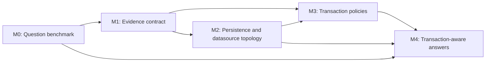

# ArchLens Roadmap: Verifiable Brownfield Architecture Intelligence

This roadmap turns four related improvements into independently shippable milestones:

1. evaluate ArchLens with realistic architecture questions;
2. expose consistent evidence and confidence for source-derived claims;
3. connect persistence configuration, JNDI datasources, and WildFly runtime descriptors;
4. model effective transaction policies and inferred transaction scopes.

The order is deliberate. The benchmark defines success before new extraction rules are added,
and the evidence contract prevents configuration and transaction inference from being presented
as runtime certainty.

## Principles

- Benchmark architecture facts, not prose quality. The deterministic suite asserts structured
  tool output and graph facts; an optional agent evaluation may assess final explanations later.
- Every inferred claim must say where it came from and how strong the evidence is.
- Confidence is an evidence score, not a statistical probability.
- Static analysis reports effective source/config intent. It must not claim to observe production
  runtime behavior.
- TinkerPop remains the runtime source of truth. New tools and renderers read through
  `GraphQuery`; they do not retain or bypass `ArchitectureModel`.
- Configuration discovery is bounded to declared project roots and known descriptor locations.
  Secrets such as datasource passwords are never projected or returned.

## M0 — Architecture Question Benchmark

**Status:** initial runner and three baseline questions implemented. The suite currently covers
Spring persistence, Spring change impact, and an unresolved Java EE consumer binding.

### Goal

Answer realistic maintenance questions with expected, machine-verifiable architecture facts.

### Initial question families

| Family | Example question | Required facts |
| --- | --- | --- |
| Persistence destination | Where is field `customerId` ultimately persisted? | entrypoint/parameter, call path, repository or `EntityManager` operation, entity, persistence unit/datasource when known, evidence |
| Consumer dependencies | What invokes this consumer and what does it touch? | channel/queue/topic, producer or deployment binding, downstream components and sinks, unresolved links |
| Change impact | What may break if component X is replaced? | upstream entrypoints/components, downstream integrations, traversal depth, confidence and ambiguity |
| Transaction policy | Which transaction contains this repository call? | effective policy, declaration/default source, inferred join/new/suspend behavior, uncertainty |
| Runtime configuration | Which database does this JNDI name represent? | source reference, persistence unit, JNDI binding, datasource, driver/URL with secrets removed |

### Layout

- `benchmarks/scenarios/<scenario>/scenario.json`: workspace reference, question ids, tool calls,
  required facts, forbidden facts, and expected evidence strength.
- Scenario workspaces currently reuse reviewable projects under `src/test/resources/testprojects/`;
  dedicated benchmark-only workspaces can be added when a question requires a new brownfield case.
- `scripts/run-benchmark.py`: drives the packaged MCP server using the mandatory sequential stdio
  handshake from `AGENTS.md` and reads `structuredContent`.
- `target/benchmark/`: generated JSON and Markdown reports; never committed.

The first suite should contain at least three scenarios:

1. Spring REST → service → repository with renamed parameters and an impact question.
2. Java EE/Jakarta EE WAR with EJB, `EntityManager`, `persistence.xml`, and JNDI datasource.
3. Messaging consumer/producer chain with one deliberately unresolved destination.

### Scoring

- Required-fact recall: required facts found / required facts declared.
- Precision guard: forbidden facts must not appear as confirmed facts.
- Traceability: every asserted inferred fact has source/config evidence.
- Confidence calibration: ambiguous fixtures are not reported as known.
- Stability: ids and structured result shapes remain deterministic across repeated runs.

### Exit criteria

- A single command builds ArchLens, executes all benchmark scenarios, and writes a summary.
- Every scenario can be reviewed without an LLM.
- CI suitability is documented, but no GitHub Actions workflow is added unless explicitly requested.
- The initial baseline is recorded before M1–M4 change the score.

## M1 — Consistent Evidence and Confidence Contract

**Status:** initial normalization boundary implemented for source-bearing graph nodes and
evidence-bearing edges. Graph node/edge structured results retain `properties` and additionally
expose a normalized `evidence` object. Extractor-specific evidence migrations remain incremental.

### Current baseline

ArchLens already carries useful evidence in `SourceInfo`, `FactConfidence`, `SourceEvidence`,
dependency confidence, receiver evidence, sink `linkEvidence`, and workflow-link confidence.
The gap is consistency: callers must currently know which property each extractor happened to use.

### Public contract

Every source- or config-derived node/edge relevant to user answers should expose:

- `derivedFrom`: stable evidence kind;
- `sourceFile` and `sourceLine` when available;
- `confidence`: numeric evidence score from 0.0 to 1.0;
- `confidenceBand`: `known`, `inferred`, `ambiguous`, or `unknown`;
- `ambiguous`: explicit boolean;
- `evidence`: short human-readable reason, without secrets.

Do not immediately replace every internal evidence type. Add one normalization boundary used by
`GraphProjector`, then migrate extractors incrementally. `GraphQuery` and structured tool results
are the stable consumer boundary.

### User-visible behavior

- `trace_data_flow`, `call_flow`, impact results, and graph queries retain evidence metadata.
- Human-facing summaries distinguish “declared”, “resolved”, “inferred”, and “unresolved”.
- Ambiguous edges remain queryable but are not traversed as default workflow truth.
- Benchmark reports fail when inferred claims lose their evidence.

### Exit criteria

- The benchmark can assert evidence uniformly across persistence, messaging, and impact questions.
- Existing graph labels and outputs remain backward-compatible where possible.
- `docs/TOOLS.md`, `llms.txt`, `GraphQueryTest`, and tool tests describe and cover the contract.

## M2 — Persistence and Datasource Topology

Status: initial end-to-end implementation complete. ArchLens now parses the planned descriptor
and source/config families, projects the proposed topology with evidence, preserves unresolved
bindings, and verifies an EJB → persistence unit → JNDI datasource → sanitized database endpoint
path in the benchmark. Directly attaching every `EntityManager` invocation sink to the topology
remains a follow-up refinement for field-level persistence answers.

Deliver this milestone in three slices so each adds a useful answer.

### M2.1 — `persistence.xml`

Parse standard `META-INF/persistence.xml` descriptors and capture:

- persistence-unit name, provider, and transaction type;
- JTA and non-JTA datasource names;
- managed classes and mapping files;
- descriptor source location and unresolved placeholders.

Link `@PersistenceContext(unitName=...)` and known `EntityManager` usage to the declared unit.

### M2.2 — JNDI and application datasource references

Resolve bounded source/config references including:

- `@Resource(lookup=...)`, `@Resource(name=...)`, and `@DataSourceDefinition`;
- Spring `spring.datasource.*` and JNDI datasource properties;
- Jakarta/Java EE resource-ref descriptors where present.

Never expose passwords, credential-store expressions, secret values, or complete sensitive URLs.

### M2.3 — WildFly runtime descriptors

Parse datasource and driver facts from explicitly supplied or project-local WildFly descriptors,
starting with `standalone.xml`, `domain.xml`, and `*-ds.xml`. Resolve JNDI aliases to datasource
definitions and record unmatched references as unresolved evidence rather than dropping them.

### Proposed graph additions

- Nodes: `PersistenceUnit`, `DataSource`.
- Edges: `DECLARES_PERSISTENCE_UNIT`, `USES_PERSISTENCE_UNIT`, `USES_DATASOURCE`,
  `CONNECTS_TO`.
- Database endpoints remain `ExternalSystem` nodes when a safe, non-secret destination can be
  derived.

Adding these labels requires the coordinated `GraphProjector`, `GraphQuery`, documentation,
reachability, and test updates listed in `AGENTS.md`.

### Exit criteria

- The Java EE benchmark answers source field/parameter → persistence operation → entity →
  persistence unit → JNDI datasource → database endpoint where evidence is available.
- A missing WildFly descriptor produces an explicit unresolved binding, not a fabricated target.
- Graph queries can inspect every hop and its evidence.

## M3 — Effective Transaction Policies

Status: complete. Effective Spring, Jakarta/Javax, Quarkus and EJB method policies are projected as
transaction boundaries; method-local EntityManager operations are linked to persistence units,
and runtime-flow steps expose bounded scope transitions. Spring XML advice and EJB descriptor
overrides, inherited policies, programmatic boundaries, unresolved pointcut evidence, and
Spring self-invocation limitations are covered by fixtures and deterministic benchmarks.

### M3.1 — Declaration extraction

Extract method- and type-level policies from:

- Spring `@Transactional`;
- Jakarta and Javax `@Transactional`;
- EJB `@TransactionAttribute`;
- EJB container-managed defaults, including the default `REQUIRED` policy;
- `@TransactionManagement(BEAN)` as a boundary where container-managed inference stops.

Capture propagation/attribute, read-only flag, isolation when declared, rollback rules, source,
and confidence. Apply framework precedence rules so method declarations override type declarations
and explicit declarations override defaults.

### M3.1b — XML and descriptor overrides

Keep standard `persistence.xml` framework-neutral: evaluate it for Spring/Spring Boot and Quarkus
modules as well as Java EE/Jakarta deployments. Add transaction-policy overrides from Spring
application contexts (`tx:advice`, `tx:method`, and resolved AOP advisor/pointcut), EJB
`ejb-jar.xml` container-transaction declarations, and explicitly supplied vendor descriptors.
Only apply an XML method rule when its bean/type pointcut can be resolved; otherwise retain it as
ambiguous configuration evidence instead of assigning it globally. Quarkus normally uses
annotations for transaction policy, but XML persistence-unit configuration and descriptor-driven
JTA datasource selection remain supported.

### M3.2 — Graph and flow projection

Represent a transaction policy as a `TransactionBoundary` node keyed by the governed method.
Connect it to its component and relevant entrypoint/runtime flow. Avoid introducing graph-wide
`Method` nodes solely for this feature.

Normalize policies to a shared vocabulary while retaining the framework-native value:

- `REQUIRED`: join an existing transaction or start one;
- `SUPPORTS`: join when one exists, otherwise run without one;
- `MANDATORY`: require and join an existing transaction;
- `REQUIRES_NEW`: suspend an existing transaction and start a new one;
- Spring `NESTED`: use nested/savepoint semantics when supported;
- `NOT_SUPPORTED`: suspend an existing transaction;
- `NEVER`: require the absence of a transaction;
- unknown or programmatic transaction management.

### M3.3 — Scope inference

Annotate call-flow steps with an inferred transaction scope id and transition such as `join`,
`begin`, `suspend`, or `none`. Stop or lower confidence across asynchronous boundaries,
ambiguous receiver edges, programmatic transaction APIs, and unresolved proxy behavior.

Important limitations must remain visible: Spring self-invocation, runtime AOP configuration,
descriptor overrides, and application-server behavior can change effective runtime semantics.

### Exit criteria

- The transaction benchmark distinguishes explicit annotations, inherited type policies, EJB
  defaults, `REQUIRES_NEW`, and non-transactional/unknown cases.
- `call_flow` can state which repository call probably shares or starts a transaction and why.
- No inferred scope crosses an async boundary as a confirmed fact.
- `docs/TOOLS.md`, `llms.txt`, transaction fixture tests, `GraphQueryTest`, and renderer/tool tests
  are updated.

## M4 — Question-Oriented Answers and Release Gate

Status: complete. `answer_architecture_question` exposes stable persistence-destination,
consumer-context, grouped-impact, and transaction-context contracts entirely through
`GraphQuery`. Every result retains unresolved and ambiguous evidence. The benchmark records index
and question timing, graph node/edge counts, deltas against a committed baseline, and regressions
of previously passing questions.

Use the graph facts from M1–M3 to make the original questions first-class workflows rather than
requiring clients to assemble many raw queries manually.

Prefer extending existing tools and prompts before adding a new MCP tool. A new tool is justified
only when its structured output represents a stable, reusable question contract.

Candidate result contracts:

- persistence destination: origin, transformations, operation, entity, persistence unit,
  datasource, external system, evidence chain;
- consumer context: inbound binding, upstream producers/config, downstream dependencies/sinks;
- impact: affected nodes grouped by entrypoint, workflow, persistence, and external integration;
- transaction context: effective policy, scope transitions, governed calls, caveats.

### Release gate

- No regression in the pre-M1 benchmark baseline without an explicit documented reason.
- New capabilities add benchmark questions before being advertised in README/website copy.
- Every answer includes unresolved and ambiguous evidence, not just successful links.
- Performance and graph-size deltas are recorded for every benchmark scenario.

## Suggested Delivery Order

1. M0 benchmark harness plus the three baseline scenarios.
2. M1 evidence normalization and user-visible uncertainty.
3. M2.1 `persistence.xml`, immediately producing a new benchmark result.
4. M2.2 JNDI/source bindings.
5. M2.3 WildFly descriptors.
6. M3.1 transaction declarations and EJB defaults.
7. M3.2–M3.3 graph projection and scope inference.
8. M4 question-oriented result contracts and comparative benchmark report.
9. M5 open question planner plus REST, messaging, integration, scheduler, state, and generic
   relationship contracts.

Each item should land with focused extractor/config tests, graph projection/query coverage, tool
tests, and the documentation updates required by `AGENTS.md`.

## M5 — Open Architecture Question Engine

M4 intentionally exposes four curated contracts; it is not yet an open question system. M5 turns
natural maintenance questions into an explicit, inspectable graph query plan and broadens the
domain beyond persistence. The server remains deterministic and does not embed an LLM: it reports
the interpreted intent and subjects, executes typed `GraphQuery` operations, and requests
clarification rather than silently choosing among ambiguous interpretations.

### M5.0 — Question taxonomy and benchmark

**Status:** implemented. `spring-endpoint-context` benchmark scenario covers REST forward/reverse,
natural-language/typed equivalence, unsupported, and needs-clarification cases;
`scripts/test-phoenix-m5.py` exercises `endpoint_context` against phoenix_backend.

Add real, machine-verifiable questions for:

- REST inbound context: “What happens on `PUT /customer/{id}`?”, “Which endpoints call service X?”,
  “Where does request field Y flow?”;
- messaging: “Who publishes Kafka topic X?”, “What consumes channel Y?”, “What is downstream of
  this listener?”, “Where does this payload originate?”;
- external integration: “Which use cases call service X?”, “Where is its base URL configured?”,
  “What changes if the client is replaced?”;
- schedulers and background processing: “What does this job trigger?”, “Which state, broker, or
  external API does it touch?”;
- state and workflow: “Where is field X written and read?”, “Which entrypoint continues this
  workflow?”;
- deployment/configuration and generic graph relations in addition to the existing persistence,
  impact, consumer, and transaction families.

Include Phoenix benchmark questions for at least one REST path, one Kafka topic/listener, one
repository, one outbound integration, and one unresolved configuration case.

### M5.1 — Universal question contract

**Status:** implemented. `answer_architecture_question` accepts a `question` input routed through
a deterministic keyword-scoring `QuestionPlanner` (`mcp/tools/question/`); results expose
`interpretation`, `queryPlan`, top-level `evidenceChain`, `clarifications`, and
`suggestedQuestions` alongside the existing envelope. `unsupported`/`needs-clarification`
statuses stop before running an answerer, never fabricating an answer.

Extend `answer_architecture_question` with a `question` input while preserving the typed `family`
mode. Return:

- `interpretation`: normalized intent, extracted subject candidates, filters, and confidence;
- `queryPlan`: ordered graph operations and traversal bounds;
- `answer`: stable intent-specific result data;
- `evidenceChain`: nodes and edges supporting each claim;
- `unresolved`, `ambiguous`, and `clarifications`;
- `suggestedQuestions` for useful follow-ups.

Unknown wording must produce an inspectable `unsupported` or `needs-clarification` result, never a
fabricated answer. Exact IDs and `METHOD /path` selectors take precedence over fuzzy names.

### M5.2 — REST and use-case questions

**Status:** implemented. `endpoint_context` covers forward (inbound method/path, owning
component, runtime calls, data-flow sinks, transaction transitions, outbound calls) and reverse
(component/service back to reachable REST/SSE/WebSocket/gRPC entrypoints via `impactedBy`)
questions. Missing security and response-schema facts are always reported in `unresolved`.

Add an `endpoint_context` intent covering inbound method/path, owning component, parameters,
runtime calls, data-flow sinks, transaction transitions, outbound calls, and affected entrypoints.
Support reverse questions from a service/client/repository back to all reachable REST entrypoints.
Keep missing security, response-schema, and runtime routing facts explicit when they are not present
in the graph.

### M5.3 — Kafka, JMS, and event-flow questions

Add a `messaging_flow` intent covering producer and consumer entrypoints, broker, logical channel,
resolved topic, configuration property, payload type, workflow links, downstream sinks, and
cross-application continuation. Treat logical channel and broker topic as separate fields. Dynamic
topic expressions, pattern subscriptions, missing producers, and capped receiver expansion remain
visible as unresolved or ambiguous evidence.

### M5.4 — Integrations, schedulers, state, and configuration

Add reusable intents for:

- `external_integration_context` — callers, originating entrypoints, configured destination, data
  sent/received, and replacement impact;
- `scheduled_workflow` — trigger evidence, call flow, state reads/writes, messaging and external
  sinks;
- `state_lifecycle` — writers, readers, handoffs, associated entrypoints, and confidence;
- `configuration_context` — config key declarations/usages, resolved values when safe, deployment
  overrides, and unresolved placeholders;
- `relationship` — bounded paths or neighborhoods for questions that do not need a specialized
  contract.

### M5.5 — Planner fallback and release gate

- Route recognized natural-language questions to a typed intent without bypassing `GraphQuery`.
- Prefer deterministic phrase/selector rules; make every interpretation visible and testable.
- Return multiple subject candidates and clarification prompts for ambiguous names or paths.
- Cap generic traversals and group low-signal support nodes instead of dumping the whole graph.
- Add contract tests, MCP schema tests, benchmark questions, performance/graph-size deltas, and a
  final Phoenix acceptance report.
- Preserve all 19 M4 benchmark questions without regression.

### Exit criteria

- A user can ask REST, Kafka/JMS, scheduler, outbound-integration, state, persistence, impact, and
  transaction questions through one public question interface.
- Every answer exposes its interpretation and query plan, with claim-level evidence and explicit
  unresolved/ambiguous facts.
- Equivalent typed and natural-language questions produce the same core answer facts.
- Phoenix verifies at least five distinct question domains, including one deliberately unresolved
  case, with no regressions in the committed benchmark baseline.
