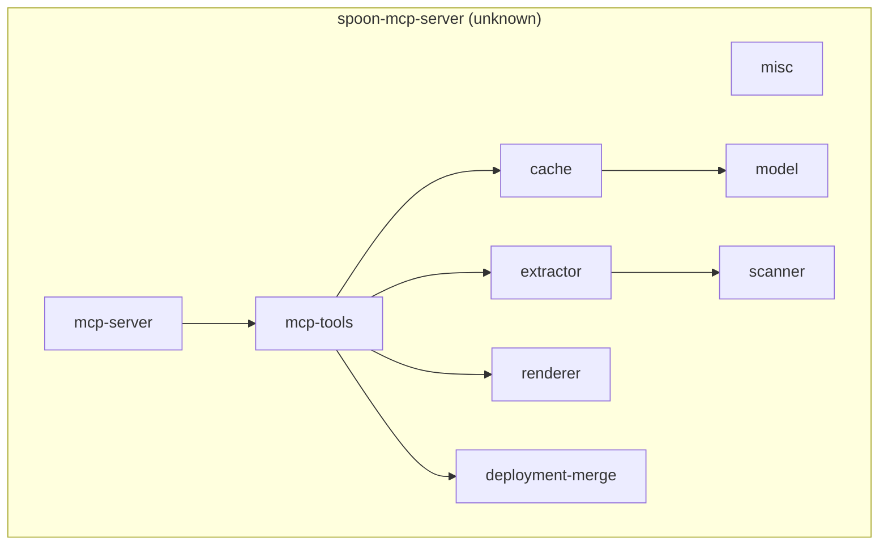
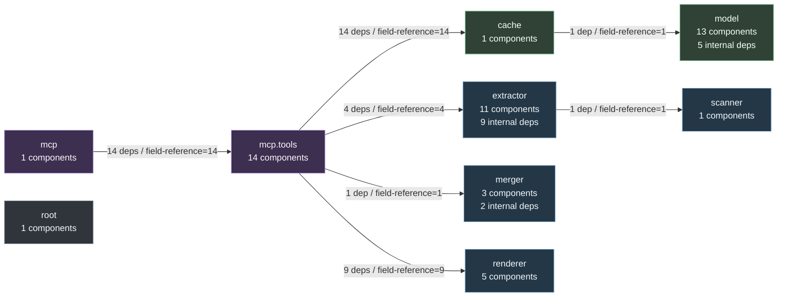

# Generated Architecture

Generated from the indexed `ArchitectureModel` by the MCP tool `export_architecture_docs`.

## Summary

- Applications: 1
- Components: 50
- Entrypoints: 0
- Interfaces: 0
- Dependencies: 60
- Runtime flows: 0

## Source Overview

```mermaid
flowchart TD
    subgraph pkg_dev_dominikbreu_spoonmcp["dev.dominikbreu.spoonmcp"]
        comp_dev_dominikbreu_spoonmcp_Main["Main\nUNKNOWN"]
    end
    subgraph pkg_dev_dominikbreu_spoonmcp_cache["dev.dominikbreu.spoonmcp.cache"]
        comp_dev_dominikbreu_spoonmcp_cache_ModelCache["ModelCache\nSERVICE"]
    end
    subgraph pkg_dev_dominikbreu_spoonmcp_extractor["dev.dominikbreu.spoonmcp.extractor"]
        comp_dev_dominikbreu_spoonmcp_extractor_ArchitectureExtractor["ArchitectureExtractor\nSERVICE"]
        comp_dev_dominikbreu_spoonmcp_extractor_ContainerInferrer["ContainerInferrer\nUNKNOWN"]
        comp_dev_dominikbreu_spoonmcp_extractor_DependencyCondenser["DependencyCondenser\nUNKNOWN"]
        comp_dev_dominikbreu_spoonmcp_extractor_DependencyEvidenceScorer["DependencyEvidenceScorer\nUNKNOWN"]
        comp_dev_dominikbreu_spoonmcp_extractor_DependencyExtractor["DependencyExtractor\nSERVICE"]
        comp_dev_dominikbreu_spoonmcp_extractor_EventBusExtractor["EventBusExtractor\nSERVICE"]
        comp_dev_dominikbreu_spoonmcp_extractor_GenericJavaExtractor["GenericJavaExtractor\nSERVICE"]
        comp_dev_dominikbreu_spoonmcp_extractor_InternalModuleClassifier["InternalModuleClassifier\nUNKNOWN"]
        comp_dev_dominikbreu_spoonmcp_extractor_JavaEEExtractor["JavaEEExtractor\nSERVICE"]
        comp_dev_dominikbreu_spoonmcp_extractor_QuarkusExtractor["QuarkusExtractor\nSERVICE"]
        comp_dev_dominikbreu_spoonmcp_extractor_RuntimeFlowInferrer["RuntimeFlowInferrer\nUNKNOWN"]
    end
    subgraph pkg_dev_dominikbreu_spoonmcp_mcp["dev.dominikbreu.spoonmcp.mcp"]
        comp_dev_dominikbreu_spoonmcp_mcp_McpServer["McpServer\nSERVICE"]
    end
    subgraph pkg_dev_dominikbreu_spoonmcp_mcp_tools["dev.dominikbreu.spoonmcp.mcp.tools"]
        comp_dev_dominikbreu_spoonmcp_mcp_tools_ExplainArchitectureTool["ExplainArchitectureTool\nSERVICE"]
        comp_dev_dominikbreu_spoonmcp_mcp_tools_ExportArchitectureDocsTool["ExportArchitectureDocsTool\nSERVICE"]
        comp_dev_dominikbreu_spoonmcp_mcp_tools_FindComponentsTool["FindComponentsTool\nSERVICE"]
        comp_dev_dominikbreu_spoonmcp_mcp_tools_FindEntrypointsTool["FindEntrypointsTool\nSERVICE"]
        comp_dev_dominikbreu_spoonmcp_mcp_tools_GetComponentDependenciesTool["GetComponentDependenciesTool\nSERVICE"]
        comp_dev_dominikbreu_spoonmcp_mcp_tools_GetRuntimeFlowTool["GetRuntimeFlowTool\nSERVICE"]
        comp_dev_dominikbreu_spoonmcp_mcp_tools_IndexWorkspaceTool["IndexWorkspaceTool\nSERVICE"]
        comp_dev_dominikbreu_spoonmcp_mcp_tools_InferContainersTool["InferContainersTool\nSERVICE"]
        comp_dev_dominikbreu_spoonmcp_mcp_tools_ListAppsTool["ListAppsTool\nSERVICE"]
        comp_dev_dominikbreu_spoonmcp_mcp_tools_RenderComponentDependencyDiagramTool["RenderComponentDependencyDiagramTool\nSERVICE"]
        comp_dev_dominikbreu_spoonmcp_mcp_tools_RenderDependencyMapTool["RenderDependencyMapTool\nSERVICE"]
        comp_dev_dominikbreu_spoonmcp_mcp_tools_RenderMermaidFlowchartTool["RenderMermaidFlowchartTool\nSERVICE"]
        comp_dev_dominikbreu_spoonmcp_mcp_tools_RenderMermaidSequenceTool["RenderMermaidSequenceTool\nSERVICE"]
        comp_dev_dominikbreu_spoonmcp_mcp_tools_RenderSourceOverviewTool["RenderSourceOverviewTool\nSERVICE"]
    end
    subgraph pkg_dev_dominikbreu_spoonmcp_merger["dev.dominikbreu.spoonmcp.merger"]
        comp_dev_dominikbreu_spoonmcp_merger_AnsibleMerger["AnsibleMerger\nSERVICE"]
        comp_dev_dominikbreu_spoonmcp_merger_DeploymentMerger["DeploymentMerger\nSERVICE"]
        comp_dev_dominikbreu_spoonmcp_merger_DockerComposeMerger["DockerComposeMerger\nSERVICE"]
    end
    subgraph pkg_dev_dominikbreu_spoonmcp_model["dev.dominikbreu.spoonmcp.model"]
        comp_dev_dominikbreu_spoonmcp_model_AppEntry["AppEntry\nENTITY"]
        comp_dev_dominikbreu_spoonmcp_model_ArchitectureModel["ArchitectureModel\nENTITY"]
        comp_dev_dominikbreu_spoonmcp_model_Component["Component\nENTITY"]
        comp_dev_dominikbreu_spoonmcp_model_ComponentType["ComponentType\nENTITY"]
        comp_dev_dominikbreu_spoonmcp_model_Container["Container\nENTITY"]
        comp_dev_dominikbreu_spoonmcp_model_Dependency["Dependency\nENTITY"]
        comp_dev_dominikbreu_spoonmcp_model_DeploymentEntry["DeploymentEntry\nENTITY"]
        comp_dev_dominikbreu_spoonmcp_model_Entrypoint["Entrypoint\nENTITY"]
        comp_dev_dominikbreu_spoonmcp_model_EntrypointType["EntrypointType\nENTITY"]
        comp_dev_dominikbreu_spoonmcp_model_InterfaceEntry["InterfaceEntry\nENTITY"]
        comp_dev_dominikbreu_spoonmcp_model_RuntimeFlow["RuntimeFlow\nENTITY"]
        comp_dev_dominikbreu_spoonmcp_model_RuntimeFlowStep["RuntimeFlowStep\nENTITY"]
        comp_dev_dominikbreu_spoonmcp_model_SourceInfo["SourceInfo\nENTITY"]
    end
    subgraph pkg_dev_dominikbreu_spoonmcp_renderer["dev.dominikbreu.spoonmcp.renderer"]
        comp_dev_dominikbreu_spoonmcp_renderer_MermaidDependencyMapRenderer["MermaidDependencyMapRenderer\nSERVICE"]
        comp_dev_dominikbreu_spoonmcp_renderer_MermaidDependencySliceRenderer["MermaidDependencySliceRenderer\nSERVICE"]
        comp_dev_dominikbreu_spoonmcp_renderer_MermaidFlowchartRenderer["MermaidFlowchartRenderer\nSERVICE"]
        comp_dev_dominikbreu_spoonmcp_renderer_MermaidSequenceRenderer["MermaidSequenceRenderer\nSERVICE"]
        comp_dev_dominikbreu_spoonmcp_renderer_MermaidSourceOverviewRenderer["MermaidSourceOverviewRenderer\nSERVICE"]
    end
    subgraph pkg_dev_dominikbreu_spoonmcp_scanner["dev.dominikbreu.spoonmcp.scanner"]
        comp_dev_dominikbreu_spoonmcp_scanner_SpoonScanner["SpoonScanner\nSERVICE"]
    end
    comp_dev_dominikbreu_spoonmcp_cache_ModelCache --> comp_dev_dominikbreu_spoonmcp_model_ArchitectureModel
    comp_dev_dominikbreu_spoonmcp_extractor_ArchitectureExtractor --> comp_dev_dominikbreu_spoonmcp_scanner_SpoonScanner
    comp_dev_dominikbreu_spoonmcp_extractor_ArchitectureExtractor --> comp_dev_dominikbreu_spoonmcp_extractor_QuarkusExtractor
    comp_dev_dominikbreu_spoonmcp_extractor_ArchitectureExtractor --> comp_dev_dominikbreu_spoonmcp_extractor_JavaEEExtractor
    comp_dev_dominikbreu_spoonmcp_extractor_ArchitectureExtractor --> comp_dev_dominikbreu_spoonmcp_extractor_GenericJavaExtractor
    comp_dev_dominikbreu_spoonmcp_extractor_ArchitectureExtractor --> comp_dev_dominikbreu_spoonmcp_extractor_DependencyExtractor
    comp_dev_dominikbreu_spoonmcp_extractor_ArchitectureExtractor --> comp_dev_dominikbreu_spoonmcp_extractor_ContainerInferrer
    comp_dev_dominikbreu_spoonmcp_extractor_ArchitectureExtractor --> comp_dev_dominikbreu_spoonmcp_extractor_InternalModuleClassifier
    comp_dev_dominikbreu_spoonmcp_extractor_ArchitectureExtractor --> comp_dev_dominikbreu_spoonmcp_extractor_EventBusExtractor
    comp_dev_dominikbreu_spoonmcp_extractor_ArchitectureExtractor --> comp_dev_dominikbreu_spoonmcp_extractor_RuntimeFlowInferrer
    comp_dev_dominikbreu_spoonmcp_extractor_DependencyExtractor --> comp_dev_dominikbreu_spoonmcp_extractor_DependencyEvidenceScorer
    comp_dev_dominikbreu_spoonmcp_mcp_McpServer --> comp_dev_dominikbreu_spoonmcp_mcp_tools_IndexWorkspaceTool
    comp_dev_dominikbreu_spoonmcp_mcp_McpServer --> comp_dev_dominikbreu_spoonmcp_mcp_tools_ListAppsTool
    comp_dev_dominikbreu_spoonmcp_mcp_McpServer --> comp_dev_dominikbreu_spoonmcp_mcp_tools_FindEntrypointsTool
    comp_dev_dominikbreu_spoonmcp_mcp_McpServer --> comp_dev_dominikbreu_spoonmcp_mcp_tools_FindComponentsTool
    comp_dev_dominikbreu_spoonmcp_mcp_McpServer --> comp_dev_dominikbreu_spoonmcp_mcp_tools_GetComponentDependenciesTool
    comp_dev_dominikbreu_spoonmcp_mcp_McpServer --> comp_dev_dominikbreu_spoonmcp_mcp_tools_InferContainersTool
    comp_dev_dominikbreu_spoonmcp_mcp_McpServer --> comp_dev_dominikbreu_spoonmcp_mcp_tools_RenderMermaidFlowchartTool
    comp_dev_dominikbreu_spoonmcp_mcp_McpServer --> comp_dev_dominikbreu_spoonmcp_mcp_tools_GetRuntimeFlowTool
    comp_dev_dominikbreu_spoonmcp_mcp_McpServer --> comp_dev_dominikbreu_spoonmcp_mcp_tools_RenderMermaidSequenceTool
    comp_dev_dominikbreu_spoonmcp_mcp_McpServer --> comp_dev_dominikbreu_spoonmcp_mcp_tools_ExplainArchitectureTool
    comp_dev_dominikbreu_spoonmcp_mcp_McpServer --> comp_dev_dominikbreu_spoonmcp_mcp_tools_RenderSourceOverviewTool
    comp_dev_dominikbreu_spoonmcp_mcp_McpServer --> comp_dev_dominikbreu_spoonmcp_mcp_tools_RenderDependencyMapTool
    comp_dev_dominikbreu_spoonmcp_mcp_McpServer --> comp_dev_dominikbreu_spoonmcp_mcp_tools_RenderComponentDependencyDiagramTool
    comp_dev_dominikbreu_spoonmcp_mcp_McpServer --> comp_dev_dominikbreu_spoonmcp_mcp_tools_ExportArchitectureDocsTool
    comp_dev_dominikbreu_spoonmcp_mcp_tools_ExplainArchitectureTool --> comp_dev_dominikbreu_spoonmcp_cache_ModelCache
    comp_dev_dominikbreu_spoonmcp_mcp_tools_ExportArchitectureDocsTool --> comp_dev_dominikbreu_spoonmcp_cache_ModelCache
    comp_dev_dominikbreu_spoonmcp_mcp_tools_ExportArchitectureDocsTool --> comp_dev_dominikbreu_spoonmcp_renderer_MermaidFlowchartRenderer
    comp_dev_dominikbreu_spoonmcp_mcp_tools_ExportArchitectureDocsTool --> comp_dev_dominikbreu_spoonmcp_renderer_MermaidSourceOverviewRenderer
    comp_dev_dominikbreu_spoonmcp_mcp_tools_ExportArchitectureDocsTool --> comp_dev_dominikbreu_spoonmcp_renderer_MermaidDependencySliceRenderer
    comp_dev_dominikbreu_spoonmcp_mcp_tools_ExportArchitectureDocsTool --> comp_dev_dominikbreu_spoonmcp_renderer_MermaidDependencyMapRenderer
    comp_dev_dominikbreu_spoonmcp_mcp_tools_FindComponentsTool --> comp_dev_dominikbreu_spoonmcp_cache_ModelCache
    comp_dev_dominikbreu_spoonmcp_mcp_tools_FindEntrypointsTool --> comp_dev_dominikbreu_spoonmcp_cache_ModelCache
    comp_dev_dominikbreu_spoonmcp_mcp_tools_GetComponentDependenciesTool --> comp_dev_dominikbreu_spoonmcp_cache_ModelCache
    comp_dev_dominikbreu_spoonmcp_mcp_tools_GetComponentDependenciesTool --> comp_dev_dominikbreu_spoonmcp_extractor_DependencyCondenser
    comp_dev_dominikbreu_spoonmcp_mcp_tools_GetRuntimeFlowTool --> comp_dev_dominikbreu_spoonmcp_cache_ModelCache
    comp_dev_dominikbreu_spoonmcp_mcp_tools_GetRuntimeFlowTool --> comp_dev_dominikbreu_spoonmcp_extractor_RuntimeFlowInferrer
    comp_dev_dominikbreu_spoonmcp_mcp_tools_IndexWorkspaceTool --> comp_dev_dominikbreu_spoonmcp_extractor_ArchitectureExtractor
    comp_dev_dominikbreu_spoonmcp_mcp_tools_IndexWorkspaceTool --> comp_dev_dominikbreu_spoonmcp_cache_ModelCache
    comp_dev_dominikbreu_spoonmcp_mcp_tools_IndexWorkspaceTool --> comp_dev_dominikbreu_spoonmcp_merger_DeploymentMerger
    comp_dev_dominikbreu_spoonmcp_mcp_tools_InferContainersTool --> comp_dev_dominikbreu_spoonmcp_cache_ModelCache
    comp_dev_dominikbreu_spoonmcp_mcp_tools_ListAppsTool --> comp_dev_dominikbreu_spoonmcp_cache_ModelCache
    comp_dev_dominikbreu_spoonmcp_mcp_tools_RenderComponentDependencyDiagramTool --> comp_dev_dominikbreu_spoonmcp_cache_ModelCache
    comp_dev_dominikbreu_spoonmcp_mcp_tools_RenderComponentDependencyDiagramTool --> comp_dev_dominikbreu_spoonmcp_renderer_MermaidDependencySliceRenderer
    comp_dev_dominikbreu_spoonmcp_mcp_tools_RenderDependencyMapTool --> comp_dev_dominikbreu_spoonmcp_cache_ModelCache
    comp_dev_dominikbreu_spoonmcp_mcp_tools_RenderDependencyMapTool --> comp_dev_dominikbreu_spoonmcp_renderer_MermaidDependencyMapRenderer
    comp_dev_dominikbreu_spoonmcp_mcp_tools_RenderMermaidFlowchartTool --> comp_dev_dominikbreu_spoonmcp_cache_ModelCache
    comp_dev_dominikbreu_spoonmcp_mcp_tools_RenderMermaidFlowchartTool --> comp_dev_dominikbreu_spoonmcp_renderer_MermaidFlowchartRenderer
    comp_dev_dominikbreu_spoonmcp_mcp_tools_RenderMermaidSequenceTool --> comp_dev_dominikbreu_spoonmcp_cache_ModelCache
    comp_dev_dominikbreu_spoonmcp_mcp_tools_RenderMermaidSequenceTool --> comp_dev_dominikbreu_spoonmcp_extractor_RuntimeFlowInferrer
    comp_dev_dominikbreu_spoonmcp_mcp_tools_RenderMermaidSequenceTool --> comp_dev_dominikbreu_spoonmcp_renderer_MermaidSequenceRenderer
    comp_dev_dominikbreu_spoonmcp_mcp_tools_RenderSourceOverviewTool --> comp_dev_dominikbreu_spoonmcp_cache_ModelCache
    comp_dev_dominikbreu_spoonmcp_mcp_tools_RenderSourceOverviewTool --> comp_dev_dominikbreu_spoonmcp_renderer_MermaidSourceOverviewRenderer
    comp_dev_dominikbreu_spoonmcp_merger_DeploymentMerger --> comp_dev_dominikbreu_spoonmcp_merger_DockerComposeMerger
    comp_dev_dominikbreu_spoonmcp_merger_DeploymentMerger --> comp_dev_dominikbreu_spoonmcp_merger_AnsibleMerger
    comp_dev_dominikbreu_spoonmcp_model_Component --> comp_dev_dominikbreu_spoonmcp_model_ComponentType
    comp_dev_dominikbreu_spoonmcp_model_Component --> comp_dev_dominikbreu_spoonmcp_model_SourceInfo
    comp_dev_dominikbreu_spoonmcp_model_Entrypoint --> comp_dev_dominikbreu_spoonmcp_model_EntrypointType
    comp_dev_dominikbreu_spoonmcp_model_Entrypoint --> comp_dev_dominikbreu_spoonmcp_model_SourceInfo
    comp_dev_dominikbreu_spoonmcp_model_InterfaceEntry --> comp_dev_dominikbreu_spoonmcp_model_SourceInfo
```

## Component Architecture

```mermaid
flowchart TD
    subgraph app_spoon_mcp_server["spoon-mcp-server (unknown)"]
        subgraph container_app_spoon_mcp_server_misc["misc"]
            comp_dev_dominikbreu_spoonmcp_Main["UNKNOWN\nMain"]
        end
        subgraph container_app_spoon_mcp_server_cache["cache"]
            comp_dev_dominikbreu_spoonmcp_cache_ModelCache["SERVICE\nModelCache"]
        end
        subgraph container_app_spoon_mcp_server_extractor["extractor"]
            comp_dev_dominikbreu_spoonmcp_extractor_ArchitectureExtractor["SERVICE\nArchitectureExtractor"]
            comp_dev_dominikbreu_spoonmcp_extractor_ContainerInferrer["UNKNOWN\nContainerInferrer"]
            comp_dev_dominikbreu_spoonmcp_extractor_DependencyCondenser["UNKNOWN\nDependencyCondenser"]
            comp_dev_dominikbreu_spoonmcp_extractor_DependencyEvidenceScorer["UNKNOWN\nDependencyEvidenceScorer"]
            comp_dev_dominikbreu_spoonmcp_extractor_DependencyExtractor["SERVICE\nDependencyExtractor"]
            comp_dev_dominikbreu_spoonmcp_extractor_EventBusExtractor["SERVICE\nEventBusExtractor"]
            comp_dev_dominikbreu_spoonmcp_extractor_GenericJavaExtractor["SERVICE\nGenericJavaExtractor"]
            comp_dev_dominikbreu_spoonmcp_extractor_InternalModuleClassifier["UNKNOWN\nInternalModuleClassifier"]
            comp_dev_dominikbreu_spoonmcp_extractor_JavaEEExtractor["SERVICE\nJavaEEExtractor"]
            comp_dev_dominikbreu_spoonmcp_extractor_QuarkusExtractor["SERVICE\nQuarkusExtractor"]
            comp_dev_dominikbreu_spoonmcp_extractor_RuntimeFlowInferrer["UNKNOWN\nRuntimeFlowInferrer"]
        end
        subgraph container_app_spoon_mcp_server_mcp_server["mcp-server"]
            comp_dev_dominikbreu_spoonmcp_mcp_McpServer["SERVICE\nMcpServer"]
        end
        subgraph container_app_spoon_mcp_server_mcp_tools["mcp-tools"]
            comp_dev_dominikbreu_spoonmcp_mcp_tools_ExplainArchitectureTool["SERVICE\nExplainArchitectureTool"]
            comp_dev_dominikbreu_spoonmcp_mcp_tools_ExportArchitectureDocsTool["SERVICE\nExportArchitectureDocsTool"]
            comp_dev_dominikbreu_spoonmcp_mcp_tools_FindComponentsTool["SERVICE\nFindComponentsTool"]
            comp_dev_dominikbreu_spoonmcp_mcp_tools_FindEntrypointsTool["SERVICE\nFindEntrypointsTool"]
            comp_dev_dominikbreu_spoonmcp_mcp_tools_GetComponentDependenciesTool["SERVICE\nGetComponentDependenciesTool"]
            comp_dev_dominikbreu_spoonmcp_mcp_tools_GetRuntimeFlowTool["SERVICE\nGetRuntimeFlowTool"]
            comp_dev_dominikbreu_spoonmcp_mcp_tools_IndexWorkspaceTool["SERVICE\nIndexWorkspaceTool"]
            comp_dev_dominikbreu_spoonmcp_mcp_tools_InferContainersTool["SERVICE\nInferContainersTool"]
            comp_dev_dominikbreu_spoonmcp_mcp_tools_ListAppsTool["SERVICE\nListAppsTool"]
            comp_dev_dominikbreu_spoonmcp_mcp_tools_RenderComponentDependencyDiagramTool["SERVICE\nRenderComponentDependencyDiagramTool"]
            comp_dev_dominikbreu_spoonmcp_mcp_tools_RenderDependencyMapTool["SERVICE\nRenderDependencyMapTool"]
            comp_dev_dominikbreu_spoonmcp_mcp_tools_RenderMermaidFlowchartTool["SERVICE\nRenderMermaidFlowchartTool"]
            comp_dev_dominikbreu_spoonmcp_mcp_tools_RenderMermaidSequenceTool["SERVICE\nRenderMermaidSequenceTool"]
            comp_dev_dominikbreu_spoonmcp_mcp_tools_RenderSourceOverviewTool["SERVICE\nRenderSourceOverviewTool"]
        end
        subgraph container_app_spoon_mcp_server_deployment_merge["deployment-merge"]
            comp_dev_dominikbreu_spoonmcp_merger_AnsibleMerger["SERVICE\nAnsibleMerger"]
            comp_dev_dominikbreu_spoonmcp_merger_DeploymentMerger["SERVICE\nDeploymentMerger"]
            comp_dev_dominikbreu_spoonmcp_merger_DockerComposeMerger["SERVICE\nDockerComposeMerger"]
        end
        subgraph container_app_spoon_mcp_server_model["model"]
            comp_dev_dominikbreu_spoonmcp_model_AppEntry[("ENTITY\nAppEntry")]
            comp_dev_dominikbreu_spoonmcp_model_ArchitectureModel[("ENTITY\nArchitectureModel")]
            comp_dev_dominikbreu_spoonmcp_model_Component[("ENTITY\nComponent")]
            comp_dev_dominikbreu_spoonmcp_model_ComponentType[("ENTITY\nComponentType")]
            comp_dev_dominikbreu_spoonmcp_model_Container[("ENTITY\nContainer")]
            comp_dev_dominikbreu_spoonmcp_model_Dependency[("ENTITY\nDependency")]
            comp_dev_dominikbreu_spoonmcp_model_DeploymentEntry[("ENTITY\nDeploymentEntry")]
            comp_dev_dominikbreu_spoonmcp_model_Entrypoint[("ENTITY\nEntrypoint")]
            comp_dev_dominikbreu_spoonmcp_model_EntrypointType[("ENTITY\nEntrypointType")]
            comp_dev_dominikbreu_spoonmcp_model_InterfaceEntry[("ENTITY\nInterfaceEntry")]
            comp_dev_dominikbreu_spoonmcp_model_RuntimeFlow[("ENTITY\nRuntimeFlow")]
            comp_dev_dominikbreu_spoonmcp_model_RuntimeFlowStep[("ENTITY\nRuntimeFlowStep")]
            comp_dev_dominikbreu_spoonmcp_model_SourceInfo[("ENTITY\nSourceInfo")]
        end
        subgraph container_app_spoon_mcp_server_renderer["renderer"]
            comp_dev_dominikbreu_spoonmcp_renderer_MermaidDependencyMapRenderer["SERVICE\nMermaidDependencyMapRenderer"]
            comp_dev_dominikbreu_spoonmcp_renderer_MermaidDependencySliceRenderer["SERVICE\nMermaidDependencySliceRenderer"]
            comp_dev_dominikbreu_spoonmcp_renderer_MermaidFlowchartRenderer["SERVICE\nMermaidFlowchartRenderer"]
            comp_dev_dominikbreu_spoonmcp_renderer_MermaidSequenceRenderer["SERVICE\nMermaidSequenceRenderer"]
            comp_dev_dominikbreu_spoonmcp_renderer_MermaidSourceOverviewRenderer["SERVICE\nMermaidSourceOverviewRenderer"]
        end
        subgraph container_app_spoon_mcp_server_scanner["scanner"]
            comp_dev_dominikbreu_spoonmcp_scanner_SpoonScanner["SERVICE\nSpoonScanner"]
        end
    end
    comp_dev_dominikbreu_spoonmcp_cache_ModelCache -->|field-reference| comp_dev_dominikbreu_spoonmcp_model_ArchitectureModel
    comp_dev_dominikbreu_spoonmcp_extractor_ArchitectureExtractor -->|field-reference| comp_dev_dominikbreu_spoonmcp_scanner_SpoonScanner
    comp_dev_dominikbreu_spoonmcp_extractor_ArchitectureExtractor -->|field-reference| comp_dev_dominikbreu_spoonmcp_extractor_QuarkusExtractor
    comp_dev_dominikbreu_spoonmcp_extractor_ArchitectureExtractor -->|field-reference| comp_dev_dominikbreu_spoonmcp_extractor_JavaEEExtractor
    comp_dev_dominikbreu_spoonmcp_extractor_ArchitectureExtractor -->|field-reference| comp_dev_dominikbreu_spoonmcp_extractor_GenericJavaExtractor
    comp_dev_dominikbreu_spoonmcp_extractor_ArchitectureExtractor -->|field-reference| comp_dev_dominikbreu_spoonmcp_extractor_DependencyExtractor
    comp_dev_dominikbreu_spoonmcp_extractor_ArchitectureExtractor -->|field-reference| comp_dev_dominikbreu_spoonmcp_extractor_ContainerInferrer
    comp_dev_dominikbreu_spoonmcp_extractor_ArchitectureExtractor -->|field-reference| comp_dev_dominikbreu_spoonmcp_extractor_InternalModuleClassifier
    comp_dev_dominikbreu_spoonmcp_extractor_ArchitectureExtractor -->|field-reference| comp_dev_dominikbreu_spoonmcp_extractor_EventBusExtractor
    comp_dev_dominikbreu_spoonmcp_extractor_ArchitectureExtractor -->|field-reference| comp_dev_dominikbreu_spoonmcp_extractor_RuntimeFlowInferrer
    comp_dev_dominikbreu_spoonmcp_extractor_DependencyExtractor -->|field-reference| comp_dev_dominikbreu_spoonmcp_extractor_DependencyEvidenceScorer
    comp_dev_dominikbreu_spoonmcp_mcp_McpServer -->|field-reference| comp_dev_dominikbreu_spoonmcp_mcp_tools_IndexWorkspaceTool
    comp_dev_dominikbreu_spoonmcp_mcp_McpServer -->|field-reference| comp_dev_dominikbreu_spoonmcp_mcp_tools_ListAppsTool
    comp_dev_dominikbreu_spoonmcp_mcp_McpServer -->|field-reference| comp_dev_dominikbreu_spoonmcp_mcp_tools_FindEntrypointsTool
    comp_dev_dominikbreu_spoonmcp_mcp_McpServer -->|field-reference| comp_dev_dominikbreu_spoonmcp_mcp_tools_FindComponentsTool
    comp_dev_dominikbreu_spoonmcp_mcp_McpServer -->|field-reference| comp_dev_dominikbreu_spoonmcp_mcp_tools_GetComponentDependenciesTool
    comp_dev_dominikbreu_spoonmcp_mcp_McpServer -->|field-reference| comp_dev_dominikbreu_spoonmcp_mcp_tools_InferContainersTool
    comp_dev_dominikbreu_spoonmcp_mcp_McpServer -->|field-reference| comp_dev_dominikbreu_spoonmcp_mcp_tools_RenderMermaidFlowchartTool
    comp_dev_dominikbreu_spoonmcp_mcp_McpServer -->|field-reference| comp_dev_dominikbreu_spoonmcp_mcp_tools_GetRuntimeFlowTool
    comp_dev_dominikbreu_spoonmcp_mcp_McpServer -->|field-reference| comp_dev_dominikbreu_spoonmcp_mcp_tools_RenderMermaidSequenceTool
    comp_dev_dominikbreu_spoonmcp_mcp_McpServer -->|field-reference| comp_dev_dominikbreu_spoonmcp_mcp_tools_ExplainArchitectureTool
    comp_dev_dominikbreu_spoonmcp_mcp_McpServer -->|field-reference| comp_dev_dominikbreu_spoonmcp_mcp_tools_RenderSourceOverviewTool
    comp_dev_dominikbreu_spoonmcp_mcp_McpServer -->|field-reference| comp_dev_dominikbreu_spoonmcp_mcp_tools_RenderDependencyMapTool
    comp_dev_dominikbreu_spoonmcp_mcp_McpServer -->|field-reference| comp_dev_dominikbreu_spoonmcp_mcp_tools_RenderComponentDependencyDiagramTool
    comp_dev_dominikbreu_spoonmcp_mcp_McpServer -->|field-reference| comp_dev_dominikbreu_spoonmcp_mcp_tools_ExportArchitectureDocsTool
    comp_dev_dominikbreu_spoonmcp_mcp_tools_ExplainArchitectureTool -->|field-reference| comp_dev_dominikbreu_spoonmcp_cache_ModelCache
    comp_dev_dominikbreu_spoonmcp_mcp_tools_ExportArchitectureDocsTool -->|field-reference| comp_dev_dominikbreu_spoonmcp_cache_ModelCache
    comp_dev_dominikbreu_spoonmcp_mcp_tools_ExportArchitectureDocsTool -->|field-reference| comp_dev_dominikbreu_spoonmcp_renderer_MermaidFlowchartRenderer
    comp_dev_dominikbreu_spoonmcp_mcp_tools_ExportArchitectureDocsTool -->|field-reference| comp_dev_dominikbreu_spoonmcp_renderer_MermaidSourceOverviewRenderer
    comp_dev_dominikbreu_spoonmcp_mcp_tools_ExportArchitectureDocsTool -->|field-reference| comp_dev_dominikbreu_spoonmcp_renderer_MermaidDependencySliceRenderer
    comp_dev_dominikbreu_spoonmcp_mcp_tools_ExportArchitectureDocsTool -->|field-reference| comp_dev_dominikbreu_spoonmcp_renderer_MermaidDependencyMapRenderer
    comp_dev_dominikbreu_spoonmcp_mcp_tools_FindComponentsTool -->|field-reference| comp_dev_dominikbreu_spoonmcp_cache_ModelCache
    comp_dev_dominikbreu_spoonmcp_mcp_tools_FindEntrypointsTool -->|field-reference| comp_dev_dominikbreu_spoonmcp_cache_ModelCache
    comp_dev_dominikbreu_spoonmcp_mcp_tools_GetComponentDependenciesTool -->|field-reference| comp_dev_dominikbreu_spoonmcp_cache_ModelCache
    comp_dev_dominikbreu_spoonmcp_mcp_tools_GetComponentDependenciesTool -->|field-reference| comp_dev_dominikbreu_spoonmcp_extractor_DependencyCondenser
    comp_dev_dominikbreu_spoonmcp_mcp_tools_GetRuntimeFlowTool -->|field-reference| comp_dev_dominikbreu_spoonmcp_cache_ModelCache
    comp_dev_dominikbreu_spoonmcp_mcp_tools_GetRuntimeFlowTool -->|field-reference| comp_dev_dominikbreu_spoonmcp_extractor_RuntimeFlowInferrer
    comp_dev_dominikbreu_spoonmcp_mcp_tools_IndexWorkspaceTool -->|field-reference| comp_dev_dominikbreu_spoonmcp_extractor_ArchitectureExtractor
    comp_dev_dominikbreu_spoonmcp_mcp_tools_IndexWorkspaceTool -->|field-reference| comp_dev_dominikbreu_spoonmcp_cache_ModelCache
    comp_dev_dominikbreu_spoonmcp_mcp_tools_IndexWorkspaceTool -->|field-reference| comp_dev_dominikbreu_spoonmcp_merger_DeploymentMerger
    comp_dev_dominikbreu_spoonmcp_mcp_tools_InferContainersTool -->|field-reference| comp_dev_dominikbreu_spoonmcp_cache_ModelCache
    comp_dev_dominikbreu_spoonmcp_mcp_tools_ListAppsTool -->|field-reference| comp_dev_dominikbreu_spoonmcp_cache_ModelCache
    comp_dev_dominikbreu_spoonmcp_mcp_tools_RenderComponentDependencyDiagramTool -->|field-reference| comp_dev_dominikbreu_spoonmcp_cache_ModelCache
    comp_dev_dominikbreu_spoonmcp_mcp_tools_RenderComponentDependencyDiagramTool -->|field-reference| comp_dev_dominikbreu_spoonmcp_renderer_MermaidDependencySliceRenderer
    comp_dev_dominikbreu_spoonmcp_mcp_tools_RenderDependencyMapTool -->|field-reference| comp_dev_dominikbreu_spoonmcp_cache_ModelCache
    comp_dev_dominikbreu_spoonmcp_mcp_tools_RenderDependencyMapTool -->|field-reference| comp_dev_dominikbreu_spoonmcp_renderer_MermaidDependencyMapRenderer
    comp_dev_dominikbreu_spoonmcp_mcp_tools_RenderMermaidFlowchartTool -->|field-reference| comp_dev_dominikbreu_spoonmcp_cache_ModelCache
    comp_dev_dominikbreu_spoonmcp_mcp_tools_RenderMermaidFlowchartTool -->|field-reference| comp_dev_dominikbreu_spoonmcp_renderer_MermaidFlowchartRenderer
    comp_dev_dominikbreu_spoonmcp_mcp_tools_RenderMermaidSequenceTool -->|field-reference| comp_dev_dominikbreu_spoonmcp_cache_ModelCache
    comp_dev_dominikbreu_spoonmcp_mcp_tools_RenderMermaidSequenceTool -->|field-reference| comp_dev_dominikbreu_spoonmcp_extractor_RuntimeFlowInferrer
    comp_dev_dominikbreu_spoonmcp_mcp_tools_RenderMermaidSequenceTool -->|field-reference| comp_dev_dominikbreu_spoonmcp_renderer_MermaidSequenceRenderer
    comp_dev_dominikbreu_spoonmcp_mcp_tools_RenderSourceOverviewTool -->|field-reference| comp_dev_dominikbreu_spoonmcp_cache_ModelCache
    comp_dev_dominikbreu_spoonmcp_mcp_tools_RenderSourceOverviewTool -->|field-reference| comp_dev_dominikbreu_spoonmcp_renderer_MermaidSourceOverviewRenderer
    comp_dev_dominikbreu_spoonmcp_merger_DeploymentMerger -->|field-reference| comp_dev_dominikbreu_spoonmcp_merger_DockerComposeMerger
    comp_dev_dominikbreu_spoonmcp_merger_DeploymentMerger -->|field-reference| comp_dev_dominikbreu_spoonmcp_merger_AnsibleMerger
    comp_dev_dominikbreu_spoonmcp_model_Component -->|field-reference| comp_dev_dominikbreu_spoonmcp_model_ComponentType
    comp_dev_dominikbreu_spoonmcp_model_Component -->|field-reference| comp_dev_dominikbreu_spoonmcp_model_SourceInfo
    comp_dev_dominikbreu_spoonmcp_model_Entrypoint -->|field-reference| comp_dev_dominikbreu_spoonmcp_model_EntrypointType
    comp_dev_dominikbreu_spoonmcp_model_Entrypoint -->|field-reference| comp_dev_dominikbreu_spoonmcp_model_SourceInfo
    comp_dev_dominikbreu_spoonmcp_model_InterfaceEntry -->|field-reference| comp_dev_dominikbreu_spoonmcp_model_SourceInfo
```

## Container Architecture

## Dependency Slice: McpServer

```mermaid
flowchart LR
    comp_dev_dominikbreu_spoonmcp_mcp_McpServer["McpServer\nSERVICE"]
    comp_dev_dominikbreu_spoonmcp_mcp_tools_IndexWorkspaceTool["IndexWorkspaceTool\nSERVICE"]
    comp_dev_dominikbreu_spoonmcp_mcp_tools_ListAppsTool["ListAppsTool\nSERVICE"]
    comp_dev_dominikbreu_spoonmcp_mcp_tools_FindEntrypointsTool["FindEntrypointsTool\nSERVICE"]
    comp_dev_dominikbreu_spoonmcp_mcp_tools_FindComponentsTool["FindComponentsTool\nSERVICE"]
    comp_dev_dominikbreu_spoonmcp_mcp_tools_GetComponentDependenciesTool["GetComponentDependenciesTool\nSERVICE"]
    comp_dev_dominikbreu_spoonmcp_mcp_tools_InferContainersTool["InferContainersTool\nSERVICE"]
    comp_dev_dominikbreu_spoonmcp_mcp_tools_RenderMermaidFlowchartTool["RenderMermaidFlowchartTool\nSERVICE"]
    comp_dev_dominikbreu_spoonmcp_mcp_tools_GetRuntimeFlowTool["GetRuntimeFlowTool\nSERVICE"]
    comp_dev_dominikbreu_spoonmcp_mcp_tools_RenderMermaidSequenceTool["RenderMermaidSequenceTool\nSERVICE"]
    comp_dev_dominikbreu_spoonmcp_mcp_tools_ExplainArchitectureTool["ExplainArchitectureTool\nSERVICE"]
    comp_dev_dominikbreu_spoonmcp_mcp_tools_RenderSourceOverviewTool["RenderSourceOverviewTool\nSERVICE"]
    comp_dev_dominikbreu_spoonmcp_mcp_tools_RenderDependencyMapTool["RenderDependencyMapTool\nSERVICE"]
    comp_dev_dominikbreu_spoonmcp_mcp_tools_RenderComponentDependencyDiagramTool["RenderComponentDependencyDiagramTool\nSERVICE"]
    comp_dev_dominikbreu_spoonmcp_mcp_tools_ExportArchitectureDocsTool["ExportArchitectureDocsTool\nSERVICE"]
    comp_dev_dominikbreu_spoonmcp_extractor_ArchitectureExtractor["ArchitectureExtractor\nSERVICE"]
    comp_dev_dominikbreu_spoonmcp_cache_ModelCache["ModelCache\nSERVICE"]
    comp_dev_dominikbreu_spoonmcp_merger_DeploymentMerger["DeploymentMerger\nSERVICE"]
    comp_dev_dominikbreu_spoonmcp_extractor_DependencyCondenser["DependencyCondenser\nUNKNOWN"]
    comp_dev_dominikbreu_spoonmcp_renderer_MermaidFlowchartRenderer["MermaidFlowchartRenderer\nSERVICE"]
    comp_dev_dominikbreu_spoonmcp_extractor_RuntimeFlowInferrer["RuntimeFlowInferrer\nUNKNOWN"]
    comp_dev_dominikbreu_spoonmcp_renderer_MermaidSequenceRenderer["MermaidSequenceRenderer\nSERVICE"]
    comp_dev_dominikbreu_spoonmcp_renderer_MermaidSourceOverviewRenderer["MermaidSourceOverviewRenderer\nSERVICE"]
    comp_dev_dominikbreu_spoonmcp_renderer_MermaidDependencyMapRenderer["MermaidDependencyMapRenderer\nSERVICE"]
    comp_dev_dominikbreu_spoonmcp_renderer_MermaidDependencySliceRenderer["MermaidDependencySliceRenderer\nSERVICE"]
    comp_dev_dominikbreu_spoonmcp_mcp_McpServer -->|field-reference| comp_dev_dominikbreu_spoonmcp_mcp_tools_IndexWorkspaceTool
    comp_dev_dominikbreu_spoonmcp_mcp_McpServer -->|field-reference| comp_dev_dominikbreu_spoonmcp_mcp_tools_ListAppsTool
    comp_dev_dominikbreu_spoonmcp_mcp_McpServer -->|field-reference| comp_dev_dominikbreu_spoonmcp_mcp_tools_FindEntrypointsTool
    comp_dev_dominikbreu_spoonmcp_mcp_McpServer -->|field-reference| comp_dev_dominikbreu_spoonmcp_mcp_tools_FindComponentsTool
    comp_dev_dominikbreu_spoonmcp_mcp_McpServer -->|field-reference| comp_dev_dominikbreu_spoonmcp_mcp_tools_GetComponentDependenciesTool
    comp_dev_dominikbreu_spoonmcp_mcp_McpServer -->|field-reference| comp_dev_dominikbreu_spoonmcp_mcp_tools_InferContainersTool
    comp_dev_dominikbreu_spoonmcp_mcp_McpServer -->|field-reference| comp_dev_dominikbreu_spoonmcp_mcp_tools_RenderMermaidFlowchartTool
    comp_dev_dominikbreu_spoonmcp_mcp_McpServer -->|field-reference| comp_dev_dominikbreu_spoonmcp_mcp_tools_GetRuntimeFlowTool
    comp_dev_dominikbreu_spoonmcp_mcp_McpServer -->|field-reference| comp_dev_dominikbreu_spoonmcp_mcp_tools_RenderMermaidSequenceTool
    comp_dev_dominikbreu_spoonmcp_mcp_McpServer -->|field-reference| comp_dev_dominikbreu_spoonmcp_mcp_tools_ExplainArchitectureTool
    comp_dev_dominikbreu_spoonmcp_mcp_McpServer -->|field-reference| comp_dev_dominikbreu_spoonmcp_mcp_tools_RenderSourceOverviewTool
    comp_dev_dominikbreu_spoonmcp_mcp_McpServer -->|field-reference| comp_dev_dominikbreu_spoonmcp_mcp_tools_RenderDependencyMapTool
    comp_dev_dominikbreu_spoonmcp_mcp_McpServer -->|field-reference| comp_dev_dominikbreu_spoonmcp_mcp_tools_RenderComponentDependencyDiagramTool
    comp_dev_dominikbreu_spoonmcp_mcp_McpServer -->|field-reference| comp_dev_dominikbreu_spoonmcp_mcp_tools_ExportArchitectureDocsTool
    comp_dev_dominikbreu_spoonmcp_mcp_tools_IndexWorkspaceTool -->|field-reference| comp_dev_dominikbreu_spoonmcp_extractor_ArchitectureExtractor
    comp_dev_dominikbreu_spoonmcp_mcp_tools_IndexWorkspaceTool -->|field-reference| comp_dev_dominikbreu_spoonmcp_cache_ModelCache
    comp_dev_dominikbreu_spoonmcp_mcp_tools_IndexWorkspaceTool -->|field-reference| comp_dev_dominikbreu_spoonmcp_merger_DeploymentMerger
    comp_dev_dominikbreu_spoonmcp_mcp_tools_ListAppsTool -->|field-reference| comp_dev_dominikbreu_spoonmcp_cache_ModelCache
    comp_dev_dominikbreu_spoonmcp_mcp_tools_FindEntrypointsTool -->|field-reference| comp_dev_dominikbreu_spoonmcp_cache_ModelCache
    comp_dev_dominikbreu_spoonmcp_mcp_tools_FindComponentsTool -->|field-reference| comp_dev_dominikbreu_spoonmcp_cache_ModelCache
    comp_dev_dominikbreu_spoonmcp_mcp_tools_GetComponentDependenciesTool -->|field-reference| comp_dev_dominikbreu_spoonmcp_cache_ModelCache
    comp_dev_dominikbreu_spoonmcp_mcp_tools_GetComponentDependenciesTool -->|field-reference| comp_dev_dominikbreu_spoonmcp_extractor_DependencyCondenser
    comp_dev_dominikbreu_spoonmcp_mcp_tools_InferContainersTool -->|field-reference| comp_dev_dominikbreu_spoonmcp_cache_ModelCache
    comp_dev_dominikbreu_spoonmcp_mcp_tools_RenderMermaidFlowchartTool -->|field-reference| comp_dev_dominikbreu_spoonmcp_cache_ModelCache
    comp_dev_dominikbreu_spoonmcp_mcp_tools_RenderMermaidFlowchartTool -->|field-reference| comp_dev_dominikbreu_spoonmcp_renderer_MermaidFlowchartRenderer
    comp_dev_dominikbreu_spoonmcp_mcp_tools_GetRuntimeFlowTool -->|field-reference| comp_dev_dominikbreu_spoonmcp_cache_ModelCache
    comp_dev_dominikbreu_spoonmcp_mcp_tools_GetRuntimeFlowTool -->|field-reference| comp_dev_dominikbreu_spoonmcp_extractor_RuntimeFlowInferrer
    comp_dev_dominikbreu_spoonmcp_mcp_tools_RenderMermaidSequenceTool -->|field-reference| comp_dev_dominikbreu_spoonmcp_cache_ModelCache
    comp_dev_dominikbreu_spoonmcp_mcp_tools_RenderMermaidSequenceTool -->|field-reference| comp_dev_dominikbreu_spoonmcp_extractor_RuntimeFlowInferrer
    comp_dev_dominikbreu_spoonmcp_mcp_tools_RenderMermaidSequenceTool -->|field-reference| comp_dev_dominikbreu_spoonmcp_renderer_MermaidSequenceRenderer
    comp_dev_dominikbreu_spoonmcp_mcp_tools_ExplainArchitectureTool -->|field-reference| comp_dev_dominikbreu_spoonmcp_cache_ModelCache
    comp_dev_dominikbreu_spoonmcp_mcp_tools_RenderSourceOverviewTool -->|field-reference| comp_dev_dominikbreu_spoonmcp_cache_ModelCache
    comp_dev_dominikbreu_spoonmcp_mcp_tools_RenderSourceOverviewTool -->|field-reference| comp_dev_dominikbreu_spoonmcp_renderer_MermaidSourceOverviewRenderer
    comp_dev_dominikbreu_spoonmcp_mcp_tools_RenderDependencyMapTool -->|field-reference| comp_dev_dominikbreu_spoonmcp_cache_ModelCache
    comp_dev_dominikbreu_spoonmcp_mcp_tools_RenderDependencyMapTool -->|field-reference| comp_dev_dominikbreu_spoonmcp_renderer_MermaidDependencyMapRenderer
    comp_dev_dominikbreu_spoonmcp_mcp_tools_RenderComponentDependencyDiagramTool -->|field-reference| comp_dev_dominikbreu_spoonmcp_cache_ModelCache
    comp_dev_dominikbreu_spoonmcp_mcp_tools_RenderComponentDependencyDiagramTool -->|field-reference| comp_dev_dominikbreu_spoonmcp_renderer_MermaidDependencySliceRenderer
    comp_dev_dominikbreu_spoonmcp_mcp_tools_ExportArchitectureDocsTool -->|field-reference| comp_dev_dominikbreu_spoonmcp_cache_ModelCache
    comp_dev_dominikbreu_spoonmcp_mcp_tools_ExportArchitectureDocsTool -->|field-reference| comp_dev_dominikbreu_spoonmcp_renderer_MermaidFlowchartRenderer
    comp_dev_dominikbreu_spoonmcp_mcp_tools_ExportArchitectureDocsTool -->|field-reference| comp_dev_dominikbreu_spoonmcp_renderer_MermaidSourceOverviewRenderer
    comp_dev_dominikbreu_spoonmcp_mcp_tools_ExportArchitectureDocsTool -->|field-reference| comp_dev_dominikbreu_spoonmcp_renderer_MermaidDependencySliceRenderer
    comp_dev_dominikbreu_spoonmcp_mcp_tools_ExportArchitectureDocsTool -->|field-reference| comp_dev_dominikbreu_spoonmcp_renderer_MermaidDependencyMapRenderer
```

## Components By Type

### ENTITY

- `dev.dominikbreu.spoonmcp.model.AppEntry` (java)
- `dev.dominikbreu.spoonmcp.model.ArchitectureModel` (java)
- `dev.dominikbreu.spoonmcp.model.Component` (java)
- `dev.dominikbreu.spoonmcp.model.ComponentType` (java)
- `dev.dominikbreu.spoonmcp.model.Container` (java)
- `dev.dominikbreu.spoonmcp.model.Dependency` (java)
- `dev.dominikbreu.spoonmcp.model.DeploymentEntry` (java)
- `dev.dominikbreu.spoonmcp.model.Entrypoint` (java)
- `dev.dominikbreu.spoonmcp.model.EntrypointType` (java)
- `dev.dominikbreu.spoonmcp.model.InterfaceEntry` (java)
- `dev.dominikbreu.spoonmcp.model.RuntimeFlow` (java)
- `dev.dominikbreu.spoonmcp.model.RuntimeFlowStep` (java)
- `dev.dominikbreu.spoonmcp.model.SourceInfo` (java)

### SERVICE

- `dev.dominikbreu.spoonmcp.merger.AnsibleMerger` (java)
- `dev.dominikbreu.spoonmcp.extractor.ArchitectureExtractor` (java)
- `dev.dominikbreu.spoonmcp.extractor.DependencyExtractor` (java)
- `dev.dominikbreu.spoonmcp.merger.DeploymentMerger` (java)
- `dev.dominikbreu.spoonmcp.merger.DockerComposeMerger` (java)
- `dev.dominikbreu.spoonmcp.extractor.EventBusExtractor` (java)
- `dev.dominikbreu.spoonmcp.mcp.tools.ExplainArchitectureTool` (java)
- `dev.dominikbreu.spoonmcp.mcp.tools.ExportArchitectureDocsTool` (java)
- `dev.dominikbreu.spoonmcp.mcp.tools.FindComponentsTool` (java)
- `dev.dominikbreu.spoonmcp.mcp.tools.FindEntrypointsTool` (java)
- `dev.dominikbreu.spoonmcp.extractor.GenericJavaExtractor` (java)
- `dev.dominikbreu.spoonmcp.mcp.tools.GetComponentDependenciesTool` (java)
- `dev.dominikbreu.spoonmcp.mcp.tools.GetRuntimeFlowTool` (java)
- `dev.dominikbreu.spoonmcp.mcp.tools.IndexWorkspaceTool` (java)
- `dev.dominikbreu.spoonmcp.mcp.tools.InferContainersTool` (java)
- `dev.dominikbreu.spoonmcp.extractor.JavaEEExtractor` (java)
- `dev.dominikbreu.spoonmcp.mcp.tools.ListAppsTool` (java)
- `dev.dominikbreu.spoonmcp.mcp.McpServer` (java)
- `dev.dominikbreu.spoonmcp.renderer.MermaidDependencyMapRenderer` (java)
- `dev.dominikbreu.spoonmcp.renderer.MermaidDependencySliceRenderer` (java)
- `dev.dominikbreu.spoonmcp.renderer.MermaidFlowchartRenderer` (java)
- `dev.dominikbreu.spoonmcp.renderer.MermaidSequenceRenderer` (java)
- `dev.dominikbreu.spoonmcp.renderer.MermaidSourceOverviewRenderer` (java)
- `dev.dominikbreu.spoonmcp.cache.ModelCache` (java)
- `dev.dominikbreu.spoonmcp.extractor.QuarkusExtractor` (java)
- `dev.dominikbreu.spoonmcp.mcp.tools.RenderComponentDependencyDiagramTool` (java)
- `dev.dominikbreu.spoonmcp.mcp.tools.RenderDependencyMapTool` (java)
- `dev.dominikbreu.spoonmcp.mcp.tools.RenderMermaidFlowchartTool` (java)
- `dev.dominikbreu.spoonmcp.mcp.tools.RenderMermaidSequenceTool` (java)
- `dev.dominikbreu.spoonmcp.mcp.tools.RenderSourceOverviewTool` (java)
- `dev.dominikbreu.spoonmcp.scanner.SpoonScanner` (java)

### UNKNOWN

- `dev.dominikbreu.spoonmcp.extractor.ContainerInferrer` (java)
- `dev.dominikbreu.spoonmcp.extractor.DependencyCondenser` (java)
- `dev.dominikbreu.spoonmcp.extractor.DependencyEvidenceScorer` (java)
- `dev.dominikbreu.spoonmcp.extractor.InternalModuleClassifier` (java)
- `dev.dominikbreu.spoonmcp.Main` (java)
- `dev.dominikbreu.spoonmcp.extractor.RuntimeFlowInferrer` (java)

## Dependency Map

## Dependency Details

- `comp:dev.dominikbreu.spoonmcp.cache.ModelCache` -> `comp:dev.dominikbreu.spoonmcp.model.ArchitectureModel` (field-reference, type-relation, evidence-score=0.6)
- `comp:dev.dominikbreu.spoonmcp.extractor.ArchitectureExtractor` -> `comp:dev.dominikbreu.spoonmcp.scanner.SpoonScanner` (field-reference, type-relation, evidence-score=0.65)
- `comp:dev.dominikbreu.spoonmcp.extractor.ArchitectureExtractor` -> `comp:dev.dominikbreu.spoonmcp.extractor.QuarkusExtractor` (field-reference, type-relation, evidence-score=0.65)
- `comp:dev.dominikbreu.spoonmcp.extractor.ArchitectureExtractor` -> `comp:dev.dominikbreu.spoonmcp.extractor.JavaEEExtractor` (field-reference, type-relation, evidence-score=0.65)
- `comp:dev.dominikbreu.spoonmcp.extractor.ArchitectureExtractor` -> `comp:dev.dominikbreu.spoonmcp.extractor.GenericJavaExtractor` (field-reference, type-relation, evidence-score=0.65)
- `comp:dev.dominikbreu.spoonmcp.extractor.ArchitectureExtractor` -> `comp:dev.dominikbreu.spoonmcp.extractor.DependencyExtractor` (field-reference, type-relation, evidence-score=0.65)
- `comp:dev.dominikbreu.spoonmcp.extractor.ArchitectureExtractor` -> `comp:dev.dominikbreu.spoonmcp.extractor.ContainerInferrer` (field-reference, type-relation, evidence-score=0.6)
- `comp:dev.dominikbreu.spoonmcp.extractor.ArchitectureExtractor` -> `comp:dev.dominikbreu.spoonmcp.extractor.InternalModuleClassifier` (field-reference, type-relation, evidence-score=0.6)
- `comp:dev.dominikbreu.spoonmcp.extractor.ArchitectureExtractor` -> `comp:dev.dominikbreu.spoonmcp.extractor.EventBusExtractor` (field-reference, type-relation, evidence-score=0.65)
- `comp:dev.dominikbreu.spoonmcp.extractor.ArchitectureExtractor` -> `comp:dev.dominikbreu.spoonmcp.extractor.RuntimeFlowInferrer` (field-reference, type-relation, evidence-score=0.6)
- `comp:dev.dominikbreu.spoonmcp.extractor.DependencyExtractor` -> `comp:dev.dominikbreu.spoonmcp.extractor.DependencyEvidenceScorer` (field-reference, type-relation, evidence-score=0.6)
- `comp:dev.dominikbreu.spoonmcp.mcp.McpServer` -> `comp:dev.dominikbreu.spoonmcp.mcp.tools.IndexWorkspaceTool` (field-reference, type-relation, evidence-score=0.65)
- `comp:dev.dominikbreu.spoonmcp.mcp.McpServer` -> `comp:dev.dominikbreu.spoonmcp.mcp.tools.ListAppsTool` (field-reference, type-relation, evidence-score=0.65)
- `comp:dev.dominikbreu.spoonmcp.mcp.McpServer` -> `comp:dev.dominikbreu.spoonmcp.mcp.tools.FindEntrypointsTool` (field-reference, type-relation, evidence-score=0.65)
- `comp:dev.dominikbreu.spoonmcp.mcp.McpServer` -> `comp:dev.dominikbreu.spoonmcp.mcp.tools.FindComponentsTool` (field-reference, type-relation, evidence-score=0.65)
- `comp:dev.dominikbreu.spoonmcp.mcp.McpServer` -> `comp:dev.dominikbreu.spoonmcp.mcp.tools.GetComponentDependenciesTool` (field-reference, type-relation, evidence-score=0.65)
- `comp:dev.dominikbreu.spoonmcp.mcp.McpServer` -> `comp:dev.dominikbreu.spoonmcp.mcp.tools.InferContainersTool` (field-reference, type-relation, evidence-score=0.65)
- `comp:dev.dominikbreu.spoonmcp.mcp.McpServer` -> `comp:dev.dominikbreu.spoonmcp.mcp.tools.RenderMermaidFlowchartTool` (field-reference, type-relation, evidence-score=0.65)
- `comp:dev.dominikbreu.spoonmcp.mcp.McpServer` -> `comp:dev.dominikbreu.spoonmcp.mcp.tools.GetRuntimeFlowTool` (field-reference, type-relation, evidence-score=0.65)
- `comp:dev.dominikbreu.spoonmcp.mcp.McpServer` -> `comp:dev.dominikbreu.spoonmcp.mcp.tools.RenderMermaidSequenceTool` (field-reference, type-relation, evidence-score=0.65)
- `comp:dev.dominikbreu.spoonmcp.mcp.McpServer` -> `comp:dev.dominikbreu.spoonmcp.mcp.tools.ExplainArchitectureTool` (field-reference, type-relation, evidence-score=0.65)
- `comp:dev.dominikbreu.spoonmcp.mcp.McpServer` -> `comp:dev.dominikbreu.spoonmcp.mcp.tools.RenderSourceOverviewTool` (field-reference, type-relation, evidence-score=0.65)
- `comp:dev.dominikbreu.spoonmcp.mcp.McpServer` -> `comp:dev.dominikbreu.spoonmcp.mcp.tools.RenderDependencyMapTool` (field-reference, type-relation, evidence-score=0.65)
- `comp:dev.dominikbreu.spoonmcp.mcp.McpServer` -> `comp:dev.dominikbreu.spoonmcp.mcp.tools.RenderComponentDependencyDiagramTool` (field-reference, type-relation, evidence-score=0.65)
- `comp:dev.dominikbreu.spoonmcp.mcp.McpServer` -> `comp:dev.dominikbreu.spoonmcp.mcp.tools.ExportArchitectureDocsTool` (field-reference, type-relation, evidence-score=0.65)
- `comp:dev.dominikbreu.spoonmcp.mcp.tools.ExplainArchitectureTool` -> `comp:dev.dominikbreu.spoonmcp.cache.ModelCache` (field-reference, type-relation, evidence-score=0.65)
- `comp:dev.dominikbreu.spoonmcp.mcp.tools.ExportArchitectureDocsTool` -> `comp:dev.dominikbreu.spoonmcp.cache.ModelCache` (field-reference, type-relation, evidence-score=0.65)
- `comp:dev.dominikbreu.spoonmcp.mcp.tools.ExportArchitectureDocsTool` -> `comp:dev.dominikbreu.spoonmcp.renderer.MermaidFlowchartRenderer` (field-reference, type-relation, evidence-score=0.65)
- `comp:dev.dominikbreu.spoonmcp.mcp.tools.ExportArchitectureDocsTool` -> `comp:dev.dominikbreu.spoonmcp.renderer.MermaidSourceOverviewRenderer` (field-reference, type-relation, evidence-score=0.65)
- `comp:dev.dominikbreu.spoonmcp.mcp.tools.ExportArchitectureDocsTool` -> `comp:dev.dominikbreu.spoonmcp.renderer.MermaidDependencySliceRenderer` (field-reference, type-relation, evidence-score=0.65)
- `comp:dev.dominikbreu.spoonmcp.mcp.tools.ExportArchitectureDocsTool` -> `comp:dev.dominikbreu.spoonmcp.renderer.MermaidDependencyMapRenderer` (field-reference, type-relation, evidence-score=0.65)
- `comp:dev.dominikbreu.spoonmcp.mcp.tools.FindComponentsTool` -> `comp:dev.dominikbreu.spoonmcp.cache.ModelCache` (field-reference, type-relation, evidence-score=0.65)
- `comp:dev.dominikbreu.spoonmcp.mcp.tools.FindEntrypointsTool` -> `comp:dev.dominikbreu.spoonmcp.cache.ModelCache` (field-reference, type-relation, evidence-score=0.65)
- `comp:dev.dominikbreu.spoonmcp.mcp.tools.GetComponentDependenciesTool` -> `comp:dev.dominikbreu.spoonmcp.cache.ModelCache` (field-reference, type-relation, evidence-score=0.65)
- `comp:dev.dominikbreu.spoonmcp.mcp.tools.GetComponentDependenciesTool` -> `comp:dev.dominikbreu.spoonmcp.extractor.DependencyCondenser` (field-reference, type-relation, evidence-score=0.6)
- `comp:dev.dominikbreu.spoonmcp.mcp.tools.GetRuntimeFlowTool` -> `comp:dev.dominikbreu.spoonmcp.cache.ModelCache` (field-reference, type-relation, evidence-score=0.65)
- `comp:dev.dominikbreu.spoonmcp.mcp.tools.GetRuntimeFlowTool` -> `comp:dev.dominikbreu.spoonmcp.extractor.RuntimeFlowInferrer` (field-reference, type-relation, evidence-score=0.6)
- `comp:dev.dominikbreu.spoonmcp.mcp.tools.IndexWorkspaceTool` -> `comp:dev.dominikbreu.spoonmcp.extractor.ArchitectureExtractor` (field-reference, type-relation, evidence-score=0.65)
- `comp:dev.dominikbreu.spoonmcp.mcp.tools.IndexWorkspaceTool` -> `comp:dev.dominikbreu.spoonmcp.cache.ModelCache` (field-reference, type-relation, evidence-score=0.65)
- `comp:dev.dominikbreu.spoonmcp.mcp.tools.IndexWorkspaceTool` -> `comp:dev.dominikbreu.spoonmcp.merger.DeploymentMerger` (field-reference, type-relation, evidence-score=0.65)
- `comp:dev.dominikbreu.spoonmcp.mcp.tools.InferContainersTool` -> `comp:dev.dominikbreu.spoonmcp.cache.ModelCache` (field-reference, type-relation, evidence-score=0.65)
- `comp:dev.dominikbreu.spoonmcp.mcp.tools.ListAppsTool` -> `comp:dev.dominikbreu.spoonmcp.cache.ModelCache` (field-reference, type-relation, evidence-score=0.65)
- `comp:dev.dominikbreu.spoonmcp.mcp.tools.RenderComponentDependencyDiagramTool` -> `comp:dev.dominikbreu.spoonmcp.cache.ModelCache` (field-reference, type-relation, evidence-score=0.65)
- `comp:dev.dominikbreu.spoonmcp.mcp.tools.RenderComponentDependencyDiagramTool` -> `comp:dev.dominikbreu.spoonmcp.renderer.MermaidDependencySliceRenderer` (field-reference, type-relation, evidence-score=0.65)
- `comp:dev.dominikbreu.spoonmcp.mcp.tools.RenderDependencyMapTool` -> `comp:dev.dominikbreu.spoonmcp.cache.ModelCache` (field-reference, type-relation, evidence-score=0.65)
- `comp:dev.dominikbreu.spoonmcp.mcp.tools.RenderDependencyMapTool` -> `comp:dev.dominikbreu.spoonmcp.renderer.MermaidDependencyMapRenderer` (field-reference, type-relation, evidence-score=0.65)
- `comp:dev.dominikbreu.spoonmcp.mcp.tools.RenderMermaidFlowchartTool` -> `comp:dev.dominikbreu.spoonmcp.cache.ModelCache` (field-reference, type-relation, evidence-score=0.65)
- `comp:dev.dominikbreu.spoonmcp.mcp.tools.RenderMermaidFlowchartTool` -> `comp:dev.dominikbreu.spoonmcp.renderer.MermaidFlowchartRenderer` (field-reference, type-relation, evidence-score=0.65)
- `comp:dev.dominikbreu.spoonmcp.mcp.tools.RenderMermaidSequenceTool` -> `comp:dev.dominikbreu.spoonmcp.cache.ModelCache` (field-reference, type-relation, evidence-score=0.65)
- `comp:dev.dominikbreu.spoonmcp.mcp.tools.RenderMermaidSequenceTool` -> `comp:dev.dominikbreu.spoonmcp.extractor.RuntimeFlowInferrer` (field-reference, type-relation, evidence-score=0.6)
- `comp:dev.dominikbreu.spoonmcp.mcp.tools.RenderMermaidSequenceTool` -> `comp:dev.dominikbreu.spoonmcp.renderer.MermaidSequenceRenderer` (field-reference, type-relation, evidence-score=0.65)
- `comp:dev.dominikbreu.spoonmcp.mcp.tools.RenderSourceOverviewTool` -> `comp:dev.dominikbreu.spoonmcp.cache.ModelCache` (field-reference, type-relation, evidence-score=0.65)
- `comp:dev.dominikbreu.spoonmcp.mcp.tools.RenderSourceOverviewTool` -> `comp:dev.dominikbreu.spoonmcp.renderer.MermaidSourceOverviewRenderer` (field-reference, type-relation, evidence-score=0.65)
- `comp:dev.dominikbreu.spoonmcp.merger.DeploymentMerger` -> `comp:dev.dominikbreu.spoonmcp.merger.DockerComposeMerger` (field-reference, type-relation, evidence-score=0.65)
- `comp:dev.dominikbreu.spoonmcp.merger.DeploymentMerger` -> `comp:dev.dominikbreu.spoonmcp.merger.AnsibleMerger` (field-reference, type-relation, evidence-score=0.65)
- `comp:dev.dominikbreu.spoonmcp.model.Component` -> `comp:dev.dominikbreu.spoonmcp.model.ComponentType` (field-reference, type-relation, evidence-score=0.6)
- `comp:dev.dominikbreu.spoonmcp.model.Component` -> `comp:dev.dominikbreu.spoonmcp.model.SourceInfo` (field-reference, type-relation, evidence-score=0.6)
- `comp:dev.dominikbreu.spoonmcp.model.Entrypoint` -> `comp:dev.dominikbreu.spoonmcp.model.EntrypointType` (field-reference, type-relation, evidence-score=0.6)
- `comp:dev.dominikbreu.spoonmcp.model.Entrypoint` -> `comp:dev.dominikbreu.spoonmcp.model.SourceInfo` (field-reference, type-relation, evidence-score=0.6)
- `comp:dev.dominikbreu.spoonmcp.model.InterfaceEntry` -> `comp:dev.dominikbreu.spoonmcp.model.SourceInfo` (field-reference, type-relation, evidence-score=0.6)
