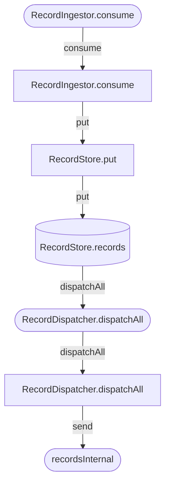

# MCP Tool And Prompt Reference

The server exposes these tools through `tools/list` and `tools/call`.
It also exposes reusable workflow prompts through `prompts/list` and `prompts/get`.

## Response Shape

Every `tools/call` response carries the same human-readable text shown in the "Sample output"
blocks below, unchanged, in `content[0].text`. Tools that return list- or record-shaped data
(entrypoints, components, dependencies, graph nodes/edges/paths, use cases, data-flow paths) also
populate `structuredContent` with the same data as JSON, validated against each tool's declared
`outputSchema` (visible via `tools/list`). Diagram-rendering and file-export tools populate
`structuredContent` with a small marker or summary object (e.g. `{diagramType: "mermaid"}` or
`{outputPath, nodeCount, edgeCount}`) since their primary payload is the diagram text or the
written file, not structured data. Clients that only read `content[0].text` continue to work
exactly as before — `structuredContent` is additive.

See `docs/STRUCTURED_OUTPUT.md` for a worked example and why this is worth using from an
agent's instructions, not just from a typed client.

## Workflow Prompts

Prompts are not tool replacements. They are client-selectable workflow templates that
tell an agent which tools to combine for common architecture tasks.

- `analyze_workspace(path)`: index a workspace, list apps, find entrypoints/components,
  and summarize the architecture.
- `generate_architecture_docs(path, focusComponent)`: index a workspace and regenerate
  `docs/ARCHITECTURE.md` plus `docs/SOURCE_ARCHITECTURE_POC.md`.
- `investigate_component(component)`: inspect dependencies, graph neighborhood, and
  change impact for a component.
- `trace_use_case(entrypoint)`: follow an entrypoint through runtime flow, call flow,
  data flow, and timeline views.
- `find_pipeline(filter)`: look for cross-entrypoint or messaging/store-linked pipeline
  chains.
- `architecture_view(app, view, maxNodes)`: render a projection-first architecture view
  from the indexed graph using `render_architecture_view` (and optionally `export_likec4_model`).

---

## `index_workspace`

Analyze one or more Java project roots and store the resulting architecture model in memory.

The extraction pipeline runs six passes:

1. Components + entrypoints per module (framework detection for Quarkus, Java EE, Spring Boot, generic Java).
2. Injection dependencies across all modules.
3. **Call graph** — actual method invocations between components (`CallEdge` records with
   caller/callee parameter-name mappings). Also enriches each entrypoint with its method's
   parameter names.
4. **Data-flow tracing** — follows each entrypoint parameter through call edges to classified
   sinks (persistence, messaging, http-outbound, event-bus).
5. Container inference.
6. External system inference (REST clients, messaging brokers).

The stored model includes applications, components, entrypoints, interfaces, dependencies,
runtime flows, call edges, and data-flow paths.

Arguments:

- `paths` array of strings, **required**. Project root directories to analyze.

Example:

```json
{ "paths": ["/path/to/java/project"] }
```

---

## `list_apps`

List recognized applications, modules, and packaging types from the indexed model.
The summary includes total components, entrypoints, interfaces, dependencies, runtime flows,
call edges, and data-flow paths.

Arguments: none.

---

## `find_entrypoints`

Return architecturally relevant entry points. All filters are combinable.

Arguments:

- `appId` string, optional. Partial app ID filter.
- `type` string, optional. One of `REST_ENDPOINT`, `JMS_CONSUMER`, `MESSAGING_CONSUMER`,
  `MESSAGING_PRODUCER`, `CDI_EVENT_OBSERVER`, `SCHEDULER`, `EJB_BUSINESS_METHOD`,
  `RMI_ENDPOINT`, `MAIN_METHOD`, `EVENT_BUS_CONSUMER`, `WEBSOCKET_ENDPOINT`,
  `SSE_ENDPOINT`, `GRPC_METHOD`, `UNKNOWN`.
- `httpMethod` string, optional. Filter REST endpoints by HTTP verb: `GET`, `POST`, `PUT`,
  `DELETE`, `PATCH`, `HEAD`, or `OPTIONS`. Case-insensitive.
- `path` string, optional. Filter by path prefix — returns all REST endpoints at or below
  this path. Works with and without path variables: `/customer` returns `/customer`,
  `/customer/{id}`, `/customer/{id}/address/{aid}`, …; `/customer/{id}` returns
  `/customer/{id}`, `/customer/{id}/address/{aid}`, … but not the bare `/customer`
  collection endpoint.

Messaging entrypoints carry `channelName` (Reactive Messaging channel), `broker`
(`KAFKA`, `MQTT`, `AMQP`, `RABBITMQ`, `PULSAR`, `IN_MEMORY`, or `UNKNOWN`), and `topic`
(broker-side destination — Kafka topic, AMQP address, RabbitMQ queue/exchange — when set
in configuration; falls back to the channel name otherwise).

The broker is resolved from `mp.messaging.{incoming|outgoing}.{channel}.connector` in
`application.properties` / `application.yaml`. Channels with no `connector` property that
are referenced by both an `@Incoming` and an `@Outgoing` declaration in the same module
are tagged `IN_MEMORY` (SmallRye in-memory channel — internal handoff, no external broker,
no external system created). The same fields are populated on `InterfaceEntry` records.

Spring Boot projects are detected from Maven/Gradle build metadata and Spring annotations.
The extractor reports Spring REST controllers as `REST_ENDPOINT` entrypoints, scheduled
methods as `SCHEDULER`, Kafka and Rabbit listeners as `MESSAGING_CONSUMER`, and JMS
listeners as `JMS_CONSUMER`. Feign, RestTemplate, WebClient, KafkaTemplate,
RabbitTemplate, and JmsTemplate calls are reported as interfaces when literal or
application config-backed destinations are visible in source.

Each entrypoint also includes a `parameters` list (method parameter names populated during
call-graph extraction), which powers `trace_data_flow`.

Example — all GET endpoints:

```json
{ "httpMethod": "GET" }
```

Example — all endpoints under `/customer`:

```json
{ "path": "/customer" }
```

Example — all GET endpoints under `/customer` (resource collection + individual reads):

```json
{ "httpMethod": "GET", "path": "/customer" }
```

Example — all sub-resources of a specific customer (not the collection endpoint):

```json
{ "path": "/customer/{id}" }
```

Example — all REST endpoints:

```json
{ "type": "REST_ENDPOINT" }
```

Example — all PUT REST endpoints:

```json
{ "type": "REST_ENDPOINT", "httpMethod": "PUT" }
```

Example — find messaging consumers in a specific module:

```json
{ "appId": "order-service", "type": "MESSAGING_CONSUMER" }
```

---

## `find_components`

Return architecture-relevant components.

Arguments:

- `appId` string, optional. Partial app ID filter.
- `type` string, optional. One of `REST_RESOURCE`, `SERVICE`, `REPOSITORY`, `ENTITY`,
  `EJB_STATELESS`, `EJB_STATEFUL`, `EJB_SINGLETON`, `MESSAGE_DRIVEN_BEAN`, `SCHEDULER`,
  `HTTP_CLIENT`, `CDI_EVENT_CONSUMER`, `CDI_EVENT_PRODUCER`, `REMOTE_SERVICE`, `UTILITY`,
  `UNKNOWN`.
- `technology` string, optional. For example `spring`, `quarkus`, `javaee`, or `jpa`.

---

## `get_component_dependencies`

Return relevant dependencies for a component.

Arguments:

- `componentId` string, optional. Component ID such as `com.example.UserService` (the
  fully-qualified class name).
- `name` string, optional. Partial component simple-name match.
- `depth` integer, optional. Traversal depth, default `1`, maximum `5`.
- `condensed` boolean, optional. Remove utility or unknown intermediaries, default `true`.

Example:

```json
{ "name": "OrderService", "depth": 2 }
```

---

## `infer_containers`

Group components into logical containers (API, service, repository, domain, messaging,
scheduling).

Arguments:

- `appId` string, optional. Partial app ID filter.

---

## `render_mermaid_flowchart`

Render a Mermaid flowchart for static architecture views.

Arguments:

- `appId` string, optional. Partial app ID filter.
- `level` string, optional. One of `system`, `container`, `module`, or `component`.
  Default is `component`.

At `level=system`, external systems inferred from REST clients and Reactive Messaging
channels are rendered alongside the application(s) with directed labelled edges.

Example — system-level diagram:

```json
{ "level": "system" }
```

---

## `call_flow`

Return the runtime call flow for an entry point: ordered steps and a Mermaid `flowchart TD`.

When call-graph data is available (after a full `index_workspace`), the tool performs a
DFS over actual method-call edges from the entrypoint method — each step’s `via` field
shows the real called-method name or HTTP method+path. Without call-graph data it falls
back to BFS over injection-dependency edges.

Component shapes reflect architectural role:

| Shape | Mermaid syntax | Used for |
| --- | --- | --- |
| Rectangle | `[Name]` | SERVICE, REST_RESOURCE, EJB, default |
| Cylinder | `[(Name)]` | REPOSITORY — persistence store |
| Parallelogram | `[/Name/]` | HTTP_CLIENT — external call |
| Stadium | `([Name])` | SCHEDULER, MESSAGE_DRIVEN_BEAN — async trigger |
| Circle | `((Name))` | CDI_EVENT_CONSUMER / CDI_EVENT_PRODUCER |

Edge labels carry the actual called method name from the call graph. The first edge from
Client shows the HTTP method+path or channel name. No return arrows — execution path only.

Arguments:

- `entrypointId` string, optional. Entrypoint ID from `find_entrypoints`.
- `entrypointName` string, optional. Entrypoint path, name, or `'METHOD /path'`
  (e.g. `'GET /account'`) for HTTP-method disambiguation.

Example:

```json
{ "entrypointName": "createOrder" }
```

Example — disambiguate by HTTP verb:

```json
{ "entrypointName": "POST /account" }
```

Sample output:

```
flowchart TD
    Client([Client])
    OrderResource[OrderResource]
    OrderService[OrderService]
    OrderRepository[(OrderRepository)]

    Client -->|POST /orders| OrderResource
    OrderResource -->|create| OrderService
    OrderService -->|save| OrderRepository
```

---

## `render_use_case_timeline`

Render a Mermaid `gantt` chart showing the sequential execution steps of one or more use
cases. Each use case becomes a section; each component hop in the call chain becomes a
task bar positioned by its call depth.

Useful for comparing how deeply different entry points penetrate the stack and which
components are involved at each step.

Arguments:

- `entrypointId` string, optional. Filter to a single use case by entrypoint ID.
- `entrypointName` string, optional. Filter by entrypoint name or HTTP path (partial match).
  Prefix with an HTTP verb to disambiguate same-path endpoints: `"GET /account"` selects the
  GET handler, `"POST /account"` selects the POST handler.
- `maxUseCases` integer, optional. Maximum sections to render. Default `10`.
- `maxDepth` integer, optional. Maximum call-chain steps per section. Default `5`.

Example — all use cases:

```json
{}
```

Example — single use case:

```json
{ "entrypointName": "createOrder" }
```

Sample output:

```
gantt
    title Use Case Execution Order
    dateFormat  X
    axisFormat  step %s

    section POST Create Order
    OrderResource.createOrder :active, 0, 1
    OrderService.create       :       1, 1
    OrderRepository.save      :       2, 1

    section GET /orders/{id}
    OrderResource.getOrder    :active, 0, 1
    OrderService.find         :       1, 1
    OrderRepository.findById  :       2, 1
```

---

## `detect_use_cases`

Detect business use cases from indexed entrypoints and their call chains.

One use case is produced per entrypoint. Names are auto-derived from entrypoint metadata
(HTTP method + camelCase-to-title conversion, channel name, scheduler name, etc.) and can
be overridden via a JSON config file.

When call-graph data is available, each use case includes a method call chain
(`ComponentA.methodX → ComponentB.methodY`). Without call-graph data the tool falls back
to injection-dependency traversal and emits a warning.

Arguments:

- `configFile` string, optional. Path to a JSON naming-config file with the format:
  ```json
  {
    "names": {
      "com.example.OrderResource#createOrder": "Create Order",
      "com.example.DeviceConsumer#handle:msg-in:device-events": "Process Device Event"
    }
  }
  ```
- `module` string, optional. Filter results by app/module ID (partial match).
- `maxDepth` integer, optional. Maximum call-chain steps shown per use case. Default `5`.

Example — auto-detect all use cases:

```json
{}
```

Example — detect with a naming config and module filter:

```json
{
  "configFile": "/path/to/use-cases.json",
  "module": "order-service",
  "maxDepth": 3
}
```

Sample output:

```
Detected 4 use case(s):

## POST Create Order
  id:           com.example.api.OrderResource#createOrder
  type:         REST_ENDPOINT
  channel/path: /orders
  components:   OrderResource, OrderService, OrderRepository
  call chain:
    - OrderResource.createOrder → OrderService.create
    - OrderService.create → OrderRepository.save

## Process order-events
  id:           com.example.messaging.OrderConsumer#handle:msg-in:order-events
  type:         MESSAGING_CONSUMER
  channel/path: order-events
  components:   OrderConsumer, OrderService
```

---

## `trace_data_flow`

Trace how entrypoint parameters flow through the call graph to architectural sinks.

A sink is any call that reaches a `REPOSITORY` component (persistence), an `HTTP_CLIENT`
component (http-outbound), or a call edge with kind `messaging` or `event-bus`. Parameter
names are tracked across call hops using the `paramMapping` captured at each call site;
when the mapping is absent the name is carried forward as a best-effort approximation.
When the argument expression is non-trivial — a constructor call, nested invocation, or
ternary that wraps a tracked variable — the mapping is still recorded, and the callee
parameter is listed in `syntheticParamMappings` on the call edge so consumers know the
hop relied on a heuristic descent rather than a direct variable reference.

**Two-phase pipeline support (store sinks):** writes to shared in-memory state fields
(e.g. `ConcurrentHashMap` caches) inside a `MESSAGING_CONSUMER` entrypoint are reported
as `store` sinks, even though no direct call edge connects the consumer to a downstream
component. For `SCHEDULER` and `MESSAGING_PRODUCER` entrypoints, the tracer
automatically seeds tracking from any shared-state field that the entrypoint or its
transitively called methods read — even when the entrypoint declares parameters of its
own — so producer paths cover both their argument flow and the cached state they publish.
The resulting path's `trackedParam` is the field name, allowing agents to stitch a
consumer's `store` sink to the matching producer/scheduler path. When a write's
right-hand side is itself a field read on the same bean (`outbox = inbox`), the tracer
records `sourceFieldName` so the data-flow keeps a `store` sink on paths tracking the
upstream field.

**Shared-state denylist:** field types `Logger`, `Log`, `Slf4j`, `Tracer`, and any type
prefixed with `Audit` are excluded from shared-state heuristics to prevent logging or
audit infrastructure from being reported as store sinks.

**Return-value flow:** when a call site binds the invocation result to a local
(`Order o = orderService.lookup(id)`) and the callee returns one of its parameters,
the call edge records `assignedToVar` and `returnsTracked=true`. The tracer adds
`assignedToVar` to the entrypoint's tracked names so persistence/messaging hops
downstream of the assignment are still visible.

**Reassigned-local pruning:** when a caller-method local is rebound to a fresh
invocation result (`order = service.lookup(id)`) before reaching a call site, the
edge's `killedTrackedNames` lists that local. The tracer drops the original tracking
at that edge so we no longer report sinks reached by the stale binding.

**Receiver evidence and ambiguity:** call edges carry `receiverEvidence`,
`receiverConfidence`, and, when visible, `receiverLocalName`. These fields describe how
the extractor decided that a method call target belongs to a component. Direct business
getter calls are still kept as real flow evidence: `dto.getId()` and
`dto.getInvoiceNumber()` produce calls on the DTO receiver and retain the receiver local
name (`dto`). What is deliberately not treated as strong evidence is an unresolved
chained call such as `dto.getId().equals(...)` when the accessor return type cannot be
resolved and the only project match comes from scanning for another component with a
method named `getId`. Those edges are retained as possible evidence with
`receiverEvidence=accessor-name-fallback`, `receiverConfidence=0.20`, and
`ambiguous=true`, so graph clients can inspect them without default workflows following
them. Accessor chains that represent collection-state ownership, such as
`store().cache().put(...)`, are represented separately as
`receiverEvidence=accessor-state-owner` with medium confidence.

**Sink kinds:** `persistence`, `messaging`, `http-outbound`, `event-bus`, `store`,
`file-outbound`, `object-storage`, `unknown`. Components carrying the stereotype
`object-storage` or `file-outbound` are classified accordingly even when their
component type is `HTTP_CLIENT`. Direct invocations against
`java.nio.file.Files` (→ `file-outbound`), `software.amazon.awssdk.services.s3.*`,
or `com.azure.storage.*` (→ `object-storage`) are detected even when the callee is
not a project component, via {@code outbound_sink_sites} captured during call-graph
extraction. Sinks land on the entrypoint method's data-flow path at depth 0.

**New entrypoint families:** `EVENT_BUS_CONSUMER` (Vert.x `eventBus.consumer(addr, handler)`),
`WEBSOCKET_ENDPOINT` (`@ServerEndpoint` + `@OnMessage`), `SSE_ENDPOINT` (REST methods
producing `text/event-stream` or with an `SseEventSink`/`Sse` parameter or return type),
and `GRPC_METHOD` (classes annotated `@GrpcService`, implementing `BindableService`, or
extending a generated `*Grpc.*ImplBase` stub — every public non-`bindService` method
becomes a `GRPC_METHOD` entrypoint).

**Cross-entrypoint linkage (`linkedPathIds` / `WORKFLOW_LINK`):** every `store` sink carries a
`linkedPathIds` list pointing to the IDs of downstream `DataFlowPath`s whose entrypoint
transitively reads the same `(fieldOwnerComponentId, fieldName)`. This makes the
consumer → cache → producer/scheduler hand-off explicit so agents do not need to match
field names heuristically. The raw relation is projected as a `LINKS_TO` sink edge in
the property graph; the canonical path-to-path continuation is projected as
`WORKFLOW_LINK` (see `query_architecture_graph`).
Shared-state reads are also recorded when a scheduler or service calls a getter-like
method on another component and that method returns the shared field directly or calls
through it, for example `return cache` or `return cache.keySet()`.

Requires call-graph data from `index_workspace`. Without it, the paths list will be empty.

Arguments:

- `entrypointId` string, optional. Filter by entrypoint ID (partial match).
- `entrypointName` string, optional. Filter by entrypoint name or HTTP path (partial match).
  Prefix with an HTTP verb to disambiguate same-path endpoints: `"GET /account"` selects the
  GET handler, `"POST /account"` selects the POST handler.
- `param` string, optional. Filter by tracked parameter name.
- `sinkKind` string, optional. Filter by sink kind: `persistence`, `messaging`,
  `http-outbound`, `event-bus`, `store`, `file-outbound`, `object-storage`, or `unknown`.

Example — trace all data-flow paths:

```json
{}
```

Example — trace paths for a specific endpoint:

```json
{ "entrypointName": "createOrder" }
```

Example — find all paths that reach a persistence sink:

```json
{ "sinkKind": "persistence" }
```

Example — trace a specific parameter:

```json
{ "entrypointName": "POST /orders", "param": "order" }
```

Example — find all store sinks (shared in-memory state writes from messaging consumers):

```json
{ "sinkKind": "store" }
```

Sample output — REST entrypoints:

```
3 data-flow path(s):

## POST /orders → param: order
  id: com.example.api.OrderResource#createOrder#order
  flow:
    1. OrderResource.createOrder (as 'order')
    2. OrderService.create (as 'dto')
    3. OrderService.create (as 'dto')
  sinks:
    - [persistence] OrderRepository.save  (OrderService.java:24)
    - [messaging] emitter.send  (OrderService.java:27)

## GET /orders/{id} → param: id
  id: com.example.api.OrderResource#getOrder#id
  flow:
    1. OrderResource.getOrder (as 'id')
    2. OrderService.find (as 'id')
  sinks:
    - [persistence] OrderRepository.findById  (OrderService.java:17)
```

Sample output — two-phase pipeline (`MESSAGING_CONSUMER` → cache → `SCHEDULER`):

```
2 data-flow path(s):

## handle (device-snapshots) → param: snapshot
  id: com.example.DeviceConsumer#handle:msg-in:device-snapshots#snapshot
  flow:
    1. DeviceConsumer.handle (as 'snapshot')
    2. StateCache.put (as 'snapshot')
  sinks:
    - [store] stateCache  field owner: StateCache  (DeviceConsumer.java:42)

## processSnapshots → param: stateCache
  id: com.example.scheduler.SnapshotProcessor#processSnapshots#stateCache
  flow:
    1. SnapshotProcessor.processSnapshots (as 'stateCache')
    2. StateCalculator.calculate (as 'entry')
  sinks:
    - [messaging] mqttEmitter.send  (StateCalculator.java:67)
    - [persistence] SnapshotRepository.save  (StateCalculator.java:72)
```

The matching field name (`stateCache`) in both paths identifies the shared state linking the
two phases. The consumer's `store` sink also carries
`linkedPathIds: ["com.example.scheduler.SnapshotProcessor#processSnapshots#stateCache"]`,
so agents can stitch the cross-phase pipeline without name matching.

---

## `render_pipeline`

Render an end-to-end Mermaid `flowchart TD` for a multi-phase pipeline by stitching
multiple `DataFlowPath`s across entrypoint boundaries. Where `call_flow`
shows the call chain rooted at a single entrypoint, and `trace_data_flow` produces
textual per-path output, `render_pipeline` follows `DataFlowSink.linkedPathIds`
through the shared workflow linker to produce one connected diagram per chain.

A *pipeline chain* is an ordered sequence of segments where each segment's
entrypoint is reached from the previous segment via either:

- a `STORE` sink (in-memory shared field) — boundary rendered as a cylinder
  labelled `OwnerComponent.fieldName`, styled as a data store
- a `MESSAGING` sink with a resolved channel — boundary rendered as a rounded
  rectangle labelled with the channel name, styled as a message broker
- an `EVENT_BUS` sink — boundary rendered as a circle

Per-segment call steps are shaped by the component's architectural role
(rectangle for SERVICE, cylinder for REPOSITORY, parallelogram for HTTP_CLIENT,
stadium for SCHEDULER / MESSAGING_CONSUMER, etc.).

Arguments:

- `entrypointName` string, optional. Filter chains whose root entrypoint name or HTTP path
  contains this substring. Prefix with an HTTP verb to disambiguate same-path endpoints:
  `"GET /account"` selects the GET handler, `"POST /account"` selects the POST handler.
- `channel` string, optional. Filter chains that pass through a messaging link
  whose channel name contains this substring.
- `maxDepth` integer, optional (default 8). Maximum number of pipeline segments
  per chain.
- `maxChains` integer, optional (default 5). Maximum number of distinct chains
  rendered in one response.

Requires `index_workspace` to have been called first. Chain quality depends on
typed workflow links derived from `DataFlowSink.linkedPathIds` — i.e. channel
names and field names must be resolvable from source. When a sink carries no
`linkedPathIds` the diagram ends at that sink node and no forwarding arc is drawn;
this is correct behaviour, not a rendering error. When no chains are found at all
the tool returns a structured diagnostic with counts for data-flow paths, linked
sinks, messaging sinks, unresolved destinations, consumer topics, persistence
writes, and persistence reads.

Spring pipeline stitching supports these handoff kinds:

- `MESSAGING`: source-derived Spring messaging producers such as `KafkaTemplate.send(...)`
  are linked to `@KafkaListener` / `@RabbitListener` / `@JmsListener` entrypoints when
  broker and destination match after Spring config placeholder resolution.
- `STATE_HANDOFF`: shared-field writes are linked to downstream entrypoints that read the
  same `(fieldOwnerComponentId, fieldName)` pair.
- `PERSISTENCE_HANDOFF`: repository write sinks such as `save*` / `delete*` are linked to
  downstream repository read paths such as `find*` / `get*` / `exists*` when entity metadata
  matches. These links carry lower confidence than direct messaging links.

When no chains render, use the diagnostic counts to decide whether config resolution,
producer extraction, or repository handoff metadata is missing.

Example output sketch (single chain, two segments):



---

## `render_source_overview`

Render a package-aware Mermaid source overview with component nodes and dependency edges.

Arguments:

- `maxComponentsPerPackage` integer, optional. Default `25`.

---

## `render_component_dependency_diagram`

Render a focused Mermaid dependency diagram for one component.

Arguments:

- `componentId` string, optional. Component ID.
- `name` string, optional. Component simple name or partial qualified-name match.
- `depth` integer, optional. Default `2`.

Example:

```json
{ "name": "OrderService", "depth": 3 }
```

---

## `render_dependency_map`

Render an aggregated Mermaid dependency map grouped by source responsibility.

Arguments: none.

---

## `query_architecture_graph`

Query the indexed architecture model as a graph. The graph view includes applications,
components, entrypoints, interfaces, containers, deployments, runtime flows, data-flow
paths, data-flow sinks, branch-aware data-flow topology nodes, and their relationships.

Arguments:

- `action` string, optional. One of `summary`, `find_nodes`, `find_edges`, `neighborhood`,
  `paths`, or `impacted_by`. Default `summary`.
- `label` string, optional. Node label for `find_nodes`, for example `Component`,
  `Entrypoint`, or `Deployment`; edge label for `find_edges`, for example `DEPENDS_ON`.
- `query` string, optional. Free-text node search.
- `filters` object, optional. Property filters. Values may be exact or partial text matches,
  or numeric comparisons such as `{"confidence":"<=0.6"}`.
- `nodeId` string, optional. Required for `neighborhood` and `impacted_by`.
- `fromId` string, optional. Required for `paths`.
- `toId` string, optional. Required for `paths`.
- `direction` string, optional. One of `in`, `out`, or `both` for `neighborhood`.
- `maxDepth` integer, optional. Traversal depth for `paths` or `impacted_by`.
- `limit` integer, optional. Maximum returned rows. For `find_nodes`, omitting
  `limit` returns all matching nodes; pass `limit` to cap large result sets.
- Common shorthand filters are also accepted as top-level args:
  `type`, `technology`, `module`, `packageName`, `entrypointReachable`,
  `workflowRelevant`, `businessRelevant`, `infrastructureRole`, `primaryRole`,
  `supportRole`, `agentCategory`, `classificationEvidence`, `isCrossModule`,
  `isRuntimeRelevant`, and `isCondensable`.

Structured result shapes depend on the action and active MCP structured-output mode:

| Action | Stable `structuredContent` | Experimental draft `structuredContent` |
| --- | --- | --- |
| `summary` | object with `action`, counts, and label maps | same object |
| `find_nodes`, `impacted_by` | `{ "action": "...", "nodes": [...] }` | node array |
| `find_edges`, `neighborhood` | `{ "action": "...", "edges": [...] }` | edge array |
| `paths` | `{ "action": "paths", "paths": [...] }` | path array |

Useful graph properties include:

- Component nodes: `componentType`, `qualifiedName`, `packageName`, `module`, `technology`,
  `sourceFile`, `sourceLine`, `confidence`, `fanIn`, `fanOut`, `entrypointReachable`,
  `architecturalWeight`, `workflowRelevant`, `businessRelevant`, `infrastructureRole`,
  `noiseScore`, `workflowBridgeScore`, `primaryRole`, `supportRole`, `agentCategory`,
  and `classificationEvidence`. Use `agentCategory=core-workflow` for first-pass
  business flow discovery and `supportRole` when looking for supporting infrastructure
  such as configuration, mappers, Redis locks, migration initializers, converters, or
  tenant/security support. `architecturalWeight` is noise-aware: utility,
  formatter/parser/mapper/logger/config, DTO-ish, and unknown components are downranked
  even when their fan-in is high; workflow bridges, entrypoints, schedulers,
  repositories, outbound clients, and state handoffs are promoted. Self-only state
  access is treated as local implementation detail; cross-component `STATE_HANDOFF`
  evidence carries the workflow bridge signal.
- Entrypoint nodes: `entrypointType`, `protocol`, `httpMethod`, `path`,
  `channelName`, `broker`, `topic`, `parameters`, and `componentId`.
- Interface nodes: `interfaceType`, `path`, `module`, `technology`. Messaging interfaces
  additionally expose `broker` (incl. `IN_MEMORY`) and `topic`, so separate inbound
  and outbound channels remain queryable even when no pipeline link connects them.
  REST interface nodes (`interfaceType=rest_endpoint`) are queryable through
  `query_architecture_graph`, but public graph exports omit them from
  `snapshot.nodes` because executable `Entrypoint` nodes already represent the
  same HTTP surface.
- Container nodes (label `Container`): inferred application layer buckets such as
  `api`, `service`, `repository`, `domain`, or `scheduling`. Properties:
  `appId`, `technology`, `derivedFrom`. These nodes are queryable through
  `query_architecture_graph`, but public graph exports omit them from
  `snapshot.nodes` because they are synthetic grouping hints.
- ExternalSystem nodes: `externalSystemKind`, `technology`.
- DataFlowPath nodes (label `DataFlowPath`): `entrypointId`, `trackedParam`,
  `stepCount`, `sinkCount`.
- DataFlowSink nodes (label `DataFlowSink`): `sinkKind` (`persistence`, `messaging`,
  `http-outbound`, `event-bus`, `store`, `file-outbound`, `object-storage`, `unknown`),
  `pathId`, `componentId`, `method` (callee method name for outbound sinks, e.g.
  `writeString`; call site method for non-outbound sinks), `fieldName`,
  `fieldOwnerComponentId`, `channel`, `broker`, `topic`, `topicPropertyKey`,
  `payloadType`, `entityType`, `repositoryOperation`, `linkEvidence`, and
  `calleeQualifiedName` (fully-qualified declaring type of the outbound callee, e.g.
  `java.nio.file.Files`; absent for non-outbound kinds).
- DataFlowNode nodes (label `DataFlowNode`): branch-aware topology vertices inside a
  `DataFlowPath`. Properties: `pathId`, `flowNodeId`, `nodeKind` (`root`, `method`,
  `branch`, `sink`, etc.), `componentId`, `componentName`, `method`, `localName`,
  `sourceFile`, `sourceLine`, `derivedFrom`, and `confidence`.
- DataFlowBranch nodes (label `DataFlowBranch`): control-flow branch metadata inside a
  `DataFlowPath`. Properties: `pathId`, `branchId`, `branchKind`, `sourceFile`,
  `sourceLine`, `derivedFrom`, and `confidence`.
- DataFlowBranchArm nodes (label `DataFlowBranchArm`): labelled branch arms such as
  `then`, `else`, or `case:*`. Properties: `pathId`, `branchId`, `branchArmId`,
  `label`, and `entryNodeId`.
- RuntimeFlow and RuntimeFlowStep nodes (labels `RuntimeFlow`, `RuntimeFlowStep`):
  internal call-trace scaffolding generated from runtime-flow inference. They are
  queryable through `query_architecture_graph` and dedicated runtime-flow tools,
  but public graph exports omit them from `snapshot.nodes`; source-level
  components, entrypoints, call edges, and data-flow paths carry the visual
  semantics instead.
- PipelineChain nodes (label `PipelineChain`): one internal graph vertex per end-to-end pipeline
  produced by stitching typed workflow links forward across entrypoint
  boundaries. Properties: `segmentCount`, `rootEntrypointId`, `linkKinds`
  (comma-separated handoff kinds in traversal order, e.g. `store,messaging`).
  These nodes are queryable through `query_architecture_graph`, but public graph
  exports move them into `projections.pipelines` rather than serializing them as
  ordinary `snapshot.nodes`.
- Dependency edges: `kind`, `derivedFrom`, `confidence`, `isRuntimeRelevant`,
  `isCondensable`, `isCrossModule`, `fromModule`, `toModule`, `weight`.
- State edges: `WRITES_STATE` / `READS_STATE` carry `fieldName`,
  `fieldOwnerComponentId`, `method`, and `accessKind`; `STATE_HANDOFF` carries
  `fieldName`, `fieldOwnerComponentId`, `writerMethod`, `readerMethod`, and
  `confidence`.

Edge labels:

- `OWNS` — Application → Component
- `STARTS_AT` — Entrypoint → Component
- `EXPOSES` — Interface → Component. Public viewer exports retain this for
  non-REST interfaces such as messaging channels; REST interface duplicates are
  omitted with their `rest_endpoint` interface nodes.
- `CONTAINS` — inferred Container → Component grouping edge. Queryable via
  `query_architecture_graph`; public viewer exports omit it from `snapshot.edges`
  because it is a synthetic grouping helper rather than source-level behavior.
- `DEPLOYS` — Deployment → Application
- `DEPENDS_ON` — Component → Component (or Component → ExternalSystem)
- `CALLS` — Component → Component method-call evidence from source invocations.
  Properties include `fromMethod`, `toMethod`, `callKind`, `receiverEvidence`,
  `receiverLocalName`, `receiverConfidence`, `receiverExpansionCapped`,
  `paramMapping`, `resolvedLiteralArgs`, `syntheticParamMappings`, `assignedToVar`,
  `returnsTracked`, and `killedTrackedNames`.
  Object-flow-derived receiver evidence is source-based where possible. The
  medium-confidence `accessor-state-owner` evidence records collection-state
  access such as `store().cache().put(...)`. The low-confidence
  `accessor-name-fallback` evidence records unresolved accessor chains that only
  matched by project method name; these edges carry `ambiguous=true`, are
  queryable for review, and are not followed by default workflow traversal.
- `WRITES_STATE` — Component → Component declaring the shared-state field
- `READS_STATE` — Component → Component declaring the shared-state field
- `STATE_HANDOFF` — writer Component → reader Component when a write and read touch
  the same `(fieldOwnerComponentId, fieldName)` shared state. This makes
  consumer/cache/scheduler handoffs queryable without matching field names manually.
- `STARTED_BY` / `HAS_STEP` / `VISITS` — internal RuntimeFlow / RuntimeFlowStep
  relationships. Queryable via `query_architecture_graph`; public viewer exports
  omit them from `snapshot.edges` because they are trace scaffolding rather than
  source-level behavior.
- `ORIGINATES` — Entrypoint → DataFlowPath (carries `trackedParam`)
- `REACHES` — DataFlowPath → DataFlowSink (carries `sinkKind`)
- `HAS_FLOW_NODE` — DataFlowPath → DataFlowNode topology vertex (carries `nodeKind`)
- `FLOW_EDGE` — DataFlowNode → DataFlowNode branch-aware topology edge. Carries
  `edgeKind`, `branchId`, `branchArmId`, and `label`.
- `HAS_BRANCH` — DataFlowPath → DataFlowBranch (carries `branchKind`)
- `HAS_BRANCH_ARM` — DataFlowBranch → DataFlowBranchArm (carries `label`)
- `ARM_STARTS_AT` — DataFlowBranchArm → DataFlowNode first reached by that branch arm
- `REACHES_NODE` — DataFlowNode (`sink`) → DataFlowSink, bridging topology sink nodes
  to classified sink metadata.
- `ON_FIELD` — DataFlowSink (`store`) → Component (the field's declaring component;
  carries `fieldName`)
- `AT_COMPONENT` — DataFlowSink (non-`store`) → Component (carries `method`)
- `LINKS_TO` — DataFlowSink (`store` | `messaging` | `event-bus`) → DataFlowPath
  downstream. Always carries `linkKind` (= the sink kind). STORE links additionally
  carry `viaField` and `fieldOwnerComponentId`; MESSAGING / EVENT_BUS links carry
  `viaChannel`. This is how cross-entrypoint pipelines (consumer → cache → scheduler
  → channel → consumer) are made explicit in the graph.
- `WORKFLOW_LINK` — DataFlowPath → DataFlowPath canonical workflow continuation
  edge produced by the shared workflow linker. Properties include `kind`
  (`MESSAGING`, `EVENT_BUS`, `STATE_HANDOFF`, `PERSISTENCE_HANDOFF`), `confidence`,
  `fromEntrypointId`, `toEntrypointId`, and where applicable `channel` / `viaChannel`
  or `fieldName` / `viaField` / `fieldOwnerComponentId`. `PERSISTENCE_HANDOFF` links
  additionally carry `entityType`, `repositoryOperation`, and `evidence`. Prefer this
  over reconstructing pipelines from raw `DataFlowSink.linkedPathIds`.
- `HAS_SEGMENT` — internal PipelineChain → DataFlowPath helper edge, one edge per segment. Carries
  `segmentIndex` (0-based traversal order). For non-root segments it also carries
  `linkKind`, `incomingSinkId` (the upstream `DataFlowSink` vertex that bridged into
  this segment), and either `viaField` + `fieldOwnerComponentId` (STORE handoff) or
  `viaChannel` (MESSAGING / EVENT_BUS handoff). Together with `WORKFLOW_LINK` and
  lower-level `LINKS_TO` sink edges, this lets a graph consumer reconstruct the full
  chain without calling `render_pipeline`. Public graph exports omit this helper edge
  from `snapshot.edges` and expose equivalent segment metadata under
  `projections.pipelines`.

Example — graph summary:

```json
{ "action": "summary" }
```

Example — find all repository components:

```json
{ "action": "find_nodes", "label": "Component", "filters": { "componentType": "REPOSITORY" } }
```

Example — find what is impacted if OrderRepository changes:

```json
{ "action": "impacted_by", "nodeId": "com.example.repository.OrderRepository", "maxDepth": 4 }
```

Example — list canonical workflow continuations between data-flow paths:

```json
{ "action": "find_edges", "label": "WORKFLOW_LINK" }
```

Example — list raw sink-to-path pipeline links (consumer store → producer/scheduler path):

```json
{ "action": "find_edges", "label": "LINKS_TO" }
```

Example — find every pipeline chain that crosses a messaging boundary:

```json
{ "action": "find_edges", "label": "HAS_SEGMENT", "filters": { "linkKind": "messaging" } }
```

Example — list component-level shared-state handoffs:

```json
{ "action": "find_edges", "label": "STATE_HANDOFF" }
```

Example — find workflow-relevant components while excluding utility noise:

```json
{ "action": "find_nodes", "label": "Component", "filters": { "workflowRelevant": "true", "noiseScore": "<4" } }
```

When reviewing generated graph POC docs, treat the "High Signal Components" section as
a ranked starting point, not a complete architecture map. It sorts workflow- and
business-relevant components ahead of supporting infrastructure, then uses
`architecturalWeight` as a secondary signal.

Example — list all materialised pipeline chains (one node per chain):

```json
{ "action": "find_nodes", "label": "PipelineChain" }
```

Example — walk a single chain from its root: take the chain node, follow
`HAS_SEGMENT` edges in `segmentIndex` order; for each non-root segment the edge
property `incomingSinkId` points at the upstream `DataFlowSink` vertex (which is
already wired with `REACHES` / `ON_FIELD` / `AT_COMPONENT` / `LINKS_TO` edges).
For direct continuation queries, prefer `WORKFLOW_LINK` edges between `DataFlowPath`
vertices. This is the same data `render_pipeline` consumes — so a graph-only client gets
parity with the tool, including the boundary kind and channel/field metadata.

Example — find every messaging entrypoint bound to an in-memory channel:

```json
{ "action": "find_nodes", "label": "Interface", "filters": { "broker": "IN_MEMORY" } }
```

## `export_architecture_docs`

Write Markdown architecture documentation with MCP-generated Mermaid diagrams.

Arguments:

- `outputPath` string, optional. Default `docs/GENERATED_ARCHITECTURE.md`.
- `focusComponent` string, optional. Component used for the dependency slice.
  Default `McpServer`.

---

## `export_graph_architecture_poc`

Write a graph-centric architecture POC document that includes graph labels, node and edge
property catalogs, high-signal component lists, cross-module dependency slices, and graph
query examples.

Arguments:

- `outputPath` string, optional. Default `docs/SOURCE_ARCHITECTURE_POC.md`.
- `focusComponent` string, optional. Component used for the graph focus slice.
  Default `McpServer`.


---

## `export_graph_data`

Write architecture graph export JSON for standalone visual graph viewers.
This is the preferred export for interactive graph debugging UIs because it keeps
the MCP server responsible for source-derived data and leaves rendering,
filtering, layout, and interaction to a frontend.

The JSON shape is:

- `snapshot.metadata`: total and included node/edge counts, truncation flag, and
  node/edge label counts.
- `snapshot.nodes`: public graph nodes with `id`, `label`, `name`, and
  `properties`. Internal/helper nodes such as `PipelineChain`, inferred
  `Container` layer buckets, `RuntimeFlow`, and `RuntimeFlowStep` are omitted
  from the exported snapshot. REST `Interface` nodes are also omitted because
  `Entrypoint` nodes already expose the same HTTP route semantics; non-REST
  interfaces remain public.
- `snapshot.edges`: public graph edges with `fromId`, `toId`, `label`, and
  `properties`. Internal/helper edges such as `HAS_SEGMENT`, inferred
  `CONTAINS` grouping edges, `STARTED_BY`, `HAS_STEP`, and `VISITS` are omitted
  from the exported snapshot.
- `projections.pipelines`: viewer-ready pipeline summaries derived in the graph
  cache layer. Each entry keeps the synthetic chain ID as projection metadata and
  includes human-facing titles, segment titles, segment node IDs, and the node/edge
  IDs to render for a focused pipeline slice. Segment `endNodeIds` are the primary
  handoff endpoints to the next pipeline segment.
- `generatedAt`: export timestamp.

Arguments:

- `outputPath` string, optional. Default `docs/GRAPH_DATA.json`.
- `limit` integer, optional. Maximum graph nodes to export. Default `5000`.

---

## `export_graph_viewer`

Write a self-contained HTML file for visually debugging the detected architecture
graph. The viewer embeds the same graph export payload as `export_graph_data`: the
raw snapshot plus any viewer-ready projections. It shows nodes, edges, labels,
filters, search, and raw property inspection. For richer interaction, prefer
`export_graph_data` and load the result in the standalone graph viewer app.

Arguments:

- `outputPath` string, optional. Default `docs/GRAPH_VIEWER.html`.
- `limit` integer, optional. Maximum graph nodes to export. Default `5000`.

---

## `render_architecture_view`

Render a projection-first architecture view from the indexed graph.

This tool does not create new architecture facts. It selects and groups facts already
present in `ArchitectureModel` and `ArchitectureGraph`.

Arguments:

- `app` string, optional. Application name or id.
- `view` string, optional. View kind. Currently `component`.
- `maxNodes` integer, optional. Maximum selected component nodes. Default `18`.

Use this before asking an agent to manually create C4-style diagrams. The view
prioritizes `workflowRelevant`, `businessRelevant`, `workflowBridgeScore`,
`STATE_HANDOFF`, entrypoint-adjacent components, repositories, schedulers, brokers,
clients, and external systems. Utility-only fan-in is treated as supporting detail.

---

## `export_likec4_model`

Export a projection of the indexed architecture graph as LikeC4-style text.

This is an interoperability/export tool, not the canonical source of truth. The MCP
graph remains the source-derived model. LikeC4 output is a projection that can be
loaded into LikeC4 tooling or used as LLM context.

Arguments:

- `app` string, optional. Application name or id. For `view=workspace`, scopes the
  exported workspace when graph ownership evidence can associate nodes with that app.
- `view` string, optional. View kind. Default `workspace`.
  - `workspace` exports a starter LikeC4 workspace with base elements, relationships,
    and `context`, `container`, and `component` views.
  - `component` exports the focused component projection.
- `maxNodes` integer, optional. Maximum detailed component view nodes. Default `18`.

Stable LikeC4 identifiers are derived from architecture graph ids. Display names are
labels only and should not be treated as stable references. Export warnings are emitted
as LikeC4 comments in the generated text.
