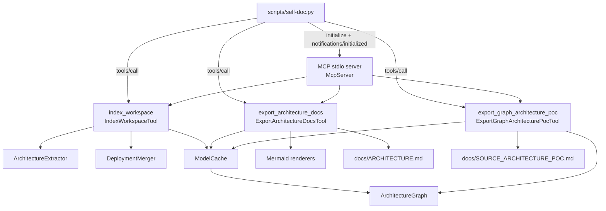
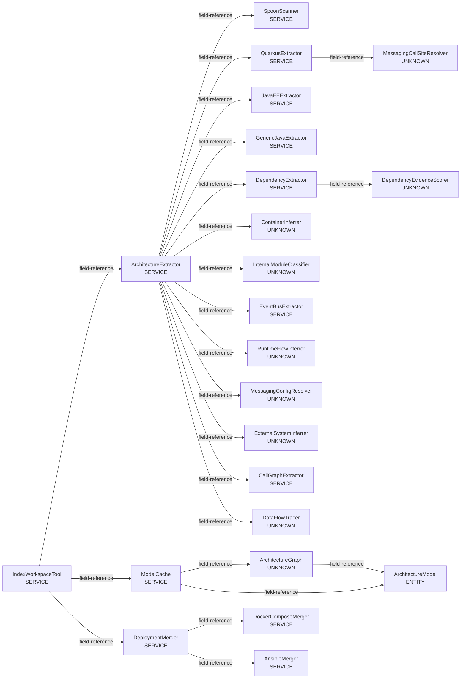
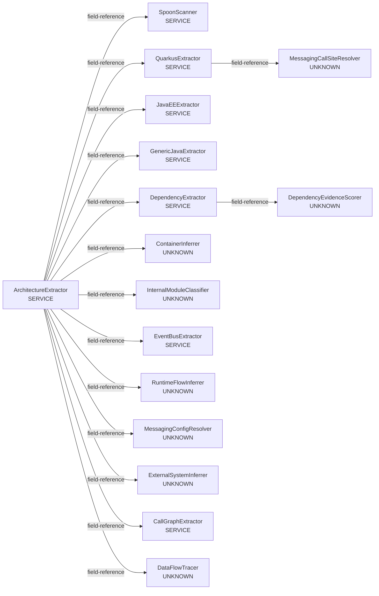
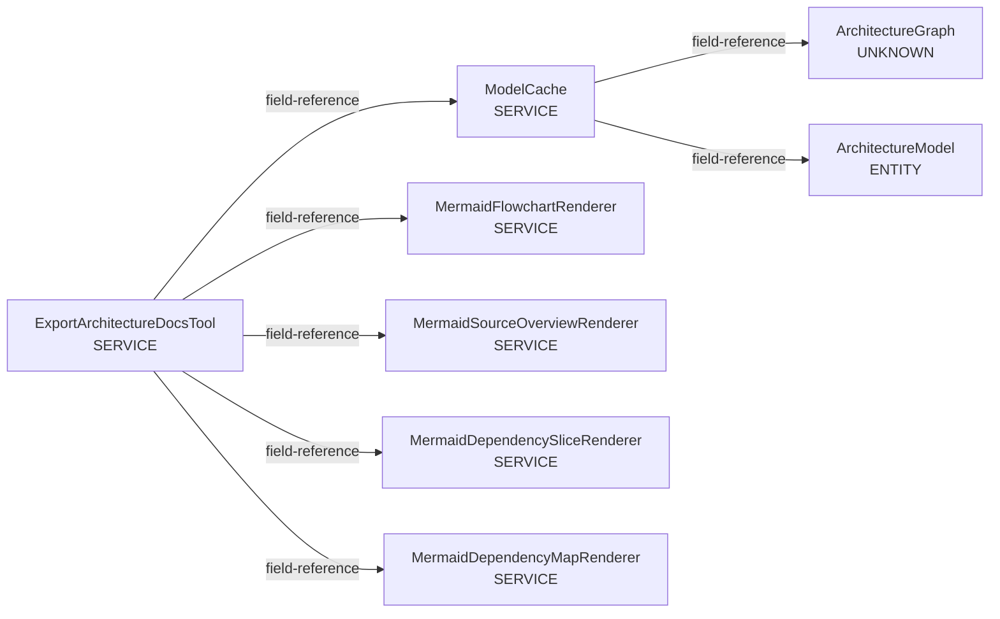
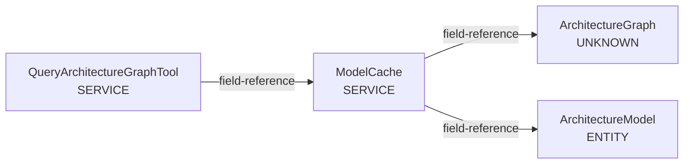
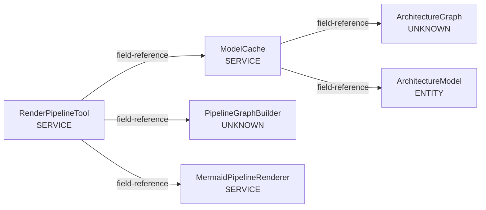

# Workflow Graphs

Generated by running this project's packaged MCP server against its own source tree.

## Index Summary

```text
Indexed 1 project(s).
Found 1 application(s), 77 component(s), 1 entrypoint(s), 0 interface(s), 1 runtime flow(s).

App: spoon-mcp-server [unknown, jar]
  Root: /home/dominik/spoon-mcp-server
  Components: 77
```

## Entrypoints

```text
Found 1 entrypoint(s):

- [MAIN_METHOD] main
  Component: comp:dev.dominikbreu.spoonmcp.Main
  Source: /home/dominik/spoon-mcp-server/src/main/java/dev/dominikbreu/spoonmcp/Main.java:16 [signature, confidence=1.0]
```

## Self-Documentation Workflow

Synthesized from the MCP-discovered tool and renderer components. This is the workflow used to generate the architecture docs from the server's own source tree.



## Runtime Entry Flow

What the MCP can infer from the executable entrypoint.


## Use Case Timeline

Timeline view of detected entrypoint execution.

```mermaid
gantt
    title Use Case Execution Order
    dateFormat  X
    axisFormat  step %s

    section main
```

## Server Dispatch Surface

The stdio server owns the tool registry and delegates calls to tool adapters.

```mermaid
flowchart LR
    comp_dev_dominikbreu_spoonmcp_mcp_McpServer["McpServer\nSERVICE"]
    comp_dev_dominikbreu_spoonmcp_mcp_tools_IndexWorkspaceTool["IndexWorkspaceTool\nSERVICE"]
    comp_dev_dominikbreu_spoonmcp_mcp_tools_ListAppsTool["ListAppsTool\nSERVICE"]
    comp_dev_dominikbreu_spoonmcp_mcp_tools_FindEntrypointsTool["FindEntrypointsTool\nSERVICE"]
    comp_dev_dominikbreu_spoonmcp_mcp_tools_FindComponentsTool["FindComponentsTool\nSERVICE"]
    comp_dev_dominikbreu_spoonmcp_mcp_tools_GetComponentDependenciesTool["GetComponentDependenciesTool\nSERVICE"]
    comp_dev_dominikbreu_spoonmcp_mcp_tools_InferContainersTool["InferContainersTool\nSERVICE"]
    comp_dev_dominikbreu_spoonmcp_mcp_tools_RenderMermaidFlowchartTool["RenderMermaidFlowchartTool\nSERVICE"]
    comp_dev_dominikbreu_spoonmcp_mcp_tools_GetRuntimeFlowTool["GetRuntimeFlowTool\nSERVICE"]
    comp_dev_dominikbreu_spoonmcp_mcp_tools_RenderCallFlowTool["RenderCallFlowTool\nSERVICE"]
    comp_dev_dominikbreu_spoonmcp_mcp_tools_ExplainArchitectureTool["ExplainArchitectureTool\nSERVICE"]
    comp_dev_dominikbreu_spoonmcp_mcp_tools_RenderSourceOverviewTool["RenderSourceOverviewTool\nSERVICE"]
    comp_dev_dominikbreu_spoonmcp_mcp_tools_RenderDependencyMapTool["RenderDependencyMapTool\nSERVICE"]
    comp_dev_dominikbreu_spoonmcp_mcp_tools_RenderComponentDependencyDiagramTool["RenderComponentDependencyDiagramTool\nSERVICE"]
    comp_dev_dominikbreu_spoonmcp_mcp_tools_ExportArchitectureDocsTool["ExportArchitectureDocsTool\nSERVICE"]
    comp_dev_dominikbreu_spoonmcp_mcp_tools_ExportGraphArchitecturePocTool["ExportGraphArchitecturePocTool\nSERVICE"]
    comp_dev_dominikbreu_spoonmcp_mcp_tools_QueryArchitectureGraphTool["QueryArchitectureGraphTool\nSERVICE"]
    comp_dev_dominikbreu_spoonmcp_mcp_tools_DetectUseCasesTool["DetectUseCasesTool\nSERVICE"]
    comp_dev_dominikbreu_spoonmcp_mcp_tools_TraceDataFlowTool["TraceDataFlowTool\nSERVICE"]
    comp_dev_dominikbreu_spoonmcp_mcp_tools_RenderUseCaseTimelineTool["RenderUseCaseTimelineTool\nSERVICE"]
    comp_dev_dominikbreu_spoonmcp_mcp_tools_RenderPipelineTool["RenderPipelineTool\nSERVICE"]
    comp_dev_dominikbreu_spoonmcp_mcp_McpServer -->|field-reference| comp_dev_dominikbreu_spoonmcp_mcp_tools_IndexWorkspaceTool
    comp_dev_dominikbreu_spoonmcp_mcp_McpServer -->|field-reference| comp_dev_dominikbreu_spoonmcp_mcp_tools_ListAppsTool
    comp_dev_dominikbreu_spoonmcp_mcp_McpServer -->|field-reference| comp_dev_dominikbreu_spoonmcp_mcp_tools_FindEntrypointsTool
    comp_dev_dominikbreu_spoonmcp_mcp_McpServer -->|field-reference| comp_dev_dominikbreu_spoonmcp_mcp_tools_FindComponentsTool
    comp_dev_dominikbreu_spoonmcp_mcp_McpServer -->|field-reference| comp_dev_dominikbreu_spoonmcp_mcp_tools_GetComponentDependenciesTool
    comp_dev_dominikbreu_spoonmcp_mcp_McpServer -->|field-reference| comp_dev_dominikbreu_spoonmcp_mcp_tools_InferContainersTool
    comp_dev_dominikbreu_spoonmcp_mcp_McpServer -->|field-reference| comp_dev_dominikbreu_spoonmcp_mcp_tools_RenderMermaidFlowchartTool
    comp_dev_dominikbreu_spoonmcp_mcp_McpServer -->|field-reference| comp_dev_dominikbreu_spoonmcp_mcp_tools_GetRuntimeFlowTool
    comp_dev_dominikbreu_spoonmcp_mcp_McpServer -->|field-reference| comp_dev_dominikbreu_spoonmcp_mcp_tools_RenderCallFlowTool
    comp_dev_dominikbreu_spoonmcp_mcp_McpServer -->|field-reference| comp_dev_dominikbreu_spoonmcp_mcp_tools_ExplainArchitectureTool
    comp_dev_dominikbreu_spoonmcp_mcp_McpServer -->|field-reference| comp_dev_dominikbreu_spoonmcp_mcp_tools_RenderSourceOverviewTool
    comp_dev_dominikbreu_spoonmcp_mcp_McpServer -->|field-reference| comp_dev_dominikbreu_spoonmcp_mcp_tools_RenderDependencyMapTool
    comp_dev_dominikbreu_spoonmcp_mcp_McpServer -->|field-reference| comp_dev_dominikbreu_spoonmcp_mcp_tools_RenderComponentDependencyDiagramTool
    comp_dev_dominikbreu_spoonmcp_mcp_McpServer -->|field-reference| comp_dev_dominikbreu_spoonmcp_mcp_tools_ExportArchitectureDocsTool
    comp_dev_dominikbreu_spoonmcp_mcp_McpServer -->|field-reference| comp_dev_dominikbreu_spoonmcp_mcp_tools_ExportGraphArchitecturePocTool
    comp_dev_dominikbreu_spoonmcp_mcp_McpServer -->|field-reference| comp_dev_dominikbreu_spoonmcp_mcp_tools_QueryArchitectureGraphTool
    comp_dev_dominikbreu_spoonmcp_mcp_McpServer -->|field-reference| comp_dev_dominikbreu_spoonmcp_mcp_tools_DetectUseCasesTool
    comp_dev_dominikbreu_spoonmcp_mcp_McpServer -->|field-reference| comp_dev_dominikbreu_spoonmcp_mcp_tools_TraceDataFlowTool
    comp_dev_dominikbreu_spoonmcp_mcp_McpServer -->|field-reference| comp_dev_dominikbreu_spoonmcp_mcp_tools_RenderUseCaseTimelineTool
    comp_dev_dominikbreu_spoonmcp_mcp_McpServer -->|field-reference| comp_dev_dominikbreu_spoonmcp_mcp_tools_RenderPipelineTool
```



## Index Workspace Workflow

The indexing tool coordinates source extraction, deployment metadata merge, and cache storage.



## Architecture Extraction Pipeline

The extractor fans out into framework, dependency, call graph, data-flow, runtime-flow, and container passes.



## Docs Export Workflow

The docs exporter reads the cached model and renders several Mermaid views.



## Graph Query Workflow

The graph query tool uses the cache-backed property graph projection.



## Pipeline Rendering Workflow

The pipeline renderer stitches data-flow paths through PipelineGraphBuilder and MermaidPipelineRenderer.



## End-To-End Pipeline Chains

This project is a stdio tool server, so it may not contain cross-entrypoint application pipelines. The MCP result is kept here because it is still a workflow signal.

```text
No pipeline chains: 0 data-flow path(s) present, 0 carry linkedPathIds. Either no path links to another (e.g. channel names unresolved or no consumer indexed for the produced channel), or store/messaging stitching in DataFlowTracer found no matching readers/consumers.
```
