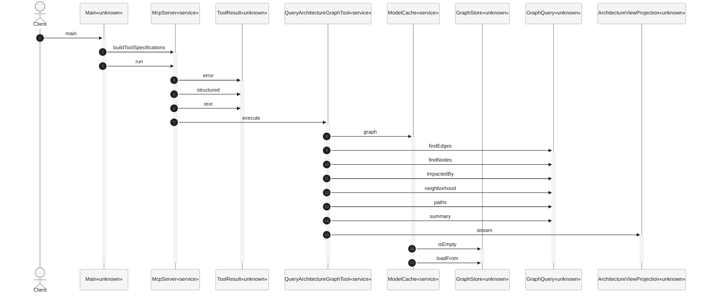
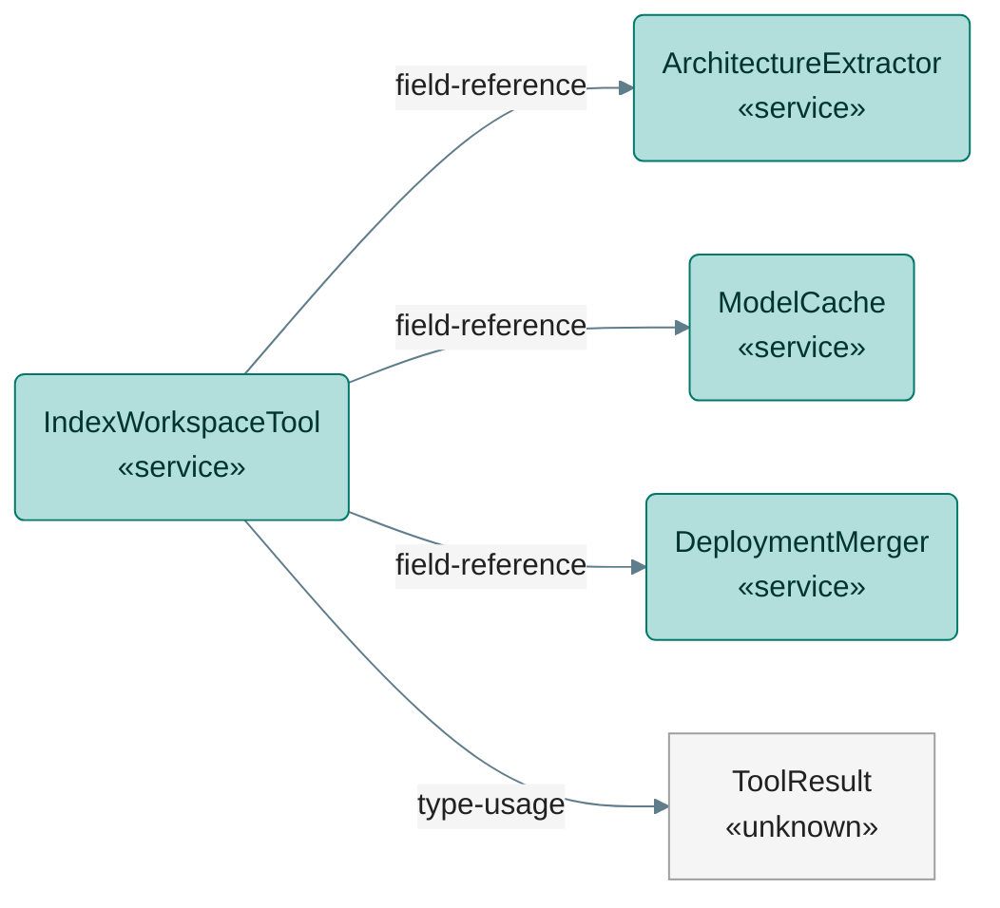
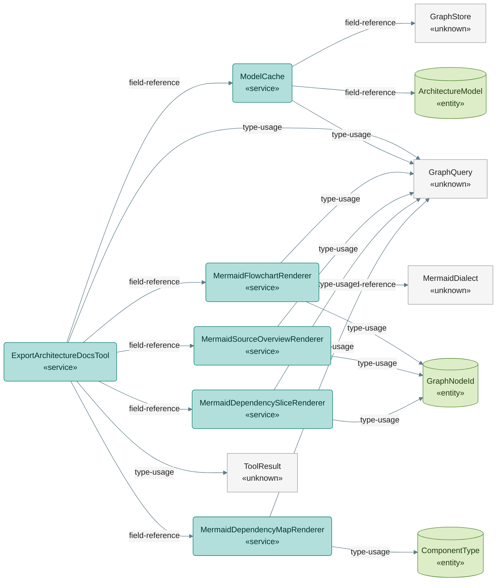
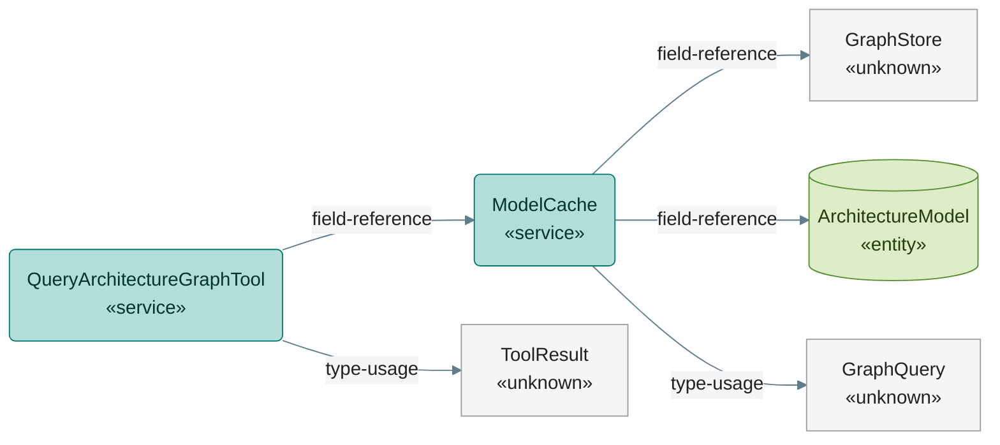
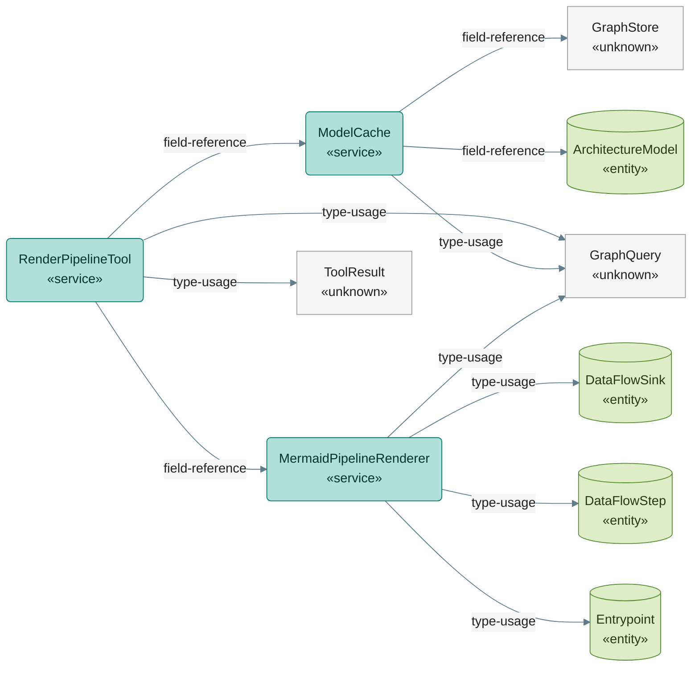

# Workflow Graphs

Generated by running this project's packaged MCP server against its own source tree.

**Regenerated 2026-08-16** against the current tree. Every code block below is verbatim tool
output — no figure in this file was typed by hand. To reproduce it, build the jar and replay the
calls named under each heading against `index_workspace { "paths": ["<repo root>"] }`.

ArchLens indexing itself is the most convenient end-to-end test of the tools: the server is a
plain Java application with a single `main` entrypoint, so the results show what the extractors
recover from ordinary code with no framework annotations to lean on.

## Index Summary

`index_workspace`

```text
Indexed 1 project(s).
Found 1 application(s), 220 component(s), 1 entrypoint(s), 0 interface(s), 1 runtime flow(s).

App: archlens [java, jar]
  Root: /home/dominik/archlens
  Components: 220
```

## Graph Coverage

`query_architecture_graph { "action": "summary" }`

```text
Architecture graph
Nodes: 244
Node labels:
- Component: 220
- RuntimeFlowStep: 9
- Container: 10
- RuntimeFlow: 1
- DataSource: 1
- Entrypoint: 1
- ExternalSystem: 1
- Application: 1
Edges: 4161
Edge labels:
- OWNS: 220
- STARTS_AT: 1
- CONTAINS: 220
- CONNECTS_TO: 1
- DEPENDS_ON: 583
- CALLS: 2482
- READS_STATE: 542
- WRITES_STATE: 13
- STATE_HANDOFF: 61
- STARTED_BY: 1
- HAS_STEP: 9
- VISITS: 9
- FLOW_CALLS: 19
```

## Entrypoints

`find_entrypoints`

```text
Found 1 entrypoint(s):

- [MAIN_METHOD] main
  ID: dev.dominikbreu.archlens.Main#main
  Component: dev.dominikbreu.archlens.Main
  Source: /home/dominik/archlens/src/main/java/dev/dominikbreu/archlens/Main.java:20 [signature, confidence=1.0]
```

One entrypoint is expected: the server is a stdio process, not a web application. Everything
below is reached from this single `main`.

## Runtime Entry Flow

`call_flow { "entrypointName": "main" }`

What the extractors infer from the executable entrypoint. Earlier snapshots of this page showed
`no flow steps found` here — the call-graph passes added since then now resolve the chain from
`Main` through the server into the tool layer and down to the graph cache.


```mermaid
%%{init: {"theme": "base", "themeVariables": {"primaryColor": "#f5f5f5", "primaryBorderColor": "#9e9e9e", "primaryTextColor": "#212121", "lineColor": "#607d8b", "clusterBkg": "#fafafa", "clusterBorder": "#b0bec5"}}}%%
sequenceDiagram
    autonumber
    actor Client
    participant Main as Main«unknown»
    participant McpServer as McpServer«service»
    participant ToolResult as ToolResult«unknown»
    participant QueryArchitectureGraphTool as QueryArchitectureGraphTool«service»
    participant ModelCache as ModelCache«service»
    participant GraphStore as GraphStore«unknown»
    participant GraphQuery as GraphQuery«unknown»
    participant ArchitectureViewProjection as ArchitectureViewProjection«unknown»
    Client->>+Main: main
    Main->>+McpServer: buildToolSpecifications
    Main->>McpServer: run
    McpServer->>+ToolResult: error
    McpServer->>ToolResult: structured
    McpServer->>ToolResult: text
    McpServer->>+QueryArchitectureGraphTool: execute
    QueryArchitectureGraphTool->>+ModelCache: graph
    QueryArchitectureGraphTool->>+GraphQuery: findEdges
    QueryArchitectureGraphTool->>GraphQuery: findNodes
    QueryArchitectureGraphTool->>GraphQuery: impactedBy
    QueryArchitectureGraphTool->>GraphQuery: neighborhood
    QueryArchitectureGraphTool->>GraphQuery: paths
    QueryArchitectureGraphTool->>GraphQuery: summary
    QueryArchitectureGraphTool->>+ArchitectureViewProjection: stream
    ModelCache->>+GraphStore: isEmpty
    ModelCache->>GraphStore: loadFrom
    deactivate GraphStore
    deactivate ArchitectureViewProjection
    deactivate GraphQuery
    deactivate ModelCache
    deactivate QueryArchitectureGraphTool
    deactivate ToolResult
    deactivate McpServer
    deactivate Main
```

Message order is not temporal: messages are sorted by caller position, then callee, then label.
Read this as "who calls whom", not as a trace.

## Use Case Timeline

`render_use_case_timeline { "maxDepth": 8 }`


```mermaid
%%{init: {"theme": "base", "themeVariables": {"primaryColor": "#f5f5f5", "primaryBorderColor": "#9e9e9e", "primaryTextColor": "#212121", "lineColor": "#607d8b", "clusterBkg": "#fafafa", "clusterBorder": "#b0bec5"}}}%%
gantt
    title Use Case Execution Order
    dateFormat  X
    axisFormat  step %s
    tickInterval 1second

    section main
    Main.main_method                    :active, 0, 1
    McpServer.buildToolSpecifications   :1, 2
    ToolResult.text                     :2, 3
    QueryArchitectureGraphTool.execute  :3, 4
    ModelCache.graph                    :4, 5
    GraphStore.isEmpty                  :5, 6
    GraphQuery.summary                  :6, 7
    GraphNodeId.containsKey             :7, 8
    ... (1 more steps) :crit, 8, 9
```

Each task spans `[step, step + 1]`; the axis compares call depth, not time. With one entrypoint
there is one section, so this view is more useful on an application with many entry points.

## Server Dispatch Surface

`render_component_dependency_diagram { "name": "McpServer", "depth": 1 }`

The stdio server owns the tool registry and delegates each call to a tool adapter.


```mermaid
%%{init: {"theme": "base", "themeVariables": {"primaryColor": "#f5f5f5", "primaryBorderColor": "#9e9e9e", "primaryTextColor": "#212121", "lineColor": "#607d8b", "clusterBkg": "#fafafa", "clusterBorder": "#b0bec5"}}}%%
flowchart LR
    dev_dominikbreu_archlens_mcp_McpServer("McpServer\n«service»")
    dev_dominikbreu_archlens_mcp_tools_IndexWorkspaceTool("IndexWorkspaceTool\n«service»")
    dev_dominikbreu_archlens_mcp_tools_ListAppsTool("ListAppsTool\n«service»")
    dev_dominikbreu_archlens_mcp_tools_FindEntrypointsTool("FindEntrypointsTool\n«service»")
    dev_dominikbreu_archlens_mcp_tools_FindComponentsTool("FindComponentsTool\n«service»")
    dev_dominikbreu_archlens_mcp_tools_GetComponentDependenciesTool("GetComponentDependenciesTool\n«service»")
    dev_dominikbreu_archlens_mcp_tools_InferContainersTool("InferContainersTool\n«service»")
    dev_dominikbreu_archlens_mcp_tools_RenderMermaidFlowchartTool("RenderMermaidFlowchartTool\n«service»")
    dev_dominikbreu_archlens_mcp_tools_CallFlowTool("CallFlowTool\n«service»")
    dev_dominikbreu_archlens_mcp_tools_RenderSourceOverviewTool("RenderSourceOverviewTool\n«service»")
    dev_dominikbreu_archlens_mcp_tools_RenderDependencyMapTool("RenderDependencyMapTool\n«service»")
    dev_dominikbreu_archlens_mcp_tools_RenderComponentDependencyDiagramTool("RenderComponentDependencyDiagramTool\n«service»")
    dev_dominikbreu_archlens_mcp_tools_ExportArchitectureDocsTool("ExportArchitectureDocsTool\n«service»")
    dev_dominikbreu_archlens_mcp_tools_ExportGraphArchitecturePocTool("ExportGraphArchitecturePocTool\n«service»")
    dev_dominikbreu_archlens_mcp_tools_ExportGraphDataTool("ExportGraphDataTool\n«service»")
    dev_dominikbreu_archlens_mcp_tools_ExportGraphViewerTool("ExportGraphViewerTool\n«service»")
    dev_dominikbreu_archlens_mcp_tools_QueryArchitectureGraphTool("QueryArchitectureGraphTool\n«service»")
    dev_dominikbreu_archlens_mcp_tools_AnswerArchitectureQuestionTool("AnswerArchitectureQuestionTool\n«service»")
    dev_dominikbreu_archlens_mcp_tools_CompileArchitectureQuestionToOkfTool("CompileArchitectureQuestionToOkfTool\n«service»")
    dev_dominikbreu_archlens_mcp_tools_DetectUseCasesTool("DetectUseCasesTool\n«service»")
    dev_dominikbreu_archlens_mcp_tools_TraceDataFlowTool("TraceDataFlowTool\n«service»")
    dev_dominikbreu_archlens_mcp_tools_RenderUseCaseTimelineTool("RenderUseCaseTimelineTool\n«service»")
    dev_dominikbreu_archlens_mcp_tools_RenderPipelineTool("RenderPipelineTool\n«service»")
    dev_dominikbreu_archlens_mcp_tools_RenderArchitectureViewTool("RenderArchitectureViewTool\n«service»")
    dev_dominikbreu_archlens_mcp_tools_ExportLikeC4ModelTool("ExportLikeC4ModelTool\n«service»")
    dev_dominikbreu_archlens_mcp_StructuredOutputMode["StructuredOutputMode\n«unknown»"]
    dev_dominikbreu_archlens_mcp_tools_ToolResult["ToolResult\n«unknown»"]
    dev_dominikbreu_archlens_mcp_McpServer -->|field-reference| dev_dominikbreu_archlens_mcp_tools_IndexWorkspaceTool
    dev_dominikbreu_archlens_mcp_McpServer -->|field-reference| dev_dominikbreu_archlens_mcp_tools_ListAppsTool
    dev_dominikbreu_archlens_mcp_McpServer -->|field-reference| dev_dominikbreu_archlens_mcp_tools_FindEntrypointsTool
    dev_dominikbreu_archlens_mcp_McpServer -->|field-reference| dev_dominikbreu_archlens_mcp_tools_FindComponentsTool
    dev_dominikbreu_archlens_mcp_McpServer -->|field-reference| dev_dominikbreu_archlens_mcp_tools_GetComponentDependenciesTool
    dev_dominikbreu_archlens_mcp_McpServer -->|field-reference| dev_dominikbreu_archlens_mcp_tools_InferContainersTool
    dev_dominikbreu_archlens_mcp_McpServer -->|field-reference| dev_dominikbreu_archlens_mcp_tools_RenderMermaidFlowchartTool
    dev_dominikbreu_archlens_mcp_McpServer -->|field-reference| dev_dominikbreu_archlens_mcp_tools_CallFlowTool
    dev_dominikbreu_archlens_mcp_McpServer -->|field-reference| dev_dominikbreu_archlens_mcp_tools_RenderSourceOverviewTool
    dev_dominikbreu_archlens_mcp_McpServer -->|field-reference| dev_dominikbreu_archlens_mcp_tools_RenderDependencyMapTool
    dev_dominikbreu_archlens_mcp_McpServer -->|field-reference| dev_dominikbreu_archlens_mcp_tools_RenderComponentDependencyDiagramTool
    dev_dominikbreu_archlens_mcp_McpServer -->|field-reference| dev_dominikbreu_archlens_mcp_tools_ExportArchitectureDocsTool
    dev_dominikbreu_archlens_mcp_McpServer -->|field-reference| dev_dominikbreu_archlens_mcp_tools_ExportGraphArchitecturePocTool
    dev_dominikbreu_archlens_mcp_McpServer -->|field-reference| dev_dominikbreu_archlens_mcp_tools_ExportGraphDataTool
    dev_dominikbreu_archlens_mcp_McpServer -->|field-reference| dev_dominikbreu_archlens_mcp_tools_ExportGraphViewerTool
    dev_dominikbreu_archlens_mcp_McpServer -->|field-reference| dev_dominikbreu_archlens_mcp_tools_QueryArchitectureGraphTool
    dev_dominikbreu_archlens_mcp_McpServer -->|field-reference| dev_dominikbreu_archlens_mcp_tools_AnswerArchitectureQuestionTool
    dev_dominikbreu_archlens_mcp_McpServer -->|field-reference| dev_dominikbreu_archlens_mcp_tools_CompileArchitectureQuestionToOkfTool
    dev_dominikbreu_archlens_mcp_McpServer -->|field-reference| dev_dominikbreu_archlens_mcp_tools_DetectUseCasesTool
    dev_dominikbreu_archlens_mcp_McpServer -->|field-reference| dev_dominikbreu_archlens_mcp_tools_TraceDataFlowTool
    dev_dominikbreu_archlens_mcp_McpServer -->|field-reference| dev_dominikbreu_archlens_mcp_tools_RenderUseCaseTimelineTool
    dev_dominikbreu_archlens_mcp_McpServer -->|field-reference| dev_dominikbreu_archlens_mcp_tools_RenderPipelineTool
    dev_dominikbreu_archlens_mcp_McpServer -->|field-reference| dev_dominikbreu_archlens_mcp_tools_RenderArchitectureViewTool
    dev_dominikbreu_archlens_mcp_McpServer -->|field-reference| dev_dominikbreu_archlens_mcp_tools_ExportLikeC4ModelTool
    dev_dominikbreu_archlens_mcp_McpServer -->|field-reference| dev_dominikbreu_archlens_mcp_StructuredOutputMode
    dev_dominikbreu_archlens_mcp_McpServer -->|type-usage| dev_dominikbreu_archlens_mcp_tools_ToolResult
    classDef service fill:#b2dfdb,stroke:#00796b,color:#00352f
    classDef component fill:#f5f5f5,stroke:#9e9e9e,color:#212121
    class dev_dominikbreu_archlens_mcp_McpServer service
    class dev_dominikbreu_archlens_mcp_tools_IndexWorkspaceTool service
    class dev_dominikbreu_archlens_mcp_tools_ListAppsTool service
    class dev_dominikbreu_archlens_mcp_tools_FindEntrypointsTool service
    class dev_dominikbreu_archlens_mcp_tools_FindComponentsTool service
    class dev_dominikbreu_archlens_mcp_tools_GetComponentDependenciesTool service
    class dev_dominikbreu_archlens_mcp_tools_InferContainersTool service
    class dev_dominikbreu_archlens_mcp_tools_RenderMermaidFlowchartTool service
    class dev_dominikbreu_archlens_mcp_tools_CallFlowTool service
    class dev_dominikbreu_archlens_mcp_tools_RenderSourceOverviewTool service
    class dev_dominikbreu_archlens_mcp_tools_RenderDependencyMapTool service
    class dev_dominikbreu_archlens_mcp_tools_RenderComponentDependencyDiagramTool service
    class dev_dominikbreu_archlens_mcp_tools_ExportArchitectureDocsTool service
    class dev_dominikbreu_archlens_mcp_tools_ExportGraphArchitecturePocTool service
    class dev_dominikbreu_archlens_mcp_tools_ExportGraphDataTool service
    class dev_dominikbreu_archlens_mcp_tools_ExportGraphViewerTool service
    class dev_dominikbreu_archlens_mcp_tools_QueryArchitectureGraphTool service
    class dev_dominikbreu_archlens_mcp_tools_AnswerArchitectureQuestionTool service
    class dev_dominikbreu_archlens_mcp_tools_CompileArchitectureQuestionToOkfTool service
    class dev_dominikbreu_archlens_mcp_tools_DetectUseCasesTool service
    class dev_dominikbreu_archlens_mcp_tools_TraceDataFlowTool service
    class dev_dominikbreu_archlens_mcp_tools_RenderUseCaseTimelineTool service
    class dev_dominikbreu_archlens_mcp_tools_RenderPipelineTool service
    class dev_dominikbreu_archlens_mcp_tools_RenderArchitectureViewTool service
    class dev_dominikbreu_archlens_mcp_tools_ExportLikeC4ModelTool service
    class dev_dominikbreu_archlens_mcp_StructuredOutputMode component
    class dev_dominikbreu_archlens_mcp_tools_ToolResult component
```

## Index Workspace Workflow

`render_component_dependency_diagram { "name": "IndexWorkspaceTool", "depth": 1 }`


```mermaid
%%{init: {"theme": "base", "themeVariables": {"primaryColor": "#f5f5f5", "primaryBorderColor": "#9e9e9e", "primaryTextColor": "#212121", "lineColor": "#607d8b", "clusterBkg": "#fafafa", "clusterBorder": "#b0bec5"}}}%%
flowchart LR
    dev_dominikbreu_archlens_mcp_tools_IndexWorkspaceTool("IndexWorkspaceTool\n«service»")
    dev_dominikbreu_archlens_extractor_ArchitectureExtractor("ArchitectureExtractor\n«service»")
    dev_dominikbreu_archlens_cache_ModelCache("ModelCache\n«service»")
    dev_dominikbreu_archlens_merger_DeploymentMerger("DeploymentMerger\n«service»")
    dev_dominikbreu_archlens_mcp_tools_ToolResult["ToolResult\n«unknown»"]
    dev_dominikbreu_archlens_mcp_tools_IndexWorkspaceTool -->|field-reference| dev_dominikbreu_archlens_extractor_ArchitectureExtractor
    dev_dominikbreu_archlens_mcp_tools_IndexWorkspaceTool -->|field-reference| dev_dominikbreu_archlens_cache_ModelCache
    dev_dominikbreu_archlens_mcp_tools_IndexWorkspaceTool -->|field-reference| dev_dominikbreu_archlens_merger_DeploymentMerger
    dev_dominikbreu_archlens_mcp_tools_IndexWorkspaceTool -->|type-usage| dev_dominikbreu_archlens_mcp_tools_ToolResult
    classDef service fill:#b2dfdb,stroke:#00796b,color:#00352f
    classDef component fill:#f5f5f5,stroke:#9e9e9e,color:#212121
    class dev_dominikbreu_archlens_mcp_tools_IndexWorkspaceTool service
    class dev_dominikbreu_archlens_extractor_ArchitectureExtractor service
    class dev_dominikbreu_archlens_cache_ModelCache service
    class dev_dominikbreu_archlens_merger_DeploymentMerger service
    class dev_dominikbreu_archlens_mcp_tools_ToolResult component
```

## Architecture Extraction Pipeline

`render_component_dependency_diagram { "name": "ArchitectureExtractor", "depth": 1 }`

The extractor coordinates the scanner, the per-framework extractors, and the enrichment passes.


```mermaid
%%{init: {"theme": "base", "themeVariables": {"primaryColor": "#f5f5f5", "primaryBorderColor": "#9e9e9e", "primaryTextColor": "#212121", "lineColor": "#607d8b", "clusterBkg": "#fafafa", "clusterBorder": "#b0bec5"}}}%%
flowchart LR
    dev_dominikbreu_archlens_extractor_ArchitectureExtractor("ArchitectureExtractor\n«service»")
    dev_dominikbreu_archlens_scanner_SpoonScanner("SpoonScanner\n«service»")
    dev_dominikbreu_archlens_extractor_QuarkusExtractor("QuarkusExtractor\n«service»")
    dev_dominikbreu_archlens_extractor_JavaEEExtractor("JavaEEExtractor\n«service»")
    dev_dominikbreu_archlens_extractor_GenericJavaExtractor("GenericJavaExtractor\n«service»")
    dev_dominikbreu_archlens_extractor_DependencyExtractor("DependencyExtractor\n«service»")
    dev_dominikbreu_archlens_extractor_ContainerInferrer["ContainerInferrer\n«unknown»"]
    dev_dominikbreu_archlens_extractor_InternalModuleClassifier["InternalModuleClassifier\n«unknown»"]
    dev_dominikbreu_archlens_extractor_EventBusExtractor("EventBusExtractor\n«service»")
    dev_dominikbreu_archlens_extractor_RuntimeFlowInferrer["RuntimeFlowInferrer\n«unknown»"]
    dev_dominikbreu_archlens_extractor_MessagingConfigResolver["MessagingConfigResolver\n«unknown»"]
    dev_dominikbreu_archlens_extractor_ExternalSystemInferrer["ExternalSystemInferrer\n«unknown»"]
    dev_dominikbreu_archlens_extractor_DataFlowTracer["DataFlowTracer\n«unknown»"]
    dev_dominikbreu_archlens_build_BuildMetadataService["BuildMetadataService\n«unknown»"]
    dev_dominikbreu_archlens_extractor_sourcefacts_SourceFactIndexBuilder["SourceFactIndexBuilder\n«unknown»"]
    dev_dominikbreu_archlens_extractor_PersistenceTopologyExtractor("PersistenceTopologyExtractor\n«service»")
    dev_dominikbreu_archlens_extractor_ConfigPropertyResolver["ConfigPropertyResolver\n«unknown»"]
    dev_dominikbreu_archlens_extractor_TransactionPolicyExtractor("TransactionPolicyExtractor\n«service»")
    dev_dominikbreu_archlens_model_ArchitectureModel[("ArchitectureModel\n«entity»")]
    dev_dominikbreu_archlens_model_ids_AppId[("AppId\n«entity»")]
    dev_dominikbreu_archlens_model_Entrypoint[("Entrypoint\n«entity»")]
    dev_dominikbreu_archlens_model_InterfaceEntry[("InterfaceEntry\n«entity»")]
    dev_dominikbreu_archlens_model_AppEntry[("AppEntry\n«entity»")]
    dev_dominikbreu_archlens_build_BuildModule["BuildModule\n«unknown»"]
    dev_dominikbreu_archlens_build_BuildProject["BuildProject\n«unknown»"]
    dev_dominikbreu_archlens_model_ids_ComponentId[("ComponentId\n«entity»")]
    dev_dominikbreu_archlens_extractor_ModelIndex["ModelIndex\n«unknown»"]
    dev_dominikbreu_archlens_extractor_ArchitectureExtractor -->|field-reference| dev_dominikbreu_archlens_scanner_SpoonScanner
    dev_dominikbreu_archlens_extractor_ArchitectureExtractor -->|field-reference| dev_dominikbreu_archlens_extractor_QuarkusExtractor
    dev_dominikbreu_archlens_extractor_ArchitectureExtractor -->|field-reference| dev_dominikbreu_archlens_extractor_JavaEEExtractor
    dev_dominikbreu_archlens_extractor_ArchitectureExtractor -->|field-reference| dev_dominikbreu_archlens_extractor_GenericJavaExtractor
    dev_dominikbreu_archlens_extractor_ArchitectureExtractor -->|field-reference| dev_dominikbreu_archlens_extractor_DependencyExtractor
    dev_dominikbreu_archlens_extractor_ArchitectureExtractor -->|field-reference| dev_dominikbreu_archlens_extractor_ContainerInferrer
    dev_dominikbreu_archlens_extractor_ArchitectureExtractor -->|field-reference| dev_dominikbreu_archlens_extractor_InternalModuleClassifier
    dev_dominikbreu_archlens_extractor_ArchitectureExtractor -->|field-reference| dev_dominikbreu_archlens_extractor_EventBusExtractor
    dev_dominikbreu_archlens_extractor_ArchitectureExtractor -->|field-reference| dev_dominikbreu_archlens_extractor_RuntimeFlowInferrer
    dev_dominikbreu_archlens_extractor_ArchitectureExtractor -->|field-reference| dev_dominikbreu_archlens_extractor_MessagingConfigResolver
    dev_dominikbreu_archlens_extractor_ArchitectureExtractor -->|field-reference| dev_dominikbreu_archlens_extractor_ExternalSystemInferrer
    dev_dominikbreu_archlens_extractor_ArchitectureExtractor -->|field-reference| dev_dominikbreu_archlens_extractor_DataFlowTracer
    dev_dominikbreu_archlens_extractor_ArchitectureExtractor -->|field-reference| dev_dominikbreu_archlens_build_BuildMetadataService
    dev_dominikbreu_archlens_extractor_ArchitectureExtractor -->|field-reference| dev_dominikbreu_archlens_extractor_sourcefacts_SourceFactIndexBuilder
    dev_dominikbreu_archlens_extractor_ArchitectureExtractor -->|field-reference| dev_dominikbreu_archlens_extractor_PersistenceTopologyExtractor
    dev_dominikbreu_archlens_extractor_ArchitectureExtractor -->|field-reference| dev_dominikbreu_archlens_extractor_ConfigPropertyResolver
    dev_dominikbreu_archlens_extractor_ArchitectureExtractor -->|field-reference| dev_dominikbreu_archlens_extractor_TransactionPolicyExtractor
    dev_dominikbreu_archlens_extractor_ArchitectureExtractor -->|type-usage| dev_dominikbreu_archlens_model_ArchitectureModel
    dev_dominikbreu_archlens_extractor_ArchitectureExtractor -->|type-usage| dev_dominikbreu_archlens_model_ids_AppId
    dev_dominikbreu_archlens_extractor_ArchitectureExtractor -->|type-usage| dev_dominikbreu_archlens_model_Entrypoint
    dev_dominikbreu_archlens_extractor_ArchitectureExtractor -->|type-usage| dev_dominikbreu_archlens_model_InterfaceEntry
    dev_dominikbreu_archlens_extractor_ArchitectureExtractor -->|type-usage| dev_dominikbreu_archlens_model_AppEntry
    dev_dominikbreu_archlens_extractor_ArchitectureExtractor -->|type-usage| dev_dominikbreu_archlens_build_BuildModule
    dev_dominikbreu_archlens_extractor_ArchitectureExtractor -->|type-usage| dev_dominikbreu_archlens_build_BuildProject
    dev_dominikbreu_archlens_extractor_ArchitectureExtractor -->|type-usage| dev_dominikbreu_archlens_model_ids_ComponentId
    dev_dominikbreu_archlens_extractor_ArchitectureExtractor -->|type-usage| dev_dominikbreu_archlens_extractor_ModelIndex
    classDef service fill:#b2dfdb,stroke:#00796b,color:#00352f
    classDef entity fill:#dcedc8,stroke:#558b2f,color:#243c10
    classDef component fill:#f5f5f5,stroke:#9e9e9e,color:#212121
    class dev_dominikbreu_archlens_extractor_ArchitectureExtractor service
    class dev_dominikbreu_archlens_scanner_SpoonScanner service
    class dev_dominikbreu_archlens_extractor_QuarkusExtractor service
    class dev_dominikbreu_archlens_extractor_JavaEEExtractor service
    class dev_dominikbreu_archlens_extractor_GenericJavaExtractor service
    class dev_dominikbreu_archlens_extractor_DependencyExtractor service
    class dev_dominikbreu_archlens_extractor_ContainerInferrer component
    class dev_dominikbreu_archlens_extractor_InternalModuleClassifier component
    class dev_dominikbreu_archlens_extractor_EventBusExtractor service
    class dev_dominikbreu_archlens_extractor_RuntimeFlowInferrer component
    class dev_dominikbreu_archlens_extractor_MessagingConfigResolver component
    class dev_dominikbreu_archlens_extractor_ExternalSystemInferrer component
    class dev_dominikbreu_archlens_extractor_DataFlowTracer component
    class dev_dominikbreu_archlens_build_BuildMetadataService component
    class dev_dominikbreu_archlens_extractor_sourcefacts_SourceFactIndexBuilder component
    class dev_dominikbreu_archlens_extractor_PersistenceTopologyExtractor service
    class dev_dominikbreu_archlens_extractor_ConfigPropertyResolver component
    class dev_dominikbreu_archlens_extractor_TransactionPolicyExtractor service
    class dev_dominikbreu_archlens_model_ArchitectureModel entity
    class dev_dominikbreu_archlens_model_ids_AppId entity
    class dev_dominikbreu_archlens_model_Entrypoint entity
    class dev_dominikbreu_archlens_model_InterfaceEntry entity
    class dev_dominikbreu_archlens_model_AppEntry entity
    class dev_dominikbreu_archlens_build_BuildModule component
    class dev_dominikbreu_archlens_build_BuildProject component
    class dev_dominikbreu_archlens_model_ids_ComponentId entity
    class dev_dominikbreu_archlens_extractor_ModelIndex component
```

## Docs Export Workflow

`render_component_dependency_diagram { "name": "ExportArchitectureDocsTool", "depth": 2 }`


```mermaid
%%{init: {"theme": "base", "themeVariables": {"primaryColor": "#f5f5f5", "primaryBorderColor": "#9e9e9e", "primaryTextColor": "#212121", "lineColor": "#607d8b", "clusterBkg": "#fafafa", "clusterBorder": "#b0bec5"}}}%%
flowchart LR
    dev_dominikbreu_archlens_mcp_tools_ExportArchitectureDocsTool("ExportArchitectureDocsTool\n«service»")
    dev_dominikbreu_archlens_cache_ModelCache("ModelCache\n«service»")
    dev_dominikbreu_archlens_renderer_MermaidFlowchartRenderer("MermaidFlowchartRenderer\n«service»")
    dev_dominikbreu_archlens_renderer_MermaidSourceOverviewRenderer("MermaidSourceOverviewRenderer\n«service»")
    dev_dominikbreu_archlens_renderer_MermaidDependencySliceRenderer("MermaidDependencySliceRenderer\n«service»")
    dev_dominikbreu_archlens_renderer_MermaidDependencyMapRenderer("MermaidDependencyMapRenderer\n«service»")
    dev_dominikbreu_archlens_mcp_tools_ToolResult["ToolResult\n«unknown»"]
    dev_dominikbreu_archlens_cache_GraphQuery["GraphQuery\n«unknown»"]
    dev_dominikbreu_archlens_cache_GraphStore["GraphStore\n«unknown»"]
    dev_dominikbreu_archlens_model_ArchitectureModel[("ArchitectureModel\n«entity»")]
    dev_dominikbreu_archlens_renderer_MermaidDialect["MermaidDialect\n«unknown»"]
    dev_dominikbreu_archlens_model_ids_GraphNodeId[("GraphNodeId\n«entity»")]
    dev_dominikbreu_archlens_model_ComponentType[("ComponentType\n«entity»")]
    dev_dominikbreu_archlens_mcp_tools_ExportArchitectureDocsTool -->|field-reference| dev_dominikbreu_archlens_cache_ModelCache
    dev_dominikbreu_archlens_mcp_tools_ExportArchitectureDocsTool -->|field-reference| dev_dominikbreu_archlens_renderer_MermaidFlowchartRenderer
    dev_dominikbreu_archlens_mcp_tools_ExportArchitectureDocsTool -->|field-reference| dev_dominikbreu_archlens_renderer_MermaidSourceOverviewRenderer
    dev_dominikbreu_archlens_mcp_tools_ExportArchitectureDocsTool -->|field-reference| dev_dominikbreu_archlens_renderer_MermaidDependencySliceRenderer
    dev_dominikbreu_archlens_mcp_tools_ExportArchitectureDocsTool -->|field-reference| dev_dominikbreu_archlens_renderer_MermaidDependencyMapRenderer
    dev_dominikbreu_archlens_mcp_tools_ExportArchitectureDocsTool -->|type-usage| dev_dominikbreu_archlens_mcp_tools_ToolResult
    dev_dominikbreu_archlens_mcp_tools_ExportArchitectureDocsTool -->|type-usage| dev_dominikbreu_archlens_cache_GraphQuery
    dev_dominikbreu_archlens_cache_ModelCache -->|field-reference| dev_dominikbreu_archlens_cache_GraphStore
    dev_dominikbreu_archlens_cache_ModelCache -->|field-reference| dev_dominikbreu_archlens_model_ArchitectureModel
    dev_dominikbreu_archlens_cache_ModelCache -->|type-usage| dev_dominikbreu_archlens_cache_GraphQuery
    dev_dominikbreu_archlens_renderer_MermaidFlowchartRenderer -->|field-reference| dev_dominikbreu_archlens_renderer_MermaidDialect
    dev_dominikbreu_archlens_renderer_MermaidFlowchartRenderer -->|type-usage| dev_dominikbreu_archlens_cache_GraphQuery
    dev_dominikbreu_archlens_renderer_MermaidFlowchartRenderer -->|type-usage| dev_dominikbreu_archlens_model_ids_GraphNodeId
    dev_dominikbreu_archlens_renderer_MermaidSourceOverviewRenderer -->|type-usage| dev_dominikbreu_archlens_cache_GraphQuery
    dev_dominikbreu_archlens_renderer_MermaidSourceOverviewRenderer -->|type-usage| dev_dominikbreu_archlens_model_ids_GraphNodeId
    dev_dominikbreu_archlens_renderer_MermaidDependencySliceRenderer -->|type-usage| dev_dominikbreu_archlens_model_ids_GraphNodeId
    dev_dominikbreu_archlens_renderer_MermaidDependencySliceRenderer -->|type-usage| dev_dominikbreu_archlens_cache_GraphQuery
    dev_dominikbreu_archlens_renderer_MermaidDependencyMapRenderer -->|type-usage| dev_dominikbreu_archlens_model_ComponentType
    dev_dominikbreu_archlens_renderer_MermaidDependencyMapRenderer -->|type-usage| dev_dominikbreu_archlens_cache_GraphQuery
    classDef service fill:#b2dfdb,stroke:#00796b,color:#00352f
    classDef entity fill:#dcedc8,stroke:#558b2f,color:#243c10
    classDef component fill:#f5f5f5,stroke:#9e9e9e,color:#212121
    class dev_dominikbreu_archlens_mcp_tools_ExportArchitectureDocsTool service
    class dev_dominikbreu_archlens_cache_ModelCache service
    class dev_dominikbreu_archlens_renderer_MermaidFlowchartRenderer service
    class dev_dominikbreu_archlens_renderer_MermaidSourceOverviewRenderer service
    class dev_dominikbreu_archlens_renderer_MermaidDependencySliceRenderer service
    class dev_dominikbreu_archlens_renderer_MermaidDependencyMapRenderer service
    class dev_dominikbreu_archlens_mcp_tools_ToolResult component
    class dev_dominikbreu_archlens_cache_GraphQuery component
    class dev_dominikbreu_archlens_cache_GraphStore component
    class dev_dominikbreu_archlens_model_ArchitectureModel entity
    class dev_dominikbreu_archlens_renderer_MermaidDialect component
    class dev_dominikbreu_archlens_model_ids_GraphNodeId entity
    class dev_dominikbreu_archlens_model_ComponentType entity
```

## Graph Query Workflow

`render_component_dependency_diagram { "name": "QueryArchitectureGraphTool", "depth": 2 }`

The graph query tool reads the cache-backed property graph projection.


```mermaid
%%{init: {"theme": "base", "themeVariables": {"primaryColor": "#f5f5f5", "primaryBorderColor": "#9e9e9e", "primaryTextColor": "#212121", "lineColor": "#607d8b", "clusterBkg": "#fafafa", "clusterBorder": "#b0bec5"}}}%%
flowchart LR
    dev_dominikbreu_archlens_mcp_tools_QueryArchitectureGraphTool("QueryArchitectureGraphTool\n«service»")
    dev_dominikbreu_archlens_cache_ModelCache("ModelCache\n«service»")
    dev_dominikbreu_archlens_mcp_tools_ToolResult["ToolResult\n«unknown»"]
    dev_dominikbreu_archlens_cache_GraphStore["GraphStore\n«unknown»"]
    dev_dominikbreu_archlens_model_ArchitectureModel[("ArchitectureModel\n«entity»")]
    dev_dominikbreu_archlens_cache_GraphQuery["GraphQuery\n«unknown»"]
    dev_dominikbreu_archlens_mcp_tools_QueryArchitectureGraphTool -->|field-reference| dev_dominikbreu_archlens_cache_ModelCache
    dev_dominikbreu_archlens_mcp_tools_QueryArchitectureGraphTool -->|type-usage| dev_dominikbreu_archlens_mcp_tools_ToolResult
    dev_dominikbreu_archlens_cache_ModelCache -->|field-reference| dev_dominikbreu_archlens_cache_GraphStore
    dev_dominikbreu_archlens_cache_ModelCache -->|field-reference| dev_dominikbreu_archlens_model_ArchitectureModel
    dev_dominikbreu_archlens_cache_ModelCache -->|type-usage| dev_dominikbreu_archlens_cache_GraphQuery
    classDef service fill:#b2dfdb,stroke:#00796b,color:#00352f
    classDef entity fill:#dcedc8,stroke:#558b2f,color:#243c10
    classDef component fill:#f5f5f5,stroke:#9e9e9e,color:#212121
    class dev_dominikbreu_archlens_mcp_tools_QueryArchitectureGraphTool service
    class dev_dominikbreu_archlens_cache_ModelCache service
    class dev_dominikbreu_archlens_mcp_tools_ToolResult component
    class dev_dominikbreu_archlens_cache_GraphStore component
    class dev_dominikbreu_archlens_model_ArchitectureModel entity
    class dev_dominikbreu_archlens_cache_GraphQuery component
```

## Pipeline Rendering Workflow

`render_component_dependency_diagram { "name": "RenderPipelineTool", "depth": 2 }`

The pipeline renderer stitches data-flow paths through `PipelineGraphBuilder`, the shared
workflow linker, and `MermaidPipelineRenderer`. Graph-only clients should prefer `WORKFLOW_LINK`
edges for continuation evidence and use `LINKS_TO` only when inspecting the lower-level sink
bridge.


```mermaid
%%{init: {"theme": "base", "themeVariables": {"primaryColor": "#f5f5f5", "primaryBorderColor": "#9e9e9e", "primaryTextColor": "#212121", "lineColor": "#607d8b", "clusterBkg": "#fafafa", "clusterBorder": "#b0bec5"}}}%%
flowchart LR
    dev_dominikbreu_archlens_mcp_tools_RenderPipelineTool("RenderPipelineTool\n«service»")
    dev_dominikbreu_archlens_cache_ModelCache("ModelCache\n«service»")
    dev_dominikbreu_archlens_renderer_MermaidPipelineRenderer("MermaidPipelineRenderer\n«service»")
    dev_dominikbreu_archlens_cache_GraphQuery["GraphQuery\n«unknown»"]
    dev_dominikbreu_archlens_mcp_tools_ToolResult["ToolResult\n«unknown»"]
    dev_dominikbreu_archlens_cache_GraphStore["GraphStore\n«unknown»"]
    dev_dominikbreu_archlens_model_ArchitectureModel[("ArchitectureModel\n«entity»")]
    dev_dominikbreu_archlens_model_DataFlowSink[("DataFlowSink\n«entity»")]
    dev_dominikbreu_archlens_model_DataFlowStep[("DataFlowStep\n«entity»")]
    dev_dominikbreu_archlens_model_Entrypoint[("Entrypoint\n«entity»")]
    dev_dominikbreu_archlens_mcp_tools_RenderPipelineTool -->|field-reference| dev_dominikbreu_archlens_cache_ModelCache
    dev_dominikbreu_archlens_mcp_tools_RenderPipelineTool -->|field-reference| dev_dominikbreu_archlens_renderer_MermaidPipelineRenderer
    dev_dominikbreu_archlens_mcp_tools_RenderPipelineTool -->|type-usage| dev_dominikbreu_archlens_cache_GraphQuery
    dev_dominikbreu_archlens_mcp_tools_RenderPipelineTool -->|type-usage| dev_dominikbreu_archlens_mcp_tools_ToolResult
    dev_dominikbreu_archlens_cache_ModelCache -->|field-reference| dev_dominikbreu_archlens_cache_GraphStore
    dev_dominikbreu_archlens_cache_ModelCache -->|field-reference| dev_dominikbreu_archlens_model_ArchitectureModel
    dev_dominikbreu_archlens_cache_ModelCache -->|type-usage| dev_dominikbreu_archlens_cache_GraphQuery
    dev_dominikbreu_archlens_renderer_MermaidPipelineRenderer -->|type-usage| dev_dominikbreu_archlens_model_DataFlowSink
    dev_dominikbreu_archlens_renderer_MermaidPipelineRenderer -->|type-usage| dev_dominikbreu_archlens_cache_GraphQuery
    dev_dominikbreu_archlens_renderer_MermaidPipelineRenderer -->|type-usage| dev_dominikbreu_archlens_model_DataFlowStep
    dev_dominikbreu_archlens_renderer_MermaidPipelineRenderer -->|type-usage| dev_dominikbreu_archlens_model_Entrypoint
    classDef service fill:#b2dfdb,stroke:#00796b,color:#00352f
    classDef entity fill:#dcedc8,stroke:#558b2f,color:#243c10
    classDef component fill:#f5f5f5,stroke:#9e9e9e,color:#212121
    class dev_dominikbreu_archlens_mcp_tools_RenderPipelineTool service
    class dev_dominikbreu_archlens_cache_ModelCache service
    class dev_dominikbreu_archlens_renderer_MermaidPipelineRenderer service
    class dev_dominikbreu_archlens_cache_GraphQuery component
    class dev_dominikbreu_archlens_mcp_tools_ToolResult component
    class dev_dominikbreu_archlens_cache_GraphStore component
    class dev_dominikbreu_archlens_model_ArchitectureModel entity
    class dev_dominikbreu_archlens_model_DataFlowSink entity
    class dev_dominikbreu_archlens_model_DataFlowStep entity
    class dev_dominikbreu_archlens_model_Entrypoint entity
```

## End-To-End Pipeline Chains

`render_pipeline`

This project is a stdio tool server with no messaging, persistence, or shared-state handoffs, so
it has no cross-entrypoint pipelines to find. The result is kept here because a well-formed
negative is itself a workflow signal — and because it shows what the tool reports when it finds
nothing, which is a diagnostic breakdown rather than a bare empty answer.

```text
No pipeline chains:
- data-flow path(s): 0
- path(s) with linked sinks: 0
- messaging sink(s): 0
- unresolved messaging destination(s): 0
- consumer topic(s): 0
- persistence write sink(s): 0
- persistence read sink(s): 0
Re-index after improving topic/property resolution or repository handoff metadata.
```
